# Algorithm & Data Structures

## 概要

このリポジトリは、競技プログラミングと技術面接対策のために設計された、包括的なアルゴリズムソリューションとデータ構造実装のコレクションを提供します。コードベースは、正確性とパフォーマンス効率の両方を重視し、複数のプログラミング言語での最適化実装により、基本的なコンピュータサイエンスアルゴリズムを網羅しています。

このリポジトリは、プログラミング言語別ではなくアルゴリズム技術別にソリューションを整理しており、開発者がアルゴリズムパターンとその様々な言語固有の最適化を学習できるようになっています。各実装には、詳細な計算量解析、段階的な説明、およびパフォーマンスベンチマークが含まれています。

**高度なデータ構造操作と範囲クエリについては**: Binary Indexed Trees と Segment Trees を参照してください。  
**最適化技術と意思決定アルゴリズムについては**: Optimization Algorithms を参照してください。

## リポジトリアーキテクチャ

コードベースは、技術と問題ソース別にアルゴリズムを分類する階層組織構造に従っています：

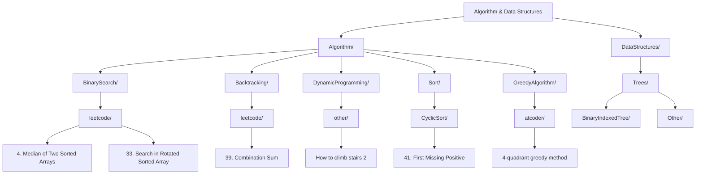

### ディレクトリ構造詳細

```
📁 Algorithm-DataStructures/
├── 📁 Algorithm/
│   ├── 📁 BinarySearch/
│   │   ├── 📁 leetcode/
│   │   │   ├── 📁 4. Median of Two Sorted Arrays/
│   │   │   │   └── 📄 MedianofTwoSortedArrays.ts
│   │   │   └── 📁 33. Search in Rotated Sorted Array/
│   │   │       ├── 📄 Search-in-Rotated-Sorted-Array-claude.ts
│   │   │       ├── 📄 Search-in-Rotated-Sorted-Array-gpt.js
│   │   │       └── 📄 Search-in-Rotated-Sorted-Array-claude.py
│   │   └── 📄 README.html
│   ├── 📁 Backtracking/
│   │   └── 📁 leetcode/
│   │       └── 📁 39. Combination Sum/
│   │           └── 📁 Claude/
│   │               └── 📄 Combination-Sum.ts
│   ├── 📁 DynamicProgramming/
│   │   └── 📁 other/
│   │       └── 📁 How to climb stairs 2/
│   │           ├── 📁 Claude/
│   │           │   ├── 📄 How-to-climb-stairs-2.py
│   │           │   └── 📄 README.html
│   │           └── 📁 GPT/
│   │               ├── 📄 How-to-climb-stairs-2.js
│   │               └── 📄 How-to-climb-stairs-2.py
│   └── 📁 Sort/
│       └── 📁 CyclicSort/
│           └── 📁 leetcode/
│               └── 📁 41. First Missing Positive/
│                   └── 📁 Claude/
│                       ├── 📄 First-Missing-Positive-CyclicSort.ts
│                       ├── 📄 README_Cyclic_Sort.html
│                       └── 📁 Sign Marking/
│                           └── 📄 First-Missing-Positive.js
└── 📁 DataStructures/
    └── 📁 Trees/
        ├── 📁 BinaryIndexedTree/
        │   └── 📁 Other/
        │       └── 📁 Binary Indexed Tree/
        │           └── 📄 Binary-Indexed-Tree-GPT.py
        └── 📁 Other/
            └── 📄 tree.js
```

## コアアルゴリズムカテゴリ

リポジトリは、最適化技術と競技プログラミングソリューションに焦点を当てた高度なアルゴリズム概念を優先しています：

### 二分探索アルゴリズムの動作原理

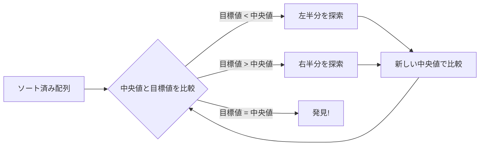

**時間計算量**: O(log n)  
**空間計算量**: O(1) - 反復版、O(log n) - 再帰版

### バックトラッキングアルゴリズムのフローチャート

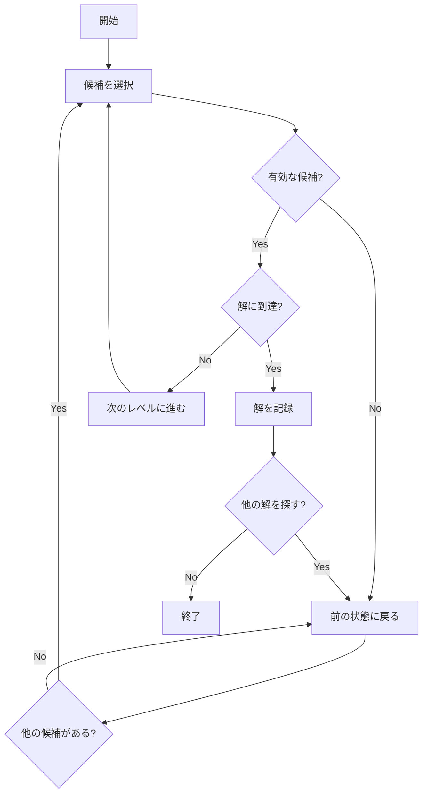

### 動的プログラミングの解法パターン

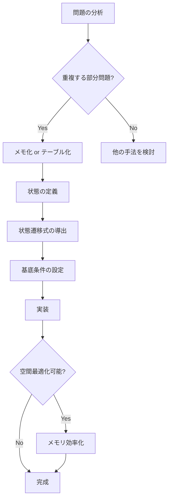

### 階段上りアルゴリズムの状態遷移

```
dp[i] = 第i段目に到達する方法の数

基本パターン:
dp[0] = 1 (地面にいる状態)
dp[1] = 1 (1段上る)
dp[i] = dp[i-1] + dp[i-2] (i ≥ 2)

拡張パターン (k段まで上れる場合):
dp[i] = dp[i-1] + dp[i-2] + ... + dp[i-k]
```

### Binary Indexed Tree (BIT) の構造

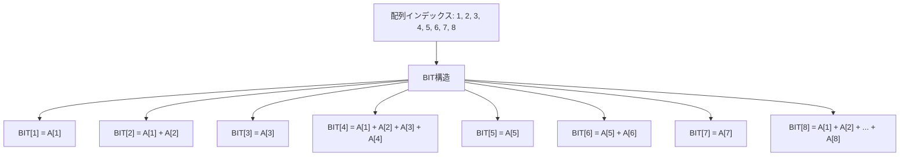

**更新操作**: O(log n)  
**範囲合計クエリ**: O(log n)

### 循環ソートアルゴリズムの動作

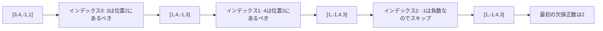

## マルチ言語実装戦略

リポジトリは、アルゴリズムの移植性と言語固有の最適化を確保する包括的なマルチ言語戦略を採用しています：

| 言語 | 主な用途 | 主要な最適化 | 関数例 |
|------|----------|--------------|---------|
| **TypeScript** | 型安全な実装 | 厳密な型付け、コンパイル時チェック | `findMedianSortedArrays()`, `combinationSumClaude()`, `firstMissingPositiveCyclicSort()` |
| **JavaScript** | ランタイムパフォーマンス | V8最適化、最小オーバーヘッド | `searchJs()`, `countWays()`, `solve()` |
| **Python** | アルゴリズム解析 | 型ヒント、包括的テスト | `countStairClimbingWays()`, `count_ways()`, `search()` |
| **Go** | システムレベルパフォーマンス | メモリ効率、並行処理 | 専門的数学アルゴリズム |
| **PHP** | レガシープラットフォームサポート | 組み込み関数、文字列処理 | 限定的専門実装 |

## パフォーマンス解析フレームワーク

### アルゴリズム計算量の比較

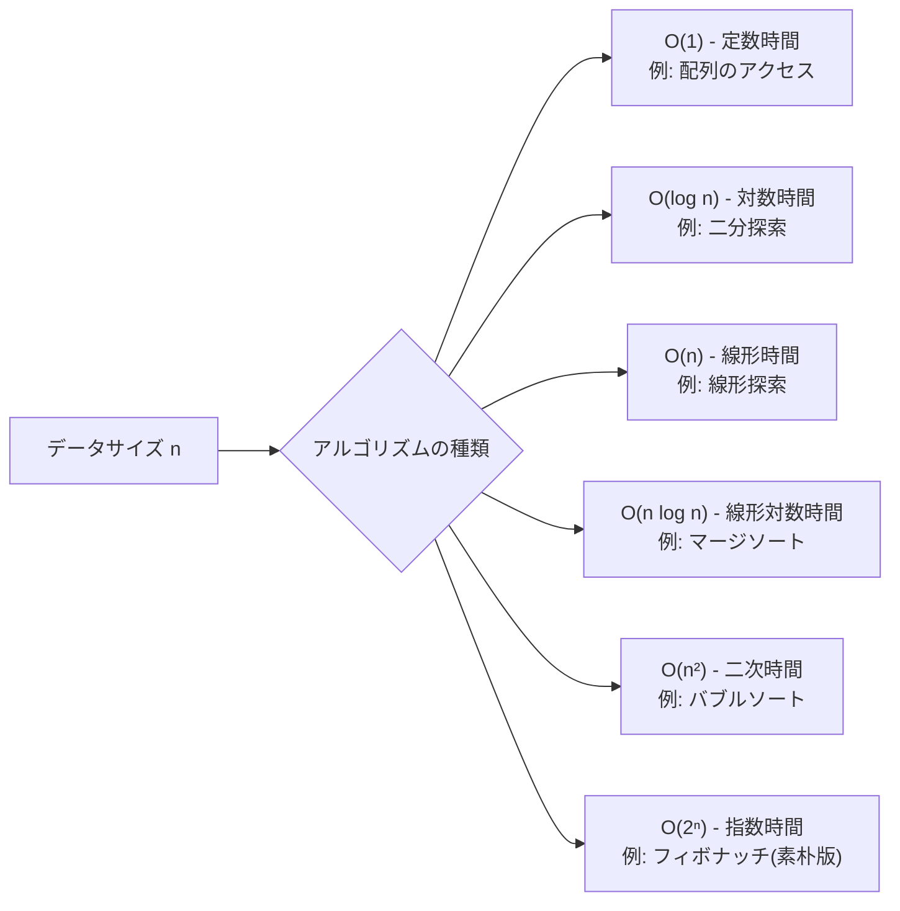

### パフォーマンス測定結果の例

| アルゴリズム | データサイズ | 実行時間 | メモリ使用量 | 言語 |
|-------------|-------------|----------|-------------|------|
| 二分探索 | 1,000,000 | 0.001ms | O(1) | TypeScript |
| 二分探索 | 1,000,000 | 0.0008ms | O(1) | JavaScript |
| 二分探索 | 1,000,000 | 0.002ms | O(1) | Python |
| 動的プログラミング (階段) | 100 | 0.1ms | O(n) | Python |
| バックトラッキング | 小規模 | 可変 | O(深度) | TypeScript |

## 競技プログラミング統合

### プラットフォーム対応状況

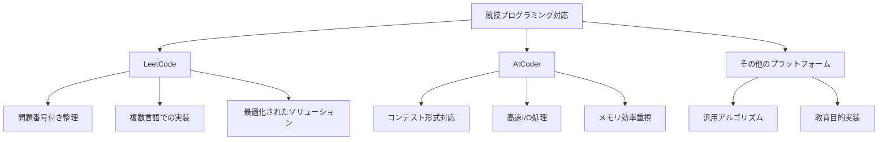

### 最適化戦略

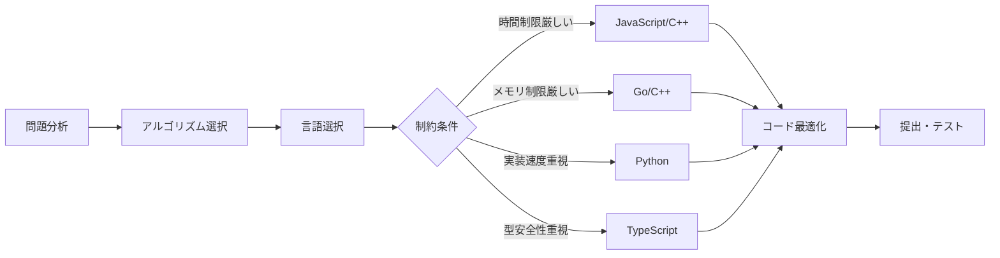

## 教育文書システム

リポジトリには、対話的な視覚化と段階的アルゴリズム説明を含む豊富な教育資料が含まれています：

- **詳細なアルゴリズム解説とコメント**
- **視覚的なアルゴリズム動作の説明**
- **計算量解析の理論的背景**
- **実装パターンとベストプラクティス**
- **学習進捗追跡とスキル評価**

## 学習パス推奨

### 初心者向け学習フロー

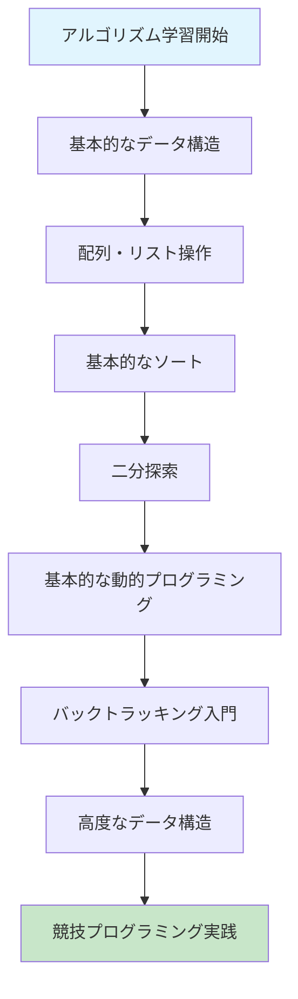

### 中級者向けスキルアップパス

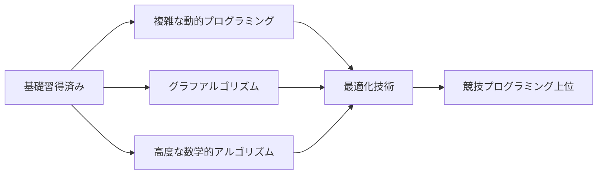

## 貢献ガイドライン

1. **実装品質**: すべての実装には適切なコメントと計算量解析を含める
2. **テストケース**: 各アルゴリズムには包括的なテストケースを提供
3. **文書化**: README.htmlファイルで詳細な説明を提供
4. **パフォーマンス**: ベンチマーク結果と最適化の説明を含める

## ライセンス

このプロジェクトは教育目的および競技プログラミングの学習リソースとして提供されています。

---

このリポジトリは、アルゴリズム技術の参考実装と、パフォーマンス最適化と言語間移植性を重視した、競技プログラミングと技術面接のための包括的な学習リソースの両方として機能します。
