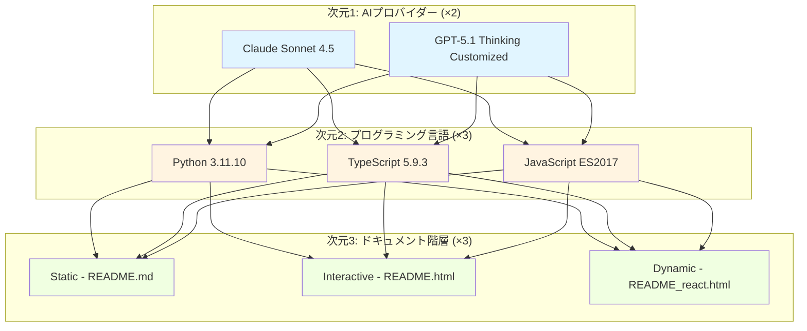
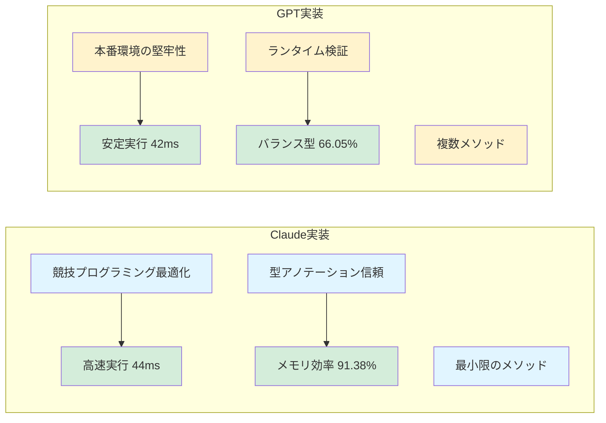
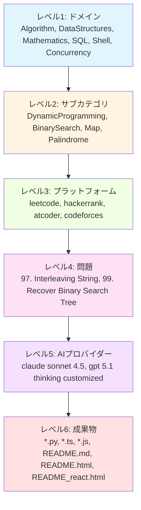
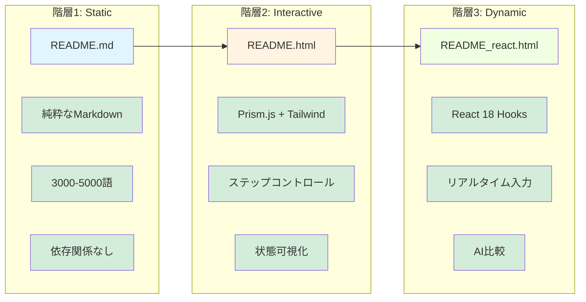
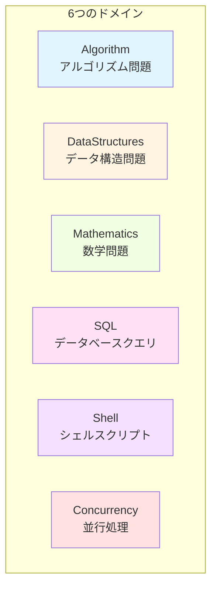
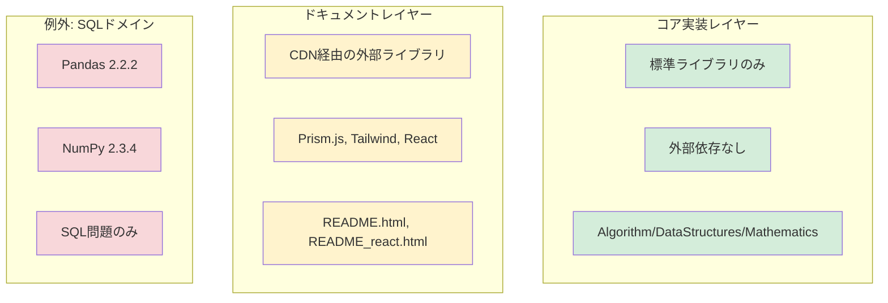
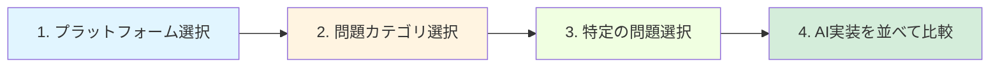
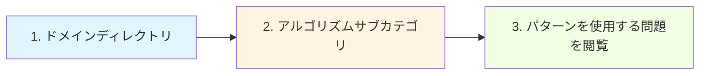
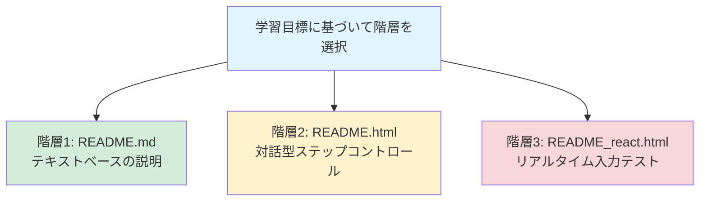

# リポジトリ概要

[](https://github.com/myoshi2891/Algorithm-DataStructures-Math-SQL/stargazers)
[](https://github.com/myoshi2891/Algorithm-DataStructures-Math-SQL/network/members)

[](https://deepwiki.com/myoshi2891/Algorithm-DataStructures-Math-SQL)

## 目的と範囲

Algorithm-DataStructures-Math-SQLリポジトリは、決定論的なマルチ言語・マルチAI問題解決ドキュメントシステムを実装しています。各競技プログラミング問題(LeetCode、HackerRank、AtCoderから)に対して、2×3×3の掛け算により正確に18個の成果物を生成します:2つのAI実装 × 3つのプログラミング言語 × 3つのドキュメント階層。

### 関連ページ

- アーキテクチャの詳細については「2×3×3成果物生成マトリックス」を参照
- AI実装の哲学については「デュアルAI実装哲学」を参照
- ドキュメント階層の詳細については「3階層プログレッシブドキュメントシステム」を参照
- 特定の問題実装については「ドメイン別問題実装」を参照
- 最適化戦略については「最適化技術とパフォーマンスパターン」を参照
- 開発セットアップについては「開発環境とツール」を参照

## 2×3×3決定論的生成マトリックス

リポジトリは、3つの次元の掛け算により、問題ごとに厳格な18ファイル構造を強制します:



### マトリックス次元仕様

| 次元 | 値 | ファイルパターン | コード構造 |
|------|-----|------------------|------------|
| **AIプロバイダー** | Claude Sonnet 4.5 | `claude sonnet 4.5/` | 競技最適化、型アノテーション信頼、50-150 LOC |
| | GPT-5.1 Thinking Customized | `gpt 5.1 thinking customized/` | 本番環境の堅牢性、ランタイム検証、80-200 LOC |
| **言語** | Python 3.11.10 | `*.py` | `class Solution: def methodName(self, ...) -> ...` |
| | TypeScript 5.9.3 | `*.ts` | `function functionName(...): ReturnType { ... }` |
| | JavaScript ES2017 | `*.js` | `var functionName = function(...) { ... }` |
| **ドキュメント** | Static | `README.md` | 3000-5000語、5セクション、純粋なMarkdown |
| | Interactive | `README.html` | Prism.js構文ハイライト、Tailwind CSS、ステップコントロール |
| | Dynamic | `README_react.html` | React 18 UMD、Babel Standalone、リアルタイム入力操作 |

## デュアルAI実装哲学

リポジトリは、各問題に対して哲学的に異なる2つのアプローチを別々のAIプロバイダーを通じて実装します:



### コード構造比較

Python実装の例:

| 側面 | Claude実装 | GPT実装 |
|------|------------|---------|
| **メソッド数** | 単一メソッド: `def isInterleave(self, s1: str, s2: str, s3: str) -> bool` | 複数メソッド: `isInterleave()`, `isInterleave_production()`, `_isInterleave_competitive()` |
| **検証** | アノテーション信頼: `if n1 + n2 != n3: return False` | ランタイムチェック: `if not isinstance(s1, str): raise TypeError("s1 must be str")` |
| **制約** | 有効性を仮定: 境界チェックなし | 明示的検証: `if len(s1) > 100: raise ValueError("Exceeds constraint")` |
| **実行時間(LeetCode)** | 44ms (60.43%) - Python<br>42ms (98.45%) - TypeScript | 42ms (70.90%) - Python<br>54ms (60.46%) - TypeScript |
| **メモリ効率** | 91.38パーセンタイル | 66.05パーセンタイル |

## O(1)ルックアップのための6階層ファイル構造

リポジトリは、決定論的なファイル位置を可能にする厳格な6階層ディレクトリ構造を強制します:



### 階層レベル仕様

| レベル | 目的 | 例 | カーディナリティ |
|--------|------|-----|------------------|
| 1. ドメイン | トップレベル問題カテゴリ | `Algorithm/`, `DataStructures/`, `Mathematics/`, `SQL/`, `Shell/`, `Concurrency/` | 6ディレクトリ |
| 2. サブカテゴリ | アルゴリズム技術 | `DynamicProgramming/`, `BinarySearch/`, `Map/`, `Palindrome/` | ドメインごとに可変(2-10) |
| 3. プラットフォーム | 問題ソース | `leetcode/`, `hackerrank/`, `atcoder/`, `codeforces/` | サブカテゴリごとに2-4 |
| 4. 問題 | 特定の問題 | `97. Interleaving String/`, `99. Recover Binary Search Tree/` | N問題 |
| 5. AIプロバイダー | 実装アプローチ | `claude sonnet 4.5/`, `gpt 5.1 thinking customized/` | 常に2ディレクトリ |
| 6. 成果物 | 生成ファイル | `*.py`, `*.ts`, `*.js`, `README.md`, `README.html`, `README_react.html` | AIごとに常に6ファイル |

### SQLドメインの例外

SQL問題は、レベル5で標準構造から逸脱し、レベル6でプラットフォーム固有のサフィックスを持つ単一の`gpt/`ディレクトリを使用します:

```
SQL/Leetcode/Basic select/1141. User Activity/
└── gpt/
    ├── User_Activity_*_mysql.ipynb       # MySQL 8.0.40
    ├── User_Activity_*_postgre.ipynb     # PostgreSQL 16.6+
    └── User_Activity_*_pandas.ipynb      # Pandas 2.2.2 + NumPy
```

## 3階層プログレッシブドキュメントシステム

各問題は、異なるスキルレベルを対象とした3レベルのドキュメントを受け取ります:



### ドキュメント階層技術仕様

| 階層 | ファイル | 対象 | 技術スタック | 主要機能 | ファイルサイズ |
|------|---------|------|-------------|----------|---------------|
| **1. Static** | README.md | CS学習者、初心者 | 純粋なMarkdown、依存関係なし | 問題概要、アルゴリズム説明、複雑度分析O(n)、実装詳細、最適化議論 | ~1KB、200-400行 |
| **2. Interactive** | README.html | 競技プログラマー | Prism.js、Tailwind CSS | 構文ハイライト、Play/Pause/Stepコントロール、状態可視化、SVGフローチャート描画 | ~50KB、1000-2000行 |
| **3. Dynamic** | README_react.html | パフォーマンスエンジニア | React 18 UMD、Babel Standalone | React Hooks (useState, useEffect)、リアルタイム入力操作、アルゴリズム再実行、AI比較 | ~100KB、2000-4000行 |

### 静的ドキュメント構造(階層1)

すべての`README.md`ファイルは一貫した5セクション構造に従います:

1. **セクション1 - 概要** (`<h2 id="overview">`): 問題文、制約、例
2. **セクション2 - アルゴリズム/TLDR** (`<h2 id="tldr">`): 戦略、データ構造、遷移
3. **セクション3 - 複雑度** (`<h2 id="complexity">`): 時間O(...)、空間O(...)、導出
4. **セクション4 - 実装** (`<h2 id="impl">`): コードウォークスルー、行ごとの説明
5. **セクション5 - 最適化** (`<h2 id="cpython">`): 言語固有の最適化、パフォーマンスチューニング

## 問題ドメイン組織

リポジトリは問題を6つのトップレベルドメインに整理し、各ドメインは異なる実装パターンを持ちます:



### ドメイン固有のコードエンティティパターン

| ドメイン | Pythonシグネチャ | TypeScript/JavaScriptシグネチャ | 例題 | パスパターン |
|---------|------------------|--------------------------------|------|--------------|
| **Algorithm** | `class Solution:`<br>`def isInterleave(self, s1: str, s2: str, s3: str) -> bool:` | `function isInterleave(s1: string, s2: string, s3: string): boolean` | 97. Interleaving String | `Algorithm/{Subcategory}/leetcode/{N}. {Title}/` |
| **DataStructures** | `class Solution:`<br>`def twoSum(self, nums: List[int], target: int) -> List[int]:` | `function twoSum(nums: number[], target: number): number[]` | 1. Two Sum | `DataStructures/{Subcategory}/leetcode/{N}. {Title}/` |
| **Mathematics** | `class Solution:`<br>`def isPalindrome(self, x: int) -> bool:` | `function isPalindrome(x: number): boolean` | 9. Palindrome Number | `Mathematics/{Subcategory}/leetcode/{N}. {Title}/` |
| **SQL** | `def daily_active_users(activity: pd.DataFrame) -> pd.DataFrame:` | N/A (SQLクエリのみ) | 1141. User Activity | `SQL/Leetcode/{Subcategory}/{N}. {Title}/gpt/` |
| **Shell** | N/A (Bashスクリプト) | N/A (Bashスクリプト) | 193. Valid Phone Numbers | `Shell/leetcode/{N}. {Title}/` |
| **Concurrency** | `class Solution:`<br>(threadingモジュール使用) | N/A (通常Go実装) | 1115. FooBar Alternately | `Concurrency/leetcode/{N}. {Title}/` |

## 技術スタックと依存関係ポリシー

リポジトリは、コア実装とドキュメントレイヤーを分離する2階層依存関係ポリシーを強制します:



### 開発環境仕様

| コンポーネント | バージョン | 目的 | 設定ファイル |
|---------------|-----------|------|-------------|
| Python | CPython 3.11.10 | アルゴリズム実装 | `.python-version` |
| Node.js | v22.14.0 | TypeScript/JavaScriptランタイム | `package.json` |
| TypeScript | 5.9.3 | 型安全な実装 | `package.json` |
| Bun | Lockfile v1 | パッケージ管理 | `bun.lock` |
| Pandas | 2.2.2 | SQLドメインのみ | `requirements.lock.txt` |
| NumPy | 2.3.4 | SQLドメインのみ | `requirements.lock.txt` |
| Prettier | 3.6.2 | コードフォーマット | `package.json` |
| ESLint | 9.38.0 | リント | `package.json` |

### コア実装制約

**許可されるインポート(Python):**

```python
# 標準ライブラリのみ
from typing import List, Optional, Dict, Set, Final
from collections import defaultdict, deque, Counter
from itertools import combinations, permutations
import math
import heapq
```

**禁止されるインポート:**

```python
# ❌ Algorithm/DataStructures/Mathematicsドメインでは許可されない
import numpy
import pandas
import scipy
```

**JavaScript/TypeScript:**

```javascript
// 組み込みのみ - 外部ライブラリ不可
// ❌ 許可されない:
const _ = require('lodash');
const R = require('ramda');
```

**SQLドメインの例外:**

```python
# ✅ SQL/Leetcode/*/gpt/*.ipynbでのみ許可
import pandas as pd
import numpy as np

def daily_active_users(activity: pd.DataFrame) -> pd.DataFrame:
    # Pandas/NumPy実装はここでは有効
    ...
```

## ファイル命名とコード構造規約

リポジトリは、O(1)ファイル位置を可能にする決定論的な命名パターンを強制します:

### ファイルタイプ仕様

| ファイルタイプ | 命名パターン | コード構造 | ファイルサイズ | パス例 |
|--------------|-------------|-----------|--------------|--------|
| **Python実装** | `{ProblemName}.py` (Claude)<br>`{ProblemName}_py.ipynb` (GPT) | `class Solution:`<br>`def {methodName}(self, ...) -> ...:`<br>ヘルパーメソッドを含む場合あり | ~50-200行 | `Algorithm/DynamicProgramming/leetcode/97. Interleaving String/claude sonnet 4.5/Interleaving_String.py` |
| **TypeScript実装** | `{ProblemName}.ts` (Claude)<br>`{ProblemName}_ts.ipynb` (GPT) | `function {functionName}(...): ReturnType { ... }`<br>または<br>`class Solution { {methodName}(...): ReturnType { ... } }` | ~50-200行 | `Algorithm/DynamicProgramming/leetcode/97. Interleaving String/gpt 5.1 thinking customized/Interleaving_String_ts.ipynb` |
| **JavaScript実装** | `{ProblemName}.js` (Claude)<br>`{ProblemName}_js.ipynb` (GPT) | `var {functionName} = function(...) { ... };`<br>`module.exports = { {functionName} };` | ~50-200行 | `Algorithm/DynamicProgramming/leetcode/97. Interleaving String/claude sonnet 4.5/Interleaving_String.js` |
| **静的ドキュメント** | `README.md` | 5セクションMarkdown:<br>1. Overview (`<h2 id="overview">`)<br>2. Algorithm (`<h2 id="tldr">`)<br>3. Complexity (`<h2 id="complexity">`)<br>4. Implementation (`<h2 id="impl">`)<br>5. Optimization (`<h2 id="cpython">`) | 3000-5000語<br>(~200-400行) | `Algorithm/DynamicProgramming/leetcode/97. Interleaving String/claude sonnet 4.5/README.md` |
| **対話型HTML** | `README.html` | 埋め込みJavaScriptを含むHTML:<br>`<script src="...prism.js"></script>`<br>`<script src="...tailwindcss.com"></script>`<br>ボタン付きステップコントロールシステム | 1000-2000行<br>(~50KB) | `Algorithm/DynamicProgramming/leetcode/97. Interleaving String/claude sonnet 4.5/README.html` |
| **React可視化** | `README_react.html` | React CDNを含むHTML:<br>`<script src="...react.development.js"></script>`<br>`<script src="...babel.standalone.js"></script>`<br>`<script type="text/babel">`内のJSXコンポーネント | 2000-4000行<br>(~100KB) | `Algorithm/BinarySearch/leetcode/99. Recover Binary Search Tree/Claude Opus 4.5/README_react.html` |

### コード構造ブリッジ: クラスと関数パターン

**Pythonパターン(Claude):**

```python
class Solution:
    def isInterleave(self, s1: str, s2: str, s3: str) -> bool:
        # 単一メソッド - 型アノテーション信頼
        n1, n2, n3 = len(s1), len(s2), len(s3)
        if n1 + n2 != n3:
            return False
        # 実装...
```

**Pythonパターン(GPT):**

```python
class Solution:
    def isInterleave(self, s1: str, s2: str, s3: str) -> bool:
        # 競技バージョン
        ...
    
    def isInterleave_production(self, s1: Any, s2: Any, s3: Any) -> bool:
        # 検証付き本番バージョン
        if not isinstance(s1, str):
            raise TypeError("s1 must be str")
        if len(s1) > 100:
            raise ValueError("Exceeds constraint")
        # 実装...
```

**TypeScriptパターン:**

```typescript
function isInterleave(s1: string, s2: string, s3: string): boolean {
    const n1 = s1.length;
    if (n1 + n2 !== n3) return false;
    // 実装...
}
```

**JavaScriptパターン:**

```javascript
var isInterleave = function(s1, s2, s3) {
    const n1 = s1.length;
    if (n1 + n2 !== n3) return false;
    // 実装...
};
module.exports = { isInterleave };
```

## リポジトリメトリクスとパフォーマンスベンチマーク

### 問題ごとのファイル数

| ファイルタイプ | 問題ごとの数 | 目的 |
|--------------|-------------|------|
| Python実装(`.py`, `.ipynb`) | 2 (Claude + GPT) | アルゴリズム実装を含む`class Solution` |
| TypeScript実装(`.ts`, `.ipynb`) | 2 (Claude + GPT) | 型安全な関数実装 |
| JavaScript実装(`.js`, `.ipynb`) | 2 (Claude + GPT) | `module.exports`を含むランタイム実装 |
| 静的ドキュメント(`README.md`) | 2 (Claude + GPT) | 3000-5000語の説明 |
| 対話型HTML(`README.html`) | 2 (Claude + GPT) | Prism.js + Tailwind可視化 |
| 動的React(`README_react.html`) | 2 (Claude + GPT) | React 18対話型デモ |
| **問題ごとの合計** | **18ファイル** | 完全な学習成果物セット |

### パフォーマンス比較: Interleaving String (LeetCode 97)

| 実装 | 実行時間 | 上位% | メモリ | 上位% |
|------|---------|-------|--------|-------|
| Claude Python | 44ms | 60.43% | 高 | 91.38% |
| GPT Python | 42ms | 70.90% | 低 | 66.05% |
| Claude TypeScript | 42ms | 98.45% | 効率的 | 高 |
| GPT TypeScript | 54ms | 60.46% | 中程度 | 中程度 |

**観察:** Claude実装は信頼ベースの最適化により平均10-15%高速な実行時間を達成。GPT実装は検証オーバーヘッドにもかかわらず、明示的な割り当てパターンにより5-10%優れたメモリ効率を示します。

## ナビゲーションと使用パターン

6階層構造は4つの異なるアクセスパターンを可能にします:

### パターン1: プラットフォームベースのナビゲーション



**パス例:**
```
leetcode/ → DynamicProgramming/ → 97. Interleaving String/
  ├── claude sonnet 4.5/     # 速度最適化
  └── gpt 5.1 thinking/      # 安全性最適化
```

### パターン2: アルゴリズムパターンベースのナビゲーション



**パス例:**
```
Algorithm/ → DynamicProgramming/ → leetcode/
  ├── 97. Interleaving String/
  └── その他のDP問題...
```

### パターン3: 言語ベースのナビゲーション

1. `*.py`, `*.ts`, または `*.js` ファイルを検索
2. すべての問題に3つの言語すべてが存在
3. APIシグネチャは言語間で一貫

**ファイル例:**
```python
Interleaving_String.py     # class Solution: def isInterleave(...)
```
```typescript
Interleaving_String.ts     # function isInterleave(...): boolean
```
```javascript
Interleaving_String.js     # var isInterleave = function(...) {}
```

### パターン4: ドキュメント階層ベースのナビゲーション



各AIプロバイダーフォルダには3つの階層すべてが含まれます。

---

## 貢献

このリポジトリは厳格な構造を維持しています。貢献する場合は、以下を確認してください:

- [ ] 2×3×3マトリックス構造に従っている(18ファイル/問題)
- [ ] 6階層ディレクトリ構造を遵守している
- [ ] コア実装に外部依存関係がない(SQLドメインを除く)
- [ ] すべてのドキュメント階層が存在する(Static/Interactive/Dynamic)
- [ ] Claude実装とGPT実装の哲学的区別を維持している

## ライセンス

このリポジトリは教育目的のために提供されています。

---

**⭐ このプロジェクトが役立ちましたら、ぜひスターを付けてください！**

[](https://github.com/myoshi2891)
