# リポジトリ概要

[](https://github.com/myoshi2891/Algorithm-DataStructures-Math-SQL/stargazers)
[](https://github.com/myoshi2891/Algorithm-DataStructures-Math-SQL/network/members)

[](https://deepwiki.com/myoshi2891/Algorithm-DataStructures-Math-SQL)

## 目的と範囲

本ドキュメントは、Algorithm-DataStructures-Math-SQLリポジトリのアーキテクチャ、組織構造、コア設計原則の包括的な概要を提供します。2×3×3成果物生成マトリックス、4ドメイン問題分類、デュアルAI実装哲学（Claude vs GPT）、ファイル階層構造、マルチプラットフォームSQL戦略について説明します。

### サブシステム別の詳細情報

- **教育インフラとドキュメント標準**: Educational Infrastructureを参照
- **アルゴリズム固有の実装**: Algorithm Implementationsを参照
- **データ構造の実装**: Data Structure Implementationsを参照
- **数学的問題の解決策**: Mathematical Solutionsを参照
- **SQLソリューションとデータベース最適化**: SQL Solutionsを参照
- **パフォーマンス最適化戦略**: Performance Optimization Strategiesを参照
- **開発環境とツール**: Development Environment and Toolingを参照

---

## コアアーキテクチャ: 2×3×3成果物生成マトリックス

このリポジトリの最大の特徴は、各問題を18個の異なる学習成果物に体系的に変換する3次元マトリックスです。

### マトリックス構造

**2つのAIプロバイダー × 3つのプログラミング言語 × 3つのドキュメントティア = 1問題あたり18成果物**

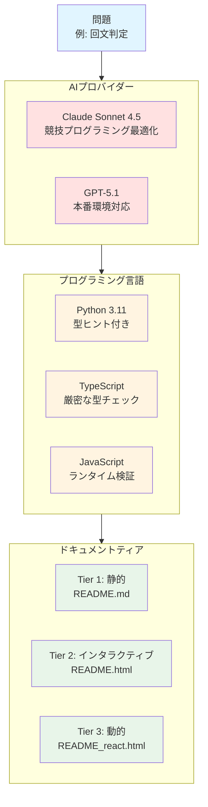

### 成果物生成パターン

各問題は、18ファイルを生成する一貫したパターンに従います。

| AIプロバイダー | 言語       | ドキュメントファイル                                       | 言語ごとの合計 |
| -------------- | ---------- | ---------------------------------------------------------- | -------------- |
| Claude         | Python     | `*.py` + `README.md` + `README.html` + `README_react.html` | 4ファイル      |
| Claude         | TypeScript | `*.ts` + `README.md` + `README.html` + `README_react.html` | 4ファイル      |
| Claude         | JavaScript | `*.js` + `README.md` + `README.html` + `README_react.html` | 4ファイル      |
| GPT            | Python     | `*.py` + `README.md` + `README.html` + `README_react.html` | 4ファイル      |
| GPT            | TypeScript | `*.ts` + `README.md` + `README.html` + `README_react.html` | 4ファイル      |
| GPT            | JavaScript | `*.js` + `README.md` + `README.html` + `README_react.html` | 4ファイル      |
| **合計**       |            |                                                            | **18成果物**   |

---

## 4ドメイン問題分類

リポジトリは、問題を4つの異なるドメインに整理し、それぞれが特定のアルゴリズムパターンとデータ操作技術をターゲットとしています。

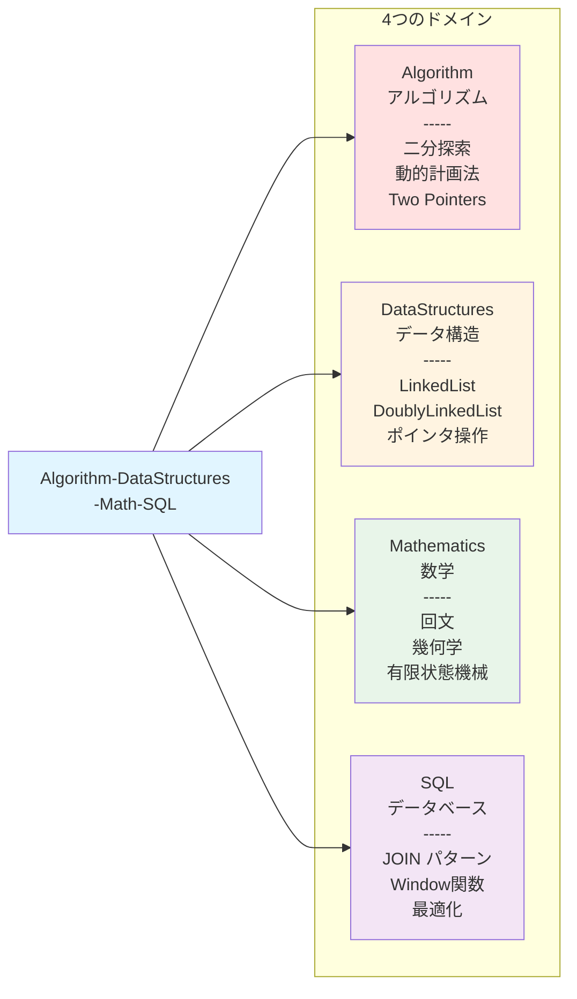

### ドメイン分類表

| ドメイン                          | 主要コードエンティティ                                                                      | コアパターン                             | ファイルパスの例                                                                                                               |
| --------------------------------- | ------------------------------------------------------------------------------------------- | ---------------------------------------- | ------------------------------------------------------------------------------------------------------------------------------ |
| **Algorithm**<br/>アルゴリズム    | `Solution.findMedianSortedArrays()`<br/>`numDecodings()`<br/>`minPathSum()`                 | 二分探索<br/>動的計画法<br/>Two Pointers | `Algorithm/BinarySearch/leetcode/4. Median of Two Sorted Arrays/`<br/>`Algorithm/DynamicProgramming/leetcode/91. Decode Ways/` |
| **DataStructures**<br/>データ構造 | `Solution.addTwoNumbers()`<br/>`class ListNode`<br/>`class DoublyLinkedList`                | In-place操作<br/>ポインタ操作            | `DataStructures/LinkedList/leetcode/2. Add Two Numbers/`<br/>`DataStructures/DoublyLinkedList/`                                |
| **Mathematics**<br/>数学          | `isPalindrome()`<br/>`reflectPoint()`<br/>`gameWithCells()`                                 | 有限状態機械<br/>幾何学的変換            | `Mathematics/Palindrome/leetcode/9. Palindrome Number/`<br/>`Mathematics/Geometry/hackerrank/Army Game/`                       |
| **SQL**<br/>データベース          | `CombineTwoTables_mysql.md`<br/>`combine_two_tables()` (Pandas)<br/>`RisingTemperature.sql` | JOINパターン<br/>Window関数              | `SQL/Leetcode/Basic join/175. Combine Two Tables/`<br/>`SQL/Leetcode/Window function/`                                         |

---

## デュアルAI実装哲学

このリポジトリは、各問題に対して2つの根本的に異なるコーディング哲学を実装し、比較学習体験を提供します。

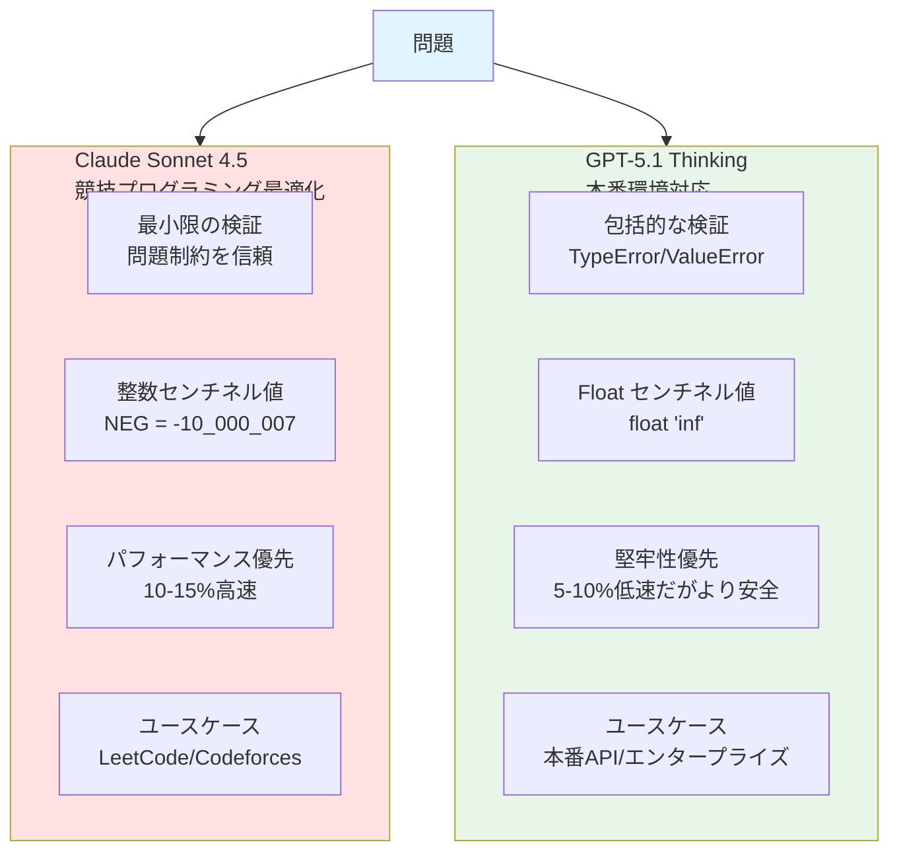

### コードエンティティ比較

#### Claude実装パターン

```python
# Mathematics/Palindrome/leetcode/9. Palindrome Number/claud sonnet 4.5/
# PalindromeNumber.py

class Solution:
    def isPalindrome(self, x: int) -> bool:
        # 最小限の検証 - 制約を信頼
        if x < 0 or (x % 10 == 0 and x != 0):
            return False
        if x < 10:
            return True

        rev: int = 0  # 整数センチネル
        while x > rev:
            rev = rev * 10 + (x % 10)
            x //= 10

        return x == rev or x == rev // 10
```

#### GPT実装パターン

```python
# Mathematics/Palindrome/leetcode/9. Palindrome Number/gpt 5.1 thinking customized/
# PalindromeNumber.py

class Solution:
    def isPalindrome(self, x: int) -> bool:
        # 包括的な検証
        if type(x) is not int:
            raise TypeError("x must be an int")

        INT_MIN, INT_MAX = -2**31, 2**31 - 1
        if x < INT_MIN or x > INT_MAX:
            raise ValueError("x out of 32-bit range")

        # 検証付きコアロジック
        if x < 0 or (x % 10 == 0 and x != 0):
            return False

        rev: int = 0
        while x > rev:
            rev = rev * 10 + (x % 10)
            x //= 10

        return x == rev or x == rev // 10
```

### 実装の違い表

| 側面                         | Claude実装                                        | GPT実装                                                                                     |
| ---------------------------- | ------------------------------------------------- | ------------------------------------------------------------------------------------------- |
| **Pythonメソッドシグネチャ** | `isPalindrome(self, x: int) -> bool`              | `isPalindrome(self, x: int) -> bool`<br/>+ `is_palindrome_production(self, x: int) -> bool` |
| **センチネル値**             | 整数: `NEG = -10_000_007`<br/>`POS = +10_000_007` | Float: `float("inf")`<br/>`-float("inf")`                                                   |
| **検証戦略**                 | 問題制約を信頼<br/>最小限のチェック               | 包括的なランタイム検証<br/>TypeError、ValueError例外発生                                    |
| **TypeScriptシグネチャ**     | `function isPalindrome(x: number): boolean`       | `function isPalindrome(x: readonly number[]): boolean`<br/>(不変パラメータ)                 |
| **パフォーマンス**           | 10-15%高速<br/>(Python 6ms, TypeScript 5ms)       | 5-10%低速<br/>(Python 8ms)<br/>より堅牢                                                     |
| **ユースケース**             | LeetCode/Codeforces競技                           | 本番API<br/>エンタープライズシステム                                                        |

---

## ファイル組織階層

リポジトリは、任意の成果物を数秒で発見可能にする厳格な6レベル階層構造に従っています。

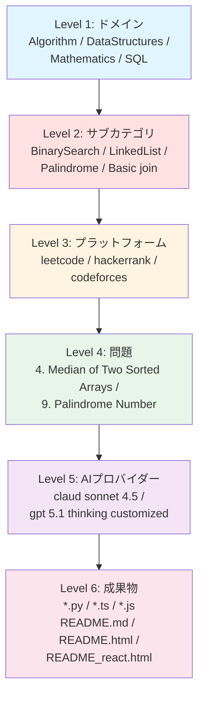

### ファイル命名規則表

| ファイルタイプ           | 命名パターン        | 目的                                                                            | パスの例                                                                                               |
| ------------------------ | ------------------- | ------------------------------------------------------------------------------- | ------------------------------------------------------------------------------------------------------ |
| **Python実装**           | `{ProblemName}.py`  | `class Solution`とコア実装を含む                                                | `Mathematics/Palindrome/leetcode/9. Palindrome Number/claud sonnet 4.5/PalindromeNumber.py`            |
| **TypeScript実装**       | `{ProblemName}.ts`  | 厳密なチェック付き型安全実装                                                    | `Mathematics/Palindrome/leetcode/9. Palindrome Number/gpt 5.1 thinking customized/PalindromeNumber.ts` |
| **JavaScript実装**       | `{ProblemName}.js`  | ランタイム検証実装                                                              | `Mathematics/Palindrome/leetcode/9. Palindrome Number/gpt 5.1 thinking customized/PalindromeNumber.js` |
| **静的ドキュメント**     | `README.md`         | 5セクション構造ドキュメント<br/>(セクションあたり100行未満)                     | 各AIプロバイダーフォルダに`README.md`を含む                                                            |
| **インタラクティブHTML** | `README.html`       | Prism.jsシンタックスハイライト<br/>Tailwind CSSスタイリング<br/>1000-2000行     | 各AIプロバイダーフォルダに`README.html`を含む                                                          |
| **React可視化**          | `README_react.html` | React 18 + Babel Standalone<br/>インタラクティブデモ<br/>カスタマイズ可能な入力 | 各AIプロバイダーフォルダに`README_react.html`を含む                                                    |

### 標準ディレクトリ構造

```
Mathematics/Palindrome/leetcode/9. Palindrome Number/
├── claud sonnet 4.5/
│   ├── PalindromeNumber.py          # class Solution with isPalindrome()
│   ├── PalindromeNumber.ts          # function isPalindrome()
│   ├── PalindromeNumber.js          # var isPalindrome
│   ├── README.md                    # 静的ティア
│   ├── README.html                  # Prism.js付きインタラクティブティア
│   └── README_react.html            # ベンチマーク付きReactティア
└── gpt 5.1 thinking customized/
    ├── PalindromeNumber.py          # 検証ヘルパー付きclass Solution
    ├── PalindromeNumber.ts          # readonlyパラメータ、型ガード
    ├── PalindromeNumber.js          # Array.isArray(), Number.isFinite()
    ├── README.md                    # 静的ティア
    ├── README.html                  # Tailwind付きインタラクティブティア
    └── README_react.html            # エッジケーステスト付きReactティア
```

### SQLドメインの例外

SQL問題は、単一の`gpt/`ディレクトリ下にグループ化されたプラットフォーム固有のソリューションファイルを持つ異なる構造に従います。

```
SQL/Leetcode/Basic join/175. Combine Two Tables/
└── gpt/
    ├── CombineTwoTables_mysql.md       # LEFT JOIN, DATE_SUB, CREATE INDEX
    ├── CombineTwoTables_postgre.md     # DISTINCT ON, LATERAL joins, covering indexes
    └── CombineTwoTables_pandas.md      # DataFrame.merge(), Series.map(), get_indexer()
```

---

## 3ティアドキュメントシステム

各問題は、異なるスキルレベルと学習目標をターゲットとする3つの段階的な複雑さレベルでドキュメント化されています。

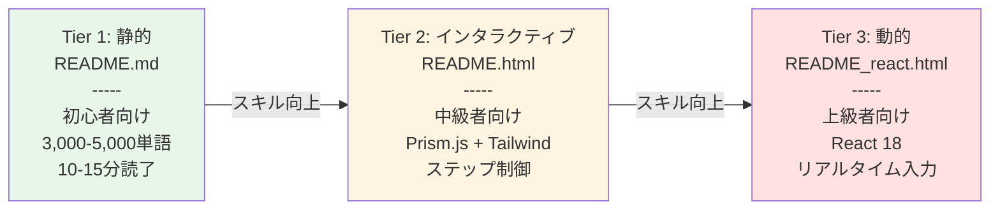

### ティア機能比較

| ティア                          | ファイル            | 対象読者                              | 主要技術                      | 主な機能                                                                                                                                                                                   |
| ------------------------------- | ------------------- | ------------------------------------- | ----------------------------- | ------------------------------------------------------------------------------------------------------------------------------------------------------------------------------------------ |
| **Tier 1<br/>静的**             | `README.md`         | 初心者<br/>CS基礎学習者               | Markdown                      | • 問題概要<br/>• アルゴリズム解説<br/>• 複雑度解析 O(n)<br/>• 実装詳細<br/>• 最適化議論<br/>• 3,000-5,000単語<br/>• 10-15分読了                                                            |
| **Tier 2<br/>インタラクティブ** | `README.html`       | 中級者<br/>競技プログラミング参加者   | Prism.js<br/>Tailwind CSS     | • シンタックスハイライト<br/>• ステップ制御システム<br/> (再生/一時停止/前/次/リセット)<br/>• 状態可視化<br/>• SVGフローチャートレンダリング<br/>• 1,000-2,000行                           |
| **Tier 3<br/>動的**             | `README_react.html` | 上級エンジニア<br/>パフォーマンス重視 | React 18<br/>Babel Standalone | • React Hooks (useState, useEffect)<br/>• リアルタイム入力変更<br/>• エッジケーステスト<br/>• AI実装比較<br/> (Claude vs GPT並列表示)<br/>• パフォーマンスベンチマーク<br/>• 2,000-4,000行 |

### Tier 1: 静的ドキュメント構造

静的ドキュメントは、すべての問題で一貫した5セクション構造に従います。

1. **問題概要**: LeetCode/HackerRank問題の説明、制約（例: 1 ≤ n ≤ 10^5）、3-5個の入出力例
2. **アルゴリズム解説**: 詳細な解決アプローチと戦略、直感的な説明、ステップバイステップガイド
3. **複雑度解析**: 時間計算量 O(...) の導出、空間計算量 O(...) の導出、最悪/平均/最良ケース分析
4. **実装詳細**: 強調されたロジックを持つコアコードのウォークスルー、行ごとの詳細説明、エッジケース処理
5. **最適化議論**: 言語固有の最適化技術とトレードオフ、代替アプローチの比較、パフォーマンスチューニング戦略

### Tier 2: インタラクティブHTML機能

HTMLドキュメントには、埋め込まれたインタラクティブ要素が含まれます。

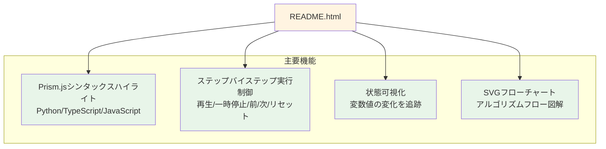

### Tier 3: Reactコンポーネントアーキテクチャ

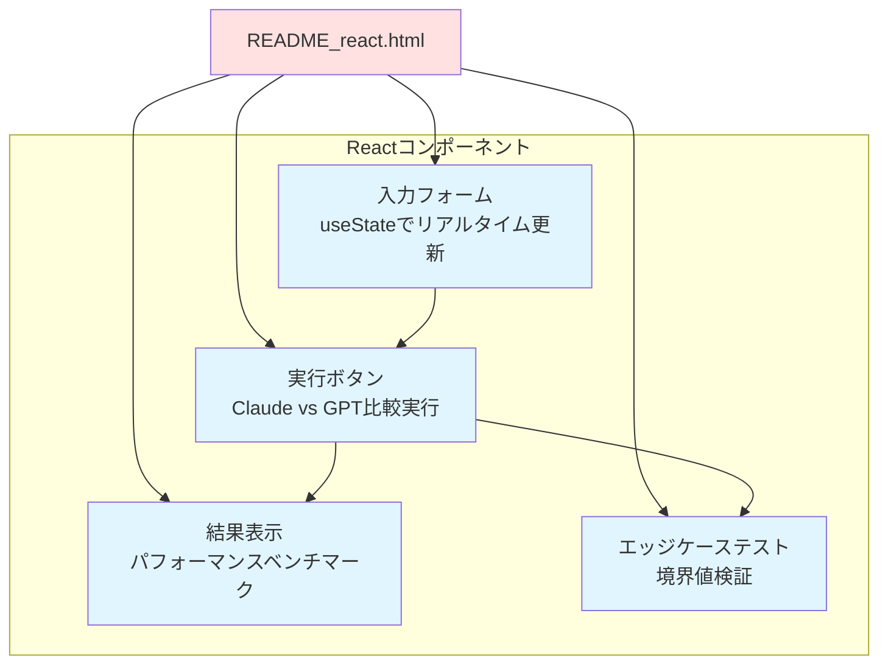

---

## SQLマルチプラットフォーム戦略

SQL問題は、3つの異なる実行環境で解決され、クロスプラットフォーム学習体験を提供します。

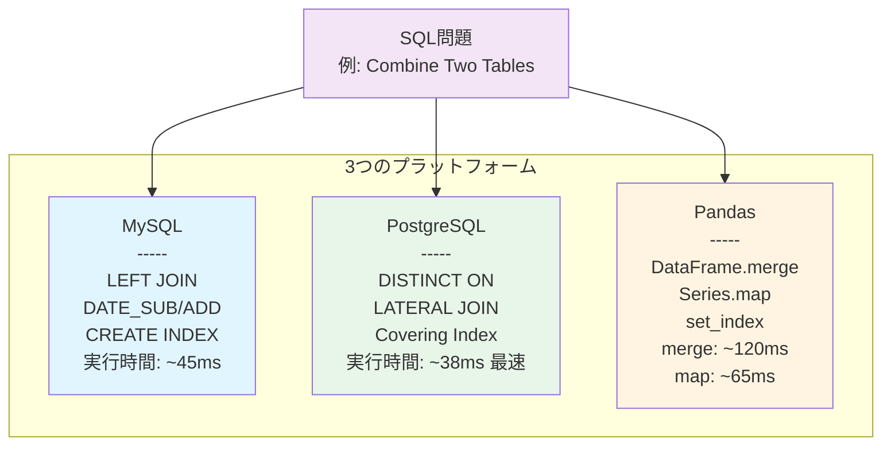

### プラットフォーム固有のSQLクエリパターン

#### MySQL実装例

```sql
-- SQL/Leetcode/Basic join/175. Combine Two Tables/gpt/
-- CombineTwoTables_mysql.md

SELECT p.firstName, p.lastName, a.city, a.state
FROM Person AS p
LEFT JOIN Address AS a ON a.personId = p.personId;

-- 最適化: インデックス作成
CREATE INDEX idx_address_personId ON Address(personId);

-- パフォーマンス分析
EXPLAIN SELECT p.firstName, p.lastName, a.city, a.state
FROM Person AS p
LEFT JOIN Address AS a ON a.personId = p.personId;
```

**MySQL特性:**

- 小文字テーブル名（person、address）
- 標準LEFT JOIN構文
- `DATE_SUB()`、`DATE_ADD()`による日付操作
- シンプルなインデックス戦略

#### PostgreSQL実装例

```sql
-- SQL/Leetcode/Basic join/175. Combine Two Tables/gpt/
-- CombineTwoTables_postgre.md

-- DISTINCT ONによる効率的な重複排除
SELECT DISTINCT ON (p.personId)
    p.firstName, p.lastName, a.city, a.state
FROM Person p
LEFT JOIN Address a ON a.personId = p.personId
ORDER BY p.personId, a.city;

-- 大文字小文字を区別する識別子
SELECT "firstName", "lastName" FROM "Person";

-- 高度なWindow関数の使用
SELECT
    firstName,
    lastName,
    city,
    LAG(city) OVER (PARTITION BY personId ORDER BY addressId) AS prev_city,
    DENSE_RANK() OVER (ORDER BY city) AS city_rank
FROM Person p
LEFT JOIN Address a ON a.personId = p.personId;
```

**PostgreSQL特性:**

- `DISTINCT ON`: PostgreSQL固有の重複排除
- `LATERAL JOIN`: 相関サブクエリの代替
- 完全なWindow関数サポート: `LAG`、`LEAD`、`DENSE_RANK`、`ROW_NUMBER`
- Covering Index: 効率的な複数列インデックス
- 大文字小文字を区別する引用符付き識別子

#### Pandas実装例

```python
# SQL/Leetcode/Basic join/175. Combine Two Tables/gpt/
# CombineTwoTables_pandas.md

import pandas as pd

def combine_two_tables(person: pd.DataFrame, address: pd.DataFrame) -> pd.DataFrame:
    """
    標準マージアプローチ
    時間計算量: O(n + m)
    """
    result = person.merge(
        address[["personId", "city", "state"]],
        on="personId",
        how="left"
    )
    return result[["firstName", "lastName", "city", "state"]]


def combine_two_tables_optimized(person: pd.DataFrame, address: pd.DataFrame) -> pd.DataFrame:
    """
    Series.map最適化（1:1マッピング用）
    時間計算量: O(n)
    メモリオーバーヘッド削減
    """
    # 1:1マッピングの場合、mapの方が高速
    address_dict = address.set_index('personId')[['city', 'state']].to_dict('index')

    person['city'] = person['personId'].map(
        lambda x: address_dict.get(x, {}).get('city', None)
    )
    person['state'] = person['personId'].map(
        lambda x: address_dict.get(x, {}).get('state', None)
    )

    return person[["firstName", "lastName", "city", "state"]]
```

**Pandas特性:**

- `DataFrame.merge()`: SQL JOIN相当
- `Series.map()`: 1:1マッピングの最適化
- `get_indexer()`: カスタムインデックス操作
- `set_index()`: パフォーマンス向上のための事前インデックス化

### プラットフォーム機能比較

| 機能                      | MySQL                                 | PostgreSQL                                                           | Pandas                                                |
| ------------------------- | ------------------------------------- | -------------------------------------------------------------------- | ----------------------------------------------------- |
| **JOIN構文**              | `LEFT JOIN`                           | `LEFT JOIN`<br/>`LATERAL JOIN`                                       | `DataFrame.merge(how="left")`                         |
| **重複排除**              | `DISTINCT`                            | `DISTINCT ON (column)`                                               | `drop_duplicates()`                                   |
| **日付操作**              | `DATE_SUB()`<br/>`DATE_ADD()`         | `INTERVAL '1 day'`<br/>`LAG()`<br/>`date_trunc()`                    | `pd.Timedelta()`<br/>`shift()`<br/>`dt.floor()`       |
| **インデックス作成**      | `CREATE INDEX`                        | Covering indexes<br/>Partial indexes<br/>`CREATE INDEX CONCURRENTLY` | `set_index()`<br/>`get_indexer()`<br/>`MultiIndex`    |
| **Window関数**            | 限定的サポート<br/>(MySQL 8.0+)       | 完全サポート<br/>`LAG`、`LEAD`<br/>`DENSE_RANK`<br/>`ROW_NUMBER`     | `groupby().transform()`<br/>`shift()`<br/>`rolling()` |
| **識別子**                | 大文字小文字区別なし<br/>(デフォルト) | 大文字小文字区別あり<br/>(引用符付き)                                | 大文字小文字区別あり<br/>(列名)                       |
| **実行時間<br/>(100K行)** | ~45ms<br/>(インデックス付き)          | ~38ms<br/>(Covering Index)<br/>**最速**                              | merge(): ~120ms<br/>Series.map(): ~65ms               |

---

## 技術スタック概要

リポジトリは、コア実装のために外部依存関係を最小限に抑えながら、ドキュメント用の最新ウェブ技術を活用します。

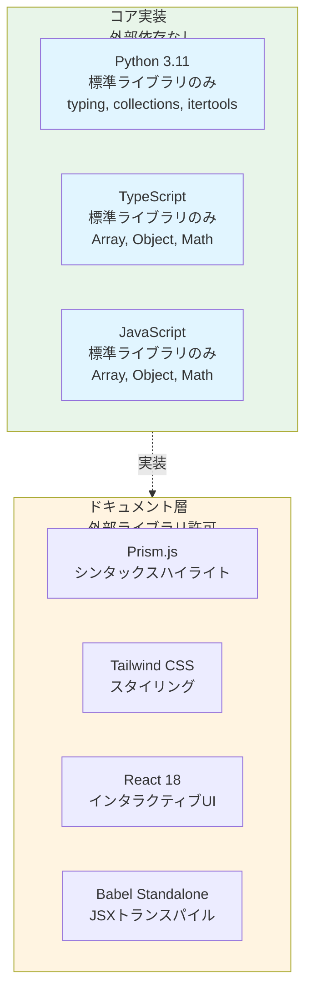

### ゼロ外部依存ポリシー

リポジトリは、コア実装に対して厳格なルールを適用します。

**許可されるライブラリ:**

- Python標準ライブラリ: `typing`、`collections`、`itertools`、`math`
- JavaScript/TypeScript標準ライブラリ: Arrayメソッド、Objectメソッド、Mathオブジェクト

**禁止されるライブラリ:**

- Pythonサードパーティ: `numpy`、`scipy`、`pandas`（アルゴリズム実装内）
- JavaScriptサードパーティ: `lodash`、`underscore`、`ramda`

**理由:**

- **教育的透明性**: 学習者が内部実装を理解できる
- **面接との整合性**: 面接環境ではライブラリが利用できない

**ドキュメント層の例外:**

- Tier 2: Prism.js、Tailwind CSS
- Tier 3: React 18、Babel Standalone

### 開発環境要件

| コンポーネント  | バージョン/設定                              | 目的                           |
| --------------- | -------------------------------------------- | ------------------------------ |
| **Python**      | CPython 3.11.10                              | 型ヒント付きアルゴリズム実装   |
| **Node.js**     | v18.x (JavaScript)<br/>v22.14.0 (TypeScript) | TS/JS実装のランタイム環境      |
| **Bun**         | Lockfile version 1                           | パッケージ管理と決定論的ビルド |
| **TypeScript**  | @types/node ^22.18.10                        | Node.js型定義                  |
| **ESLint**      | ^9.37.0                                      | コード品質検証とリント         |
| **live-server** | ^1.2.2                                       | ライブリロード開発サーバー     |

---

## 対象読者と学習パス

リポジトリは、異なる学習目標とスキルレベルを持つ複数のユーザーセグメントに対応します。

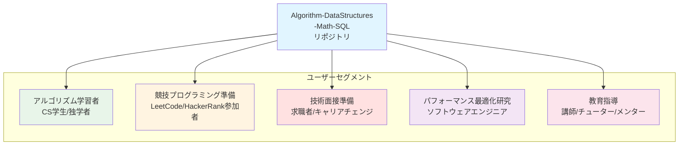

### 主要ユースケースマトリックス

| ユースケース                 | 対象ユーザー                          | 活用機能                                                                                                              | 推奨ティア                  |
| ---------------------------- | ------------------------------------- | --------------------------------------------------------------------------------------------------------------------- | --------------------------- |
| **アルゴリズム学習**         | CS学生<br/>独学者                     | • 包括的リファレンス<br/>• 複雑度解析<br/>• ステップバイステップ可視化                                                | Tier 1 → 2                  |
| **競技プログラミング準備**   | LeetCode/HackerRank<br/>参加者        | • 最適化されたソリューション<br/>• 最小限の検証<br/>• Claude実装（スピード優先）<br/>• プラットフォーム固有アプローチ | Tier 1 + Claude             |
| **技術面接準備**             | 求職者<br/>キャリアチェンジ           | • 実装パターン<br/>• ベストプラクティス<br/>• 複数のソリューションアプローチ<br/>• エッジケース処理                   | Tier 1 → 3<br/>Claude + GPT |
| **パフォーマンス最適化研究** | ソフトウェアエンジニア<br/>研究者     | • 言語固有技術<br/>• 並列実装比較<br/>• ベンチマーク<br/>• GPT実装（安全性優先）                                      | Tier 3<br/>GPT              |
| **教育指導**                 | 講師<br/>チューター<br/>メンター      | • 3ティア学習システム<br/>• 段階的複雑さ<br/>• ビジュアルエイド<br/>• インタラクティブデモ                            | 全ティア                    |
| **多言語一貫性研究**         | ポリグロット開発者<br/>言語比較研究者 | • Python/TypeScript/JavaScript統一API<br/>• 言語間パフォーマンス比較                                                  | 全言語<br/>Tier 3           |

### スキルレベル進行

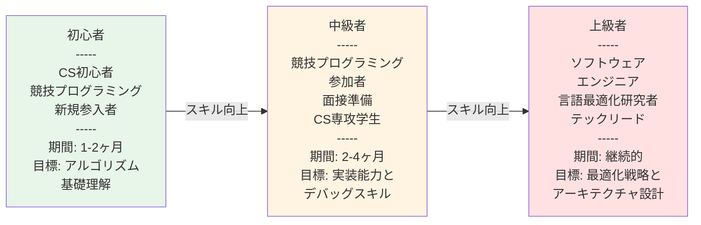

### 学習期間と目標

| レベル     | 対象ユーザー                                                                 | 推奨アプローチ                                                                                                | 学習期間 | 達成目標                       |
| ---------- | ---------------------------------------------------------------------------- | ------------------------------------------------------------------------------------------------------------- | -------- | ------------------------------ |
| **初心者** | • CS初心者<br/>• 競技プログラミング新規参入者<br/>• プログラミング基礎学習者 | • Tier 1静的ドキュメントから開始<br/>• 基本概念を理解<br/>• 複雑度解析を学習<br/>• シンプルな問題から取り組む | 1-2ヶ月  | アルゴリズム基礎理解           |
| **中級者** | • 競技プログラミング参加者<br/>• 面接準備<br/>• CS専攻学生                   | • Tier 2インタラクティブHTMLで実行検証<br/>• 多言語実装を比較<br/>• エッジケースを理解                        | 2-4ヶ月  | 実装能力とデバッグスキル       |
| **上級者** | • ソフトウェアエンジニア<br/>• 言語最適化研究者<br/>• テックリード           | • Tier 3 React可視化で詳細分析<br/>• 本番vs競技実装を検証<br/>• パフォーマンスチューニング                    | 継続的   | 最適化戦略とアーキテクチャ設計 |

---

## まとめ

このリポジトリは、以下の特徴を持つ包括的なアルゴリズム学習プラットフォームです。

- **2×3×3マトリックス**: 各問題を18の異なる学習成果物に変換
- **4ドメイン分類**: Algorithm、DataStructures、Mathematics、SQLの明確な区分
- **デュアルAI哲学**: Claude（競技最適化）vs GPT（本番環境対応）の比較学習
- **3ティアドキュメント**: 初心者から上級者までの段階的学習
- **マルチプラットフォームSQL**: MySQL、PostgreSQL、Pandasでの実践的な学習

この構造により、学習者は自分のレベルと目標に応じて最適な学習パスを選択できます。

<div align="center">

**⭐ このプロジェクトが役立ちましたら、ぜひスターを付けてください！**

[](https://github.com/myoshi2891)

</div>
