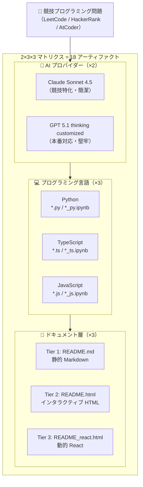
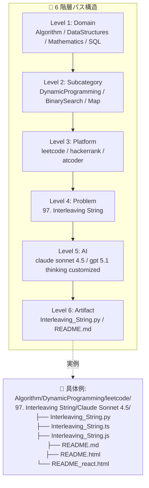
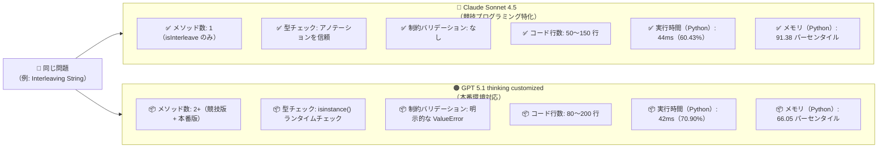
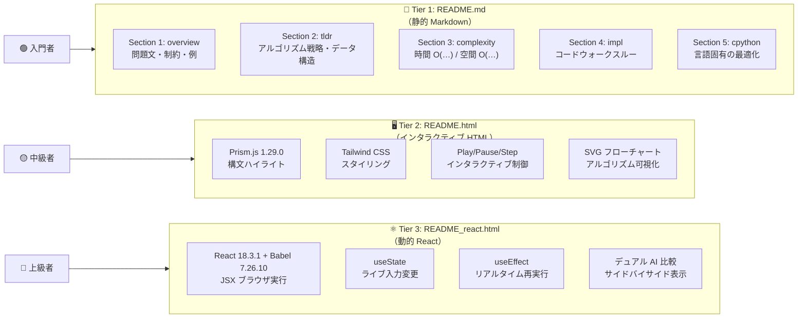
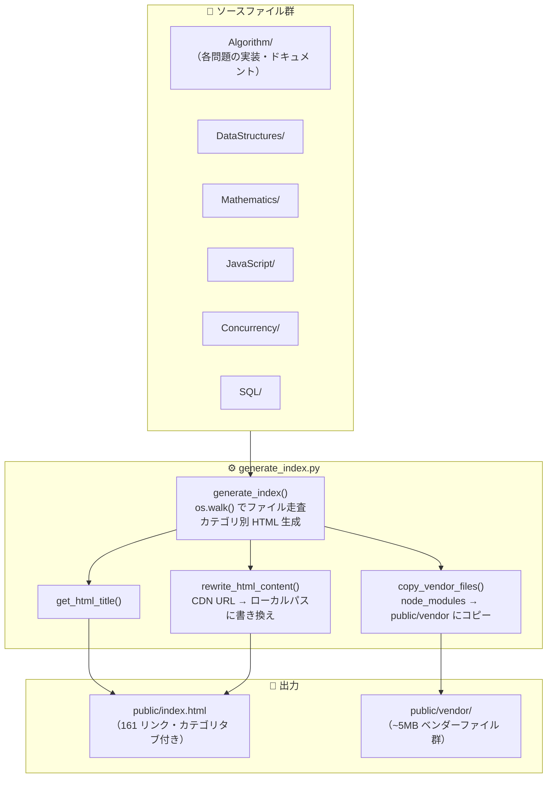
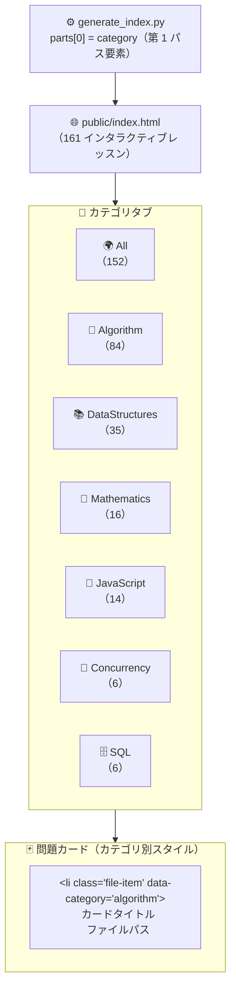
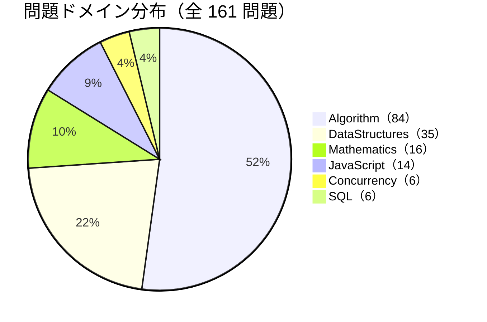
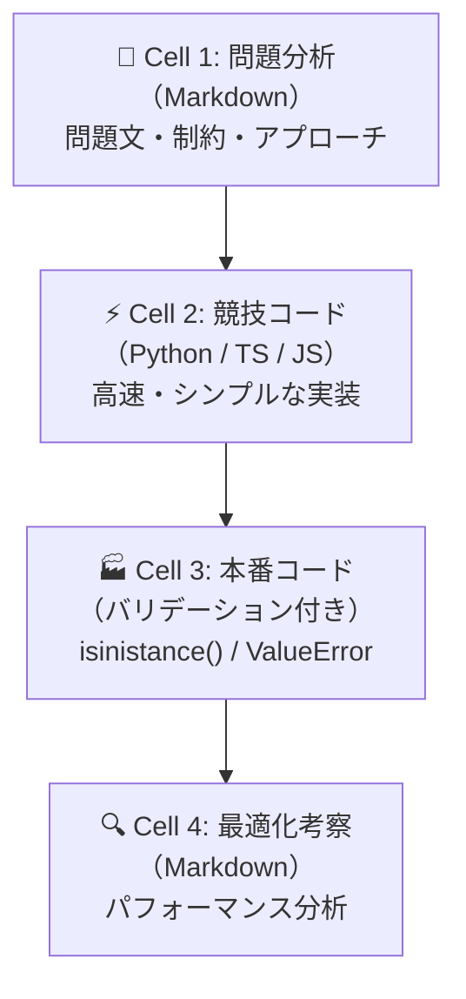

# リポジトリ概要

**関連ソースファイル**: `README.md` / `public/index.html` / `generate_index.py` / `update_index.sh` / `INDEX_MAINTENANCE.md`

Algorithm-DataStructures-Math-SQL リポジトリは、**決定論的・多言語・マルチ AI の問題解決ドキュメントシステム**を実装しています。LeetCode・HackerRank・AtCoder から収録した各競技プログラミング問題は、**2×3×3 の行列乗算**（2 AI 実装 × 3 プログラミング言語 × 3 ドキュメント層）によって正確に **18 個のアーティファクト**を生成します。

このページでは、リポジトリの基本アーキテクチャ・ファイル構成パターン・ビルドインフラストラクチャを解説します。各サブシステムの詳細については以下を参照してください。

- アーティファクト生成の仕組み → [The 2×3×3 Artifact Generation Matrix]
- AI 実装の違い → [Dual AI Implementation Philosophy]
- ドキュメント形式 → [Three-Tier Progressive Documentation System]
- 開発ツール → [Development Environment and Tooling]

---

## リポジトリ構造: 2×3×3×6 アーキテクチャ

### 決定論的アーティファクト生成マトリクス

リポジトリは、3 つの乗算次元によって問題ごとに厳密な **18 ファイル生成パターン**を強制しています。


```mermaid
graph TD
    PROBLEM["🧩 競技プログラミング問題<br>（LeetCode / HackerRank / AtCoder）"]

    subgraph MATRIX["2×3×3 マトリクス = 18 アーティファクト"]
        subgraph AI["🤖 AI プロバイダー（×2）"]
            CLAUDE["Claude Sonnet 4.5<br>（競技特化・簡潔）"]
            GPT["GPT 5.1 thinking customized<br>（本番対応・堅牢）"]
        end

        subgraph LANG["💻 プログラミング言語（×3）"]
            PY["Python<br>*.py / *_py.ipynb"]
            TS["TypeScript<br>*.ts / *_ts.ipynb"]
            JS["JavaScript<br>*.js / *_js.ipynb"]
        end

        subgraph DOC["📄 ドキュメント層（×3）"]
            MD["Tier 1: README.md<br>静的 Markdown"]
            HTML["Tier 2: README.html<br>インタラクティブ HTML"]
            REACT["Tier 3: README_react.html<br>動的 React"]
        end
    end

    PROBLEM --> AI
    AI --> LANG
    LANG --> DOC
```

**問題ごとのアーティファクト数: 18 ファイル（2 AI × 3 言語 × 3 ドキュメント）**

| 次元                | 数  | 例                                                   | コードパターン                        |
| ------------------- | --- | ---------------------------------------------------- | ------------------------------------- |
| **AI プロバイダー** | 2   | `claude sonnet 4.5/`、`gpt 5.1 thinking customized/` | Level 5 のサブディレクトリ名          |
| **言語**            | 3   | `*.py`、`*.ts`、`*.js` + Jupyter バリアント          | ファイル拡張子 + Jupyter ノートブック |
| **ドキュメント**    | 3   | `README.md`、`README.html`、`README_react.html`      | 固定ファイル名パターン                |

---

### O(1) 検索を実現する 6 階層ファイル構造

リポジトリは検索なしに直接ファイルを特定できる、**決定論的なパス構造**を採用しています。


```mermaid
flowchart TD
    subgraph HIERARCHY["📁 6 階層パス構造"]
        L1["Level 1: Domain<br>Algorithm / DataStructures / Mathematics / SQL"]
        L2["Level 2: Subcategory<br>DynamicProgramming / BinarySearch / Map"]
        L3["Level 3: Platform<br> leetcode / hackerrank / atcoder"]
        L4["Level 4: Problem<br>97. Interleaving String"]
        L5["Level 5: AI<br>claude sonnet 4.5 / gpt 5.1 thinking customized"]
        L6["Level 6: Artifact<br>Interleaving_String.py / README.md"]
    end

    L1 --> L2 --> L3 --> L4 --> L5 --> L6

    EXAMPLE["📌 具体例:<br>Algorithm/DynamicProgramming/leetcode/<br>97. Interleaving String/Claude Sonnet 4.5/<br>├── Interleaving_String.py<br>├── Interleaving_String.ts<br>├── Interleaving_String.js<br>├── README.md<br>├── README.html<br>└── README_react.html"]

    L6 -. "実例" .-> EXAMPLE
```

**パスパターン**:

```
{Domain}/{Subcategory}/{Platform}/{Problem}/{AI}/{Artifact}
```

| Level | 用途                     | 抽出方法                             | 値の例                                              |
| ----- | ------------------------ | ------------------------------------ | --------------------------------------------------- |
| 1     | ドメイン分類             | `parts[0]`（`os.path.split()` より） | `Algorithm`, `DataStructures`, `Mathematics`, `SQL` |
| 2     | アルゴリズム手法         | `parts[1]`                           | `DynamicProgramming`, `BinarySearch`, `Map`         |
| 3     | 問題ソース               | `parts[2]`                           | `leetcode`, `hackerrank`, `atcoder`                 |
| 4     | 具体的な問題             | `parts[3]`                           | `97. Interleaving String`                           |
| 5     | AI 実装                  | `parts[4]`                           | `claude sonnet 4.5`, `gpt 5.1 thinking customized`  |
| 6     | ファイルアーティファクト | ファイル名                           | `Interleaving_String.py`, `README.md`               |

> **SQL ドメインの例外**: Level 5 に単一の `gpt/` ディレクトリを使用し、Level 6 でプラットフォーム固有のサフィックスを付与します。
>
> ```
> SQL/Leetcode/Basic select/1141. User Activity/gpt/
> ├── User_Activity_*_mysql.ipynb     # MySQL 8.0.40
> ├── User_Activity_*_postgre.ipynb   # PostgreSQL 16.6+
> └── User_Activity_*_pandas.ipynb    # Pandas 2.2.2
> ```

---

## デュアル AI 実装哲学: コードレベルの差別化


```mermaid
graph LR
    subgraph CLAUDE_BOX["🔵 Claude Sonnet 4.5<br>（競技プログラミング特化）"]
        C1["✅ メソッド数: 1（isInterleave のみ）"]
        C2["✅ 型チェック: アノテーションを信頼"]
        C3["✅ 制約バリデーション: なし"]
        C4["✅ コード行数: 50〜150 行"]
        C5["✅ 実行時間（Python）: 44ms（60.43%）"]
        C6["✅ メモリ（Python）: 91.38 パーセンタイル"]
    end

    subgraph GPT_BOX["🟠 GPT 5.1 thinking customized<br>（本番環境対応）"]
        G1["📦 メソッド数: 2+（競技版 + 本番版）"]
        G2["📦 型チェック: isinstance() ランタイムチェック"]
        G3["📦 制約バリデーション: 明示的な ValueError"]
        G4["📦 コード行数: 80〜200 行"]
        G5["📦 実行時間（Python）: 42ms（70.90%）"]
        G6["📦 メモリ（Python）: 66.05 パーセンタイル"]
    end

    PROBLEM["🧩 同じ問題<br>（例: Interleaving String）"]
    PROBLEM --> CLAUDE_BOX
    PROBLEM --> GPT_BOX
```

### コードエンティティの比較

| 観点                   | Claude 実装          | GPT 実装                                        |
| ---------------------- | -------------------- | ----------------------------------------------- |
| **メソッド数**         | 1（`isInterleave`）  | 2+（`isInterleave`, `isInterleave_production`） |
| **型チェック**         | アノテーションを信頼 | `isinstance()` ランタイムチェック               |
| **制約バリデーション** | なし                 | `if len(s1) > 100: raise ValueError` を明示     |
| **コード行数**         | 50〜150 行           | 80〜200 行                                      |
| **実行時間（Python）** | 44ms（60.43%）       | 42ms（70.90%）                                  |
| **メモリ（Python）**   | 91.38 パーセンタイル | 66.05 パーセンタイル                            |

---

## 3 段階プログレッシブドキュメントシステム

各問題には、異なるスキルレベルを対象とした **3 段階のドキュメント**が提供されます。


```mermaid
flowchart LR
    subgraph TIER1["📄 Tier 1: README.md<br>（静的 Markdown）"]
        T1A["Section 1: overview<br>問題文・制約・例"]
        T1B["Section 2: tldr<br>アルゴリズム戦略・データ構造"]
        T1C["Section 3: complexity<br>時間 O(…) / 空間 O(…)"]
        T1D["Section 4: impl<br>コードウォークスルー"]
        T1E["Section 5: cpython<br>言語固有の最適化"]
    end

    subgraph TIER2["🖥️ Tier 2: README.html<br>（インタラクティブ HTML）"]
        T2A["Prism.js 1.29.0<br>構文ハイライト"]
        T2B["Tailwind CSS<br>スタイリング"]
        T2C["Play/Pause/Step<br>インタラクティブ制御"]
        T2D["SVG フローチャート<br>アルゴリズム可視化"]
    end

    subgraph TIER3["⚛️ Tier 3: README_react.html<br>（動的 React）"]
        T3A["React 18.3.1 + Babel 7.26.10<br>JSX ブラウザ実行"]
        T3B["useState<br>ライブ入力変更"]
        T3C["useEffect<br>リアルタイム再実行"]
        T3D["デュアル AI 比較<br>サイドバイサイド表示"]
    end

    BEGINNER["🟢 入門者"] --> TIER1
    INTERMEDIATE["🟡 中級者"] --> TIER2
    ADVANCED["🔴 上級者"] --> TIER3
```

### Tier 1: 静的 Markdown（`README.md`）

**標準 5 セクション構成**:

| Section ID | ヘッダー               | コンテンツの目的                             |
| ---------- | ---------------------- | -------------------------------------------- |
| 1          | `<h2 id="overview">`   | 問題文・制約・例                             |
| 2          | `<h2 id="tldr">`       | アルゴリズム戦略・データ構造・状態遷移       |
| 3          | `<h2 id="complexity">` | 時間 O(...)・空間 O(...)・導出               |
| 4          | `<h2 id="impl">`       | コードウォークスルー・行ごとの解説           |
| 5          | `<h2 id="cpython">`    | 言語固有の最適化・パフォーマンスチューニング |

### Tier 2: インタラクティブ HTML（`README.html`）

**技術スタック**: Prism.js 1.29.0・Tailwind CSS・JavaScript 状態管理

**主な機能**:

- ステップバイステップのアルゴリズム可視化
- SVG フローチャートレンダリング
- 行番号付きコードブロックハイライト
- 外部 CDN 依存なし（全てベンダーローカル化）

### Tier 3: 動的 React（`README_react.html`）

**技術スタック**: React 18.3.1・React DOM 18.3.1・Babel Standalone 7.26.10

**主な機能**:

- `useState` によるライブ入力変更
- `useEffect` によるリアルタイムアルゴリズム再実行
- デュアル AI 実装のサイドバイサイド比較
- インタラクティブな可視化コンポーネント

---

## ビルド・公開インフラストラクチャ

### インデックス生成パイプライン


```mermaid
flowchart TD
    subgraph SOURCE["📁 ソースファイル群"]
        ALGO["Algorithm/<br>（各問題の実装・ドキュメント）"]
        DS["DataStructures/"]
        MATH["Mathematics/"]
        JS_DIR["JavaScript/"]
        CONC["Concurrency/"]
        SQL_DIR["SQL/"]
    end

    subgraph SCRIPT["⚙️ generate_index.py"]
        F1["get_html_title()<br><title> タグを正規表現で抽出"]
        F2["copy_vendor_files()<br>node_modules → public/vendor にコピー"]
        F3["rewrite_html_content()<br>CDN URL → ローカルパスに書き換え"]
        F4["generate_index()<br>os.walk() でファイル走査<br>カテゴリ別 HTML 生成"]
    end

    subgraph OUTPUT["📄 出力"]
        INDEX["public/index.html<br>（161 リンク・カテゴリタブ付き）"]
        VENDOR["public/vendor/<br>（~5MB ベンダーファイル群）"]
    end

    SOURCE --> F4
    F4 --> F1
    F4 --> F2
    F4 --> F3
    F1 --> INDEX
    F2 --> VENDOR
    F3 --> INDEX
```

### `generate_index.py` の主要関数

| 関数                     | 行      | 目的                                       | コードエンティティ                      |
| ------------------------ | ------- | ------------------------------------------ | --------------------------------------- |
| `get_html_title()`       | 11-17   | `<title>` タグを正規表現で抽出             | `re.search(r'<title>(.*?)</title>')`    |
| `copy_vendor_files()`    | 19-77   | `node_modules` を `public/vendor` にコピー | `shutil.copy2()`, `shutil.copytree()`   |
| `rewrite_html_content()` | 78-111  | CDN URL をローカルパスに置換               | 文字列置換マッピング                    |
| `generate_index()`       | 113-617 | メインオーケストレーション関数             | `os.walk()`, `defaultdict()`, HTML 生成 |

### ベンダーファイルマッピング

| ソース（node_modules）                          | 出力先（public/vendor）                      | 用途                             |
| ----------------------------------------------- | -------------------------------------------- | -------------------------------- |
| `react/umd/react.development.js`                | `/vendor/react/react.development.js`         | React 18.3.1 UMD ビルド          |
| `react-dom/umd/react-dom.development.js`        | `/vendor/react-dom/react-dom.development.js` | React DOM 18.3.1                 |
| `@babel/standalone/babel.min.js`                | `/vendor/babel/babel.min.js`                 | Babel 7.26.10（JSX 変換）        |
| `prismjs/prism.js`                              | `/vendor/prismjs/prism.js`                   | Prism.js 1.29.0 構文ハイライター |
| `@fortawesome/fontawesome-free/css/all.min.css` | `/vendor/fontawesome/css/all.min.css`        | FontAwesome 6.7.2 アイコン       |

### 自動化スクリプト

**シェルラッパー**（`update_index.sh`）:

```bash
#!/bin/bash
set -euo pipefail
cd "$(dirname "$0")"
python3 generate_index.py
```

**CI/CD 連携**（Git フック）:

- **Pre-commit フック**: コミット前に `update_index.sh` を自動実行
- **GitHub Actions**: Push / PR イベントでビルドをトリガー
- **自動コミット**: `git-auto-commit-action` で生成ファイルをコミット

---

## 技術スタックと依存関係管理

### コアランタイム環境

| コンポーネント | バージョン           | 設定ファイル      | 用途                                 |
| -------------- | -------------------- | ----------------- | ------------------------------------ |
| **Python**     | CPython 3.12.11      | `.python-version` | アルゴリズム実装・ビルドスクリプト   |
| **Node.js**    | v22.14.0             | `package.json`    | TypeScript / JavaScript ランタイム   |
| **TypeScript** | 5.9.3                | `package.json`    | 型安全な実装                         |
| **Bun**        | 1.3.5（Lockfile v1） | `bun.lock`        | パッケージマネージャー（npm の代替） |

### フロントエンド依存関係（ベンダーローカル化済み）

| パッケージ       | バージョン     | 用途                               |
| ---------------- | -------------- | ---------------------------------- |
| React            | 18.3.1         | React Tier 3 ドキュメント用 UI     |
| React DOM        | 18.3.1         | DOM レンダラー                     |
| Babel Standalone | 7.26.10        | ブラウザ上での JSX トランスパイル  |
| Prism.js         | 1.29.0         | Tier 2 HTML のコード構文ハイライト |
| Tailwind CSS     | スタンドアロン | Tier 2 HTML のスタイリング         |
| FontAwesome      | 6.7.2          | アイコン                           |

### SQL ドメインの依存関係（例外）

SQL 問題のみ、外部 Python ライブラリを使用します。

| ライブラリ     | バージョン | 設定                    | 用途                              |
| -------------- | ---------- | ----------------------- | --------------------------------- |
| **Pandas**     | 2.2.2      | `requirements.lock.txt` | SQL 問題代替の DataFrame 操作     |
| **NumPy**      | 2.3.4      | `requirements.lock.txt` | Pandas ソリューションでの数値演算 |
| **SQLAlchemy** | Latest     | `requirements.lock.txt` | データベースインタラクション層    |

### コード品質ツール

| ツール           | バージョン | 設定                 | 用途                         |
| ---------------- | ---------- | -------------------- | ---------------------------- |
| **Prettier**     | 3.4.2      | `package.json`       | コードフォーマット（JS/TS）  |
| **ESLint**       | 9.18.0     | `package.json`       | リンター（JS/TS）            |
| **Ruff**         | Latest     | Python 設定          | Python リント / フォーマット |
| **Markdownlint** | N/A        | `.markdownlint.json` | Markdown バリデーション      |

---

## ナビゲーションとファイル検索

### カテゴリベースのナビゲーション

生成された `public/index.html` は、カテゴリフィルタリング付きのタブインターフェースを実装しています。


```mermaid
flowchart TD
    INDEX["🌐 public/index.html<br>（161 インタラクティブレッスン）"]

    subgraph TABS["📑 カテゴリタブ"]
        T_ALL["🌍 All<br>（152）"]
        T_ALGO["🧩 Algorithm<br>（84）"]
        T_DS["📚 DataStructures<br>（35）"]
        T_MATH["📐 Mathematics<br>（16）"]
        T_JS["📜 JavaScript<br>（14）"]
        T_CONC["🔄 Concurrency<br>（6）"]
        T_SQL["🗄️ SQL<br>（6）"]
    end

    subgraph CARDS["🃏 問題カード（カテゴリ別スタイル）"]
        CARD["&lt;li class='file-item' data-category='algorithm'&gt;<br>  カードタイトル<br>  ファイルパス"]
    end

    INDEX --> TABS
    TABS --> CARDS

    BUILD["⚙️ generate_index.py<br>parts[0] = category（第 1 パス要素）"]
    BUILD --> INDEX
```

**カテゴリ抽出ロジック**（`generate_index.py:163-168`）:

```python
parts = rel_path.split(os.sep)
if len(parts) > 1:
    category = parts[0]  # 第 1 パス要素 = ドメイン
else:
    category = "Uncategorized"
```

---

## リポジトリのメトリクスとスケール

### 問題ドメイン分布


```mermaid
pie title 問題ドメイン分布（全 161 問題）
    "Algorithm（84）" : 84
    "DataStructures（35）" : 35
    "Mathematics（16）" : 16
    "JavaScript（14）" : 14
    "Concurrency（6）" : 6
    "SQL（6）" : 6
```

| ドメイン           | 問題数  | ファイル数（18×N） | 割合  |
| ------------------ | ------- | ------------------ | ----- |
| **Algorithm**      | 84      | 1,512              | 52.2% |
| **DataStructures** | 35      | 630                | 21.7% |
| **Mathematics**    | 16      | 288                | 9.9%  |
| **JavaScript**     | 14      | 252                | 8.7%  |
| **Concurrency**    | 6       | 108                | 3.7%  |
| **SQL**            | 6       | 108                | 3.7%  |
| **合計**           | **161** | **2,898**          | 100%  |

### 問題ごとのファイルタイプ内訳

| ファイルタイプ        | 数     | 用途                              | 命名パターン         |
| --------------------- | ------ | --------------------------------- | -------------------- |
| Python 実装           | 2      | アルゴリズム付き `class Solution` | `*.py`, `*_py.ipynb` |
| TypeScript 実装       | 2      | 型安全な関数実装                  | `*.ts`, `*_ts.ipynb` |
| JavaScript 実装       | 2      | CommonJS `module.exports`         | `*.js`, `*_js.ipynb` |
| 静的ドキュメント      | 2      | 5 セクション Markdown             | `README.md`          |
| インタラクティブ HTML | 2      | Prism.js + Tailwind               | `README.html`        |
| React 可視化          | 2      | React 18 + Babel                  | `README_react.html`  |
| **1 問題あたり合計**  | **18** | 完全な学習アーティファクトセット  | —                    |

### 生成サイトの構成

```
public/
├── index.html                 # メインナビゲーション（161 リンク・カテゴリタブ）
├── vendor/                    # ベンダー依存関係（合計約 5MB）
│   ├── react/                # React 18.3.1 UMD
│   ├── react-dom/            # React DOM 18.3.1
│   ├── babel/                # Babel Standalone 7.26.10
│   ├── prismjs/              # Prism.js 1.29.0 + プラグイン
│   ├── tailwindcss/          # Tailwind CSS スタンドアロン
│   └── fontawesome/          # FontAwesome 6.7.2 + Web フォント
├── Algorithm/                # 84 問題 × 18 ファイル = 1,512 ファイル
├── DataStructures/           # 35 問題 × 18 ファイル = 630 ファイル
├── Mathematics/              # 16 問題 × 18 ファイル = 288 ファイル
├── JavaScript/               # 14 問題 × 18 ファイル = 252 ファイル
├── Concurrency/              # 6 問題 × 18 ファイル = 108 ファイル
└── SQL/                      # 6 問題 × 18 ファイル = 108 ファイル
```

---

## ファイル命名規則とコード構成

### 言語別パターン

**Python**（Claude 実装）:

```python
class Solution:
    def isInterleave(self, s1: str, s2: str, s3: str) -> bool:
        """
        Docstring with Time/Space complexity
        """
        # 実装
```

**TypeScript**（GPT 実装）:

```typescript
function isInterleave(s1: string, s2: string, s3: string): boolean {
    // 型安全な実装
}
```

**JavaScript**:

```javascript
var isInterleave = function (s1, s2, s3) {
    // 実装
};
module.exports = { isInterleave };
```

### Jupyter ノートブック構成（GPT 実装）


```mermaid
flowchart TD
    CELL1["📝 Cell 1: 問題分析<br>（Markdown）<br>問題文・制約・アプローチ"]
    CELL2["⚡ Cell 2: 競技コード<br>（Python / TS / JS）<br>高速・シンプルな実装"]
    CELL3["🏭 Cell 3: 本番コード<br>（バリデーション付き）<br>isinistance() / ValueError"]
    CELL4["🔍 Cell 4: 最適化考察<br>（Markdown）<br>パフォーマンス分析"]

    CELL1 --> CELL2 --> CELL3 --> CELL4
```

---

## クイックスタートガイド

### クローンとセットアップ

```bash
# 1. リポジトリのクローン
git clone https://github.com/myoshi2891/Algorithm-DataStructures-Math-SQL.git
cd Algorithm-DataStructures-Math-SQL

# 2. 依存関係のインストール（Bun を使用）
bun install

# 3. 公開サイトの生成
./update_index.sh

# 4. ローカルサーバーで確認
bun run serve
# http://127.0.0.1:8080 を開く
```

### 新しい問題の追加

新しい問題を追加する際は、**2×3×3 マトリクス構造**を確保してください。

```
{Domain}/{Subcategory}/{Platform}/{Problem}/
├── claude sonnet 4.5/
│   ├── {Problem}.py
│   ├── {Problem}.ts
│   ├── {Problem}.js
│   ├── README.md
│   ├── README.html
│   └── README_react.html
└── gpt 5.1 thinking customized/
    ├── {Problem}_py.ipynb
    ├── {Problem}_ts.ipynb
    ├── {Problem}_js.ipynb
    ├── README.md
    ├── README.html
    └── README_react.html
```

ファイルの追加後、`./update_index.sh` を実行して `public/index.html` を再生成してください。

---

このリポジトリは、自動化されたビルドプロセスと厳密なファイル構成パターンによって **O(1) ファイル検索**と体系的な知識ナビゲーションを実現する、決定論的でスケーラブルな多言語アルゴリズムドキュメントアーキテクチャを実装しています。
