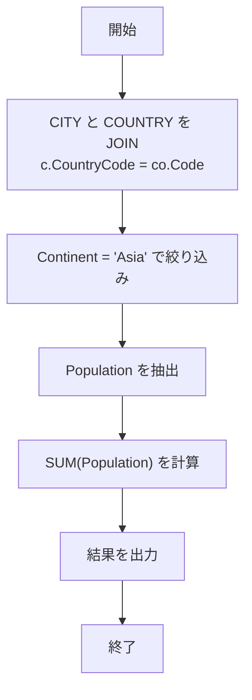

# **「CITY テーブルと COUNTRY テーブルを結合して、アジア大陸の都市の人口合計を算出」**

---

## 0. 実行環境

- **DB**: MySQL 8.x
- **テーブル**:

  - `CITY (ID, Name, CountryCode, District, Population)`
  - `COUNTRY (Code, Name, Continent, Region, SurfaceArea, IndepYear, Population, …)`

---

## 1. 問題整理

- **CITY.CountryCode** と **COUNTRY.Code** が結合キー
- **Continent = 'Asia'** の国に属する都市の人口を合計
- 出力は 1 行（sum のみ）

---

## 2. SQL クエリ

```sql
SELECT SUM(c.Population) AS TotalPopulation
FROM CITY c
JOIN COUNTRY co
  ON c.CountryCode = co.Code
WHERE co.Continent = 'Asia';
```

---

## 3. 処理の流れを図解で解説

### (1) CITY テーブルと COUNTRY テーブルの構造

```text
CITY                          COUNTRY
+----+----------+---------+   +------+---------+-----------+
| ID | Name     | CountryCode | | Code | Name    | Continent |
+----+----------+---------+   +------+---------+-----------+
| 1  | Tokyo    | JPN     |   | JPN  | Japan   | Asia      |
| 2  | Osaka    | JPN     |   | USA  | USA     | America   |
| 3  | Delhi    | IND     |   | IND  | India   | Asia      |
+----+----------+---------+   +------+---------+-----------+
```

---

### (2) JOIN のイメージ

```text
CITY.CountryCode = COUNTRY.Code で結合
─────────────────────────────
 Tokyo (JPN)  → Japan (Asia)
 Osaka (JPN)  → Japan (Asia)
 Delhi (IND)  → India (Asia)
```

---

### (3) WHERE フィルタリング

```text
Continent = 'Asia' のみ残す
─────────────────────────────
 Tokyo (Japan, Asia)  → Population 13,500,000
 Osaka (Japan, Asia)  → Population 2,700,000
 Delhi (India, Asia)  → Population 19,000,000
```

---

### (4) SUM 集計

```text
合計 Population
13,500,000 + 2,700,000 + 19,000,000 = 35,200,000
```

---

## 4. 処理フローチャート (Mermaid 図解)



---

## 5. 出力例

```text
+----------------+
| TotalPopulation|
+----------------+
|     35200000   |
+----------------+
```

---

✅ ポイント

- **JOIN → WHERE → SUM** の流れを押さえれば、ほかの大陸（例: Europe, Africa）の集計にも応用可能です。

---
