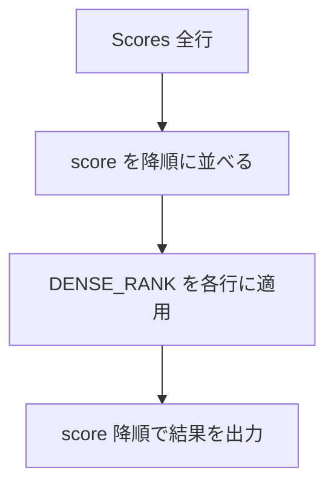
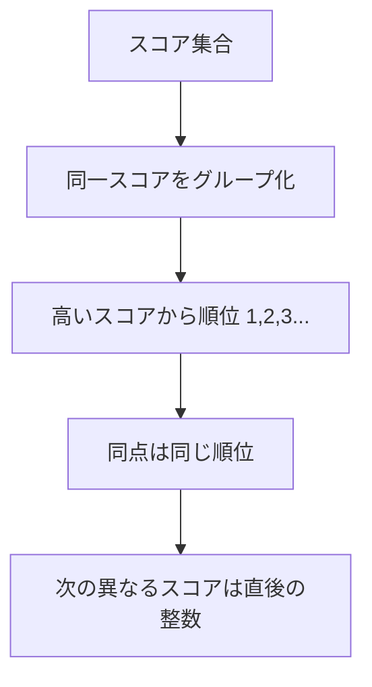
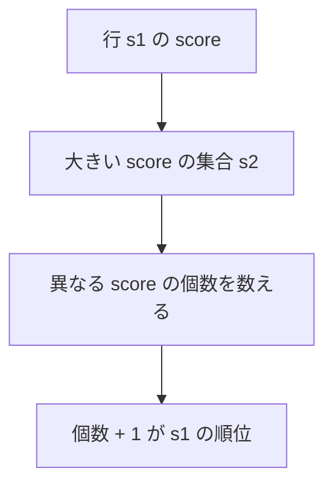

# 解説

## ✅ 解法 1（推奨 / PostgreSQL）

```sql
-- PostgreSQL
SELECT
  score,
  DENSE_RANK() OVER (ORDER BY score DESC) AS rank
FROM scores
ORDER BY score DESC;
```

### メモ

- PostgreSQL の小数は `NUMERIC(p,s)`（= MySQL DECIMAL 相当）。表示桁を固定したいだけなら `ROUND(score, 2)`、
  文字列化までしたいなら `to_char(score, 'FM999990.00')` を使えます（ただし文字列になるので並び替えには使わないのが無難）。

---

## ✅ 解法 2（ウィンドウ関数なしの考え方）

相関サブクエリで「自分よりも**大きい異なるスコア**の個数 + 1」を順位にします。**DENSE** の性質を守れます。

```sql
SELECT
  s1.score,
  1 + (
    SELECT COUNT(DISTINCT s2.score)
    FROM scores AS s2
    WHERE s2.score > s1.score
  ) AS rank
FROM scores AS s1
ORDER BY s1.score DESC;
```

---

## ✅ 解法 3（段階を明示：重複除去 → 順位付け → 結合）

概念をクエリの構造にも反映したい場合の書き方です。

```sql
WITH distinct_scores AS (
  SELECT DISTINCT score
  FROM scores
),
ranked AS (
  SELECT
    score,
    DENSE_RANK() OVER (ORDER BY score DESC) AS rank
  FROM distinct_scores
)
SELECT s.score, r.rank
FROM scores AS s
JOIN ranked AS r USING (score)
ORDER BY s.score DESC;
```

---

## 図解 1：処理の流れ（ウィンドウ関数版）



## 図解 2：DENSE_RANK の考え方



## 図解 3：相関サブクエリ版のイメージ



---

## サンプル入出力（確認）

入力（例）

```text
id | score
---+-------
1  | 3.50
2  | 3.65
3  | 4.00
4  | 3.85
5  | 4.00
6  | 3.65
```

出力（いずれの解法でも同じ）

```text
score | rank
------+------
4.00  | 1
4.00  | 1
3.85  | 2
3.65  | 3
3.65  | 3
3.50  | 4
```

---

## つまずきやすい点と対策

- **順位の穴**：`RANK()` は同点のぶんだけ順位が飛ぶ（穴あり）。本問題は**必ず `DENSE_RANK()`** を使うか、相関サブクエリで「大きい**異なる**スコア数 + 1」を計算してください。
- **表示桁**：結果を数値のまま返すならそのまま。
  見た目を 2 桁固定にしたいなら `SELECT to_char(score, 'FM999990.00') AS score, ...` とし、並び替えは数値列 `score` を使うのが安全です。
- **性能**：大量データではウィンドウ関数が一般に高速。相関サブクエリ版は `scores(score)` にインデックスがあると効果的です。
