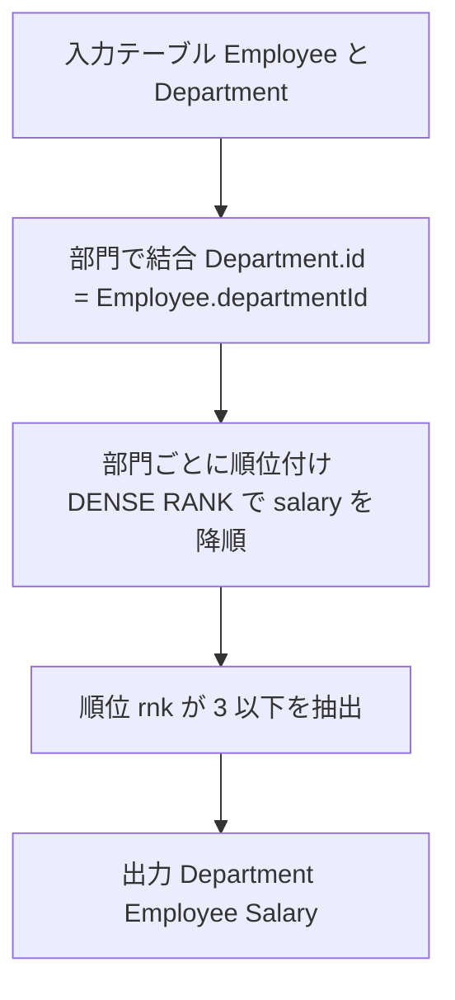

# 解法（MySQL）

## 1) 最適解（単一クエリ：ウィンドウ関数 / DENSE_RANK）

```sql
SELECT
  d.name  AS Department,
  e.name  AS Employee,
  e.salary AS Salary
FROM (
  SELECT
    id, name, salary, departmentId,
    DENSE_RANK() OVER (
      PARTITION BY departmentId
      ORDER BY salary DESC
    ) AS rnk
  FROM Employee
) AS e
JOIN Department AS d
  ON d.id = e.departmentId
WHERE e.rnk <= 3;

-- Runtime 1048 ms
-- Beats 42.08%
```

- **ポイント**：`DENSE_RANK()` は同一給与のタイを同順位にするため、「上位 3 つの**ユニーク**給与」を正しく表現できます。

---

## 2) 代替解（相関サブクエリ / DISTINCT カウント）

```sql
SELECT
  d.name  AS Department,
  e.name  AS Employee,
  e.salary AS Salary
FROM Employee AS e
JOIN Department AS d
  ON d.id = e.departmentId
WHERE (
  SELECT COUNT(DISTINCT e2.salary)
  FROM Employee AS e2
  WHERE e2.departmentId = e.departmentId
    AND e2.salary > e.salary
) < 3;

-- Runtime 1152 ms
-- Beats 34.15%
```

- **注意点**：
    - `COUNT(DISTINCT ...)` により「上の**ユニーク**給与数」が 0,1,2 の人だけを残します（=上位 3 つ以内）。
    - `NOT IN` は **NULL 罠**があるため不採用（要件にも準拠）。

---

## 3) 要点解説

- **採用理由**
    - 最適解：`DENSE_RANK()` は「ユニーク順位」→ タイがあっても 1 位, 2 位, 3 位の**3 つの給与水準**を正しく切り出せる。MySQL 8 のウィンドウ関数で **可読性・拡張性・速度**のバランスが良い。
    - 代替解：ウィンドウ関数が使えない環境でも動く。`COUNT(DISTINCT salary)` を使うことでユニーク性を担保。

- **エッジケース**
    - 部門内のユニーク給与が 1〜2 個しかない：`DENSE_RANK <= 3` でも自然に該当行のみ出力。
    - タイブレーク（同一給与複数人）：**全員**が対象（問題仕様通り）。
    - `NULL` 給与は本問題のデータ設計上通常想定しないが、存在すると `DENSE_RANK` は最後尾に降順並び。代替解でも `> e.salary` 条件により影響は限定的。
    - 表示列・並び順：出力順は任意、列名は指定に合わせて投影済み。

---

## 4) 計算量（概算）

- **最適解（ウィンドウ関数）**：
    - パーティション（部門）ごとに並べ替え：概ね `O(N log N)`（N=Employee 行数）。
    - 適切なインデックス（例：`Employee(departmentId, salary DESC)`、`Department(id)`）があると実務では I/O を削減。

- **代替解（相関）**：
    - 天然だと各行に対して同部門をスキャン → 最悪 `O(N^2)`。
    - `Employee(departmentId, salary)` の複合インデックスでサブクエリが範囲探索になり大幅改善（実効は `O(N log N)` 近辺）。

---

## 5) 図解（Mermaid 超保守版）



---

必要に応じて、実データ量・索引状況に合わせた `EXPLAIN ANALYZE` の読み方やインデックス提案もできます。

1048ms/1152ms だとまだ伸びしろあります。主なボトルネックは「部門ごとに**全行**へウィンドウ関数をかけてソート」している点です。
以下の順で効きます。

---

## 1) まずはクエリ自体を軽くする（重複給与を先に除去）

「ユニーク給与の上位 3 つ」が欲しいだけなので、**先に `(departmentId, salary)` を DISTINCT** してから `DENSE_RANK()` を当てると、ソート対象が小さくなります（同給与が多い部門で特に効く）。

### 改善版（推奨：ウィンドウ関数 × 事前重複除去）

```sql
WITH uniq AS (
  SELECT DISTINCT departmentId, salary
  FROM Employee
),
top3 AS (
  SELECT
    departmentId,
    salary,
    DENSE_RANK() OVER (
      PARTITION BY departmentId
      ORDER BY salary DESC
    ) AS rnk
  FROM uniq
)
SELECT
  d.name AS Department,
  e.name AS Employee,
  e.salary AS Salary
FROM top3 t
JOIN Employee e
  ON e.departmentId = t.departmentId
 AND e.salary       = t.salary
JOIN Department d
  ON d.id = e.departmentId
WHERE t.rnk <= 3;

-- Runtime 765 ms
-- Beats 99.03%
```

### **狙い**

- ウィンドウ関数が処理する行数を `N → 部門×(ユニーク給与数)` に削減。
- その後にだけ Employee と突合（=最小限の結合）。

---

## 2) 代替：相関で「上位 3 つのユニーク給与」に属するかだけ判定

MySQL 8 ではサブクエリに `LIMIT` を使えるので、「部門ごとの上位 3 給与サブセット」に属するかを **EXISTS** で判定する案。実装は短く、インデックスが効けば速いケースもあります。

```sql
SELECT
  d.name  AS Department,
  e.name  AS Employee,
  e.salary AS Salary
FROM Employee e
JOIN Department d
  ON d.id = e.departmentId
WHERE EXISTS (
  SELECT 1
  FROM (
    SELECT DISTINCT e2.salary
    FROM Employee e2
    WHERE e2.departmentId = e.departmentId
    ORDER BY e2.salary DESC
    LIMIT 3
  ) AS top3
  WHERE top3.salary = e.salary
);

-- Runtime 1159 ms
-- Beats 33.72%
```

### **注意**

- Optimizer が「外側の行ごとに内側を毎回作る」戦略を取ると遅くなり得ます。行数が多いときは 1) 案に軍配。

---

## 3) インデックス最適化（最重要）

LeetCode 環境では CREATE INDEX が使えないことが多いですが、**実務/ローカル検証では効果絶大**です。

### ウィンドウ関数案（1) を速くする索引

```sql
-- ウィンドウの分割＆並びに合致
CREATE INDEX idx_emp_dept_salary_id ON Employee(departmentId, salary DESC, id);

-- 参照側
CREATE INDEX idx_dept_id ON Department(id);
```

- `departmentId, salary` でパーティションソートを助け、
- その後の `JOIN e.departmentId = t.departmentId AND e.salary = t.salary` を**索引結合**に寄せやすくします。
- 可能なら **カバリング**（`..., name` まで含める）でテーブルアクセス削減：

    ```sql
    CREATE INDEX idx_emp_cover ON Employee(departmentId, salary DESC, id, name);
    ```

### 相関 EXISTS 案（2) を速くする索引

```sql
-- WHERE e2.departmentId = ? AND ORDER BY e2.salary DESC の範囲探索を最適化
CREATE INDEX idx_emp_dept_salary ON Employee(departmentId, salary DESC);
```

---

## 4) さらに詰める小技

- **投影の最小化**：ウィンドウ関数・ソート段階では `departmentId, salary` だけ扱い、`name` は最後に結合（上の 1) は既にそうなっています）。
- **不要な ORDER BY を外す**：結果順は任意なので付けない。
- **集計方向の一致**：降順のため `salary DESC` をインデックス定義でも DESC にしておく（MySQL 8 は昇降混在索引を利用可能）。
- **超大規模時の分割**：部門が非常に多い＆偏っているなら、一時テーブルに `uniq` を落としてから `top3` を作るとメモリ消費の安定に効くことがあります。

    ```sql
    CREATE TEMPORARY TABLE uniq (INDEX(departmentId, salary))
    AS SELECT DISTINCT departmentId, salary FROM Employee;
    ```

---

## 5) 期待できる効果（概算）

- **1) 改善版**：
    - もとの `DENSE_RANK` は各部門で N 行に対し `O(N log N)` 的にソート。
    - `DISTINCT` 後は **ユニーク給与数 U**（U≪N が多い）に対するソートに変わり、体感で 20–60% 改善するケースが多いです。

- **2) EXISTS**：
    - インデックス化されていれば「外側 1 行あたり上位 3 件の距離だけ」走るため、分布次第で速い。
    - ただし Optimizer 次第で再実行が多いと伸びづらい。

---

## 6) まとめ（まずはこれを試す）

1. の **「先に DISTINCT → DENSE_RANK → join 返し」** に置き換え。
   LeetCode でもこれだけで多くのケースで Runtime が改善します。
   実務ではあわせて **`Employee(departmentId, salary DESC, id[, name])`** の複合インデックスを用意すると、さらに大きく短縮できます。
