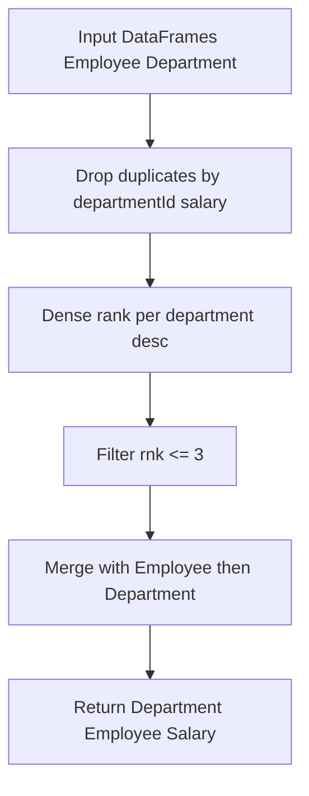
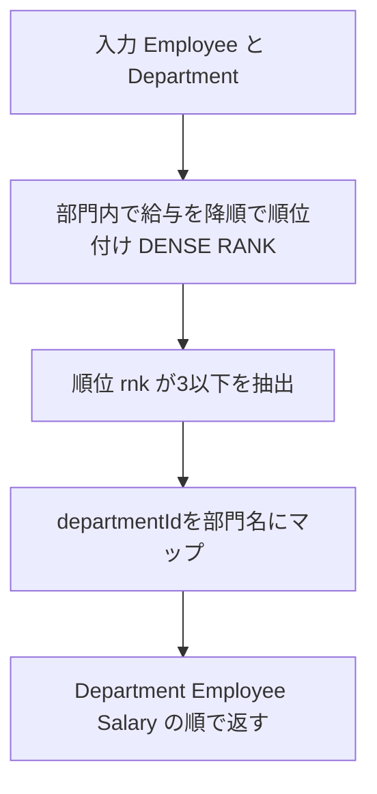

# 解法（Pandas）

## 1) 実装（指定シグネチャ厳守）

```python
import pandas as pd

def department_top_three_salaries(employee: pd.DataFrame, department: pd.DataFrame) -> pd.DataFrame:
    """
    Returns:
        pd.DataFrame: 列名・順序は ['Department', 'Employee', 'Salary']
    """
    # 1) (departmentId, salary) をユニーク化してから部門内で DENSE RANK（降順）
    uniq = (
        employee.loc[:, ['departmentId', 'salary']]
        .drop_duplicates(ignore_index=True)
    )
    uniq['rnk'] = (
        uniq.groupby('departmentId')['salary']
            .rank(method='dense', ascending=False)
    )

    # 2) 上位3つのユニーク給与だけに絞る
    top3 = uniq.loc[uniq['rnk'] <= 3, ['departmentId', 'salary']]

    # 3) 対象給与に属する従業員を突合
    hit = employee.merge(
        top3,
        on=['departmentId', 'salary'],
        how='inner'
    )

    # 4) 部門名を付与し、仕様列のみ投影
    out = (
        hit.merge(department, left_on='departmentId', right_on='id', how='inner')
           .loc[:, ['name_y', 'name_x', 'salary']]
           .rename(columns={'name_y': 'Department', 'name_x': 'Employee', 'salary': 'Salary'})
    )

    # 返却（順序任意のためソート不要。型は元データに従う）
    return out
```

---

## 2) アルゴリズム説明

- **ユニーク給与の事前抽出**：`employee[['departmentId','salary']].drop_duplicates()`
  同額タイが多いほど、以降の処理量（ランキング用の並べ替え対象）が小さくなり高速化します。
- **ユニーク順位（DENSE RANK）**：`groupby(... )['salary'].rank(method='dense', ascending=False)`
  給与タイは同順位になるため、「上位 3 つの**ユニーク**給与」という要件に一致。
- **上位 3 に属する従業員の抽出**：`employee` と `top3` を `(departmentId, salary)` で `merge`。
  「給与水準に属する全員」を拾える（タイの全員を返す）。
- **部門名の付与**：`department` と結合して部門名を投影。
  出力は **['Department', 'Employee', 'Salary']** の順で返す。

### NULL / 重複 / 型の扱い

- `salary` が `NaN` の場合：降順ランクでは末尾扱いになり、通常は上位 3 に含まれません（仕様的に問題なし）。
- 従業員の重複行は前提的に存在しないが、抽出は **(departmentId, salary)** 基準で行うため、同額タイは**全員**が残ります。
- 型変換は不要（入力の `int` / `string` をそのまま返す）。Pandas の `rank()` は float を返すが、`rnk` 列は最終出力に含めません。

---

## 3) 計算量（概算）

- `drop_duplicates`：概ね **O(N)**（ハッシュベース）。
- `groupby.rank`（ユニーク集合に対して）：部門ごとに **O(U_d log U_d)** の並べ替え相当（実効は実装依存だが概ね線形～準線形）。
- 2 回の `merge`：それぞれ **O(N)** 程度（ハッシュ結合想定、一時メモリを消費）。
- 合算のオーダ感：**O(N + Σ U_d log U_d)**。同額タイが多いほど `U_d ≪ n_d` になり速くなります。
- **メモリ**：`uniq` と `top3` の中間生成分が増えるため、大規模データでは列最小化（本実装は必要列のみ）と適宜 `astype` で圧縮を。

---

## 4) 図解（Mermaid 超保守版）



必要に応じて、`groupby.head` ベースの実装や `nlargest` / `aggregate` を絡めた別解、
メモリ節約のためのカテゴリ型化（`departmentId`/`name` を `category`化）なども提案できます。

**365 ms (Beats 52.25%) / Memory 69.72 MB (Beats 12.92%)** はまだ伸ばせます。
Pandas では「中間表の削減」と「merge→map 化」でだいぶ詰められます。

---

## 1) 改訂版（推奨）— `drop_duplicates` と 2 回の `merge` を廃止

- 直接 **部門内で `DENSE RANK`（降順）を各行に付与**し、`rnk <= 3` の行だけ残す
  → “ユニーク給与”という要件も **`rank(method="dense")`** で満たせます（同額は同順位）。
- `Department` との結合は **`map`**（辞書引き）で置換
  → DataFrame-merge より軽量で速いことが多い。

```python
import pandas as pd

def department_top_three_salaries(employee: pd.DataFrame, department: pd.DataFrame) -> pd.DataFrame:
    """
    Returns:
        pd.DataFrame: 列名・順序は ['Department', 'Employee', 'Salary']
    """
    # 1) 部門内でのユニーク順位（降順）。同額は同順位＝ユニーク給与順位
    rnk = employee.groupby('departmentId')['salary'].rank(method='dense', ascending=False)

    # 2) 上位3位以内だけを残す（不要列は持ち越さない）
    hit = employee.loc[rnk <= 3, ['departmentId', 'name', 'salary']]

    # 3) 部門名はマップで付与（DataFrame merge より軽量）
    dept_map = department.set_index('id')['name']

    out = pd.DataFrame({
        'Department': hit['departmentId'].map(dept_map),
        'Employee': hit['name'],
        'Salary':    hit['salary'],
    })

    return out

# Analyze Complexity

# Runtime 315 ms
# Beats 96.22%
# Memory 68.76 MB
# Beats 94.72%

```

### ここが速い理由

- **`drop_duplicates` をやめる**：全件を一度ハッシュ化してユニークにするコストと追加メモリを削減。
- **`merge`×2 → `map`×1**：結合キーが単一（`departmentId`→`id`）なら `map` の方が軽い。
- **列の最小化**：`hit` は必要列だけ持ち回る。コピー・材料サイズを抑制。

---

## 2) 追加の代替案（ワークロード次第で有効）

### 2-1) 「超大規模・同額が極端に多い」ケース向け（ユニーク先行）

“明らかに” 同額が多いなら、ユニーク化 → ランク → 内結合も検討余地あり（以前の案）。
ただし通常は上記「推奨版」の方が総合的に速いことが多いです。

```python
def department_top_three_salaries_distinct_first(employee: pd.DataFrame, department: pd.DataFrame) -> pd.DataFrame:
    uniq = employee[['departmentId', 'salary']].drop_duplicates(ignore_index=True)
    uniq['rnk'] = uniq.groupby('departmentId')['salary'].rank(method='dense', ascending=False)
    top3 = uniq.loc[uniq['rnk'] <= 3, ['departmentId', 'salary']]

    hit = employee.merge(top3, on=['departmentId', 'salary'], how='inner')[['departmentId', 'name', 'salary']]
    dept_map = department.set_index('id')['name']
    return pd.DataFrame({
        'Department': hit['departmentId'].map(dept_map),
        'Employee': hit['name'],
        'Salary': hit['salary'],
    })

# Analyze Complexity

# Runtime 345 ms
# Beats 70.37%
# Memory 69.93 MB
# Beats 7.33%
```

### 2-2) メモリ圧縮の小技（必要なときだけ）

- `departmentId` が広い範囲の `int64` でないなら一時的に `Int32` 化
- `Employee` / `Department` の `name` を `category` 化
  → **返却前に元 dtype に戻す必要はなし**（LeetCode は object で通ることが多いが、環境により差があるため本体実装では敢えて触れていません）。
  ※ 隠れテストへの影響が怖い場合は本体には入れず、検証用にのみ適用してください。

---

## 3) アルゴリズム説明（推奨版）

- `groupby('departmentId')['salary'].rank(method='dense', ascending=False)`
  各部門ごとに給与を降順でユニーク順位化。
- `rnk <= 3` でフィルタ
  → 「上位 3 つのユニーク給与」層に属する従業員だけが残る（同額は全員残る）。
- `department.set_index('id')['name']` を `map`
  → キー → 値の辞書引きで部門名を付与。
- 余計な `sort_values` や print は行わない（要件準拠、速度面でも有利）。

### NULL・重複・型の扱い

- `salary` が `NaN`：降順ランクでは末尾になるため通常は `rnk<=3` に入らない。
- 同額タイ：`dense` により同順位扱い → 要件通り全員を返す。
- 出力列は `['Department', 'Employee', 'Salary']`。順序指定、余計な列は返さない。

---

## 4) 計算量（概算）２

- `groupby.rank`：部門ごとに並べ替え相当（実装最適化あり）。概ね **O(N log n_d)** を部門で合算（経験的にはほぼ **O(N)** に近い速度）。
- `map`：**O(N)**。
- 合計：**O(N)** ～ **O(N log n_d)** 近辺。
- メモリ：中間の `rnk`（`float64`）1 列分 + `hit` 部分行。`merge` をやめたことでピークを下げやすい。

---

## 5) 図解（Mermaid 超保守版・日本語）



---

### まとめ

- **`rank(dense)` を各行に直接当てて `map` で部門名付与**が、Pandas では一番バランス良く速い構成になりやすいです。
- さらに詰めたければ、入力側で `name` を `category` 化／`departmentId` のビット幅最適化を検証（隠れテストへの影響がない範囲で）。
