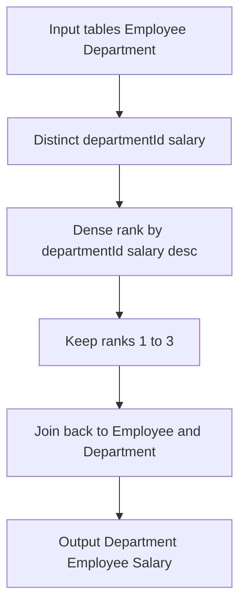

# 解法（PosgreSQL）

## 1) 最適解（単一クエリ：CTE で重複給与を先に除去 → DENSE_RANK）

```sql
WITH uniq AS (
  SELECT DISTINCT departmentId, salary
  FROM Employee
),
top3 AS (
  SELECT
    departmentId,
    salary,
    DENSE_RANK() OVER (
      PARTITION BY departmentId
      ORDER BY salary DESC
    ) AS rnk
  FROM uniq
)
SELECT
  d.name AS "Department",
  e.name AS "Employee",
  e.salary AS "Salary"
FROM top3 t
JOIN Employee e
  ON e.departmentId = t.departmentId
 AND e.salary       = t.salary
JOIN Department d
  ON d.id = e.departmentId
WHERE t.rnk <= 3;

-- Analyze Complexity
-- Runtime 236 ms
-- Beats 96.42%

-- Memory 0.00 MB
-- Beats 100.00%
```

**狙い**：まず `(departmentId, salary)` をユニークにしてから順位付け ⇒ ソート対象が減り、高速化しやすい（同額タイが多い部門で特に効く）。

---

## 2) 代替解

### 2-1) LATERAL × DISTINCT × LIMIT で「部門ごとの上位 3 給与」を作って突合

```sql
SELECT
  d.name AS "Department",
  e.name AS "Employee",
  e.salary AS "Salary"
FROM Department d
JOIN LATERAL (
  SELECT DISTINCT e2.salary
  FROM Employee e2
  WHERE e2.departmentId = d.id
  ORDER BY e2.salary DESC
  LIMIT 3
) s ON TRUE
JOIN Employee e
  ON e.departmentId = d.id
 AND e.salary       = s.salary;

-- Analyze Complexity
-- Runtim 249 ms
-- Beats 76.86%

-- Memory 0.00 MB
-- Beats 100.00%
```

- **長所**：部門ごとに **上位 3 のユニーク給与**だけを算出してから従業員を結合。`(departmentId, salary DESC)` インデックスが効くと速い。
- **短所**：部門数が非常に多く、各部門に従業員が大量だと、LATERAL が部門ごとにサブ計算するため、分布次第でプランがブレることがある。

### 2-2) 直球：ウィンドウを全件に当てる（実装は短い）

```sql
SELECT
  d.name AS "Department",
  e.name AS "Employee",
  e.salary AS "Salary"
FROM (
  SELECT
    id, name, salary, departmentId,
    DENSE_RANK() OVER (
      PARTITION BY departmentId
      ORDER BY salary DESC
    ) AS rnk
  FROM Employee
) e
JOIN Department d
  ON d.id = e.departmentId
WHERE e.rnk <= 3;

-- Analyze Complexity

-- Runtime 257 ms
-- Beats 66.85%
-- Memory 0.00 MB
-- Beats 100.00%

```

- **長所**：簡潔。
- **短所**：ユニーク化せずに順位付けするため、**全行**を並べ替える。タイが多いほど無駄が増え、最適解より遅くなりやすい。

### 2-3) 配列集約で上位 3 のユニーク給与を作って半結合

```sql
WITH s AS (
  SELECT
    departmentId,
    (ARRAY_AGG(DISTINCT salary ORDER BY salary DESC))[1:3] AS top3
  FROM Employee
  GROUP BY departmentId
)
SELECT
  d.name AS "Department",
  e.name AS "Employee",
  e.salary AS "Salary"
FROM s
JOIN Employee e
  ON e.departmentId = s.departmentId
 AND e.salary = ANY(s.top3)
JOIN Department d
  ON d.id = e.departmentId;

-- Analyze Complexity

-- Runtime 249 ms
-- Beats 76.86%
-- Memory 0.00 MB
-- Beats 100.00%

```

- **長所**：部門単位でユニーク化と上位 3 抽出を一発で実現。読みやすい。
- **短所**：`ARRAY_AGG(DISTINCT ...)` はメモリ使用量が増えやすい。極端にスキューした部門では要注意。

---

## 3) 要点解説

- **PostgreSQL 流の表現**

  - 過剰な `DISTINCT ON` は使わず、**必要な箇所だけユニーク化**（最適解の `uniq`）→ `DENSE_RANK`。
  - LATERAL は「部門単位で少量だけ取りたい」時に有効（2-1）。
  - 配列・`ANY` はセミジョイン代替としてスッキリ書ける（2-3）。

- **NULL / 重複 / タイブレーク**

  - `salary` が NULL の場合：`ORDER BY salary DESC` では NULL は最後尾（デフォルト）。上位 3 には通常含まれない。
  - **重複給与**：`DENSE_RANK` により同順位扱い。上位 3**ユニーク給与**に属する全員を返すため仕様に一致。
  - 判定は **ID 基準**だが、抽出条件は「給与水準 ∈ 上位 3（ユニーク）」で行い、投影列は仕様準拠（部門名・社員名・給与）。

- **インデックス最適化（実務で強力）**

  ```sql
  -- 部門・給与の探索と並びに合致
  CREATE INDEX ON Employee (departmentId, salary DESC) INCLUDE (name, id);
  CREATE INDEX ON Department (id);
  ```

  - INCLUDE で**カバリング**度を上げ、テーブルアクセスを減らす（PostgreSQL 11+）。

---

## 5) 計算量（概算）

- **最適解（CTE でユニーク → DENSE_RANK）**

  - ユニーク化：部門ごとユニーク給与数を **U** とすると、並べ替えは概ね `O(U log U)` を部門分。
  - 全体では `O(N)`（ハッシュ or インデックスでの重複除去）＋ `O(Σ U log U)`＋ 最終結合 `O(N)` 程度。
  - 適切な索引で **Hash/Semi/Index Scan** が選ばれ、実務体感は `O(N+M)` 近似。

- **3-2（全件ウィンドウ）**：各部門で `O(n_d log n_d)`（`n_d` は部門件数）。ユニーク化がない分、同額が多いと不利。
- **3-1（LATERAL）**：各部門で `ORDER BY salary DESC LIMIT 3` の範囲探索。
  `(departmentId, salary DESC)` 索引があれば実効は `O(#dept * log N + match)` 近辺。

---

## 6) 図解（Mermaid 超保守版）



必要なら `EXPLAIN (ANALYZE, BUFFERS)` の読み解きとインデックスチューニング（並び順 DESC の利活用、付随列 INCLUDE の可否）まで掘り下げます。
