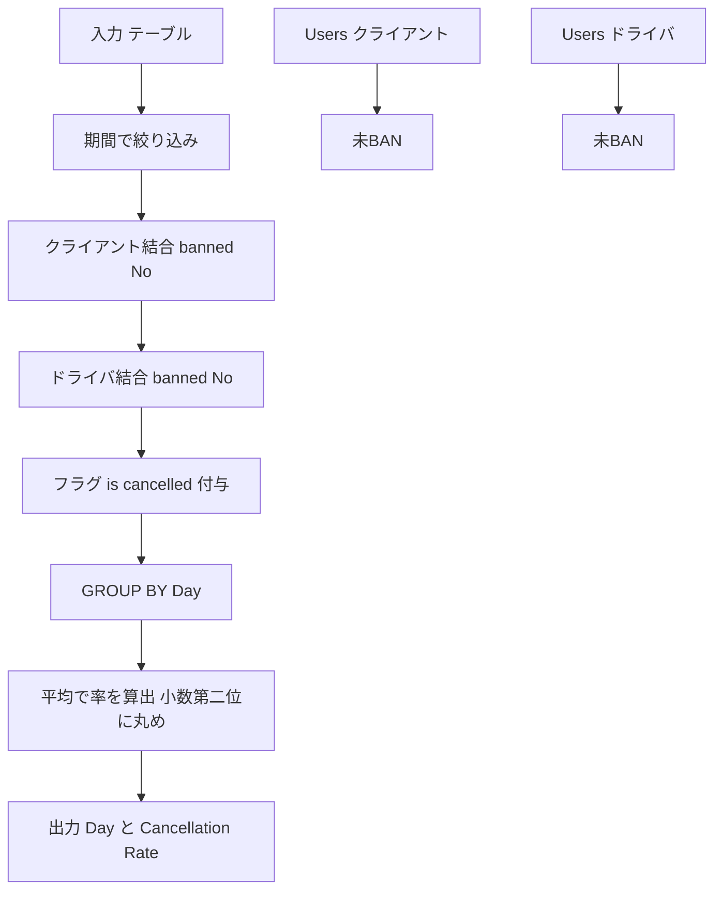

# MySQL 8.0.4

## 0) 前提

- エンジン: **MySQL 8**
- 並び順: 任意（`ORDER BY` なし）
- `NOT IN` は NULL 罠のため回避
- 判定は **ID 基準**（Users へ 2 回結合で「両者とも未 BAN」を担保）、表示は仕様どおりの列名と順序

## 1) 問題

- `2013-10-01`〜`2013-10-03` の各日について、**クライアントとドライバの両方が未 BAN**であるリクエストのみを対象に、
  **キャンセル率**（= その日のキャンセル件数 ÷ その日の総件数）を算出。
  キャンセルは `('cancelled_by_driver','cancelled_by_client')`。小数は **小数第 2 位**に丸める。
- 入力テーブル例: `Trips(id, client_id, driver_id, city_id, status, request_at[varchar])`,
  `Users(users_id, banned enum('Yes','No'), role)`
- 出力仕様:
  列 `Day`（日付文字列）, `Cancellation Rate`（小数第 2 位丸め）。対象期間内で**少なくとも 1 件の対象トリップ**がある日だけ返す。順序は任意。

## 2) 最適解（単一クエリ）

> 期間と未 BAN ユーザーで前処理 → 1/0 フラグを平均（`AVG`）して率を計算。`AVG` を使うことで分母 0 の心配がなく、四捨五入は `ROUND(...,2)`。

```sql
WITH unbanned_trips AS (
  SELECT
    t.request_at AS Day,
    CASE
      WHEN t.status IN ('cancelled_by_driver', 'cancelled_by_client') THEN 1
      ELSE 0
    END AS is_cancelled
  FROM Trips AS t
  INNER JOIN Users AS uc
    ON uc.users_id = t.client_id
   AND uc.banned = 'No'
  INNER JOIN Users AS ud
    ON ud.users_id = t.driver_id
   AND ud.banned = 'No'
  WHERE t.request_at BETWEEN '2013-10-01' AND '2013-10-03'
)
SELECT
  Day,
  ROUND(AVG(is_cancelled), 2) AS `Cancellation Rate`
FROM unbanned_trips
GROUP BY Day;

-- Runtime 568 ms
-- Beats 33.92%
```

- ポイント
    - **両結合**（client／driver）かつ `banned='No'` で「未 BAN の双方のみ」を抽出。
    - `request_at` は ISO 文字列なので `BETWEEN` で安全に期間フィルタ可能（文字列比較で日付順と一致）。
    - `AVG(0/1)` = キャンセル率、`ROUND(...,2)` で仕様どおり丸め。
    - 期間内に対象 0 件の日は CTE に現れないため、**自然に除外**される。

## 3) 代替解

> `EXISTS` を使って「未 BAN ユーザーの存在」を相関チェック。重複行を増やさずシンプル。

```sql
SELECT
  t.request_at AS Day,
  ROUND(AVG(
    CASE WHEN t.status IN ('cancelled_by_driver', 'cancelled_by_client') THEN 1 ELSE 0 END
  ), 2) AS `Cancellation Rate`
FROM Trips AS t
WHERE t.request_at BETWEEN '2013-10-01' AND '2013-10-03'
  AND EXISTS (
        SELECT 1 FROM Users uc
        WHERE uc.users_id = t.client_id AND uc.banned = 'No'
      )
  AND EXISTS (
        SELECT 1 FROM Users ud
        WHERE ud.users_id = t.driver_id AND ud.banned = 'No'
      )
GROUP BY t.request_at;

-- Runtime 472 ms
-- Beats 93.38%

```

- `NOT IN` は不採用（NULL 混入で誤判定）
- `EXISTS` によりインデックス（`Users.users_id`）が活きやすい

## 4) 要点解説

- **前処理で対象を縮小**: 期間＋未 BAN の両者を満たす行だけにする。
- **率は平均で出す**: `SUM/COUNT` ではなく `AVG(フラグ)` は分母 0 を気にせず書け、読みやすい。
- **ENUM の比較**: `status`／`banned` とも **文字列で明示比較**。列の実体が内部番号でも、可読性と可搬性を優先。
- **文字列日付**: `YYYY-MM-DD` フォーマットなら、文字列比較で時間を持たない日付範囲に対応可能。

## 5) 計算量（概算）

- 前処理フィルタ＋結合（インデックス有り）: **O(N)** 近似
    - `Trips.request_at` に期間フィルタ、`Users.users_id` に主キーインデックス → ネステッドループでも実運用十分

- 集約（`GROUP BY Day`）: 日数を D とすると **O(N)**（ハッシュ集約）
- 全体: **O(N)** 目安（N=期間内 Trips 件数）

## 6) 図解（Mermaid 超保守版）



---

必要なら、`request_at` を `DATE` へ明示キャストする版（パース不整合対策）も提示できます。
