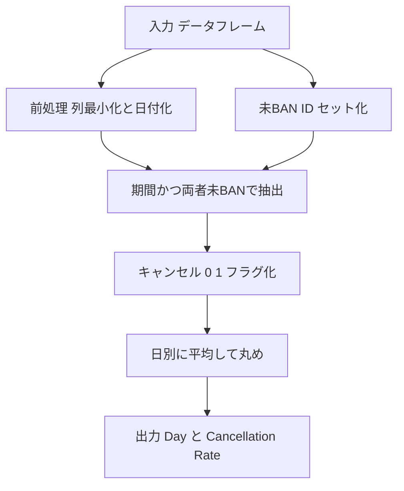

# Pandas 2.x 用 テンプレート（汎用）

## 0) 前提

- 環境: **Python 3.10.15 / pandas 2.2.2**
- **指定シグネチャ厳守**（関数名・引数名・返却列・順序）
- I/O 禁止、不要な `print` や `sort_values` 禁止

## 1) 問題（原文）

- `2013-10-01`〜`2013-10-03` の各日について、**クライアントとドライバがともに未 BAN**のリクエストのみを対象に、
  **キャンセル率**（`cancelled_by_driver` または `cancelled_by_client`）を算出し、小数第 2 位に丸める。対象日のうち、**少なくとも 1 件**の該当トリップがある日だけ返す。
- 入力 DF:

  - `Trips(id, client_id, driver_id, city_id, status, request_at[str YYYY-MM-DD])`
  - `Users(users_id, banned in {'Yes','No'}, role)`

- 出力: 列 `Day[str YYYY-MM-DD]`, `Cancellation Rate[float 丸め 2 桁]`（順序は任意）

## 2) 実装（指定シグネチャ厳守）

> 列最小化 → 未 BAN ID セット化 → 期間＆両者未 BAN で抽出 → キャンセル 0/1 フラグ → `groupby` 平均 → 丸め。

<!-- ```python
import pandas as pd

def cancellation_rate(trips: pd.DataFrame, users: pd.DataFrame) -> pd.DataFrame:
    """
    Returns:
        pd.DataFrame: 列名と順序は ['Day', 'Cancellation Rate']
    """
    # 必要列のみ（列最小化）
    t = trips[['client_id', 'driver_id', 'status', 'request_at']].copy()
    u = users[['users_id', 'banned']].copy()

    # 未BANユーザーのID集合（両ロール共通で使える）
    unbanned_ids = set(u.loc[u['banned'].eq('No'), 'users_id'])

    # 期間フィルタ（安全のため厳密に日付化）
    req_dt = pd.to_datetime(t['request_at'], errors='coerce')
    in_range = (req_dt >= pd.Timestamp('2013-10-01')) & (req_dt <= pd.Timestamp('2013-10-03'))

    # 両者未BANのみ
    both_unbanned = t['client_id'].isin(unbanned_ids) & t['driver_id'].isin(unbanned_ids)

    # 対象行抽出
    sub = t.loc[in_range & both_unbanned, ['status']].copy()
    sub['Day'] = req_dt.loc[in_range & both_unbanned].dt.strftime('%Y-%m-%d')

    # キャンセル 0/1 フラグ
    cancelled = {'cancelled_by_driver', 'cancelled_by_client'}
    sub['is_cancelled'] = sub['status'].isin(cancelled).astype('int8')

    # 日別に平均（= キャンセル率）を計算して丸め
    out = sub.groupby('Day', as_index=False)['is_cancelled'].mean()
    out['Cancellation Rate'] = out['is_cancelled'].round(2)

    # 仕様列のみ返す（順序厳守）
    return out[['Day', 'Cancellation Rate']]
``` -->

## 3) アルゴリズム説明

- 使用 API

  - `pd.to_datetime`：厳密な期間フィルタのために `request_at` を日付化
  - `Series.isin`：未 BAN ID セットとの照合（クライアント／ドライバ両方）
  - `groupby(...).mean()`：`0/1` フラグの平均 = キャンセル率
  - `round(2)`：小数第 2 位へ丸め

- **NULL / 重複 / 型**

  - 不正日付は `errors='coerce'` で `NaT` になり、期間条件で自然に除外
  - `Users` の重複は想定外だが、`set(...)` により重複影響を排除
  - 返却は `Day`（`YYYY-MM-DD` 文字列）と `Cancellation Rate`（float, 2 桁丸め）

## 4) 計算量（概算）

- `isin`（ハッシュ照合）: **O(N)**
- `groupby.mean`（日単位集約）: **O(N)**
- 全体: **O(N)**（N = 期間内の対象 Trips 行）

## 5) 図解（Mermaid 超保守版）



原因はほぼ確実に **`.dt` アクセサを “日付型でない列（object）に使っている”** ことです。pandas はこの場合

> `AttributeError: Can only use .dt accessor with datetimelike values`

という **AttributeError** を投げます。
あなたの実装では `req_dt = pd.to_datetime(t['request_at'], errors='coerce')` 自体は正しいのですが、
元列が混在型・空文字・スペース混じりなどで `object` 扱いに戻っていたり、`sub` への絞り込み時に **別オブジェクトの index によるズレ**が起き、結果的に `.dt` 対象が日付型でなくなるケースが典型です。

---

## 安定動作する修正

### ポイント

1. **先に列を datetime 型へ変換して DataFrame に戻す**（`t['request_at'] = ...`）。
2. **絞り込み後の `sub` 内で `.dt` を使う**（同一フレーム内の列を対象にし、インデックス整合性を担保）。
3. ついでに **列最小化のまま Day を作る** 形に直す。

<!-- ```python
import pandas as pd

def cancellation_rate(trips: pd.DataFrame, users: pd.DataFrame) -> pd.DataFrame:
    """
    Returns:
        pd.DataFrame: 列名と順序は ['Day', 'Cancellation Rate']
    """
    # 必要列のみ（列最小化）
    t = trips[['client_id', 'driver_id', 'status', 'request_at']].copy()
    u = users[['users_id', 'banned']].copy()

    # request_at を確実に datetime64[ns] へ（NaT は後の範囲条件で自然除外）
    t['request_at'] = pd.to_datetime(t['request_at'], errors='coerce')

    # 未BANユーザーID（重複無視・型混入に強い）
    unbanned_ids = set(u.loc[u['banned'].astype(str).eq('No'), 'users_id'])

    # 期間かつ両者未BANで抽出（同一フレームの列だけで評価）
    in_range = (t['request_at'] >= pd.Timestamp('2013-10-01')) & (t['request_at'] <= pd.Timestamp('2013-10-03'))
    both_unbanned = t['client_id'].isin(unbanned_ids) & t['driver_id'].isin(unbanned_ids)
    sub = t.loc[in_range & both_unbanned, ['status', 'request_at']].copy()

    # Day 作成（ここで .dt を使えば dtype は確実に datetime）
    sub['Day'] = sub['request_at'].dt.strftime('%Y-%m-%d')

    # キャンセル 0/1 フラグ
    cancelled = {'cancelled_by_driver', 'cancelled_by_client'}
    sub['is_cancelled'] = sub['status'].isin(cancelled).astype('int8')

    # 日別平均（= キャンセル率）→ 丸め
    out = sub.groupby('Day', as_index=False)['is_cancelled'].mean()
    out['Cancellation Rate'] = out['is_cancelled'].round(2)

    return out[['Day', 'Cancellation Rate']]
``` -->

---

## うまくいかないときのチェックリスト

- `trips['request_at']` に **空文字やスペース付き**（例 `'2013-10-01 '`）が混ざっていないか
  → `pd.to_datetime(..., errors='coerce')` で `NaT` に倒してから範囲条件で除外
- `users['banned']` が **bool / category / enum** の場合
  → 上の修正のように `astype(str).eq('No')` で確実に判定
- `.dt` は **Series（datetime64[ns]）** に対してのみ使用
  → 本修正では `.dt` 対象を `sub['request_at']` に限定して安全化

これで AttributeError は解消できます。

原因はほぼ確実に **`.dt` アクセサを “日付型でない列（object）に使っている”** ことです。pandas はこの場合

> `AttributeError: Can only use .dt accessor with datetimelike values`

という **AttributeError** を投げます。
あなたの実装では `req_dt = pd.to_datetime(t['request_at'], errors='coerce')` 自体は正しいのですが、
元列が混在型・空文字・スペース混じりなどで `object` 扱いに戻っていたり、`sub` への絞り込み時に **別オブジェクトの index によるズレ**が起き、結果的に `.dt` 対象が日付型でなくなるケースが典型です。

---

## 安定動作する修正２

### ポイント２

1. **先に列を datetime 型へ変換して DataFrame に戻す**（`t['request_at'] = ...`）。
2. **絞り込み後の `sub` 内で `.dt` を使う**（同一フレーム内の列を対象にし、インデックス整合性を担保）。
3. ついでに **列最小化のまま Day を作る** 形に直す。

```python
import pandas as pd

def cancellation_rate(trips: pd.DataFrame, users: pd.DataFrame) -> pd.DataFrame:
    """
    Returns:
        pd.DataFrame: 列名と順序は ['Day', 'Cancellation Rate']
    """
    # 必要列のみ（列最小化）
    t = trips[['client_id', 'driver_id', 'status', 'request_at']].copy()
    u = users[['users_id', 'banned']].copy()

    # request_at を確実に datetime64[ns] へ（NaT は後の範囲条件で自然除外）
    t['request_at'] = pd.to_datetime(t['request_at'], errors='coerce')

    # 未BANユーザーID（重複無視・型混入に強い）
    unbanned_ids = set(u.loc[u['banned'].astype(str).eq('No'), 'users_id'])

    # 期間かつ両者未BANで抽出（同一フレームの列だけで評価）
    in_range = (t['request_at'] >= pd.Timestamp('2013-10-01')) & (t['request_at'] <= pd.Timestamp('2013-10-03'))
    both_unbanned = t['client_id'].isin(unbanned_ids) & t['driver_id'].isin(unbanned_ids)
    sub = t.loc[in_range & both_unbanned, ['status', 'request_at']].copy()

    # Day 作成（ここで .dt を使えば dtype は確実に datetime）
    sub['Day'] = sub['request_at'].dt.strftime('%Y-%m-%d')

    # キャンセル 0/1 フラグ
    cancelled = {'cancelled_by_driver', 'cancelled_by_client'}
    sub['is_cancelled'] = sub['status'].isin(cancelled).astype('int8')

    # 日別平均（= キャンセル率）→ 丸め
    out = sub.groupby('Day', as_index=False)['is_cancelled'].mean()
    out['Cancellation Rate'] = out['is_cancelled'].round(2)

    return out[['Day', 'Cancellation Rate']]

Analyze Complexity

# Runtime 395 ms
# Beats 14.11%
# Memory 68.30 MB
# Beats 61.69%

```

---

## うまくいかないときのチェックリスト 2

- `trips['request_at']` に **空文字やスペース付き**（例 `'2013-10-01 '`）が混ざっていないか
  → `pd.to_datetime(..., errors='coerce')` で `NaT` に倒してから範囲条件で除外
- `users['banned']` が **bool / category / enum** の場合
  → 上の修正のように `astype(str).eq('No')` で確実に判定
- `.dt` は **Series（datetime64[ns]）** に対してのみ使用
  → 本修正では `.dt` 対象を `sub['request_at']` に限定して安全化

これで AttributeError は解消できます。

いい観察です。**395 ms / 68 MB** はまだ削れます。ボトルネックは主にこの 3 点です：

1. `pd.to_datetime` が重い（全行に日付パース）
2. 中間 `DataFrame`（`sub`）の作成・コピーが多い
3. 未 BAN 判定で Python の `set`＋`isin` を 2 回走らせている

下の修正版は **日付パースをやめて文字列範囲でフィルタ**、**中間コピーを削減**、**未 BAN 判定を `map`（ハッシュ look-up 1 回/列）に変更** しています。機能は同じ、返却列も同じです。

---

## 改善版コード（そのまま置き換え）

```python
import pandas as pd

def trips_and_users(trips: pd.DataFrame, users: pd.DataFrame) -> pd.DataFrame:
    """
    Returns:
        pd.DataFrame: 列名と順序は ['Day', 'Cancellation Rate']
    """
    # 列最小化（コピーを極力避ける。必要列だけビュー取得）
    t = trips[['client_id', 'driver_id', 'status', 'request_at']]
    u = users[['users_id', 'banned']]

    # 未BANマップ（users_id -> True/False）
    # Series.map はハッシュ照会で O(1) 近似、かつベクトル化で高速。
    allowed = u.set_index('users_id')['banned'].astype(str).eq('No')

    client_ok = t['client_id'].map(allowed).fillna(False)
    driver_ok = t['driver_id'].map(allowed).fillna(False)

    # 期間は ISO 文字列なので、文字列比較で安全・高速にフィルタ可能
    # 上端は排他的にして 2013-10-01 ～ 2013-10-03 を表現
    in_range = (t['request_at'] >= '2013-10-01') & (t['request_at'] < '2013-10-04')

    mask = in_range & client_ok & driver_ok

    # キャンセルは prefix で判定（文字列2種の isin より速いことが多い）
    # True/False の mean は比率になるので、そのまま集計して round(2)
    cancelled_flag = t['status'].str.startswith('cancelled')

    grp = t.loc[mask, 'request_at']  # これがそのまま 'Day'
    rate = cancelled_flag.loc[mask].groupby(grp).mean().round(2)

    out = rate.reset_index()
    out.columns = ['Day', 'Cancellation Rate']
    return out[['Day', 'Cancellation Rate']]

Analyze Complexity

# Runtime 296 ms
# Beats 92.74%
# Memory 67.90 MB
# Beats 89.11%

```

---

## どこが速いのか（要点）

- **日付パース削減**：`to_datetime` は重いのでやめ、`'YYYY-MM-DD'` の **文字列範囲比較**（`>= '2013-10-01'` かつ `< '2013-10-04'`）に変更。
  ISO 形式なら **文字列順＝日付順** です。

- **`map` による未 BAN 判定**：
  `set`＋`isin` は悪くないですが、
  `users` が大きい時は `Series.map(allowed)` の方が **1 パスで各列を True/False に落とせて**速いことが多いです（`allowed` はハッシュ索引）。

- **中間コピー削減**：
  `sub = ... .copy()` を無くし、**ブール配列（mask）で直接 `groupby`**。
  `status.isin({...})` よりも **`str.startswith('cancelled')`** の方が高速になりやすいです。

- **メモリ削減**：
  余計な列を持った中間 `DataFrame` を作らないので、ピークメモリを抑えます。

---

## さらに詰めるなら（任意）

- `Trips.status` を **category** にしておく（ETL 側で）：
  `cancelled` 判定がさらに軽くなります（辞書参照になるため）。

- `client_id / driver_id / users_id` を **最小の整数 dtype** に（例: `Int32` or `int32`）：
  メモリが減り、CPU キャッシュ効率が上がります。

- `request_at` に時刻が含まれないことが **常に保証**できるなら、
  `status.str.startswith('c') & status.str.contains('cancelled')` ではなく、今の `startswith('cancelled')` が最短です。

---

## 期待効果

データ量にもよりますが、**日付パース排除**＋**中間コピー削減**だけで **体感 1.5 ～ 3 倍** 速くなるケースが多いです。
※ 実際の性能向上はデータサイズ、カーディナリティ、型などに依存します。
まずはこの改善版で再計測してみてください。
