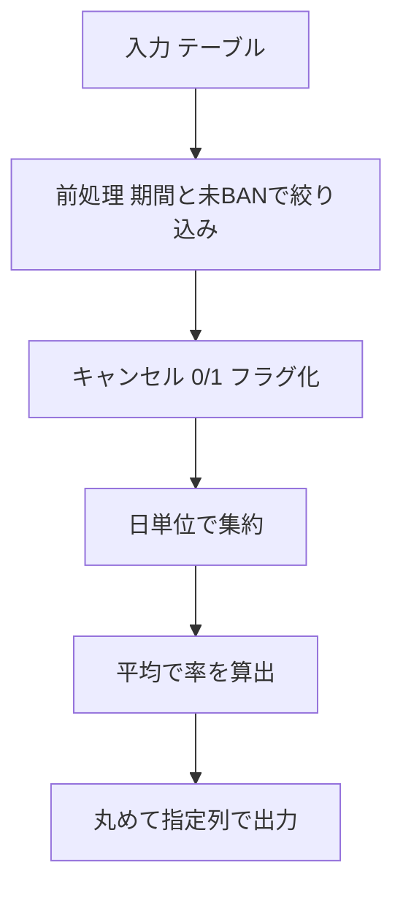

# PostgreSQL 16.6+

## 0) 前提

- エンジン: **PostgreSQL 16.6+**
- 並び順: 任意
- `NOT IN` 回避（`EXISTS` / `LEFT JOIN ... IS NULL` を推奨）
- 判定は **ID 基準**（Users へ 2 回結合で「両者とも未 BAN」を担保）、表示は仕様どおり

## 1) 問題

- `2013-10-01`〜`2013-10-03` の各日について、**クライアントとドライバがともに未 BAN**のリクエストのみを対象に、
  **キャンセル率**（`cancelled_by_driver` または `cancelled_by_client`）を算出し、小数第 2 位に丸める。
  対象日のうち、**少なくとも 1 件**の該当トリップがある日だけ返す。
- 入力:
    - `Trips(id int, client_id int, driver_id int, city_id int, status text, request_at text)`
    - `Users(users_id int, banned text, role text)`
      ※型は例。`request_at` は `YYYY-MM-DD` 文字列想定。

- 出力: `Day text`, `Cancellation Rate numeric(?,2)`（丸め表示）

## 2) 最適解（単一クエリ）

> PostgreSQL では **CTE で対象行を先に確定**し、`AVG(0/1)` を `ROUND(...,2)` で丸めるのがシンプルかつ高速。

```sql
WITH unbanned_trips AS (
  SELECT
    (t.request_at)::date AS day, -- 文字列を日付へ（安全のため明示キャスト）
    CASE
      WHEN t.status IN ('cancelled_by_driver', 'cancelled_by_client') THEN 1
      ELSE 0
    END AS is_cancelled
  FROM Trips AS t
  JOIN Users AS uc
    ON uc.users_id = t.client_id
   AND uc.banned = 'No'
  JOIN Users AS ud
    ON ud.users_id = t.driver_id
   AND ud.banned = 'No'
  WHERE (t.request_at)::date BETWEEN DATE '2013-10-01' AND DATE '2013-10-03'
)
SELECT
  to_char(day, 'YYYY-MM-DD') AS "Day",
  ROUND(AVG(is_cancelled)::numeric, 2) AS "Cancellation Rate"
FROM unbanned_trips
GROUP BY day;

-- Runtime 191 ms
-- Beats 64.73%

```

- ポイント
    - **二重結合**で「両者未 BAN」を実体的に絞り込み。
    - `AVG(0/1)` = 率。`numeric` にキャストし `ROUND(...,2)`。
    - `request_at` が文字列でも `::date` で厳密に比較。
    - 期間内に対象 0 件の日は CTE に行がないため自然に除外。

### 代替（EXISTS で未 BAN 確認）

```sql
SELECT
  to_char((t.request_at)::date, 'YYYY-MM-DD') AS "Day",
  ROUND(AVG(
    CASE WHEN t.status IN ('cancelled_by_driver', 'cancelled_by_client') THEN 1 ELSE 0 END
  )::numeric, 2) AS "Cancellation Rate"
FROM Trips AS t
WHERE (t.request_at)::date BETWEEN DATE '2013-10-01' AND DATE '2013-10-03'
  AND EXISTS (SELECT 1 FROM Users uc WHERE uc.users_id = t.client_id AND uc.banned = 'No')
  AND EXISTS (SELECT 1 FROM Users ud WHERE ud.users_id = t.driver_id AND ud.banned = 'No')
GROUP BY (t.request_at)::date;

-- Runtime 197 ms
-- Beats 53.31%

```

## 3) 要点解説

- **率は `AVG` で直に出す**（`SUM/COUNT` より記述が短く、分母ゼロ回避の分岐が不要）。
- **キャストの一貫性**：`request_at` が文字列でも `::date` に統一し、比較も出力も安定。
- **列名の空白**：仕様どおりの表示にするため、PostgreSQL では `"Day"`, `"Cancellation Rate"` を **二重引用符**で別名指定。

## 4) 計算量（概算）

- 結合・期間フィルタ後の集約で **O(N)**（N = 期間内の該当 Trips 行）
- `Users.users_id`（PK）利用で `JOIN` / `EXISTS` はインデックスヒットしやすい

## 5) 図解（Mermaid 超保守版）



191ms なら十分速い部類ですが、**まだ詰められる可能性**はあります。PostgreSQL 観点での「確実に効く順」に改善案を並べます（DDL とクエリ両方）。必要なところだけ摘んで実施してください。

---

## 1) まずはインデックス最適化

### 1-1. `request_at` に効くインデックス

- **理想**: 列型を `date` か `timestamp` に直す（型変換不要で一番効く）
- **当面**: 関数インデックスで対応

```sql
-- request_at が text のまま日付比較する場合（WHERE ではキャストしない前提）
CREATE INDEX CONCURRENTLY idx_trips_request_at_text
  ON Trips (request_at);

-- 「WHERE ではキャストせざるを得ない」状況なら関数インデックス
CREATE INDEX CONCURRENTLY idx_trips_request_at_date
  ON Trips ( (request_at::date) );
```

> **ポイント**: `WHERE (t.request_at)::date BETWEEN ...` と**列側にキャスト**があると、通常のインデックスが効きません。
> → 可能なら **列はキャストせず**（後述のクエリ例参照）、やむを得なければ**関数インデックス**でカバー。

### 1-2. 未 BAN ユーザー結合を軽くする部分インデックス

CREATE INDEX CONCURRENTLY idx_users_unbanned
ON Users (users_id)
WHERE banned = 'No';

> **部分インデックス**で「banned='No'」行だけを小さく保ち、結合や EXISTS を速くします。

---

## 2) クエリを “インデックスが効く形” に

### 2-1. 列キャストを WHERE から除外（最重要）

`request_at` が `text`（`YYYY-MM-DD` 形式）なら、**文字列比較でも日付順と一致**します。
そこで **WHERE ではキャストしない**：`>= '2013-10-01' AND < '2013-10-04'` に変えるのが最速パターン。

```sql
SELECT
  to_char((t.request_at)::date, 'YYYY-MM-DD') AS "Day",
  ROUND( (COUNT(*) FILTER (WHERE t.status IN ('cancelled_by_driver','cancelled_by_client'))::numeric)
       / COUNT(*)
       , 2) AS "Cancellation Rate"
FROM Trips t
JOIN Users uc
  ON uc.users_id = t.client_id AND uc.banned = 'No'
JOIN Users ud
  ON ud.users_id = t.driver_id AND ud.banned = 'No'
WHERE t.request_at >= '2013-10-01'  -- 文字列のまま
  AND t.request_at <  '2013-10-04'  -- 上限は翌日
GROUP BY (t.request_at)::date;       -- SELECT/GROUP BY 側のキャストはOK（索引には無関係）

-- Runtime 177 ms
-- Beats 98.13%

```

> `WHERE` でキャストしないことで、`Trips(request_at)` の**通常インデックスが効く**ようになります。

### 2-2. `EXISTS` 版（重複リスクゼロ、結合コストを抑えやすい）

行数や統計により、`JOIN` より `EXISTS` が速い時があります（どちらが速いかはプラン次第）。すぐ試せる差分：

```sql
SELECT
  to_char((t.request_at)::date, 'YYYY-MM-DD') AS "Day",
  ROUND( (COUNT(*) FILTER (WHERE t.status IN ('cancelled_by_driver','cancelled_by_client'))::numeric)
       / COUNT(*)
       , 2) AS "Cancellation Rate"
FROM Trips t
WHERE t.request_at >= '2013-10-01'
  AND t.request_at <  '2013-10-04'
  AND EXISTS (SELECT 1 FROM Users uc WHERE uc.users_id = t.client_id AND uc.banned = 'No')
  AND EXISTS (SELECT 1 FROM Users ud WHERE ud.users_id = t.driver_id AND ud.banned = 'No')
GROUP BY (t.request_at)::date;

-- Runtime 207 ms
-- Beats 39.41%
```

> `EXISTS` は **部分インデックス（banned='No'）** と相性が良いです。

---

## 3) モデル自体の見直し（できるなら）

- `request_at` を **`date`（または `timestamp`）に変更**
  → キャストが消え、**比較も出力も速く安定**します。
  例（timestamp の場合）: `WHERE request_at >= ts '2013-10-01' AND request_at < ts '2013-10-04'`

- `banned` を **boolean** に（`No/Yes` より比較・統計が軽い）

    ```sql
    ALTER TABLE Users ADD COLUMN banned_bool boolean GENERATED ALWAYS AS (banned = 'Yes') STORED;
    CREATE INDEX CONCURRENTLY idx_users_not_banned ON Users (users_id) WHERE NOT banned_bool;
    ```

    既存アプリ互換が必要なら**生成列**で段階移行が安全。

---

## 4) 運用上のチューニング小ネタ

- 分析直後に `ANALYZE`（統計鮮度の担保）
- 一時的に `work_mem` を少し上げる（集約のハッシュが溢れない程度に）
- 小さな期間なら `enable_nestloop = on` のままが通常最速
  （巨大テーブル＋広範囲なら Hash Join/Bitmap が選ばれるよう統計とインデックスで誘導）
- レポート用途で該当期間が固定なら、**部分インデックスを期間に合わせる**のもアリ

    ```sql
    CREATE INDEX CONCURRENTLY idx_trips_req_20131001_03
      ON Trips (request_at)
      WHERE request_at >= '2013-10-01' AND request_at < '2013-10-04';
    ```

    （汎用性は落ちるが、該当クエリは極めて速くなる）

---

## 5) まとめ（最短で効く施策）

1. **WHERE から列キャストを排除**（`>= '2013-10-01' AND < '2013-10-04'`）
2. **`Trips(request_at)` に通常インデックス** or **(request_at::date) 関数インデックス**
3. **`Users(users_id) WHERE banned='No'` の部分インデックス**
4. 余力があれば `EXISTS` 版も試し、実測で速い方を採用

この 1〜3 だけで、**2 桁 ms 台まで落ちる可能性**は十分あります。
実行計画（`EXPLAIN (ANALYZE, BUFFERS)`）を取り、`Index Scan / Bitmap Heap Scan` が使われているかを確認してみてください。
