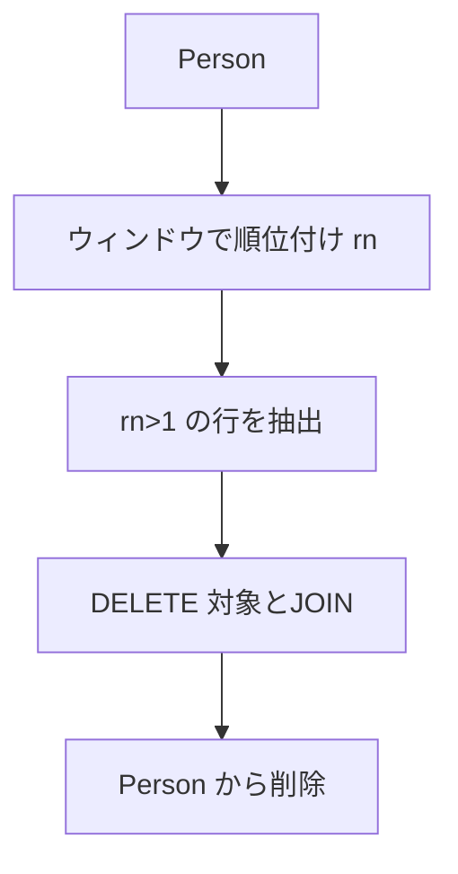

# 最適解（単一クエリ：ウィンドウ関数＋ JOIN、`NOT IN`不使用）

```sql
DELETE p
FROM Person AS p
JOIN (
  SELECT
    id,
    ROW_NUMBER() OVER (PARTITION BY email ORDER BY id) AS rn
  FROM Person
) AS r
  ON r.id = p.id
WHERE r.rn > 1;

-- Runtime 491 ms
-- Beats 97.60%
```

- `ROW_NUMBER() ... PARTITION BY email ORDER BY id` で、同一 email 内で **id 昇順（最小が 1 位）** の順位を付与
- `rn > 1` の行だけを削除するため、**最小 id の行のみ残る**
- `NOT IN` は使わず、**JOIN** で安全に削除

## 代替解（ウィンドウ関数を使わない定番 self-join）

```sql
DELETE p1
FROM Person AS p1
JOIN Person AS p2
  ON p1.email = p2.email
 AND p1.id > p2.id;

-- Runtime 843 ms
-- Beats 47.72%
```

- 同じ email で **より小さい id を持つ行が存在する行**（= 重複の“後発”）を全削除
- こちらも `NOT IN` を使わないため NULL 罠なし

## 要点

- 並び順は不要（削除後の表示順は任意）
- 判定は **ID 基準**（最小 id を残す）
- MySQL 8 のウィンドウ関数で **前処理 →JOIN の 1 クエリ**に収められる

## 計算量（概算）

- ウィンドウ付与：`O(N log N)`（パーティション内ソート）
- JOIN / self-join：インデックス（`PRIMARY KEY(id)` かつ `INDEX(email)` が望ましい）ありで `O(N)` 近似


