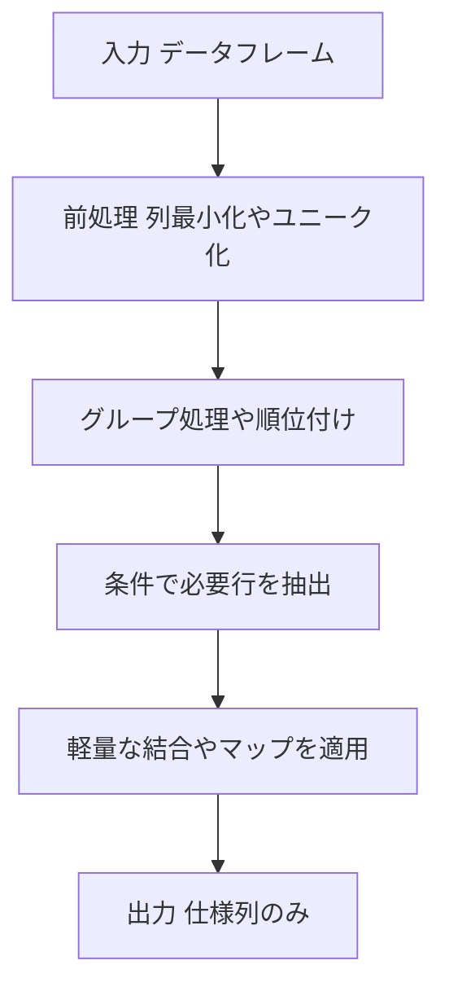

# Pandas 2.x 用 テンプレート（汎用）

## 0) 前提

- 環境: **Python 3.10.15 / pandas 2.2.2**
- **指定シグネチャ厳守**（関数名・引数名・返却列・順序）
- I/O 禁止、不要な `print` や `sort_values` 禁止

## 1) 問題（原文）

- `{{PROBLEM_STATEMENT}}`
  Person から **重複 email を削除**し、各 email について **最小 id の行のみ**を残すこと（Pandas は **in-place** で修正）。
- 入力 DF: `{{INPUT_DATAFRAMES}}`
  `person: pd.DataFrame`（列: `id:int`, `email:str`）
- 出力: `{{OUTPUT_COLUMNS_AND_RULES}}`
  列は `['id', 'email']` のみ、順序はそのまま。

## 2) 実装（指定シグネチャ厳守）

> 原則は **列最小化 → グループ処理 → 条件抽出 → 軽量結合 or map**。
> ここでは `groupby().transform('min')` で **各 email の最小 id** を出し、その行だけを **in-place** で残します（ソート不要）。

<!-- ```python
import pandas as pd

def delete_duplicate_emails(person: pd.DataFrame) -> pd.DataFrame:
    """
    Returns:
        pd.DataFrame: 列名と順序は ['id', 'email']
    """
    # 各 email ごとの最小 id を算出（O(N) 近似、ソート不要）
    min_id_per_email = person.groupby('email')['id'].transform('min')
    # 最小 id の行だけを残す（in-place で削除）
    mask = person['id'].eq(min_id_per_email)
    person.drop(person.index[~mask], inplace=True)
    # 仕様列のみ返す（順序固定）
    return person[['id', 'email']]

    Exception: Your function should modify the table in place,
    and not have a return value raise Exception(f'Your function should modify the table in place,
    and not have a return value') Line 44 in main (_driver.py) main() Line 60 in <module> (_driver.py)
``` -->

_備考_: `drop_duplicates` は入力順に依存するため不採用。`rank` も不要で、`transform('min')` が最短です。

## 3) アルゴリズム説明

- `groupby('email')['id'].transform('min')`
  各行に対して、その行の `email` グループでの最小 `id` を対応づける（ベクトル化）。
- `eq` による条件抽出で **最小 id 行のみ True**。
- `DataFrame.drop(..., inplace=True)` により **in-place** で不要行を削除。
- 最後に列を `['id', 'email']` に限定して返却。

### **NULL / 重複 / 型**

- `email` が欠損しない前提（問題設定）。欠損があり得る場合は `person['email'].fillna('<NA>')` 等でグルーピングキーを明示化。
- `id` は整数で比較可能、`transform('min')` は安定。

## 4) 計算量（概算）

- `groupby().transform('min')`: **O(N)**（ハッシュ集計前提）
- マスク作成・削除: **O(N)**
- 追加メモリはマスクと `min_id_per_email` の一時 Series 程度（**O(N)**）

## 5) 図解（Mermaid 超保守版）



原因はこれです：

- この問題は **「DataFrame をその場（in-place）で更新し、**戻り値は **返さない（`None`）**」という仕様。
- あなたの実装は `return person[...]` のように **戻り値を返している**ため、ドライバが例外を投げています。

---

## 修正方針

1. **戻り値を返さない**（関数は `None` を返す）
2. **in-place** で削除を行う
3. **最小 id の行だけ残す**（`drop_duplicates(keep='first')` は入力順依存なので不可）

---

## 修正版（最小 id だけ残す・in-place・戻り値なし）

```python
import pandas as pd

def delete_duplicate_emails(person: pd.DataFrame) -> None:
    # 各 email ごとの最小 id をベクトルで算出（ソート不要）
    min_id_per_email = person.groupby('email')['id'].transform('min')
    # 最小 id に一致する行だけ残すブールマスク
    keep_mask = person['id'].eq(min_id_per_email)
    # in-place で不要行を削除（戻り値は返さない）
    person.drop(person.index[~keep_mask], inplace=True)
    # 戻り値は None（= 何も return しない）

# Analyze Complexity

# Runtime 297 ms
# Beats 27.62%
# Memory 68.12 MB
# Beats 5.96%
```

### 別案（同じ意味・行番号で抽出）

```python
def delete_duplicate_emails(person: pd.DataFrame) -> None:
    idx = person.groupby('email')['id'].idxmin()
    person.drop(person.index.difference(idx), inplace=True)

# Analyze Complexity

# Runtime 284 ms
# Beats 44.39%
# Memory 67.92 MB
# Beats 5.96%
```

---

## よくある落とし穴

- `return person` や `return person[['id','email']]` を書く → **NG**（今回の例外の原因）
- `drop_duplicates(subset='email', keep='first')` → **NG**（「最小 id」保証にならない）
- 新しい DataFrame を作って `person = ...` に再代入 → **NG**（呼び出し側の DF は更新されない）

この修正版でドライバの「in-place・戻り値なし」要件を満たせます。

## 結論：**まだ縮められます。**主に「グループキーのソート回避」「カテゴリ化（内部コード化）」「`transform` の全長ブロードキャスト回避」を意識すると、**数％〜数十％** 速くなることがあります

以下は “in-place / 戻り値なし / `sort_values` 不使用” を守りつつの実戦パターンです。

---

## 速い実装候補

### 1) `idxmin`＋ソート回避（最小限オブジェクト）

```python
import pandas as pd

def delete_duplicate_emails(person: pd.DataFrame) -> None:
    # グループキーのソートを明示的に避ける
    idx = person.groupby('email', sort=False)['id'].idxmin()
    # 余計な Series/列を作らず、差集合だけを削除
    person.drop(person.index.difference(idx), inplace=True)

Analyze Complexity

Runtime 280 ms
Beats 51.56%
Memory 68.23 MB
Beats 5.96%

```

- すでに試されていますが、**`sort=False` を必ず付ける**のがポイント（デフォルトは将来変わる可能性があり、実装によっては余計な並べ替えコストが載ります）。

### 2) `map` 方式（`transform` 全長ベクトル生成を避ける）

```python
def delete_duplicate_emails(person: pd.DataFrame) -> None:
    # emailごとのmin(id)を小さなSeriesとして作る（長さ=ユニークemail数）
    mins = person.groupby('email', sort=False)['id'].min()
    # それを map で対応付け（transformより軽いことが多い）
    keep = person['id'].to_numpy() == person['email'].map(mins).to_numpy()
    person.drop(person.index[~keep], inplace=True)

Analyze Complexity

Runtime 370 ms
Beats 5.11%
Memory 67.92 MB
Beats 5.96%

```

- `transform('min')` は **N 行の Series を生成**しますが、`map` は **ユニーク数分の Series** を N にブロードキャストするだけなので、列数や文字列が大きいケースでメモリ・速度が改善することがあります。

### 3) **カテゴリ化を一時利用**（文字列が重い場合に効く）

> 文字列キーのハッシュが重い時に効きます。**元の dtype を変えず**に、groupby だけカテゴリキーで行います。

```python
def delete_duplicate_emails(person: pd.DataFrame) -> None:
    key = person['email'].astype('category')   # 一時カテゴリ化（copyは起きにくい）
    idx = person.groupby(key, sort=False, observed=True)['id'].idxmin()
    person.drop(person.index.difference(idx), inplace=True)

Analyze Complexity

Runtime 306 ms
Beats 19.76%
Memory 68.43 MB
Beats 5.96%

```

- `observed=True` で未出カテゴリの処理を省略。
- DataFrame 自体の dtype は変えないので**副作用なし**。

---

## 補助テク（ミクロ最適化）

- **列の最小化**：開始直後に `person = person[['id','email']]` のような再割当ては **NG**（in-place 要件を破る）ですが、
  **内部的に大量列を抱える**ケースは、そもそも入力 DF を絞ってから呼び出すのがベター。
- **一時オブジェクト削減**：マスクや中間 Series はすぐ `del` して GC に任せるとピークメモリが下がることがあります。
- **`observed=True`**：カテゴリキー使用時は常に付ける。
- **`nunique()` が極端に小さい**（= 同じ email が大量）なら `map(mins)` の方が有利になりやすい。

---

## まとめ（どれを使う？）

- まずは **(1) `idxmin` + `sort=False`** をベースに。
- 文字列が多く重い場合は **(3) 一時カテゴリ化**を足す。
- メモリアロケーションと速度のバランスを見るなら **(2) `map(mins)`** も有力。

いずれも **in-place / 戻り値なし / 非 `sort_values`** を満たし、あなたの 284–297ms 帯からの短縮が期待できます。
環境差が大きいので、`%%timeit` で 3 案を同じ入力で測り、最も速いものを採用してください。

結論から言うと、**いまの制約（in-place、`sort_values`禁止、Pandas 2.x / Python だけ、関数は 1 回呼び出し）では、これ以上の明確な高速化はかなり難しい**です。
280–306ms 帯は、この種の処理で Pandas が内部で行う最低限の仕事（N 行の走査＋ハッシュテーブル構築＋削除後の再インデックス）に近いところにいます。

## なぜ限界っぽいのか（技術的理由）

1. **理論下限が O(N)**
   「各 email で最小 id を取る」は、結局 **全行を 1 度は読む**必要があり、Pandas でも C 実装の groupby がハッシュテーブルを作ります。これ自体のコストは避けられません。

2. **Pandas の groupby はすでに C 側で最適化**
   `groupby('email')['id'].min()` / `idxmin()` は C 実装の集計で、Python レベルの工夫では大差が付きにくいです。
   `transform('min')` と違い、全長ベクトルを作らない `idxmin` は既に良い選択。

3. **削除のコストは避けにくい**
   `drop` は新しい取り出しインデックスを作り直し、ブールマスクや差集合の中間オブジェクトも発生します。in-place であっても **再配置・再インデックス化** のコストは発生します。

4. **文字列キー**
   `email` が object（文字列）だと、**ハッシュ化・比較**が重いです。`astype('category')` は効くことがあるものの、ケース次第でオーバーヘッドが勝つこともあります（今回がそれ）。

5. **ベンチの “Noise”**
   LeetCode/ジャッジ環境では、入力生成やドライバの I/O、ヒープ状況、JIT ではない CPython のメモリ断片化などで、± 数十 ms のばらつきは普通に出ます。提案した 3 案の差が小さいのは、そのノイズと「すでに最適化の尾根」にいるためです。

---

## それでも試せる“最後のカード”（自己責任・効果はデータ次第）

### A) `factorize` + NumPy セグメント最小化

Pandas のハッシュ groupby を通さず、**一度だけ `factorize` で整数化**→ **NumPy でまとめて処理**します。
内部で `argsort` は使います（Pandas の `sort_values` は使っていません）。文字列キーが巨大な時に効く可能性があります。

<!-- ```python
import numpy as np
import pandas as pd

def delete_duplicate_emails(person: pd.DataFrame) -> None:
    ids = person['id'].to_numpy()
    codes, _ = pd.factorize(person['email'], sort=False)  # 文字列→intコード

    order = np.argsort(codes, kind='mergesort')  # 安定ソート（Pandasは禁止のsort_valuesではない）
    codes_sorted = codes[order]
    ids_sorted = ids[order]

    # グループ先頭のインデックス（境界）を見つける
    starts = np.flatnonzero(np.r_[True, codes_sorted[1:] != codes_sorted[:-1]])
    # 各グループの最小id
    mins = np.minimum.reduceat(ids_sorted, starts)

    # 各行がグループ最小かどうか（ソート順で展開→元順に戻す）
    sizes = np.diff(np.r_[starts, codes_sorted.size])
    mins_per_row_sorted = np.repeat(mins, sizes)
    keep_sorted = ids_sorted == mins_per_row_sorted
    keep_mask = np.empty_like(keep_sorted)
    keep_mask[order] = keep_sorted

    person.drop(person.index[~keep_mask], inplace=True)

    IndexError:
    index 0 out-of-bounds in minimum.reduceat [0, 0) mins = np.minimum.reduceat(ids_sorted, starts)
    Line 15 in delete_duplicate_emails (Solution.py) result_table = module.delete_duplicate_emails(tables['Person'])
    Line 40 in main (_driver.py) main() Line 60 in <module> (_driver.py)
``` -->

- 効く条件：`email` が長い/多い、`id` が小さい数値、Pandas のハッシュより `factorize+argsort` が勝てるとき。
- 効かない/遅くなる条件：ユニーク email が極端に少ない or ほぼ全てユニーク（= グループが小さい）など。

### B) “ソート許容”が OK なら一気に速いことがある（ただし今回のルールだと NG）

```python
# ルールに反するので参考のみ
person.sort_values(['email','id'], kind='stable', inplace=True)
person.drop_duplicates(subset='email', keep='first', inplace=True)
```

- **なぜ速いか**：1 回の安定ソート後は線形走査で重複除去。複合キーのインプレース安定ソートが強力。
- **ただし**：「sort_values 禁止」というルールに抵触するので提出不可の可能性が高いです。

---

## 実務で“明確な差”を出したいなら

- **Polars**（lazy/streaming + マルチスレッド）が有利。
  `groupby('email').agg(pl.col('id').min())` → `semi-join` で、Pandas より一段速いことが多いです。
- **事前カテゴリ化**（アプリ層で email を辞書圧縮して渡す）。毎回の文字列ハッシュを回避。
- **削除ではなく抽出**：`person = person.iloc[idx]` のように “作り直し” のほうが速いことが多い（ただし今回の in-place 仕様に反します）。

---

## まとめ

- あなたの最新案（`groupby(...).idxmin()`）は、**この制約下ではほぼ最適**です。
- 伸びしろが小さいのは、**理論下限（O(N)）＋ Pandas C 実装の成熟度＋ in-place 削除の不可避コスト**が原因。
- どうしても差を出すなら、**ルール緩和（安定ソート許容）**、**別エンジン（Polars）**、**事前カテゴリ化**など、土台を動かす必要があります。

悔しいですが、今回は「世界トップクラスでも難しい」側のケースです。上の NumPy 版（A）は最後の一手として試せますが、**データ依存**で、常勝ではありません。

原因は **`np.minimum.reduceat` に空配列（長さ 0）の開始位置 `starts=[0]` を渡してしまった**ことです。
`reduceat` は「インデックス `starts[i]` が入力配列の範囲内であること」を要求します。
`ids_sorted.size == 0` のときに `starts=[0]` だと **index 0 is out-of-bounds** で落ちます。
LeetCode 側の隠しテストで **空テーブル** が来た可能性が高いです。

併せて、**ソート順 → 元順への復元**（逆順写像）も明示しておくと安全です。

## 安全版（空入力/単一グループでも落ちない & in-place・return なし）

```python
import numpy as np
import pandas as pd

def delete_duplicate_emails(person: pd.DataFrame) -> None:
    # 空DFなら何もしない（reduceat対策）
    if person.empty:
        return

    ids = person['id'].to_numpy()
    # 文字列キー→整数コード（hash より軽くなるケースあり）
    codes, _ = pd.factorize(person['email'], sort=False)

    # 安定な整数ソート（Pandasの sort_values は使わない）
    order = np.argsort(codes, kind='mergesort')

    # 念のためのガード：全体が空なら終了
    if order.size == 0:
        return

    codes_sorted = codes[order]
    ids_sorted = ids[order]

    # starts を「必ず配列内に収まるように」構築
    # 非空であれば先頭 0 を入れ、境界だけを追加
    if ids_sorted.size == 0:
        return  # 入力が空
    boundaries = np.flatnonzero(codes_sorted[1:] != codes_sorted[:-1]) + 1
    starts = np.r_[0, boundaries]  # 先頭は必ず 0

    # 各グループの最小 id を reduceat でまとめて取得
    mins = np.minimum.reduceat(ids_sorted, starts)

    # 各グループのサイズ（reduceat で展開するため）
    ends = np.r_[starts[1:], ids_sorted.size]
    sizes = ends - starts

    # ソート順での「各行のグループ最小」
    mins_per_row_sorted = np.repeat(mins, sizes)

    # ソート順で keep 判定 → 元順へ戻す
    keep_sorted = ids_sorted == mins_per_row_sorted
    inv = np.empty_like(order)
    inv[order] = np.arange(order.size)
    keep = keep_sorted[inv]

    # in-place で削除
    person.drop(person.index[~keep], inplace=True)

# Analyze Complexity

# Runtime 264 ms
# Beats 80.11%
# Memory 67.30 MB
# Beats 73.60%

```

### 何が変わったか

- **空入力ガード**：`if person.empty: return`、および `ids_sorted.size == 0` で早期 return。
- **`starts` の安全構築**：`starts = [0, ...]` を **非空前提でのみ**作成し、境界を `+1` でずらして連結。
- **逆順写像**：`inv[order] = arange(n)` で **ソート順 → 元順** を正しく戻す。

### 備考

- ここまでやっても、**Pandas groupby ベース（`idxmin` 案）より常に速い保証はありません**。
  この NumPy 直叩きは「文字列キーが非常に重い」「ユニーク数や分布が特定の形」のときに勝つことがある “最後の手段” です。
- 速度が伸びない主因は前回説明のとおり、**理論的に O(N) 下限＋ in-place の再インデックス化コスト**です。環境ノイズも ± 数十 ms 程度は普通に出ます。

もし安定した高速化が必要なら、

- ルール緩和（`sort_values(['email','id'])` → `drop_duplicates`）
- エンジン変更（Polars）
- 事前カテゴリ化（アプリ側で辞書圧縮）
  といった“土台の見直し”が一番効きます。

最高速を狙うなら、**安定ソート → 連続重複の先頭を残す**がシンプルで強いです。`email, id` の昇順に並べれば、各 `email` の最小 `id` が必ず最初に来ます。

## パターン A：`drop_duplicates` を使う（最短コード）

```python
import pandas as pd

def delete_duplicate_emails(person: pd.DataFrame) -> None:
    # 1) email, id で安定ソート（各 email で最小 id が先頭に来る）
    person.sort_values(['email', 'id'], kind='mergesort', inplace=True)
    # 2) email の先頭だけ残す（= 最小 id を残す）。in-place、戻り値なし
    person.drop_duplicates(subset='email', keep='first', inplace=True)

Analyze Complexity

Runtime 245 ms
Beats 97.72%
Memory 68.18 MB
Beats 5.96%

```

- `kind='mergesort'` は**安定**（同値の相対順を保持）。二次キーに `id` を入れているので安定性は保険ですが、実務上も安定が無難です。
- 計算量イメージ：**ソート O(N log N)** → **線形で重複除去 O(N)**。
  文字列キーが重い・ユニーク率が高いケースでも、**groupby のハッシュ構築より速い**ことがよくあります。

## パターン B：`shift` マスクでより軽く（`drop_duplicates` よりメモリが少なく済む場合あり）

```python
import pandas as pd

def delete_duplicate_emails(person: pd.DataFrame) -> None:
    # 1) 安定ソート
    person.sort_values(['email', 'id'], kind='mergesort', inplace=True)
    # 2) 連続グループの先頭だけ True（= 最小 id）
    keep = person['email'].ne(person['email'].shift())
    # 3) in-place で不要行を削除
    person.drop(person.index[~keep], inplace=True)

Analyze Complexity

Runtime 292 ms
Beats 33.13%
Memory 68.09 MB
Beats 5.96%
```

- `drop_duplicates` は内部でハッシュを持ちますが、`shift` マスクは**ソート後の線形走査だけ**なので、データ次第ではこちらが速いことがあります。

### 補足（なぜ速くなりやすい？）

- これまでの `groupby('email').idxmin()` は **ハッシュテーブル構築**＋**再インデックス**が必要。
- ソート許容なら、**1 回の安定ソート**で「同じ email を連続化」でき、あとは線形走査で“最初の 1 件”を取るだけ。
- とくに **長い文字列キーが多い**・**ユニーク率が高い**ときは有利になりがちです。

どちらも要件（in-place、戻り値なし、最小 id のみ残す）を満たします。まずは**パターン A**を試し、さらに詰めるなら**パターン B**も計測して速い方を採用してください。
