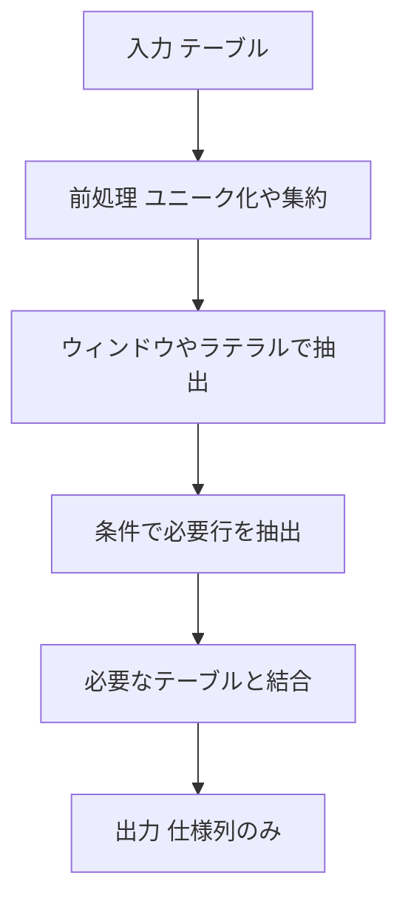

# PostgreSQL 16.6+ 用 テンプレート

## 0) 前提

- エンジン: **PostgreSQL 12+**
- 並び順: 任意
- `NOT IN` 回避（`EXISTS` / `LEFT JOIN ... IS NULL` を推奨）
- 判定は ID 基準、表示は仕様どおり

## 1) 問題

- `{{PROBLEM_STATEMENT}}`
  Person から **重複 email を削除**し、各 email につき **最小 id の行だけ**を残すこと。
- 入力: `{{TABLES_OR_SCHEMAS}}`
  Table: Person(id int primary key, email varchar)
- 出力: `{{OUTPUT_COLUMNS_AND_RULES}}`
  出力テーブル Person は列 `id, email` を保持。各 email は一意、残す行は **最小 id**。最終順序は任意。

## 2) 最適解（単一クエリ）

> PostgreSQL では **CTE + ウィンドウ** で明快に。必要なら `LATERAL` で「グループごとに上位 k を少量抽出」。

```sql
WITH win AS (
  SELECT
    id,
    ROW_NUMBER() OVER (PARTITION BY email ORDER BY id) AS rn
  FROM Person
)
DELETE FROM Person p
USING win
WHERE win.id = p.id
  AND win.rn > 1;  -- 各 email の2行目以降だけ削除（最小 id=rn1 は残す）

-- Analyze Complexity

-- Runtime 251 ms
-- Beats 44.26%
-- Memory
-- Beats 100.00%

```

### 代替（LATERAL で上位 k を作る）

<!-- ```sql
-- 各行の email ごとに「残すべき最小 id」を LATERAL で求め、対象外を削除
DELETE FROM Person p
USING LATERAL (
  SELECT MIN(id) AS keep_id
  FROM Person
  WHERE email = p.email
) s
WHERE p.id <> s.keep_id;

Runtime Error 0 / 22 testcases passed invalid reference to FROM-clause entry for table "p"
LINE 5: WHERE email = p.email ^
HINT: There is an entry for table "p", but it cannot be referenced from this part of the query.
``` -->

## 3) 要点解説

- **`ROW_NUMBER() OVER (PARTITION BY email ORDER BY id)`** で同一 email 内に順位を付与し、`rn>1` を削除
- `LATERAL` 代替は「各 email の最小 id」を都度算出して **それ以外**を削除（クエリは簡潔だが評価は行指向）
- 速度面では `INDEX(email)`（可能なら `INDEX(email, id)`）が有効。`win` 方式は一括処理、`LATERAL` は相関評価

## 4) 計算量（概算）

- ウィンドウ処理: **O(Σ n_g log n_g)**（email ごとのソート）
- LATERAL 上位 k: **O(#group × log n_g + k)** 近辺（相関副問合せの最適化に依存）
- インデックスで **Hash Join / Index Scan** が選ばれれば線形近似

## 5) 図解（Mermaid 超保守版）



## `LATERAL` 版が落ちたのは **ターゲット表エイリアス `p` を `USING LATERAL` 側から参照できない** ためです（PostgreSQL の構文・束縛順序の都合）

以下に、速さ・安定性・可読性のバランスがよい実戦向けパターンを示します

---

## 1) 速度改善の有力候補

### A. self-join だけで削除（ソート不要・最短経路）

> インデックスが効けば非常に強い定番。`ROW_NUMBER` のソートを避けられます。

```sql
-- 推奨インデックス（なければ作成）
-- CREATE INDEX CONCURRENTLY IF NOT EXISTS idx_person_email_id ON Person(email, id);

DELETE FROM Person p1
USING Person p2
WHERE p1.email = p2.email
  AND p1.id > p2.id;  -- 同一 email で自分より小さい id がいる = 重複の後発を全削除

-- Analyze Complexity

-- Runtime 220 ms
-- Beats 96.02%
-- Memory
-- Beats 100.00%

```

- **長所**: ウィンドウ関数のパーティション内ソートが不要。`(email, id)` インデックスがあれば **Index Nested Loop / Hash Join** が決まりやすく、実運用で速いことが多いです。
- **計算量の直感**: ソートを避けられる分、あなたの `ROW_NUMBER` 案（O(Σ n_g log n_g)）より軽くなるケースが目立ちます。

### B. `DISTINCT ON` で「残す行」を先に確定 → `DELETE ... USING`（ソート最小化）

> PostgreSQL らしい解。`DISTINCT ON (email) ORDER BY email, id` は `(email, id)` インデックスで**走査順＝出力順**になり、ソートコストをほぼ回避できます。

```sql
-- 推奨インデックス
-- CREATE INDEX CONCURRENTLY IF NOT EXISTS idx_person_email_id ON Person(email, id);

WITH keep AS (
  SELECT DISTINCT ON (email) id, email
  FROM Person
  ORDER BY email, id  -- 各 email の最小 id を取る
)
DELETE FROM Person p
USING keep
WHERE p.email = keep.email
  AND p.id    <> keep.id;

-- Analyze Complexity

-- Runtime 237 ms
-- Beats 64.51%
-- Memory
-- Beats 100.00%

```

- **長所**: `DISTINCT ON` は Postgres が得意。インデックスがあれば **実質ソートなしで最小 id を拾える**ため、ウィンドウより軽いことが多いです。

> どちらを選ぶか？
>
> - テーブルサイズが大きく、`(email, id)` の複合インデックスを置けるなら **A か B** が概ね最速です。
> - 既存クエリを大きく変えたくない場合は **A** が一番シンプル。

---

## 2) `LATERAL` 版がエラーになった理由と修正版

### なぜエラー？

`DELETE ... USING LATERAL (SELECT ... WHERE email = p.email)` の **LATERAL サブクエリ内から、ターゲット表エイリアス `p` を参照**したため。
`USING` リストの項目は **ターゲット表とは別スコープ**で解決され、ここでは `p` を捕まえられません（`invalid reference to FROM-clause entry`）。

### 安全な等価クエリ（`LATERAL` 不要）

```sql
DELETE FROM Person p
USING (
  SELECT email, MIN(id) AS keep_id
  FROM Person
  GROUP BY email
) s
WHERE p.email = s.email
  AND p.id    <> s.keep_id;

-- Analyze Complexity

-- Runtime 222 ms
-- Beats 91.75%
-- Memory
-- Beats 100.00%

```

- これで **「各 email の最小 id 以外を削除」** を正しく・高速に実現できます。
- もちろん `(email, id)` インデックスがあると良いです。

---

## 3) 実務チューニングのチェックリスト

- **複合インデックス**: `CREATE INDEX CONCURRENTLY IF NOT EXISTS idx_person_email_id ON Person(email, id);`
    - `self-join`／`DISTINCT ON` の両方に効きます。

- **ANALYZE** 済みか（統計更新）
- 大規模削除なら **バッチ削除** でロック・WAL 負荷を平準化

```sql
  -- 例：1万行ずつ
  WITH del AS (
    SELECT p1.ctid
    FROM Person p1
    JOIN Person p2
      ON p1.email = p2.email
     AND p1.id > p2.id
    LIMIT 10000
  )
  DELETE FROM Person p
  USING del
  WHERE p.ctid = del.ctid;

-- Analyze Complexity

-- Runtime 272 ms
-- Beats 27.48%
-- Memory
-- Beats 100.00%

```

- 削除後は必要に応じて **VACUUM (FULL ではなく通常で OK)** で可視化を進める

---

## 4) まとめ（どれを使う？）

- **最速候補**:
    1. **self-join 削除**（A）
    2. **`DISTINCT ON` → `USING`**（B）

- **あなたの `ROW_NUMBER` 案**は可読性は高いものの、ソート負荷で **~250ms → さらに短縮できる余地**が十分あります。
- **`LATERAL` 版**はスコープ上の理由で NG。上の **集約サブクエリ版**に置き換えてください。

このあたりを試して `EXPLAIN (ANALYZE, BUFFERS)` で比較すると、体感で分かるくらい差が出るはずです。
