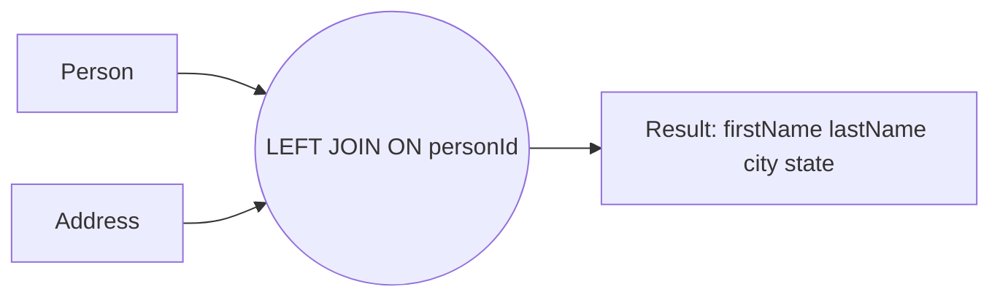
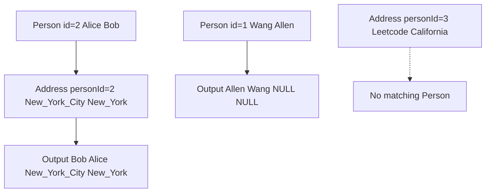

# 解法（MySQL）— People と Address を LEFT JOIN で結合

## **ポイント**

- すべての人（`Person`）を必ず出す ⇒ **LEFT JOIN**
- 住所がなければ `city`,`state` を **NULL** にする
- 並び順は指定なし（“in any order”）

```sql
SELECT
  p.firstName,
  p.lastName,
  a.city,
  a.state
FROM Person AS p
LEFT JOIN Address AS a
  ON a.personId = p.personId;
```

---

## 図解で理解する

### 1) 結合の全体像（LEFT JOIN の挙動）



- `Person` の各行を起点に、同じ `personId` を `Address` から探します
- 見つからなければ、`city` と `state` は **NULL** になります（人の行は消えない）

### 2) 例のデータでの流れ



- `personId=1` は Address に不在 ⇒ `city`,`state` が **NULL**
- `personId=2` は一致あり ⇒ `city=New York City`, `state=New York`
- `personId=3` の住所はあるが `Person` に該当者がいない ⇒ LEFT 基準なので結果には出ない

---

## なぜこの書き方なのか

- **INNER JOIN** にすると住所がない人が消える（要件に反する）
- MySQL には **FULL OUTER JOIN がない** ため「全員＋住所があれば付与」を素直に実現するには **LEFT JOIN** が最適
- 並び順指定がないので `ORDER BY` は不要（必要なら後付けで可）

---

## パフォーマンスのひと工夫

件数が増えても速く動かすには、`Address(personId)` にインデックスを作成します。

```sql
-- 可能なら作成（権限・運用ポリシーに合わせて）
CREATE INDEX idx_address_personId ON Address(personId);
```

## **効果**

- 結合キー `personId` での探索が高速化
- 概算コスト：インデックスあり → `O(|Person| + 一致件数)`、なし → `O(|Person| × |Address|)` に近づきがち

---

## 追加メモ（実務でありがちな論点）

1. **Address が 1 人に複数行**
    - 本問題は 0 か 1 を想定ですが、もし複数あると **人 × 住所** で行が増えます。
    - 代表 1 件のみを出したいなら、`ROW_NUMBER()`（MySQL 8.0+）で 1 件に絞るなどの対策が必要です。

2. **表示順が必要なとき**
    - 例：名前順にしたい → `ORDER BY p.lastName, p.firstName` を追記。

---

## 再現用サンプル（任意）

ローカルで試すときの最小セットです。

```sql
CREATE TABLE Person (
  personId  INT PRIMARY KEY,
  lastName  VARCHAR(100),
  firstName VARCHAR(100)
);

CREATE TABLE Address (
  addressId INT PRIMARY KEY,
  personId  INT,
  city      VARCHAR(100),
  state     VARCHAR(100)
);

INSERT INTO Person VALUES
(1, 'Wang',  'Allen'),
(2, 'Alice', 'Bob');

INSERT INTO Address VALUES
(1, 2, 'New York City', 'New York'),
(2, 3, 'Leetcode',      'California');

-- 解答クエリ
SELECT
  p.firstName,
  p.lastName,
  a.city,
  a.state
FROM Person AS p
LEFT JOIN Address AS a
  ON a.personId = p.personId;
```

このクエリで、サンプル出力と同じ結果（`Allen Wang NULL NULL` と `Bob Alice New York City New York`）が得られます。
GitHub の Mermaid は **ノード内の記号（カンマ`,`/括弧`()`/改行`<br/>` など）** に弱いことが多いので、**シンプルなラベル**に直した版を置きます。

## 1) 結合の全体像（LEFT JOIN の挙動：安全版）


- `Person` を基準に結合（LEFT JOIN）
- `Address` に対応が無い行は `city/state = NULL` で残る

## 2) 例のデータでの流れ（安全版）


- `id=1` は Address に無い → `NULL NULL`
- `id=2` は一致 → 住所が付与
- `personId=3` の住所は Person に不在 → LEFT 基準なので結果に出ない

---

### Mermaid でエラーになりにくいコツ

- ノードラベルは **英数字とスペース中心**にする（記号は最小限。特に `, () : <br/>` を避ける）
- どうしても区切りたいときは **アンダースコア**（`New_York_City`）などで代用
- `subgraph` や HTML 行分けは相性悪いことがあるので、まずはシンプル構成で
