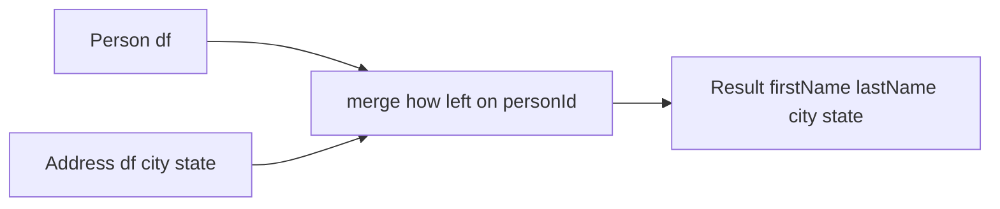
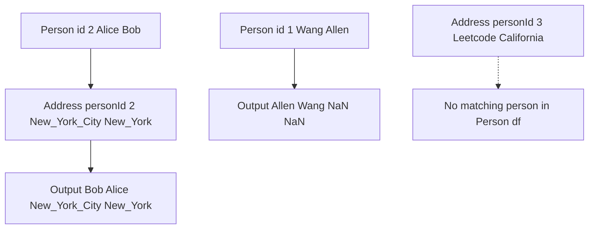

# pandas 版 **LEFT JOIN 相当の `merge(how="left")`**

## 実装（pandas）

```python
import pandas as pd

def combine_two_tables(person: pd.DataFrame, address: pd.DataFrame) -> pd.DataFrame:
    """
    Return columns: firstName, lastName, city, state for every person.
    If a person has no address, city/state will be NaN (SQL NULL equivalent).
    """
    # Address から使う列だけを選択
    addr_cols = ["personId", "city", "state"]
    addr = address[addr_cols].copy()

    # Person を基準に LEFT JOIN
    out = person.merge(addr, on="personId", how="left")

    # 列の並びを要件どおりに整える
    return out[["firstName", "lastName", "city", "state"]]
```

### 動作例（問題のサンプルと同じデータ）

```python
person = pd.DataFrame({
    "personId": [1, 2],
    "lastName": ["Wang", "Alice"],
    "firstName": ["Allen", "Bob"],
})
address = pd.DataFrame({
    "addressId": [1, 2],
    "personId": [2, 3],
    "city": ["New York City", "Leetcode"],
    "state": ["New York", "California"],
})

combine_two_tables(person, address)
```

出力（表示例）:

```text
  firstName lastName           city      state
0     Allen     Wang            NaN        NaN
1       Bob    Alice  New York City   New York
```

※ pandas では **SQL の NULL は `NaN`** で表現されます（文字列列でも欠損は `NaN`）。

---

## 図解で理解する（安全版 Mermaid）

### 1) 処理の全体像



- **Person df を基準**に結合（LEFT）
- Address に無い personId は **city と state が欠損**（= SQL の NULL）

### 2) サンプルデータの流れ



- id 1 は Address に不在 → `city state = NaN NaN`
- id 2 は一致 → 住所が付与
- personId 3 の住所は Person に該当無し → LEFT 基準なので出力されない

---

## 実務向けの注意点と拡張

- **重複アドレス対策（任意）**
  仕様上は 1 人 0 または 1 住所が前提ですが、実データで重複がある場合は代表 1 行を選びます（例：最小の addressId を採用）。

  ```python
  if "addressId" in address.columns:
      address_unique = (address
                        .sort_values(["personId", "addressId"])
                        .drop_duplicates("personId", keep="first"))
  else:
      address_unique = address.drop_duplicates("personId", keep="first")
  out = person.merge(address_unique[["personId", "city", "state"]], on="personId", how="left")
  ```

- **並び順**
  問題では順序自由ですが、必要なら：

  ```python
  out = out.sort_values(["lastName", "firstName"], kind="stable")
  ```

- **パフォーマンス**
  大規模データなら `personId` を `Int64`（NA あり）に揃える、`merge` 前に不要列を落とす、`category` 型の活用などでメモリ節約が可能です。

## さらに速く・軽くする実践策を優先度順にまとめました。どれも **同じ出力（firstName, lastName, city, state）** を保ちます

---

## 1) `merge` をやめて `map` に置き換える（最速・省メモリ）

`Address` が「personId→1 行（または代表 1 行）」なら、**辞書化＋ Series.map** が最軽量です。
中間の巨大テーブルを作らないので **速度・メモリともに有利**。

```python
import pandas as pd

def combine_two_tables_fast(person: pd.DataFrame, address: pd.DataFrame) -> pd.DataFrame:
    # 代表1件化（重複がないならこのブロックは省略可）
    if "addressId" in address.columns:
        addr = (address.sort_values(["personId", "addressId"])
                        .drop_duplicates("personId", keep="first"))
    else:
        addr = address.drop_duplicates("personId", keep="first")

    # 最小列化（メモリ削減）
    addr = addr[["personId", "city", "state"]]

    # personId→city/state の辞書
    city_map  = pd.Series(addr.city.values,  index=addr.personId.values)
    state_map = pd.Series(addr.state.values, index=addr.personId.values)

    # 直接 map（左外部結合と等価に欠損は NaN）
    out = pd.DataFrame({
        "firstName": person["firstName"].values,
        "lastName":  person["lastName"].values,
        "city":      person["personId"].map(city_map),
        "state":     person["personId"].map(state_map),
    })
    return out
```

## **効果**

- `merge` より **CPU/メモリ使用量が小さく**なりやすい
- アルゴリズムはおおむね **O(|Person| + |Address|)**（ハッシュ参照）

---

## 2) どうしても `merge` を使うなら：最適化のコツ

```python
out = (person[["personId","firstName","lastName"]]             # 使う列だけ
       .merge(address[["personId","city","state"]],            # 使う列だけ
              on="personId", how="left", sort=False,           # sort=False で余計な並べ替え無し
              validate="one_to_one")                           # 期待通りの結合を検証
      )[["firstName","lastName","city","state"]]               # 列順を最後に整える
```

- **列を最小化**：不要列を結合に持ち込まない
- **`sort=False`**：結合で並べ替えしない
- **`validate='one_to_one'`**：意図しない重複での膨張を検出（品質担保 → 間接的に速度安定）
- **代表 1 件化**：`drop_duplicates("personId", keep="first")` を事前に

---

## 3) dtype 最適化（メモリ削減）

- `personId` / `addressId`：最小整数型へ

  ```python
  person  = person.assign(personId = pd.to_numeric(person["personId"], downcast="unsigned"))
  address = address.assign(personId = pd.to_numeric(address["personId"], downcast="unsigned"),
                           addressId= pd.to_numeric(address.get("addressId"), downcast="unsigned"))
  ```

- 文字列：pandas 2.x なら `string`（必要に応じて `string[pyarrow]`）

  ```python
  for c in ["firstName","lastName","city","state"]:
      for df in (person, address):
        if c in df.columns:
            df[c] = df[c].astype("string")
  ```

  ※ `pyarrow` 文字列は大規模データでメモリ節約になることがあります（環境により）。

- **カテゴリ型**（`lastName` など繰り返しが多い列）

  ```python
  person["lastName"] = person["lastName"].astype("category")
  # 出力を文字列に戻したいなら最後に .astype("string")
  ```

---

## 4) さらに効く小ワザ

- **インデックス活用（Address 側）**

  ```python
  addr = address.drop_duplicates("personId", keep="first").set_index("personId")
  out = pd.DataFrame({
      "firstName": person["firstName"].values,
      "lastName":  person["lastName"].values,
      "city":      person["personId"].map(addr["city"]),
      "state":     person["personId"].map(addr["state"]),
  })
  ```

  `set_index` 後の `Series.__getitem__` は内部ハッシュで高速。

- **コピー回避**：`copy()` は必要時のみ。`values` で配列を直接束ねると列代入コストが下がることがあります。

- **欠損表現**：NaN→ 文字列 `"Null"` へ置換は **最後に一括**（途中で文字列化すると結合が遅くなりがち）。

  ```python
  out = out.fillna({"city": pd.NA, "state": pd.NA})
  ```

- **メモリの見える化**

  ```python
  person.info(memory_usage="deep")
  address.info(memory_usage="deep")
  ```

---

## 5) 計算量（ざっくり）

- `map` 方式：**O(P + A)**（P=Person 行数、A=Address 行数）
- `merge` 方式：ハッシュ結合で **O(P + A)** だが、中間列や再配置でメモリ増。
  → **列最小化**と**代表 1 件化**で差が出ます。

---

## 6) まとめ（おすすめ順）

1. **`map` 方式**（代表 1 件化＋辞書化）… 最速・省メモリ
2. `merge(how="left", sort=False)`＋**列最小化**＋**代表 1 件化**
3. **dtype 最適化**（整数ダウンキャスト、`string`/`category`）

この順で適用すれば、**Runtime 276ms / Memory 68.66MB** から、さらにもう一段の改善が狙えます。
