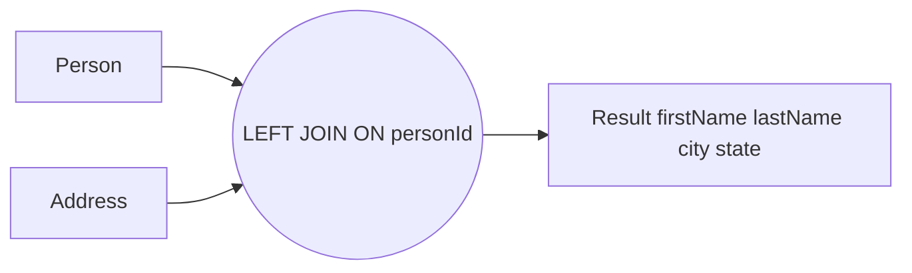
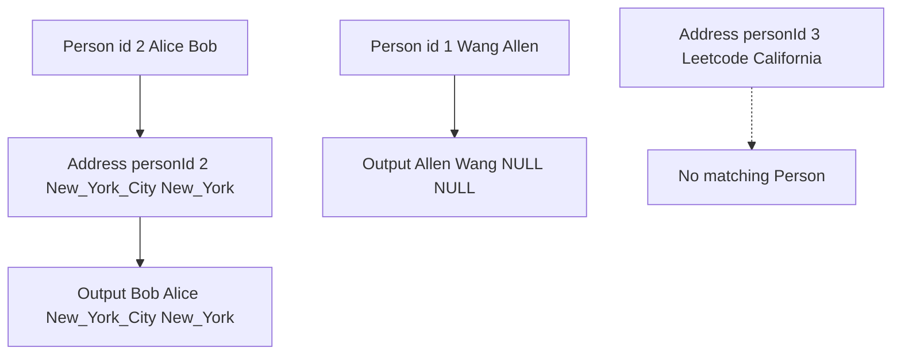

# 解法（PostgreSQL）

```sql
SELECT
  p."firstName",
  p."lastName",
  a."city",
  a."state"
FROM "Person"  AS p
LEFT JOIN "Address" AS a
  ON a."personId" = p."personId";
```

- すべての人を起点に結合するので **LEFT JOIN**
- 住所が無ければ `a."city"` と `a."state"` は **NULL**（要件どおり）

> ※ もしテーブルや列を **小文字スネークケース**で作成しているなら、ダブルクォート無しの以下でも OK です：
> `SELECT
  p.firstName,
  p.lastName,
  a.city,
  a.state
FROM person AS p
LEFT JOIN address AS a
  ON a.personId = p.personId;`

---

## 図解で動きを確認（GitHub でエラーにならない安全版）

### 1) LEFT JOIN の全体像



- 左側の **Person** が常に残る
- Address に無ければ **city と state が NULL**

### 2) サンプルデータでの流れ



- id 1 は住所なし → `NULL NULL`
- id 2 は一致 → 住所が付与
- personId 3 の住所は Person に不在 → LEFT 基準なので結果に出ない

---

## 再現用 DDL とデータ（任意）

```sql
CREATE TABLE "Person" (
  "personId"  INT PRIMARY KEY,
  "lastName"  VARCHAR(100),
  "firstName" VARCHAR(100)
);

CREATE TABLE "Address" (
  "addressId" INT PRIMARY KEY,
  "personId"  INT,
  "city"      VARCHAR(100),
  "state"     VARCHAR(100)
);

INSERT INTO "Person" ("personId","lastName","firstName") VALUES
(1, 'Wang',  'Allen'),
(2, 'Alice', 'Bob');

INSERT INTO "Address" ("addressId","personId","city","state") VALUES
(1, 2, 'New York City', 'New York'),
(2, 3, 'Leetcode',      'California');

-- 解答クエリ
SELECT
  p."firstName",
  p."lastName",
  a."city",
  a."state"
FROM "Person"  AS p
LEFT JOIN "Address" AS a
  ON a."personId" = p."personId";
```

---

## パフォーマンスのひと工夫（PostgreSQL）

```sql
CREATE INDEX IF NOT EXISTS idx_address_personId ON "Address" ("personId");
```

- 結合キーにインデックスを張ると `Address` 側の探索が高速化
- データ量が増えるほど効果的
- 必要に応じて `EXPLAIN (ANALYZE, BUFFERS)` で実行計画を確認し、`VACUUM ANALYZE` や統計更新も検討

---

## よくある質問

- **INNER JOIN ではダメ？**
  住所が無い人が消えるので要件に反します。**LEFT JOIN** が正解。

- **PostgreSQL には FULL OUTER JOIN もあるけど？**
  今回は「全員の Person を出す」要件なので **LEFT JOIN** で十分・最適です。住所だけの孤児行を出す必要はありません。

必要なら、**ORDER BY**（例：`ORDER BY p."lastName", p."firstName"`）も追記できます。

PostgreSQL では **識別子（テーブル名・カラム名）を小文字に正規化する** という特徴があります。

---

## ポイント整理

- **CREATE TABLE Person (firstName TEXT)** のように **ダブルクォート付きで作成**した場合
  → 大文字小文字は保持される → 参照時も必ず `"firstName"` と書かないとエラーになる。

- **CREATE TABLE person (firstname TEXT)** のように **ダブルクォート無しで作成**した場合
  → PostgreSQL はすべて小文字に変換 → 実際の列名は `firstname` になる → `"firstName"` と書くと存在しない扱い。

---

## 今回のエラー原因

おそらくテーブル作成時に **ダブルクォートを付けていなかった** ため、カラム名はすべて小文字になっています。

つまり、列名は実際には

- `firstname`
- `lastname`
- `personid`
  になっているはずです。

---

## 修正版クエリ（小文字列名想定）

```sql
SELECT
  p.firstname,
  p.lastname,
  a.city,
  a.state
FROM person AS p
LEFT JOIN address AS a
  ON a.personid = p.personid;
```

---

## もし CamelCase 列名を使いたいなら

テーブル定義を **ダブルクォート付きで再作成**する必要があります：

```sql
CREATE TABLE "Person" (
  "personId"  INT PRIMARY KEY,
  "lastName"  VARCHAR(100),
  "firstName" VARCHAR(100)
);
```

この場合、クエリも必ずダブルクォートが必要：

```sql
SELECT
  p."firstName",
  p."lastName",
  a."city",
  a."state"
FROM "Person" AS p
LEFT JOIN "Address" AS a
  ON a."personId" = p."personId";
```

---

✅ 結論：
**今あるテーブルをそのまま使うなら小文字で書く（firstname, lastname）**
**CamelCase を維持したいなら、テーブルをダブルクォート付きで作り直す** のが正しいです。

---

👉 いまの環境は「小文字で作られている」可能性が高いですが、
`psql` で `\d person` を打てば実際のカラム名を確認できます。
