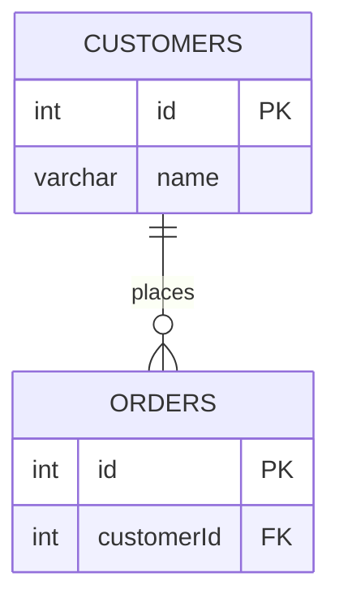
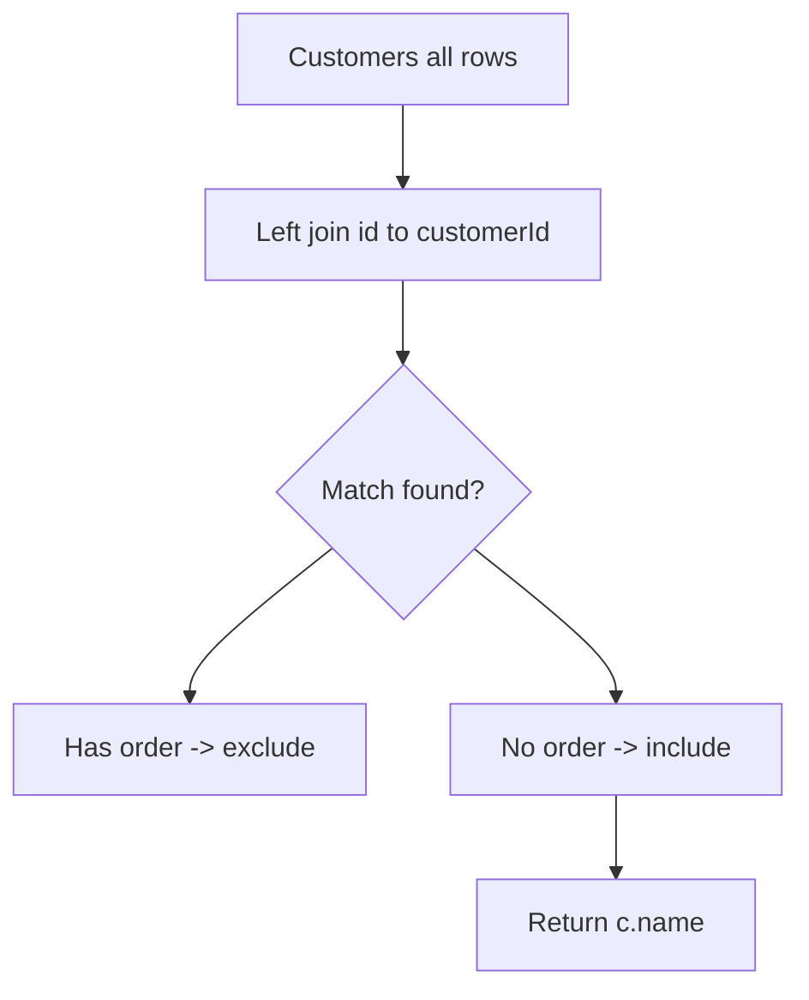
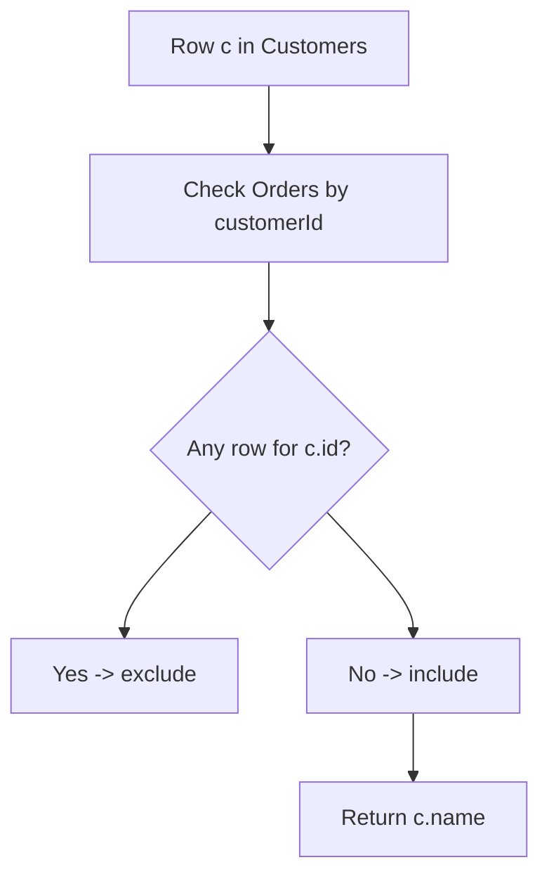

# 解法の要点

- 「一度も注文していない顧客」＝ **Customers にいて Orders に存在しない customerId**
- 実務的に堅牢なのは **LEFT JOIN … IS NULL** か **NOT EXISTS**
- **NOT IN** は `NULL` を含むと全滅する可能性があるため（SQL 三値論理）、避けるのが無難

---

## ✅ 推奨解：LEFT JOIN ＋ IS NULL（アンチ結合）

```sql
-- MySQL 8+
SELECT
  c.name AS Customers
FROM Customers AS c
LEFT JOIN Orders AS o
  ON o.customerId = c.id
WHERE o.customerId IS NULL
ORDER BY Customers;  -- 並び順は任意（要件は "any order"）
```

Runtime
472
ms
Beats
95.26%

### 仕組み

- `LEFT JOIN` は Customers を **全件** 起点に結合
- Orders に対応行が無い顧客は `o.*` が **NULL** で埋まる
- `WHERE o.customerId IS NULL` で「未注文の顧客」だけを抽出

---

## 🔁 代替解：NOT EXISTS

```sql
SELECT
  c.name AS Customers
FROM Customers AS c
WHERE NOT EXISTS (
  SELECT 1
  FROM Orders AS o
  WHERE o.customerId = c.id
)
ORDER BY Customers;
```

Runtime
548
ms
Beats
47.29%

- サブクエリに該当が **存在しない** 顧客だけを返す
- `NULL` に強く、読みやすくて最適化も効きやすいことが多いです

---

## ⚠️ 非推奨：NOT IN の落とし穴（参考）

```sql
-- Orders.customerId に NULL が1つでもあると、全体が空になることがある
SELECT c.name AS Customers
FROM Customers AS c
WHERE c.id NOT IN (SELECT o.customerId FROM Orders AS o);
```

Runtime
654
ms
Beats
16.59%

- サブクエリ結果に `NULL` が含まれると比較結果が不定になり、期待通り動かないケースがあります

---

## 📈 パフォーマンス最適化

- インデックス：`Orders(customerId)` を作成

```sql
CREATE INDEX idx_orders_customerId ON Orders(customerId);
```

- これにより `JOIN`／`EXISTS` のルックアップが高速化
- 想定データ量が大きいほど効果が出ます

---

## 🧪 サンプルデータでの動作確認

```sql
-- DDL
CREATE TABLE Customers (
  id   INT PRIMARY KEY,
  name VARCHAR(255) NOT NULL
);

CREATE TABLE Orders (
  id         INT PRIMARY KEY,
  customerId INT NOT NULL,
  CONSTRAINT fk_orders_customer
    FOREIGN KEY (customerId) REFERENCES Customers(id)
);

-- サンプル投入
INSERT INTO Customers (id, name) VALUES
(1,'Joe'),(2,'Henry'),(3,'Sam'),(4,'Max');

INSERT INTO Orders (id, customerId) VALUES
(1,3),(2,1);

-- 実行（LEFT JOIN 版）
SELECT c.name AS Customers
FROM Customers AS c
LEFT JOIN Orders AS o
  ON o.customerId = c.id
WHERE o.customerId IS NULL
ORDER BY Customers;
```

## **期待される出力**

```text
+-----------+
| Customers |
+-----------+
| Henry     |
| Max       |
+-----------+
```

---

## 🧩 図解

### 1) ER 図（主従関係）



### 2) LEFT JOIN によるアンチ結合の流れ



### 3) NOT EXISTS の考え方



---

## ⏱ 計算量イメージ

- `LEFT JOIN … IS NULL`：`O(|Customers| + |Orders|)`（インデックスでさらに良化）
- `NOT EXISTS`：`O(|Customers| * log|Orders|)` 近似（インデックス次第で準線形）

---

### まとめ

- 最もシンプルで実務的：**LEFT JOIN + IS NULL**
- 等価で堅牢：**NOT EXISTS**
- インデックス `Orders(customerId)` を忘れずに。
