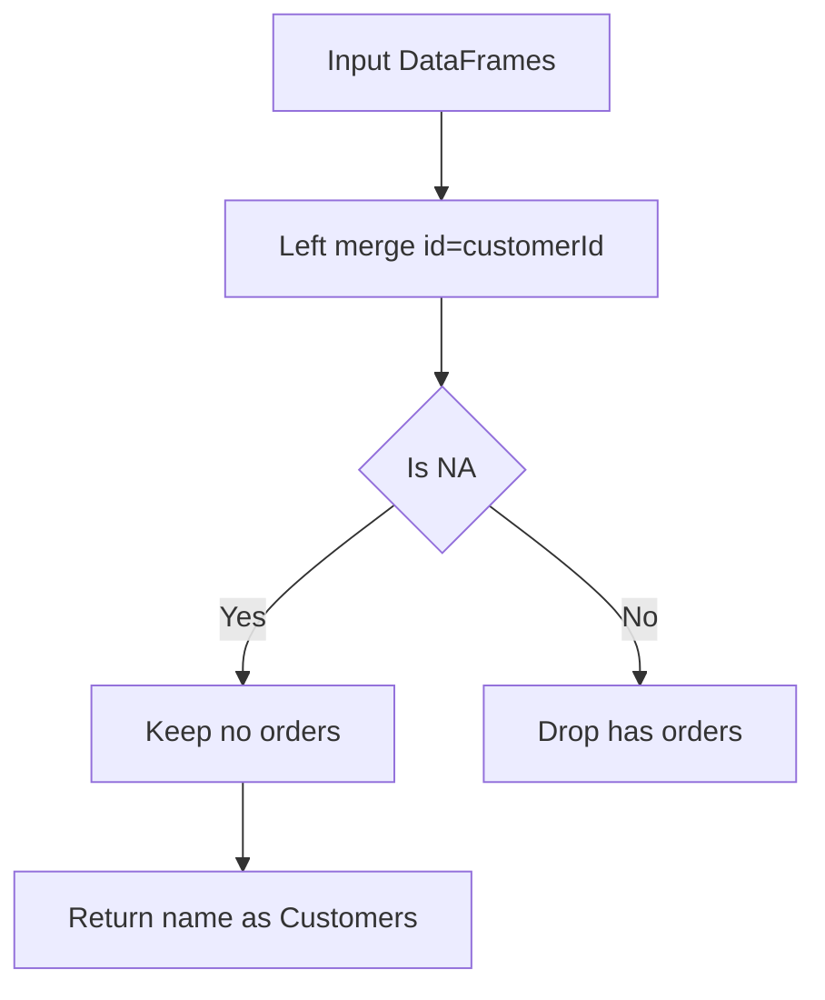

# 解法の要点

## 0) 前提

- 環境: Python 3.11+ / pandas 2.x
- シグネチャ厳守・I/O 禁止・余計な列/ソートなし

---

## 1) 問題（原文）

Customers と Orders の 2 表から、**一度も注文していない顧客の名前**を返す（列名は `Customers`、順序は任意）。

---

## 2) 実装（指定シグネチャを厳守）

```python
import pandas as pd

def find_customers(customers: pd.DataFrame, orders: pd.DataFrame) -> pd.DataFrame:
    """
    Returns:
        pd.DataFrame: 1列 'Customers' を持ち、注文の無い顧客名のみを含む。
    """
    # 左外部結合で顧客IDと注文の対応を作る（NULL=未注文）
    merged = customers.merge(
        orders[['customerId']],
        how="left",
        left_on="id",
        right_on="customerId",
    )
    # customerId が欠損（結合先なし）= 未注文
    out = merged[merged["customerId"].isna()][["name"]].rename(columns={"name": "Customers"})
    return out
```

Runtime
273
ms
Beats
78.77%
Memory
68.22
MB
Beats
13.71%

---

## 3) アルゴリズム説明

- **方針**: `customers.id = orders.customerId` で **left merge** → 結合先がない行は `customerId` が `NaN` になる。
  これをフィルタして `name` だけ抽出し、列名を仕様どおり `Customers` に変更。
- **使用 API**:

  - `DataFrame.merge(how="left", left_on=..., right_on=...)`
  - `Series.isna()` による欠損判定
  - `DataFrame.rename()` で列名合わせ

- **NULL/重複/型**:

  - `orders.customerId` に `NaN` があっても **left merge + isna** は安全（`NOT IN` 相当の NULL 問題なし）。
  - 同名異人がいても判定は **ID 基準**。要求列は名前のみなのでそのまま返す（重複名は仕様上 OK）。

---

## 4) 計算量（概算）

- `customers` を **N 行**、`orders` を **M 行** とすると、

  - `merge` は概ね **O(N + M)**（ハッシュ結合相当; 実装依存）
  - フィルタと列選択は **O(N)**

- **メモリ増分**: `merge` により一時的に `O(N + k)`（k は一致行数）のコピーが発生。

---

## 5) 図解（Mermaid 超保守版 A’）


