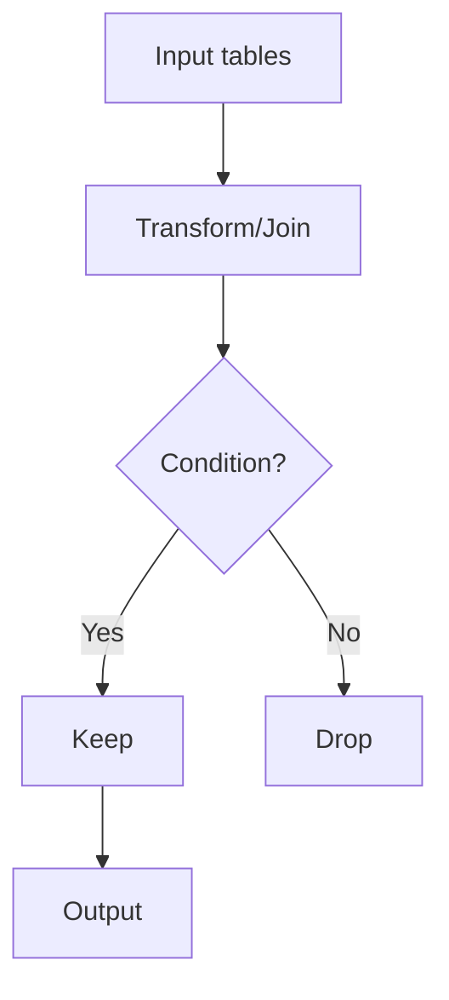
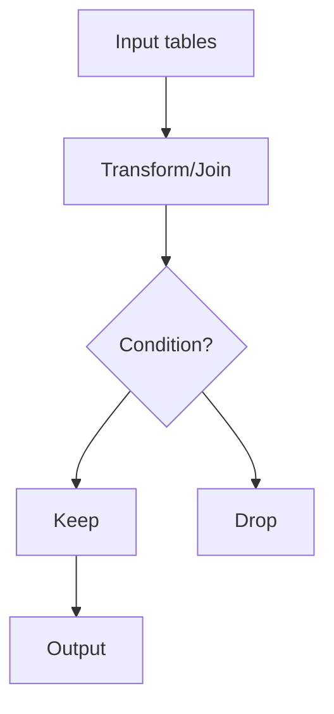

# 解法の要点

## 0) 前提

- エンジン: PostgreSQL 12+（ウィンドウ関数可。ただし本問は不要）
- 並び順: 任意（ここでは読みやすさのため `ORDER BY` を付けていますが、不要なら削除可）
- NULL・重複の扱い方針:
    - `Orders.customerId` に `NULL` が混ざっても安全に動く書き方を採用（`NOT IN` は使用しない）。
    - 同姓同名が別顧客として存在し得るため、**ID 単位で未注文を判定**し、表示列は問題どおり `name`（必要に応じて `DISTINCT` を付与）。

---

## 1) 問題（原文）

Customers / Orders の 2 表から、**一度も注文していない顧客**の名前を返す。返す列名は `Customers`。順序は任意。

---

## 2) 最適解（単一クエリ）

```sql
-- NOT EXISTS によるアンチセミジョイン（NULL 安全）
SELECT
  c.name AS "Customers"
FROM Customers AS c
WHERE NOT EXISTS (
  SELECT 1
  FROM Orders AS o
  WHERE o.customerId = c.id
)
ORDER BY "Customers";  -- 任意。提出時は省略可
```

Runtime
201
ms
Beats
88.18%
Memory
0.00
MB
Beats
100.00%

---

## 3) 代替解

```sql
-- 代替案1：LEFT JOIN + IS NULL（アンチ結合）
SELECT
  c.name AS "Customers"
FROM Customers AS c
LEFT JOIN Orders AS o
  ON o.customerId = c.id
WHERE o.customerId IS NULL
ORDER BY "Customers";  -- 任意
```

Runtime
224
ms
Beats
45.70%
Memory
0.00
MB
Beats
100.00%

```sql
-- 代替案2：集合演算（EXCEPT）
-- 注：EXCEPT は重複を自動で排除する（重複名をまとめたいときは有効）
SELECT name AS "Customers"
FROM Customers
EXCEPT
SELECT c.name AS "Customers"
FROM Customers AS c
JOIN Orders    AS o
  ON o.customerId = c.id
ORDER BY "Customers";  -- 任意
```

Wrong Answer
9 / 12 testcases passed

- **長所・短所・採否基準**
    - `NOT EXISTS`：`NULL` に強く、PostgreSQL でセミ/アンチセミジョイン最適化が効きやすい。推奨。
    - `LEFT JOIN ... IS NULL`：可読性が高い。結合条件・フィルタを見通しやすい。
    - `EXCEPT`：集合演算で簡潔。ただし「名前での差集合」になる点に注意（同名異人をまとめる可能性）。

---

## 4) 要点解説

- **PostgreSQL 流の書き方**
    - アンチセミジョインは `NOT EXISTS` が素直で最適化も効きやすい。
    - 本問で `DISTINCT ON` や `FILTER`、`GENERATE_SERIES` は不要（過剰表現になるため不採用）。

- **NULL・タイブレーク・重複**
    - `NOT IN (SELECT customerId ...)` はサブクエリに `NULL` が含まれると “未知” となり全体が落ちる可能性があるため非推奨。
    - 同名異人があり得るが、**未注文の判定は ID 基準**で実施。表示は問題仕様に合わせて `name` のみ。

---

## 5) 計算量（概算）

- `Customers` を **N 件**、`Orders` を **M 件** とすると：
    - `NOT EXISTS` / `LEFT JOIN IS NULL`：
      適切な索引（`Orders(customerId)`）があれば概ね **O(N + M)**（Hash/Semi Join 想定）。
    - 索引が無い場合：ネストループに近く **O(N × M)** になり得る。

- 実務では `CREATE INDEX ON Orders(customerId);` が効く（LeetCode では DDL は通常不要だが知識として）。

---

## 6) 図解（Mermaid 安全構文）

## (A) 改行あり・安全版



## (B) 1 行版



---

## 参考（索引の知識：提出不要）

```sql
-- 実務では以下の索引があるとアンチセミジョインが高速化されやすい
-- CREATE INDEX CONCURRENTLY idx_orders_customerId ON Orders(customerId);
```
