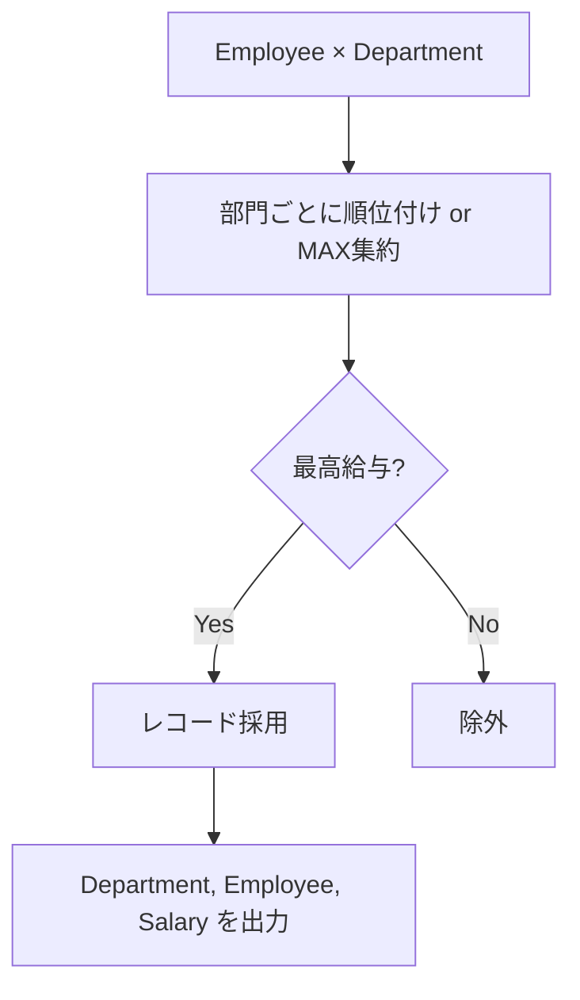

# 解法の要点

## 1) 最適解（単一クエリ）

```sql
-- Window関数 + 派生表（MySQL 8）
SELECT
  d.name  AS Department,
  e2.name AS Employee,
  e2.salary AS Salary
FROM (
  SELECT
    e.*,
    DENSE_RANK() OVER (
      PARTITION BY e.departmentId
      ORDER BY e.salary DESC
    ) AS rk
  FROM Employee AS e
) AS e2
JOIN Department AS d
  ON d.id = e2.departmentId
WHERE e2.rk = 1;
-- Runtime
-- 580 ms
-- Beats 90.85%
```

## 2) 代替解

```sql
-- 代替案A: 集約(GROUP BY)で各部門の最大給与を出し、JOINで復元
SELECT
  d.name  AS Department,
  e.name  AS Employee,
  e.salary AS Salary
FROM Department AS d
JOIN (
  SELECT departmentId, MAX(salary) AS max_salary
  FROM Employee
  GROUP BY departmentId
) AS mx
  ON mx.departmentId = d.id
JOIN Employee AS e
  ON e.departmentId = mx.departmentId
 AND e.salary = mx.max_salary;
-- Runtime
-- 556 ms
-- Beats 96.65%

-- 代替案B: NOT EXISTS（アンチ結合）
-- 「同部門で自分より高い給与が存在しない」社員だけを残す
SELECT
  d.name  AS Department,
  e.name  AS Employee,
  e.salary AS Salary
FROM Employee AS e
JOIN Department AS d
  ON d.id = e.departmentId
WHERE NOT EXISTS (
  SELECT 1
  FROM Employee AS x
  WHERE x.departmentId = e.departmentId
    AND x.salary > e.salary
);
-- Runtime
-- 553 ms
-- Beats 97.21%
```

## 3) 要点解説

- アプローチ比較

  - **最適解**は **DENSE_RANK() OVER (PARTITION BY departmentId ORDER BY salary DESC)** で各部門ごとに順位付けし、`rk=1`（最高給与）だけ抽出。**同率（タイ）に強い**のが長所。
  - **代替 A（GROUP BY + JOIN）** は教科書的な定番：各部門の`MAX(salary)`を求め、同額の行を JOIN で復元するので**タイも網羅**できる。
  - **代替 B（NOT EXISTS）** は**NULL 罠を避けられるアンチ結合**。`NOT IN`は NULL を含むと全否定になるため不採用方針に合致。

- エッジケース

  - **同率首位**：3 案とも網羅。
  - **Department に社員不在**：問題仕様上、出力は「最高給与の社員」なので社員がいない部門は自然に不出力（LEFT JOIN は不要）。
  - **NULL**：`salary`が NULL でも最高にはならない（`>`比較・降順ソートで最後方）。`Department.name`は非 NULL 保証あり。
  - **重複レコード**：主キー`Employee.id`で一意なので、表示は同一社員が重複しない。

- 実務 Tips

  - 大規模データでは**複合索引 `(departmentId, salary)`** が効く。Window 関数案でもソート・パーティションに利く。
  - クエリプランにより、集約＋ JOIN 案が最速になるケースもある（カーディナリティが高いほど有利な傾向）。

## 4) 計算量（概算）

- **Window 関数案**：部門ごとに並べ替え → おおむね `O(N log N)`（N=Employee 件数）。索引 `(departmentId, salary)` ありで実効は軽減。
- **GROUP BY + JOIN**：`MAX`集約 `O(N)`、その後の JOIN は索引で `O(N)` 近似 → 全体 `O(N)` ～ `O(N log N)`。
- **NOT EXISTS**：適切な索引が無いと相関サブクエリで最悪 `O(N^2)`、索引 `(departmentId, salary)` で実効は良化。

## 5) 図解（Mermaid 超保守版）



必要に応じて、実データ量や実行計画に合わせて「Window 関数」↔「GROUP BY+JOIN」を切り替えてください。
