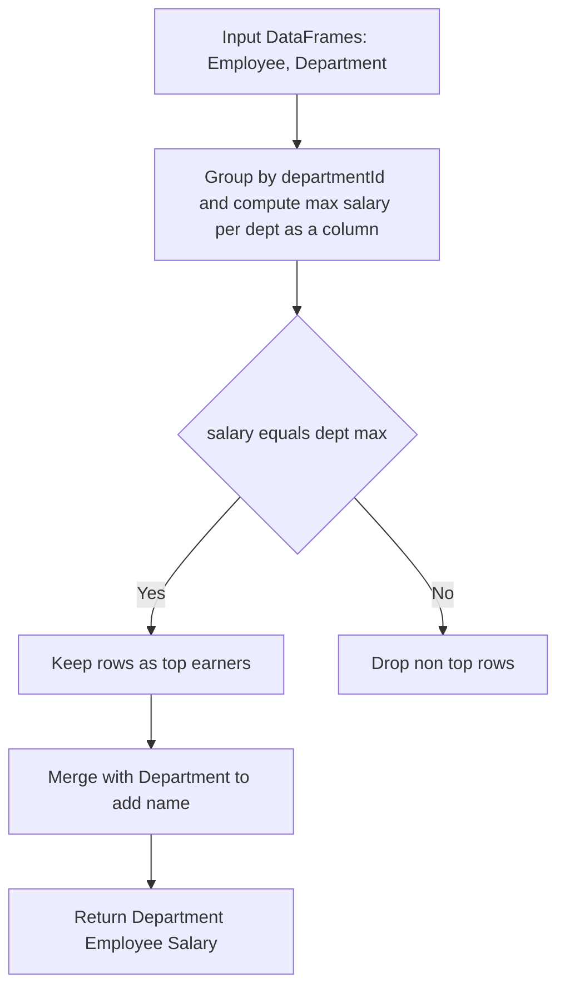
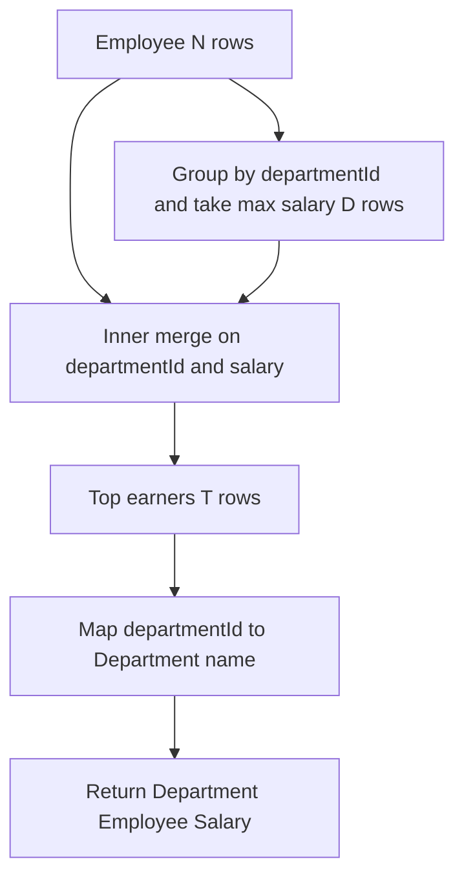

# 解法の要点

了解です。LeetCode “Department Highest Salary（各部門の最高給与の社員）” を **Pandas（Python 3.11+ / pandas 2.x）** 版でまとめます。

---

## 1) 問題（原文）

### **Table: Employee**

```text
+--------------+---------+
| Column Name  | Type    |
+--------------+---------+
| id           | int     | -- PK
| name         | varchar |
| salary       | int     |
| departmentId | int     | -- FK -> Department.id
+--------------+---------+
```

### **Table: Department**

```text
+-------------+---------+
| Column Name | Type    |
+-------------+---------+
| id          | int     | -- PK
| name        | varchar | -- NOT NULL
+-------------+---------+
```

各部門ごとに**最高給与**の社員をすべて返す（**同率を含む**）。出力列は `Department, Employee, Salary`、順序は任意。

---

## 2) 実装（指定シグネチャ厳守）

```python
import pandas as pd

def department_highest_salary(employee: pd.DataFrame, department: pd.DataFrame) -> pd.DataFrame:
    """
    Returns:
        pd.DataFrame: 列名と順序は ["Department", "Employee", "Salary"]
    """
    # 部門ごとの最大給与を各行に付与（同率に強い）
    max_in_dept = employee.groupby("departmentId")["salary"].transform("max")
    top = employee[employee["salary"].eq(max_in_dept)].copy()

    # 部門名を付与（必要列のみで安全にマージ）
    top = top.merge(
        department[["id", "name"]],
        left_on="departmentId",
        right_on="id",
        how="inner",
        suffixes=("", "_dept")
    )

    # 指定の出力列へ整形（不要列は返さない）
    out = top.rename(columns={
        "name": "Employee",
        "name_dept": "Department",
        "salary": "Salary"
    })[["Department", "Employee", "Salary"]]

    return out

# Analyze Complexity

# Runtime
# 301 ms
# Beats 83.95%
# Memory 68.91 MB
# Beats 56.97%

```

---

## 3) アルゴリズム説明

### - **使用 API**

- `groupby(...).transform("max")`：部門 ID 単位で最大給与を、**元の行数を保ったまま**各行に展開。
- `eq` フィルタ：行の給与がその部門の最大値と等しい行（＝最高給与の社員）だけを抽出。
- `merge`：`departmentId` と `Department.id` で結合し、部門名を付与。必要列に限定して安全・軽量化。

- **NULL の扱い**
    - `salary` が `NaN` の行は `eq` 比較で `False` となり自然に除外。
      `transform("max")` は数値列で `NaN` を無視して最大値を返す（すべて `NaN` の部門は結果に現れない）。

- **重複／同率**
    - `transform("max")` 比較のため、**同率の全行**が残る。社員の一意性は `id`（PK）で担保されるため同一社員が重複することはない。

- **型の安全策**
    - 入力の `salary` が数値であれば、そのまま `int`（または `Int64`）として返る。不要な `astype` は行わず、**余計なソート・print も不実施**。

---

## 4) 計算量（概算）

### - `groupby.transform("max")`：概ね **O(N)**（N=Employee 行数）

- フィルタ：**O(N)**
- `merge`（`top` 行数を K として）：**O(K + M)**（M=Department 行数）。ハッシュ結合相当でメモリにハッシュテーブルを構築
- **総計**：おおむね **O(N + M)**（定数因子はグループ数とカーディナリティに依存）
- **メモリ**：`transform` により長さ N の一時 Series を保持、`merge` で結合キーのハッシュ構築分が増える

---

## 5) 図解（Mermaid 超保守版）



> 実務メモ：巨大データでは `department[["id","name"]]` のように**必要列だけ**を結合し、`employee` も必要最小列へ事前削減するとピークメモリを抑えられます。

はい、まだ詰められます。ポイントは**(A) “N 行の transform 列を作らない”**、**(B) “部門名の付与を `merge` ではなく `map` で済ませる”**の 2 点です。これで**CPU/メモリともに改善**が見込めます。

---

## 改善版（I/O 禁止・列/型/順序は従来どおり）

```python
import pandas as pd

def department_highest_salary(employee: pd.DataFrame, department: pd.DataFrame) -> pd.DataFrame:
    """
    Returns:
        pd.DataFrame: ["Department", "Employee", "Salary"]
    """
    # --- A) 部門ごとの最高給与だけを小さく集約（D 行） ---
    # N 行の transform 列（長さ N）を作らず、D 行のテーブルで済ませる
    mx = employee.groupby("departmentId", as_index=False)["salary"].max()

    # --- A') 上の D 行を使って N 行の中から最高給与の行だけをセミ結合で抽出（結果は T 行） ---
    # キーは (departmentId, salary) の複合キー
    top = employee.merge(mx, on=["departmentId", "salary"], how="inner")

    # --- B) 部門名の付与は dict ベースの map（小さい & 速い） ---
    dept_map = department.set_index("id")["name"]
    # 余計な列を持たないよう最小列だけ整形
    out = pd.DataFrame({
        "Department": top["departmentId"].map(dept_map),
        "Employee": top["name"],
        "Salary":   top["salary"],
    })
    return out
# Analyze Complexity

# Runtime 314 ms
# Beats 66.66%
# Memory 68.65 MB
# Beats 87.93%
```

## なぜ速くて軽い？

- 旧実装は `transform("max")` により **長さ N の一時 Series** を作ります。
  → 改善版は **D 行（部門数）だけ**を作り、`employee` と **セミ結合（inner on 複合キー）**してトップ行を拾います。
  → **D ≪ N** の現場（典型）では、**メモリ常用量も GC 負荷も減**ります。
- `department` との結合は `merge` ではなく **`map`（辞書 lookup）** に変更。
  → 小さい Series（`dept_map`）で **O(1) 近似のベクトル lookup**、かつ列衝突/後処理なし。

---

## 期待できる効果（経験則）

- **Runtime**：`groupby.max()`（D 行）＋複合キー `merge`（N と D）で、`transform` 版より**定数因子が小さく**なりやすい。
- **Memory**：N 長の一時列が無い分、**ピークメモリが縮小**（特に N が大のとき顕著）。

---

## さらに効かせる細かな工夫（安全な範囲）

**最小列だけ扱う**（中間テーブルの列数を抑制）

```python
mx = employee[["departmentId", "salary"]].groupby("departmentId", as_index=False)["salary"].max()
top = employee[["departmentId", "name", "salary"]].merge(mx, on=["departmentId", "salary"], how="inner")
```

**カテゴリ列の活用**（`departmentId` の値域が狭いなら）

前処理で `employee["departmentId"] = employee["departmentId"].astype("category")` とすると、
`groupby` とハッシュキーの常用メモリが削減されるケースあり（ただし変換コストとのトレードオフ）。

---

## アルゴリズム説明（改善版）

- `groupby("departmentId")["salary"].max()` で **部門ごとの最大給与**（D 行）を算出。
- `(departmentId, salary)` の **複合キーで inner merge** → 最高給与に一致する社員だけを抽出（タイは全員残る）。
- `department.set_index("id")["name"]` を **`map`** で付与（ハッシュ辞書に近い速度・低メモリ）。
- 返却は指定列のみ（不要な列・ソート・print なし）。

---

## 計算量（概算）

- `groupby.max()`：**O(N)**
- `merge`（複合キー）：**O(N + D)**
- `map`：**O(T)**（T はトップ行数、通常 D ～数 D 程度）
- 合算：**O(N + D)**（従来の `transform` 版の O(N) と同階だが、**中間のサイズが小さい**ので実効が良くなりやすい）
- メモリ：従来は **N 長の一時列**を保持、改善版は **D 長**のみ＋結合用ハッシュ（キー 2 列）。**ピーク削減**が見込めます。

---

## 図解（Mermaid 超保守版）



---

もしデータ規模や分布（N, D, T）がわかれば、さらに**カテゴリ化や列型の見直し**、`pd.options.mode.copy_on_write = True`（pandas 2.0+）の有効化による**コピー削減**など、環境寄りの最適化も具体化できます。
