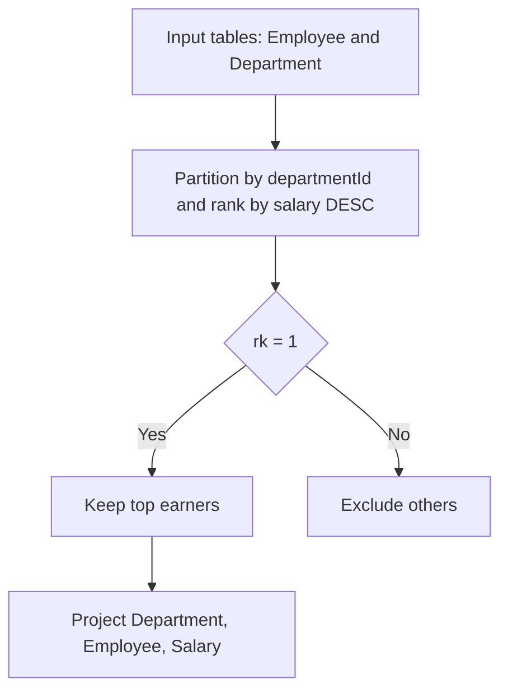

# 解法の要点

## 1) 問題（原文）

### **Table: Employee**

```text
+--------------+---------+
| Column Name  | Type    |
+--------------+---------+
| id           | int     | -- PK
| name         | varchar |
| salary       | int     |
| departmentId | int     | -- FK -> Department.id
+--------------+---------+
```

### **Table: Department**

```text
+-------------+---------+
| Column Name | Type    |
+-------------+---------+
| id          | int     | -- PK
| name        | varchar | -- NOT NULL
+-------------+---------+
```

各部門ごとに**最高給与**の社員をすべて返す（同率を含む）。出力列は `Department, Employee, Salary`、順序は任意。

---

## 2) 最適解（単一クエリ）

```sql
-- Window関数（PostgreSQL 12+）
SELECT
  d.name  AS Department,
  e2.name AS Employee,
  e2.salary AS Salary
FROM (
  SELECT
    e.*,
    DENSE_RANK() OVER (
      PARTITION BY e.departmentId
      ORDER BY e.salary DESC
    ) AS rk
  FROM Employee AS e
) AS e2
JOIN Department AS d
  ON d.id = e2.departmentId
WHERE e2.rk = 1;

-- Analyze Complexity
-- Runtime
-- 220 ms
-- Beats 93.96%

-- Memory 0.00
-- MB
-- Beats 100.00%

```

---

## 3) 代替解

```sql
-- 代替案A: MAX集約 + 等値JOIN（同率も全件拾える定番）
SELECT
  d.name  AS Department,
  e.name  AS Employee,
  e.salary AS Salary
FROM Department AS d
JOIN (
  SELECT departmentId, MAX(salary) AS max_salary
  FROM Employee
  GROUP BY departmentId
) AS mx
  ON mx.departmentId = d.id
JOIN Employee AS e
  ON e.departmentId = mx.departmentId
 AND e.salary = mx.max_salary;

-- Analyze Complexity
-- Runtime
-- 246 ms
-- Beats 56.21%

-- Memory 0.00
-- MB
-- Beats 100.00%

-- 代替案B: NOT EXISTS アンチ結合（自部門で自分より高い給与が存在しない）
SELECT
  d.name  AS Department,
  e.name  AS Employee,
  e.salary AS Salary
FROM Employee AS e
JOIN Department AS d
  ON d.id = e.departmentId
WHERE NOT EXISTS (
  SELECT 1
  FROM Employee AS x
  WHERE x.departmentId = e.departmentId
    AND x.salary > e.salary
);

-- Analyze Complexity
-- Runtime
-- 228 ms
-- Beats 80.57%

-- Memory 0.00
-- MB
-- Beats 100.00%

-- （注意）DISTINCT ON は“部門あたり1行”しか返さず同率が欠落するため本問には不適
-- SELECT DISTINCT ON (e."departmentId") ... ORDER BY e."departmentId", e.salary DESC; -- ←同率NG
```

---

## 4) 要点解説

- **PostgreSQL 流の表現**

  - 最適解は **`DENSE_RANK()`** で部門内順位を付与し `rk=1` を抽出。タイ（同額上位）を自然に全件取得。
  - 代替 A は教科書的：`MAX(salary)` を部門ごとに出し、**等値 JOIN で復元**するため同率も漏れない。
  - 代替 B は **`NOT EXISTS` による半順序最小性** を利用。「自分より高い人がいない」＝最高。`NOT IN` は NULL 罠があるので非推奨という前提にも合致。

- **NULL の扱い**

  - `salary` が NULL の行は `>` 比較・降順で最高にならないため自動的に除外される。`Department.name` は NOT NULL。

- **重複・ID 基準**

  - 判定は `Employee.id` が一意（PK）なので重複出力は発生しない。

- **タイブレーク**

  - 本問は**同率すべて出力**が要件。`DISTINCT ON` 単独は不適（1 行に丸めてしまう）。使うなら必ず `MAX` などで同率を JOIN 復元する形に。

---

## 5) 計算量（概算）

- **Window 関数案**：部門内ソートを含むため概ね `O(N log N)`（N=社員数）。`btree` 複合索引 `("departmentId", salary DESC)` で実効コスト低減。
- **MAX 集約+JOIN**：集約は `O(N)`、等値 JOIN は索引で `O(N)` 近似 → 全体 `O(N)`〜`O(N log N)`。
- **NOT EXISTS**：適切な索引（`("departmentId", salary)`）があればセミジョイン最適化で `O(N)` 近似、無索引だと最悪 `O(N^2)`。

---

## 6) 図解（Mermaid 超保守版）



> 実務 Tips：PostgreSQL なら `Employee("departmentId", salary DESC)` の複合索引、
> `Department(id)` 既定 PK で十分。データ分布により、集約+JOIN 案が最速になるケースも多いです。
