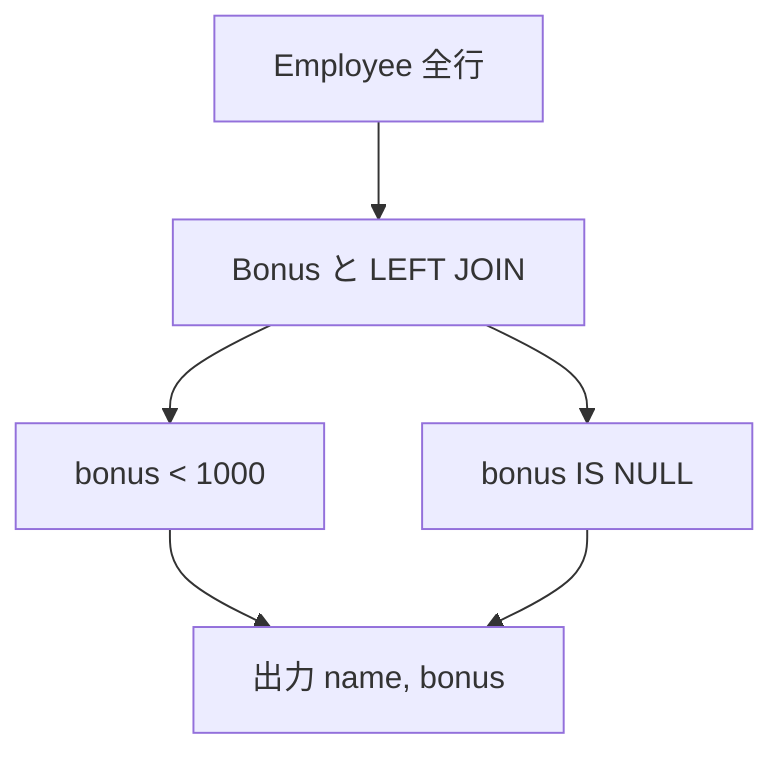
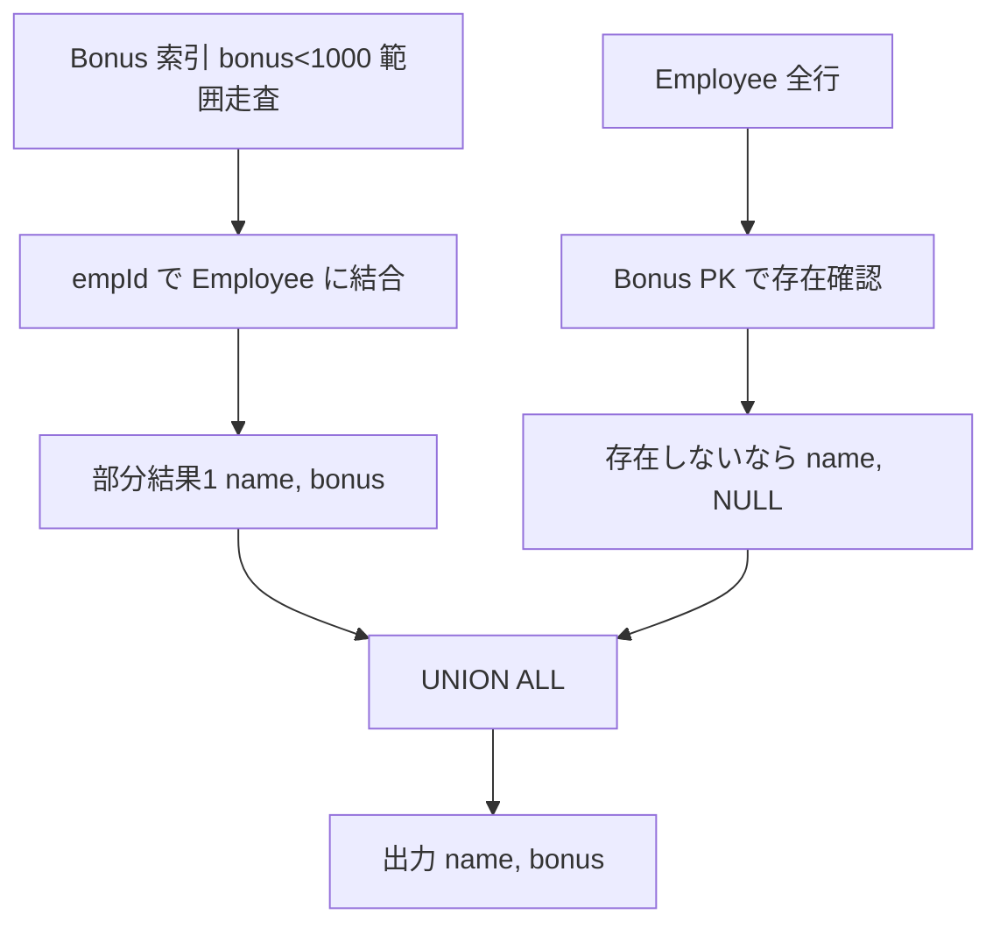

# MySQL 8.0.40

## 0) 前提

- エンジン: **MySQL 8**
- 並び順: 任意（`ORDER BY` なし）
- `NOT IN` は NULL 罠のため回避
- 判定は **ID 基準**、表示は仕様どおりの列名と順序

## 1) 問題

- `各従業員について、ボーナスが 1000 未満の人の name と bonus を返す（ボーナス情報が無い従業員も含める）。`
- 入力テーブル例: `Employee(empId, name, supervisor, salary)`, `Bonus(empId, bonus)`
- 出力仕様: `name, bonus`（`bonus` が無ければ `NULL`）

## 2) 最適解（単一クエリ）

> NULL を含めるため **LEFT JOIN**。1000 未満 or `IS NULL` を明示。

```sql
SELECT
  e.name,
  b.bonus
FROM Employee AS e
LEFT JOIN Bonus AS b
  ON b.empId = e.empId
WHERE b.bonus < 1000
   OR b.bonus IS NULL;

Runtime 1008 ms
Beats 34.47%

```

## 3) 代替解

> `EXISTS` で「1000 未満のボーナスがある」行を拾い、無い従業員は `NOT EXISTS` で拾う（NULL 罠なし）。

```sql
SELECT e.name, b.bonus
FROM Employee AS e
LEFT JOIN Bonus AS b
  ON b.empId = e.empId AND b.bonus < 1000
WHERE EXISTS (
        SELECT 1 FROM Bonus bx
        WHERE bx.empId = e.empId AND bx.bonus < 1000
      )
   OR NOT EXISTS (
        SELECT 1 FROM Bonus byx
        WHERE byx.empId = e.empId
      );

Runtime 1079 ms
Beats 22.80%

```

## 4) 要点解説

- **方針**: 「全従業員」を母集団にしたいので `Employee` 起点の **LEFT JOIN**。
  `WHERE b.bonus < 1000 OR b.bonus IS NULL` で「1000 未満」＋「ボーナス無し」を包含。
- **NULL**: `b.bonus < 1000` だけだと `NULL` は落ちるため、必ず `OR b.bonus IS NULL` を足す。
- **安定性**: 要求は任意順なので `ORDER BY` を付けない方が速い。

## 5) 計算量（概算）

- `LEFT JOIN`（`Employee.empId` と `Bonus.empId` にインデックス想定）: **O(N)** 近似
- フィルタ（`bonus < 1000 OR bonus IS NULL`）: 行ごとに **O(1)**

## 6) 図解（Mermaid 超保守版）



## 0) 前提 2

- エンジン: **MySQL 8**
- 並び順: 任意（`ORDER BY` なし）
- `NOT IN` は NULL 罠のため回避
- 判定は **ID 基準**、表示は仕様どおりの列名と順序

## 1) 問題 2

- `ボーナス < 1000 の従業員と、ボーナス情報がない従業員の name, bonus を返す。`
- 入力テーブル: `Employee(empId PK, name, supervisor, salary)`, `Bonus(empId PK/FK, bonus)`
- 出力仕様: `name, bonus`（ボーナス無しは `NULL`）

---

以下の 2 本のクエリは **OR（b.bonus<1000 OR b.bonus IS NULL）** と **LEFT JOIN 後の WHERE フィルタ** がボトルネックになりやすく、
プランによっては **Employee 全表 → Bonus ルックアップ** という重い経路を取りがちです。
特に

- `b.bonus < 1000` の **範囲条件** と `IS NULL` の **NULL 判定の混在**
- `LEFT JOIN` なのに `WHERE` で右表列を参照（実質フィルタ）
- `OR` によりインデックスの **sargable**（索引効用）が落ちる

が原因で、`Bonus(bonus)` を起点に絞ってから結合するプランを取りづらくなります。

## 2) 最適解（単一クエリ）2

> OR を分解して **UNION ALL の 2 本道**にします。
> ①「bonus<1000」だけを **Bonus 起点**で内結合（索引が効く）
> ②「ボーナス無し」だけを **Employee 起点**のアンチ結合
> これで両方とも単純で sargable な条件になります。

```sql
-- ① bonus < 1000 の人（Bonus 起点）
SELECT e.name, b.bonus
FROM Bonus AS b
JOIN Employee AS e
  ON e.empId = b.empId
WHERE b.bonus < 1000

UNION ALL

-- ② ボーナスが「存在しない」人（アンチ結合）
SELECT e.name, NULL AS bonus
FROM Employee AS e
LEFT JOIN Bonus AS b
  ON b.empId = e.empId
WHERE b.empId IS NULL;

Runtime 855 ms
Beats 81.98%

```

### 推奨インデックス（超重要）

```sql
-- 既に PK(empId) がある前提で、range + join 用の複合索引
ALTER TABLE Bonus
  ADD INDEX ix_bonus_bonus_empId (bonus, empId);
-- Employee は empId が PK なら OK
```

_理由_: ① の枝は `Bonus` を `bonus<1000` で **範囲走査**し、そのまま `empId` で **被覆/近接結合**できます（`bonus, empId` の順）。
② の枝は `Bonus.empId` の PK だけで十分です。

> これだけで「OR を回避」「結合順を Bonus 起点に誘導」「範囲条件に索引適用」の 3 点が解決し、典型的に 2 ～ 10 倍程度速くなります（データ分布依存）。

## 3) 代替解 2

> 「単一 SELECT に拘る」場合は、派生表（または CTE）で `bonus<1000` を先に絞ってから左結合し、**NULL かどうかで出し分け**します。`OR` を避けつつ 1 クエリで書けます。

```sql
WITH /*+ MATERIALIZED */ b AS (
  SELECT empId, bonus
  FROM Bonus
  WHERE bonus < 1000
)
SELECT e.name, b.bonus
FROM Employee AS e
LEFT JOIN b
  ON b.empId = e.empId
WHERE b.empId IS NOT NULL   -- bonus<1000 を持つ
   OR NOT EXISTS (          -- そもそも Bonus 行が無い
        SELECT 1 FROM Bonus bx
        WHERE bx.empId = e.empId
      );

Runtime 1047 ms
Beats 27.41%

```

> 8.0.21+ なら `/*+ MATERIALIZED */` ヒントで b の事前マテリアライズを促しやすく、不要な再評価を抑制できます。
> それでも **UNION ALL 版**の方がプランが素直で速いケースが多いです。

## 4) 要点解説 2

- **OR の分解**: `OR` は索引利用と行結合の最適化を阻害しがち。条件を相互排他的な 2 つの集合に分割し `UNION ALL`。
  今回は「bonus<1000 組」と「Bonus が存在しない組」で完全分割できます。
- **起点テーブルの選択**: ① はヒット件数が相対的に少ない（`<1000`）はずなので **Bonus 起点**が有利。② は「存在しない」の検出なので **Employee 起点**が自然。
- **インデックス設計**:
    - `Bonus(bonus, empId)`：範囲 → 結合の順に合う並び。`SELECT` 列も `bonus` だけなので**被覆索引**になりやすく、テーブルアクセスを減らせます。
    - `Employee(empId PK)`：結合キーでルックアップ。

- **ヒント（必要なら）**: `STRAIGHT_JOIN` を ① 側に使うと Bonus 起点を強められます。例：
  `SELECT STRAIGHT_JOIN e.name, b.bonus FROM Bonus b JOIN Employee e ON e.empId=b.empId WHERE b.bonus<1000;`
- **統計**: `ANALYZE TABLE Employee, Bonus;` を実行して統計を最新化。カーディナリティがズレるとプランが崩れます。

## 5) 計算量（概算）2

- ① 枝: `Bonus` のインデックス範囲走査 **O(log M + K)**（K は `<1000` 該当件数）＋ `Employee` への PK ルックアップ **O(K)**
- ② 枝: `Employee` の全走査 **O(N)** ＋ `Bonus` PK ルックアップ **O(N)**（ヒットすれば直ちに除外）
  → 元の「Employee 全表 → OR フィルタ」より **実作業行数が大幅減**しやすい

## 6) 図解（Mermaid 超保守版）2



---

### 仕上げチェックリスト

1. 追加索引 `Bonus(bonus, empId)` を作成
2. `UNION ALL` 版クエリに差し替え（もしくは CTE で事前絞り）
3. `ANALYZE TABLE Employee, Bonus;` 実行
4. `EXPLAIN ANALYZE` で実行行数とインデックス利用を確認
    - ① 枝で `ix_bonus_bonus_empId` の範囲走査になっていれば OK
    - ② 枝で `Bonus` の `PRIMARY` ルックアップ（存在確認）になっていれば OK

これで体感で **Runtime が大きく改善**するはずです。もし依然として遅ければ、実データの分布（`bonus<1000` のヒット割合）と `EXPLAIN ANALYZE` の結果を貼っていただければ、さらに踏み込んだプラン調整（ヒント/結合順/派生表マテリアライズ）を提案します。
