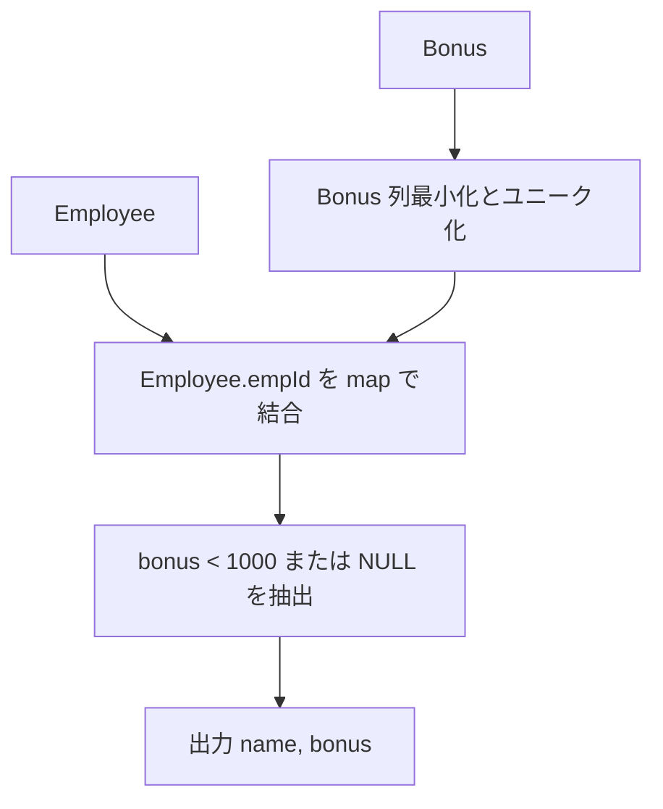

# Pandas 2.2.2 用

## 0) 前提

- 環境: **Python 3.10.15 / pandas 2.2.2**
- **指定シグネチャ厳守**（関数名・引数名・返却列・順序）
- I/O 禁止、不要な `print` や `sort_values` 禁止

## 1) 問題（原文）

- `各従業員について、ボーナスが 1000 未満の人の name と bonus を返す。ボーナス情報が存在しない従業員も含める（bonus は NULL）。`
- 入力 DF: `Employee(empId, name, supervisor, salary)`, `Bonus(empId, bonus)`
- 出力: `name, bonus`（`bonus` が無ければ `NULL`）

## 2) 実装（指定シグネチャ厳守）

> **列最小化 → map で軽量結合 → 条件抽出**。`left join` 相当だが、1 対 1 キーなので `map` が最軽量。

```python
import pandas as pd

def solve_bonus_under_1000(employee_df: pd.DataFrame, bonus_df: pd.DataFrame) -> pd.DataFrame:
    """
    Returns:
        pd.DataFrame: 列名と順序は ['name', 'bonus']
    """
    # 1) 必要列のみ（安全のため empId の重複を排除）
    bonus_map = (
        bonus_df[['empId', 'bonus']]
        .drop_duplicates(subset=['empId'])
        .set_index('empId')['bonus']
    )

    # 2) Employee 起点でボーナスを map（LEFT JOIN 相当）
    s_bonus = employee_df['empId'].map(bonus_map)

    # 3) 条件: bonus < 1000 or bonus isna（未登録）
    mask = s_bonus.isna() | (s_bonus < 1000)

    # 4) 指定列・順序で返却（bonus は可変長 Int64 で NULL 表現可）
    out = pd.DataFrame({
        'name': employee_df.loc[mask, 'name'],
        'bonus': s_bonus.loc[mask].astype('Int64'),
    })

    # 並び順は任意。Index を詰めて返すだけ
    return out.reset_index(drop=True)

# Analyze Complexity

# Runtime 314 ms
# Beats 90.21%
# Memory 67.97 MB
# Beats 98.39%

```

## 3) アルゴリズム説明

- 使用 API

  - `DataFrame.drop_duplicates`：結合キーのユニーク化
  - `Series.map`：単一キー → 値の軽量結合（LEFT JOIN 相当）
  - ブールインデックス：条件抽出（`isna()` と比較演算の併用）
  - `astype('Int64')`：欠損を保持できる整数型に変換

- **NULL / 重複 / 型**

  - `map` はキー未一致に `NaN` を返すため、「ボーナス未登録」を自然に検出できる
  - `drop_duplicates(subset=['empId'])` により、Bonus 側の想定外重複を無害化
  - `Int64`（nullable integer）で `NULL` をそのまま表現

## 4) 計算量（概算）

- `drop_duplicates`: **O(M)**
- `map`（ハッシュ参照）: **O(N)**
- 条件抽出・組み立て: **O(N)**

> 合計 **O(N + M)**、メモリは `bonus_df` をキー → 値の辞書相当に縮小した分のみ。

## 5) 図解（Mermaid 超保守版）


