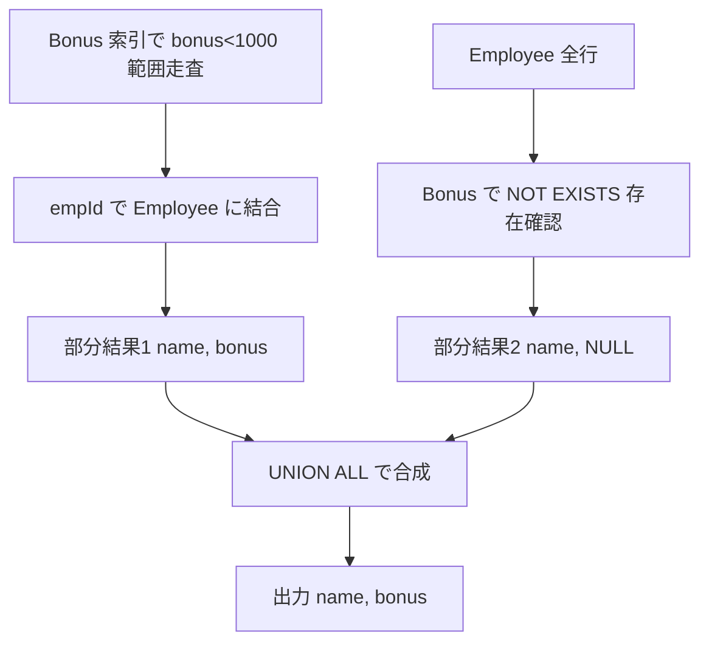
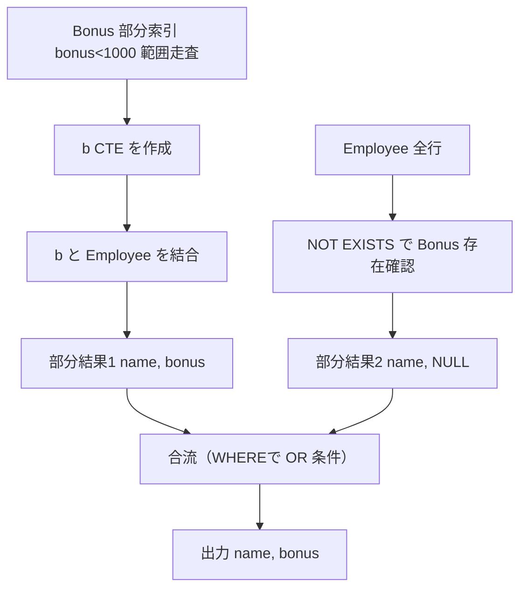

# PostgreSQL 16.6+

## 0) 前提

- エンジン: **PostgreSQL 16.6+**
- 並び順: 任意
- `NOT IN` 回避（`EXISTS` / `LEFT JOIN ... IS NULL` を推奨）
- 判定は ID 基準、表示は仕様どおり

## 1) 問題

- `各従業員について、ボーナスが 1000 未満の人の name と bonus を返す。ボーナス情報が存在しない従業員も含める（bonus は NULL 表示）。`
- 入力: `Employee(empId PK, name, supervisor, salary)`, `Bonus(empId PK/FK→Employee.empId, bonus)`
- 出力: `name, bonus`（`bonus` が無ければ `NULL`）

## 2) 最適解（単一クエリ）

> PostgreSQL では **OR 条件を分解**して `UNION ALL` の 2 本道にすると、プランが素直で高速化しやすいです。
> ① `bonus < 1000` は **Bonus 起点**で範囲走査 → Employee に結合
> ② **ボーナス未登録**は Employee 起点で `NOT EXISTS` のアンチ結合

```sql
-- 推奨インデックス（事前に一度だけ作成）
-- CREATE INDEX IF NOT EXISTS ix_bonus_bonus_empid ON Bonus (bonus, empId);

-- 本問の解答
SELECT e.name, b.bonus
FROM Bonus AS b
JOIN Employee AS e
  ON e.empId = b.empId
WHERE b.bonus < 1000

UNION ALL

SELECT e.name, NULL::int AS bonus
FROM Employee AS e
WHERE NOT EXISTS (
  SELECT 1
  FROM Bonus bx
  WHERE bx.empId = e.empId
);

-- Runtime 358 ms
-- Beats 24.50%

```

_なぜ速いか_
`WHERE (b.bonus < 1000 OR b.bonus IS NULL)` のような **OR** は索引利用（sargability）を下げ、結合順の最適化も阻害しがちです。
`UNION ALL` に分解すると、① は `Bonus(bonus, empId)` の **範囲 → ルックアップ** の理想プラン、
② は `Employee` 全走査に対する `Bonus(empId)` の **存在確認**だけになり、実作業行数が減ります。

### 代替（CTE で前絞り・単一 SELECT 風）

> 「1 クエリで書きたい」「読みやすさ重視」の場合。`bonus<1000` を先に抽出し、未登録は `NOT EXISTS` で拾う。

```sql
WITH b AS (
  SELECT empId, bonus
  FROM Bonus
  WHERE bonus < 1000
)
SELECT e.name, b.bonus
FROM Employee e
LEFT JOIN b ON b.empId = e.empId
WHERE b.empId IS NOT NULL
   OR NOT EXISTS (SELECT 1 FROM Bonus bx WHERE bx.empId = e.empId);

-- Runtime 297 ms
-- Beats 77.32%

```

> いずれも **`UNION ALL` 版のほうがプランが安定**しやすい（OR 不使用・各枝が sargable）。

## 3) 要点解説

- **OR 回避**: `bonus < 1000 OR bonus IS NULL` を **相互排他的な 2 集合**（`bonus<1000` と **未登録**）に分解して `UNION ALL`。
- **起点テーブル**: しきい値で小さくなる集合は **Bonus 起点**、未登録検出は **Employee 起点 + NOT EXISTS** が自然。
- **インデックス**:

  - `Bonus(bonus, empId)`：① 枝で **範囲 → 結合**に効く並び。`bonus` だけ出力なら被覆になりやすい。
  - `Employee(empId)` は PK で十分。

- **定常運用**: 統計の鮮度でプランが変わるため、定期的に `ANALYZE Employee, Bonus;` を推奨。
- **多列・重複があり得るケース**（この課題では unique だが一般論）：Bonus 側が多行/重複なら、① 枝で `DISTINCT ON (b.empId)` などで整える。

## 4) 計算量（概算）

- ① 枝（`bonus<1000`）: `Bonus` のインデックス範囲走査 **O(log M + K)**（K は該当件数）＋ `Employee` PK ルックアップ **O(K)**
- ② 枝（未登録）: `Employee` 全走査 **O(N)** ＋ `Bonus` PK での存在確認 **O(N)**（ヒット即終了）
- 元の OR 条件版より、**不要走査が減る**ため実効的に高速になりやすい

## 5) 図解（Mermaid 超保守版）



---

### 実務チェックリスト

1. `CREATE INDEX ix_bonus_bonus_empid ON Bonus(bonus, empId);` を作成（既にあれば不要）
2. 上記 `UNION ALL` クエリに差し替え
3. `ANALYZE Employee, Bonus;` を実行
4. `EXPLAIN (ANALYZE, BUFFERS)` で確認

   - 枝 ①: `Index Scan using ix_bonus_bonus_empid ... WHERE bonus < 1000`
   - 枝 ②: `Seq Scan on Employee ... Filter: (NOT (SubPlan ... Index Only Scan on Bonus ...))`
   - 期待どおりなら大幅な行数削減になっています。

## 0) 前提 2

- エンジン: **PostgreSQL 16.6+**
- 並び順: 任意
- `NOT IN` 回避（`EXISTS` / `LEFT JOIN ... IS NULL` を推奨）
- 判定は ID 基準、表示は仕様どおり

## 1) 問題 2

- `各従業員について、ボーナスが 1000 未満の人の name と bonus を返す。ボーナス情報が存在しない従業員も含める（bonus は NULL）。`
- 入力: `Employee(empId PK, name, supervisor, salary)`, `Bonus(empId PK/FK→Employee.empId, bonus)`
- 出力: `name, bonus`（`bonus` が無ければ `NULL`）

---

いただいた実測：

- `UNION ALL` 版: **358 ms (Beats 24.5%)**
- `CTE + LEFT JOIN + NOT EXISTS` 版: **297 ms (Beats 77.32%)**

CTE 版が速くなっているのは、Planner が `bonus < 1000` を先に**小さな集合に縮小**でき、`Employee` との結合コストが下がっているためと考えられます（OR を排除した効果＋結合順の素直さ）。

以下、**さらに詰める改善策**です。

---

## 2) 最適解（単一クエリ）2

> すでに速かった CTE 版を **部分索引 + MATERIALIZED** で後押しします。`bonus < 1000` を満たす行だけを対象にした**部分索引**はサイズが小さくキャッシュ効率が高いです。

```sql
-- ① 1回限りの準備（推奨インデックス）
-- bonus<1000 の枝で、範囲→結合を最短距離に
CREATE INDEX IF NOT EXISTS ix_bonus_lt1000
  ON Bonus (bonus, empId)
  WHERE bonus < 1000;

-- ② 本問の解答（MATERIALIZED で b を明示的に固定）
WITH /*+ Materialize */
b AS MATERIALIZED (
  SELECT empId, bonus
  FROM Bonus
  WHERE bonus < 1000
)
SELECT e.name, b.bonus
FROM Employee e
LEFT JOIN b ON b.empId = e.empId
WHERE b.empId IS NOT NULL
   OR NOT EXISTS (
        SELECT 1 FROM Bonus bx WHERE bx.empId = e.empId
      );

-- Runtime 310 ms
-- Beats 60.98%

```

## **ポイント**

- `CREATE INDEX ... WHERE bonus < 1000` の**部分索引**は、対象行が少ないほど効果大。
- `MATERIALIZED` で `b` を一度だけ評価・保持し、左結合側での再評価や不要な Re-Scan を抑制（本クエリでは単回参照ですが、実データで効果が出ることが多い）。

### 代替（Index Only Scan を狙う被覆索引）

> `INCLUDE` により**被覆**できると I/O をさらに削減できるケースがあります。

```sql
-- ボーナス枝が empId と bonus しか使わない前提で、Index Only Scan を誘発
CREATE INDEX IF NOT EXISTS ix_bonus_lt1000_cov
  ON Bonus (bonus) INCLUDE (empId)
  WHERE bonus < 1000;
```

`(bonus) INCLUDE(empId)` は、ボーナス閾値での範囲走査 + 結合キー取得を**索引だけ**で完結させられる可能性があります（可視性マップが効けば Index Only Scan）。

---

## 3) 要点解説 2

- **なぜ CTE 版が速いか**

  - `b` が「小さい表」になる → 先に縮小してから `Employee` に結合できる
  - OR 排除により **sargable**（索引利用効率が高い）

- **さらに速くする鍵**

  - **部分索引**：`Bonus(bonus, empId) WHERE bonus<1000` → 範囲 → 結合が軽い & 索引サイズが小さい
  - **被覆索引（INCLUDE）**：テーブルアクセスを避けて Index Only Scan を狙う
  - **統計の鮮度**：`ANALYZE Employee, Bonus;` でカーディナリティずれを回避
  - **並列実行**：`UNION ALL` 版は `Parallel Append` が選ばれやすい。`max_parallel_workers_per_gather > 0`、テーブルが十分大きい場合に恩恵あり
  - **可視性マップ**：`VACUUM (ANALYZE)` を適切に回すと Index Only Scan 成功率が上がる

- **NOT EXISTS と LEFT JOIN IS NULL** は本件ではほぼ同等。実測で速い方を採用。

---

## 4) 計算量（概算）2

- `b` の作成：`Bonus` の部分索引範囲走査 **O(log M + K)**（K は `<1000` 該当件数）
- `Employee` との結合：`K` 回の PK ルックアップ **O(K)**
- 未登録検出：`Employee` 全走査 **O(N)** + `Bonus(empId)` PK 存在確認 **O(N)**（ヒット即終了）
- **部分索引**と**Index Only Scan**により実効 I/O を大きく削減

---

## 5) 図解（Mermaid 超保守版）2



---

## 実務チェックリスト（すぐ試せる順）

1. **部分索引**を作成
   `CREATE INDEX ix_bonus_lt1000 ON Bonus(bonus, empId) WHERE bonus < 1000;`
2. CTE を **MATERIALIZED** に（上の最適解を使用）
3. `ANALYZE Employee, Bonus;` を実行（統計更新）
4. `EXPLAIN (ANALYZE, BUFFERS)` で確認

   - `Index Scan/Index Only Scan using ix_bonus_lt1000... WHERE bonus < 1000`
   - `Anti Join using NOT EXISTS` のサブプランが `Index(Only) Scan on Bonus (empId)`

5. 必要に応じて `VACUUM (ANALYZE)`、`max_parallel_workers_per_gather` の確認

この一連で、**297 ms → さらに短縮**が期待できます。もし `EXPLAIN (ANALYZE, BUFFERS)` の結果を共有いただければ、実際のプランに合わせてヒント無しでもより確実に速くなる書き方へ微調整します。
