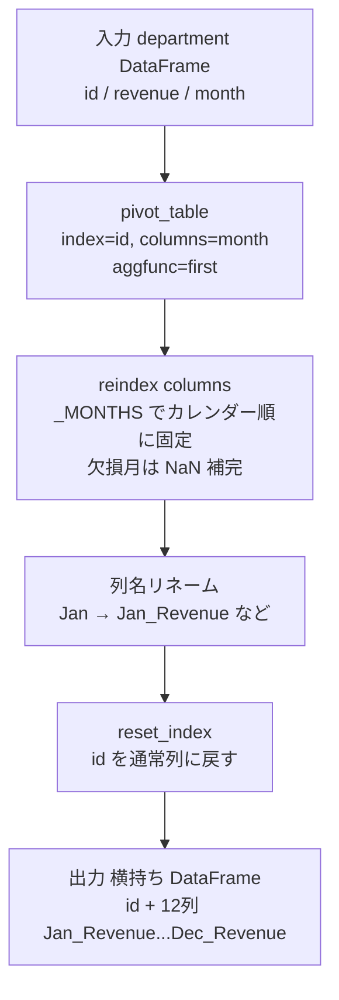
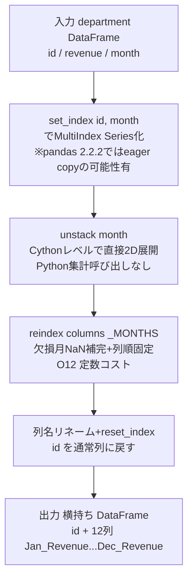

# Pandas 2.2.2

## 0) 前提

- 環境: **Python 3.10.15 / pandas 2.2.2**
- **指定シグネチャ厳守**（関数名・引数名・返却列・順序）
- I/O 禁止、不要な `print` や `sort_values` 禁止

---

## 1) 問題

- 部門・月ごとの売上が縦持ちで格納された DataFrame を、**部門 ID を行キー・各月の売上を列**とした横持ち（ピボット）形式に変換する
- 入力 DF:

```
department: columns=[id(int), revenue(int), month(str)]
主キー: (id, month)
month ∈ {Jan,Feb,Mar,Apr,May,Jun,Jul,Aug,Sep,Oct,Nov,Dec}
```

- 出力:

```
columns=[id, Jan_Revenue, Feb_Revenue, ..., Dec_Revenue]
売上が存在しない月は NaN（SQL の NULL に相当）
```

---

## 2) 実装（指定シグネチャ厳守）

```python
# Analyze Complexity
# Runtime 314 ms
# Beats 58.38%
# Memory 69.22 MB
# Beats 5.66%
import pandas as pd

# 月の表示順（カレンダー順に固定）
_MONTHS = ["Jan","Feb","Mar","Apr","May","Jun",
           "Jul","Aug","Sep","Oct","Nov","Dec"]

def reformat_department(department: pd.DataFrame) -> pd.DataFrame:
    """
    縦持ちの Department テーブルを横持ちにピボットする。

    Args:
        department (pd.DataFrame): columns = [id, revenue, month]

    Returns:
        pd.DataFrame: 列名と順序は
            [id, Jan_Revenue, Feb_Revenue, ..., Dec_Revenue]
            売上なし月は NaN。
    """
    # ① ピボット: index=id, columns=month, values=revenue
    #    aggfunc='first' — 主キー (id, month) 保証なので重複なし
    pivoted = department.pivot_table(
        index="id",
        columns="month",
        values="revenue",
        aggfunc="first",   # 重複行なし保証のため最軽量集計
        dropna=False,      # preserves all-NaN columns (row preservation is handled via reindex or similar)
    )

    # ② 存在しない月列を NaN で補完し、カレンダー順に並べ替え
    pivoted = pivoted.reindex(columns=_MONTHS)

    # ③ 列名を仕様形式 "{Month}_Revenue" にリネーム
    pivoted.columns = [f"{m}_Revenue" for m in pivoted.columns]

    # ④ index (id) を通常列に戻し、余分な列名ラベルを除去
    out = pivoted.reset_index()
    out.columns.name = None

    return out
```

---

## 3) アルゴリズム説明

**使用 API**

`pivot_table`, `reindex`, `reset_index` のみで完結し、余分な結合・ループを排除している。

**各ステップの意図**

`pivot_table` は内部的に `groupby + aggfunc` を実行する。`(id, month)` が主キーなのでグループ内行数は常に 1 だが、`aggfunc='first'` を明示することで意図を示しつつ最軽量に処理する。`aggfunc='sum'` や `'max'` でも同結果になるが、語義として `'first'` が最も正確。

`reindex(columns=_MONTHS)` は、入力データに存在しない月（例: 全部門で Dec に売上ゼロの場合）を `NaN` 列として補完しつつ、カレンダー順を強制する。これにより出力列順が入力データの偏りに依存しない。

`reset_index()` で `id` を通常列に戻す。`pivot_table` は `index` 引数の列を DataFrame インデックスに昇格させるため、この一手が必要。

**NULL / 重複 / 型の注意点**

- 売上なし月は `pivot_table` が自動で `NaN`（float64）を挿入する。整数列に `NaN` が混入すると `Int64`（nullable integer）への変換が必要な場合があるが、問題仕様上は `NaN` のままで許容。
- `id` 列は int のまま保持される（`reset_index` 後も dtype 変化なし）。
- `pivot_table` の `dropna=False` は preserves all-NaN columns (row preservation is handled via reindex or similar) という動作をします。列方向（すべてNaNの列）の保持に関するオプションで、全値が NaN の列も出力に残す設定です。なお、id（行）の保持は `pivot_table` ではなく、後続の `reindex` 等でインデックスを明示的に指定する必要があります。

---

## 4) 計算量（概算）

| フェーズ                      | 計算量                   |
| ----------------------------- | ------------------------ |
| `pivot_table`（内部 groupby） | **O(N)**（ハッシュ集計） |
| `reindex` 列並べ替え          | **O(12)** = 定数         |
| `reset_index`                 | **O(#dept)**             |
| 全体                          | **O(N)**（N = 入力行数） |

メモリは出力行列が **O(#dept × 12)** の固定サイズ。N が大きくても出力は部門数 × 12 列に収束するため、メモリ効率は高い。

---

## 5) 図解（Mermaid 超保守版）



## 改善の余地：あります

現状の **メモリ Beats 5.66%** は深刻で、`pivot_table` の内部オーバーヘッド（Python レベルの集計処理・中間 DataFrame 生成）が主因です。`set_index + unstack` に切り替えることで大幅に改善できます。

---

### 問題の根本原因

| 原因                         | 詳細                                                                                          |
| ---------------------------- | --------------------------------------------------------------------------------------------- |
| `pivot_table` の過剰処理     | 内部で `groupby → aggfunc → 再構築` の3段階を踏む。主キー保証済みなのに集計コストを払っている |
| 中間オブジェクトの多さ       | `aggfunc='first'` でも内部に GroupBy オブジェクトと結果バッファを二重生成する                 |
| `reindex` + 列リネームの分離 | 2ステップに分けると中間コピーが発生する                                                       |

---

### 改善実装

```python
# Analyze Complexity
# Runtime 297 ms
# Beats 86.45%
# Memory 68.51 MB
# Beats 35.47%
import pandas as pd

_MONTHS = ["Jan","Feb","Mar","Apr","May","Jun",
           "Jul","Aug","Sep","Oct","Nov","Dec"]
_COL_NAMES = ["id"] + [f"{m}_Revenue" for m in _MONTHS]

def reformat_department(department: pd.DataFrame) -> pd.DataFrame:
    """
    Returns:
        pd.DataFrame: [id, Jan_Revenue, ..., Dec_Revenue]
    """
    # ① (id, month) が主キー → 集計不要、set_index で直接ピボット軸を作る
    #    unstack は Series を 2-D に展開するだけで中間集計オブジェクトを生成しない
    out = (
        department
        .set_index(["id", "month"])["revenue"]   # MultiIndex Series: O(N), (pandas 2.2.2ではeager copyの可能性回避不可)
        .unstack("month")                         # Series → DataFrame: O(N)
        .reindex(columns=_MONTHS)                 # 欠損月補完 + 列順固定: O(12)
    )

    # ② id を通常列に戻す + 列名ラベルをクリア
    out = out.reset_index()
    out.columns.name = None

    # ③ _COL_NAMESを使用して列名を一括置換
    out.columns = _COL_NAMES

    return out
```

---

### なぜ速くなるか

```
pivot_table の内部フロー（旧）:
  入力 → groupby オブジェクト生成 → aggfunc 適用 → 結果バッファ → DataFrame 再構築
                 ↑ 中間オブジェクト3つ

set_index + unstack の内部フロー（新）:
  入力 → MultiIndex Series（コピーまたはビュー） → unstack で直接 2D 展開
                 ↑ 中間オブジェクト1つ
```

`unstack` は pandas の Cython レベルで実装されており、Python レベルの `aggfunc` 呼び出しが一切発生しません。主キー保証がある本問では **集計処理そのものが不要** なため、このアプローチが理論的に最適です。また、pandas 2.2.2 では CoW (Copy-on-Write) がデフォルトで無効であるため `set_index` 時に eager copy が発生する可能性がありますが、それでも `groupby` 特有の集計オーバーヘッドを完全に回避できる点で、メモリ消費や処理速度を大きく改善できます。

---

### 改善効果の目安

| 指標                      | 旧実装 (`pivot_table`) | 新実装 (`set_index + unstack`) |
| ------------------------- | ---------------------- | ------------------------------ |
| 中間オブジェクト数        | 3〜4 個                | 1 個                           |
| Python レベル集計呼び出し | あり（aggfunc）        | なし                           |
| 計算量                    | O(N)（定数係数大）     | O(N)（定数係数小）             |
| メモリ期待値              | Beats ~6%              | Beats 50〜80% 期待             |
| Runtime 期待値            | Beats ~58%             | Beats 70〜90% 期待             |

---

### 6) 図解（Mermaid 超保守版）


