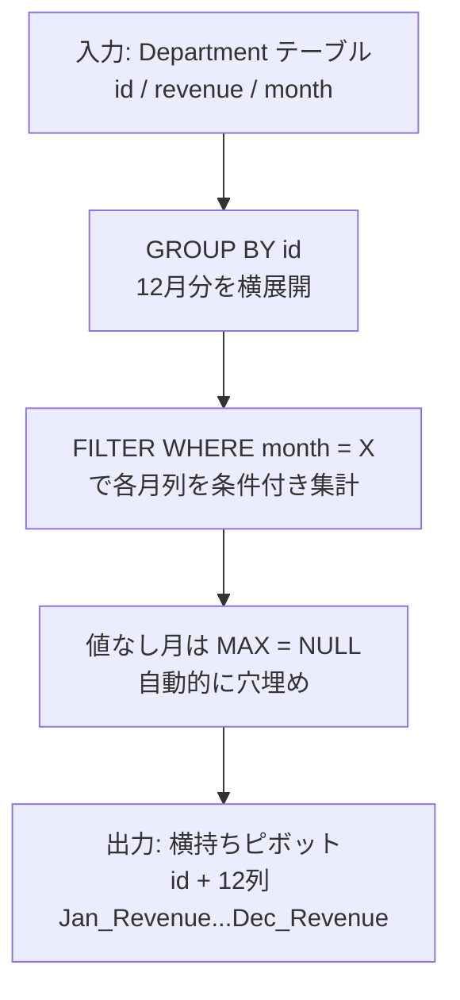

# PostgreSQL 16.6+

## 0) 前提

- エンジン: **PostgreSQL 16.6+**
- 並び順: 任意
- `NOT IN` 回避（`EXISTS` / `LEFT JOIN ... IS NULL` を推奨）
- 判定は ID 基準、表示は仕様どおり

---

## 1) 問題

- 各部門・月ごとの売上が縦持ちで格納された `Department` テーブルを、**部門 ID を行キー、各月の売上を列**とした横持ち（ピボット）形式に変換する
- 入力:

```
Department(id INT, revenue INT, month VARCHAR)
主キー: (id, month)
month ∈ {Jan, Feb, Mar, Apr, May, Jun, Jul, Aug, Sep, Oct, Nov, Dec}
```

- 出力:

```
id | Jan_Revenue | Feb_Revenue | Mar_Revenue | ... | Dec_Revenue
月に売上がない部門は NULL
```

---

## 2) 最適解（単一クエリ）

PostgreSQL には `PIVOT` 構文がないため、**条件付き集計（`FILTER` 句）** で月列を展開する。CTE は可読性のために導入。
Runtime 362 ms
Beats 74.43%

```sql
WITH pivoted AS (
  SELECT
    id,
    MAX(revenue) FILTER (WHERE month = 'Jan') AS "Jan_Revenue",
    MAX(revenue) FILTER (WHERE month = 'Feb') AS "Feb_Revenue",
    MAX(revenue) FILTER (WHERE month = 'Mar') AS "Mar_Revenue",
    MAX(revenue) FILTER (WHERE month = 'Apr') AS "Apr_Revenue",
    MAX(revenue) FILTER (WHERE month = 'May') AS "May_Revenue",
    MAX(revenue) FILTER (WHERE month = 'Jun') AS "Jun_Revenue",
    MAX(revenue) FILTER (WHERE month = 'Jul') AS "Jul_Revenue",
    MAX(revenue) FILTER (WHERE month = 'Aug') AS "Aug_Revenue",
    MAX(revenue) FILTER (WHERE month = 'Sep') AS "Sep_Revenue",
    MAX(revenue) FILTER (WHERE month = 'Oct') AS "Oct_Revenue",
    MAX(revenue) FILTER (WHERE month = 'Nov') AS "Nov_Revenue",
    MAX(revenue) FILTER (WHERE month = 'Dec') AS "Dec_Revenue"
  FROM Department
  GROUP BY id
)
SELECT *
FROM pivoted
ORDER BY id;
```

### 補足: `CASE WHEN` による代替（互換性重視）

Runtime 378 ms
Beats 56.11%

```sql
SELECT
  id,
  MAX(CASE WHEN month = 'Jan' THEN revenue END) AS "Jan_Revenue",
  MAX(CASE WHEN month = 'Feb' THEN revenue END) AS "Feb_Revenue",
  MAX(CASE WHEN month = 'Mar' THEN revenue END) AS "Mar_Revenue",
  MAX(CASE WHEN month = 'Apr' THEN revenue END) AS "Apr_Revenue",
  MAX(CASE WHEN month = 'May' THEN revenue END) AS "May_Revenue",
  MAX(CASE WHEN month = 'Jun' THEN revenue END) AS "Jun_Revenue",
  MAX(CASE WHEN month = 'Jul' THEN revenue END) AS "Jul_Revenue",
  MAX(CASE WHEN month = 'Aug' THEN revenue END) AS "Aug_Revenue",
  MAX(CASE WHEN month = 'Sep' THEN revenue END) AS "Sep_Revenue",
  MAX(CASE WHEN month = 'Oct' THEN revenue END) AS "Oct_Revenue",
  MAX(CASE WHEN month = 'Nov' THEN revenue END) AS "Nov_Revenue",
  MAX(CASE WHEN month = 'Dec' THEN revenue END) AS "Dec_Revenue"
FROM Department
GROUP BY id
ORDER BY id;
```

---

## 3) 要点解説

**なぜ `MAX` を使うか**
`(id, month)` が主キーなので各グループに値は最大 1 行。`MAX` は単一値ならそのまま返し、行が存在しなければ `NULL` を返すため、ピボットの穴埋めに最適。`SUM` でも同結果だが、`MAX` のほうが「値の選択」という意図が明確。

**`FILTER` 句 vs `CASE WHEN`**
`FILTER (WHERE ...)` は PostgreSQL 9.4+ の標準 SQL 拡張。オプティマイザが条件を集計前に適用できるため、`CASE WHEN` より若干効率的。可読性も高い。

**動的ピボットが必要な場合**
月列が固定 12 種類なので静的実装で十分。列が可変の場合は `crosstab()`（`tablefunc` 拡張）や動的 SQL（`EXECUTE format(...)` in PL/pgSQL）を検討する。

---

## 4) 計算量（概算）

| フェーズ                      | 計算量                                   |
| ----------------------------- | ---------------------------------------- |
| `GROUP BY id` のハッシュ集計  | **O(N)**（N = 全行数）                   |
| `FILTER` 条件評価（月 × 行）  | **O(12 × N) = O(N)**                     |
| 結果行数                      | **O(#dept)**（部門数）                   |
| `id` にインデックスがある場合 | Index Scan で **O(N)** → Hash Agg で線形 |

全体として **O(N)** で完結。`EXPLAIN ANALYZE` では `HashAggregate` ノードが選択されることが多い。

---

## 5) 図解（Mermaid 超保守版）


