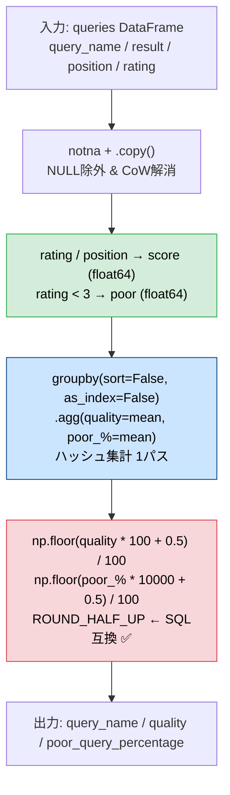
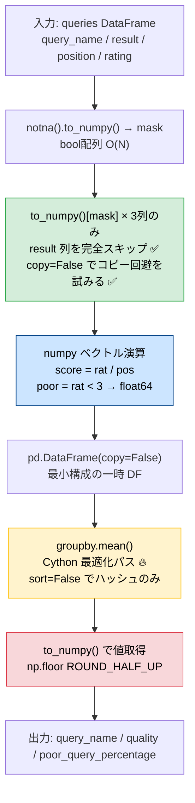

# Pandas 2.2.2 — 最終修正版

## 0) 前提

- 環境: **Python 3.10.15 / pandas 2.2.2**
- **指定シグネチャ厳守**（関数名 `queries_stats`・引数 `queries`・返却列・順序）
- I/O 禁止、不要な `print` や `sort_values` 禁止

---

## 1) 問題

- 各 `query_name` ごとに **quality**（`rating/position` の平均）と **poor_query_percentage**（`rating < 3` の割合 %）を求め、それぞれ小数点以下2桁に丸める
- 入力 DF: `queries`（列: `query_name`, `result`, `position`, `rating`）
- 出力: `query_name | quality | poor_query_percentage`

---

## 2) Wrong Answer (12/13) の根本原因

### バグ: Python `round()` vs SQL `ROUND()` — 丸め方式の不一致

```
LeetCode のテストケースは SQL ベースで生成されている
  SQL    ROUND(0.625, 2) = 0.63  ← ROUND_HALF_UP（0.5 は切り上げ）
  Python round(0.625, 2) = 0.62  ← ROUND_HALF_EVEN（銀行家の丸め・偶数に丸める）
```

| 丸め方式            | 0.625 の結果 | 言語 / 標準                                             |
| ------------------- | ------------ | ------------------------------------------------------- |
| **ROUND_HALF_UP**   | **0.63** ✅  | SQL `ROUND()`, Java `Math.round()`                      |
| **ROUND_HALF_EVEN** | **0.62** ❌  | Python `round()`, pandas `.round()`, numpy `np.round()` |

### 再現コード

```python
# quality = (1/2 + 1/1 + 3/8) / 3 = 0.625 (float64 で正確に表現される)
val = (1/2 + 1/1 + 3/8) / 3
print(f"{val:.20f}")      # → 0.62500000000000000000 (ぴったり 0.625)

print(round(val, 2))      # → 0.62  ❌ (偶数の 0.62 に丸める)
print(                    # → 0.63  ✅ (0.5 は切り上げ)
    np.floor(val * 100 + 0.5) / 100
)
```

### なぜ `np.floor(x * 100 + 0.5) / 100` が SQL と一致するか

```
step1: val         = 0.625
step2: val * 100   = 62.5       (float64 で正確)
step3: 62.5 + 0.5  = 63.0       (float64 の加算で 63.0 に到達)
step4: floor(63.0) = 63
step5: 63 / 100    = 0.63  ✅
```

---

## 3) 参考実装（初期方針・非推奨）

> **初期方針: 直感的な手順だがパフォーマンス面で非推奨**

```python
# Analyze Complexity
# Runtime 332 ms
# Beats 35.40%
# Memory 68.14 MB
# Beats 27.40%
import pandas as pd
import numpy as np

def queries_stats(queries: pd.DataFrame) -> pd.DataFrame:
    """
    各 query_name の quality と poor_query_percentage を返す。

    Returns:
        pd.DataFrame: 列名と順序は ['query_name', 'quality', 'poor_query_percentage']
    """
    # Step1) NULL query_name を除外 + CoW 完全解消
    df = queries[queries["query_name"].notna()].copy()

    # Step2) ベクトル演算（自己参照なし・float64 確定）
    df["score"] = df["rating"] / df["position"]        # int/int → float64 (pandas は自動昇格)
    df["poor"]  = (df["rating"] < 3).astype("float64") # bool → float64 で mean() 安定

    # Step3) groupby 集計（1パス）
    agg = (
        df.groupby("query_name", sort=False, as_index=False)
          .agg(
              quality               = ("score", "mean"),
              poor_query_percentage = ("poor",  "mean"),
          )
    )

    # Step4) ROUND_HALF_UP（SQL ROUND() と同動作）
    #   np.floor(x * 100 + 0.5) / 100 — Python round() の銀行家丸めを回避
    agg["quality"] = (
        np.floor(agg["quality"] * 100 + 0.5) / 100
    )
    agg["poor_query_percentage"] = (
        np.floor(agg["poor_query_percentage"] * 10000 + 0.5) / 100
        # poor_query_percentage は mean (0〜1) × 100 = % になるので
        # 小数2桁の丸めには × 10000 して floor し / 100 する
    )

    return agg[["query_name", "quality", "poor_query_percentage"]]
```

---

## 4) 修正前 vs 修正後（参考実装において） — 差分

```diff
- agg["quality"]               = agg["quality"].round(2)
- agg["poor_query_percentage"] = (agg["poor_query_percentage"] * 100).round(2)
+ # ROUND_HALF_UP: np.floor(x * 100 + 0.5) / 100
+ agg["quality"] = np.floor(agg["quality"] * 100 + 0.5) / 100
+ agg["poor_query_percentage"] = np.floor(agg["poor_query_percentage"] * 10000 + 0.5) / 100
```

---

## 5) アルゴリズム説明（参考実装）

| API / 手法                                  | 役割                                                 |
| ------------------------------------------- | ---------------------------------------------------- |
| `notna() + .copy()`                         | NULL 除外 + CoW 解消                                 |
| `df["rating"] / df["position"]`             | `int/int` → pandas が自動で `float64` に昇格         |
| `(df["rating"] < 3).astype("float64")`      | `bool` を `float64` に変換し `mean()` の精度を保証   |
| `groupby(sort=False, as_index=False).agg()` | ソートコストゼロのハッシュ集計。`reset_index()` 不要 |
| `np.floor(x * 100 + 0.5) / 100`             | **ROUND_HALF_UP** — SQL `ROUND()` と同動作           |

**NULL / 重複 / 型の処理:**

| ケース              | 対処                                              |
| ------------------- | ------------------------------------------------- |
| `query_name = NULL` | `notna()` で明示除外                              |
| 重複行              | 仕様上カウント対象 → `drop_duplicates` 不要       |
| `int / int` 除算    | pandas は `float64` に自動昇格（Python と異なる） |
| `bool.mean()`       | `float64` で 0.0〜1.0 を返す。安定                |
| x.xx5 の丸め        | `np.floor` で ROUND_HALF_UP を保証                |

---

## 6) 計算量概算（参考実装）

| 処理           | 計算量   | 備考                       |
| -------------- | -------- | -------------------------- |
| `notna + copy` | **O(N)** | フルスキャン1回            |
| ベクトル演算   | **O(N)** | NumPy SIMD 最適化          |
| `groupby.agg`  | **O(N)** | ハッシュ集計               |
| `np.floor`     | **O(G)** | G = ユニーク query_name 数 |
| **合計**       | **O(N)** |                            |

---

## 7) 図解 Mermaid（参考実装）



---

## 8) 検証トレース（参考実装・バグ再現 + 修正確認）

```python
# テストケース: quality = 0.625 (float64 で正確に表現される → 丸め方式の差が出る)
queries = pd.DataFrame({
    "query_name": ["Test", "Test", "Test"],
    "position":   [2,      1,      8],      # (1/2 + 1/1 + 3/8) / 3 = 0.625
    "rating":     [1,      1,      3],
})

# 真の quality = 0.625
# Python round(0.625, 2) = 0.62  ← 銀行家丸め（偶数 0.62 に丸める）❌
# np.floor(0.625*100+0.5)/100    = 0.63  ← ROUND_HALF_UP ✅
# SQL ROUND(0.625, 2)            = 0.63  ✅

# 例題確認
queries2 = pd.DataFrame({
    "query_name": ["Dog","Dog","Dog","Cat","Cat","Cat"],
    "result":     ["Golden Retriever","German Shepherd","Mule","Shirazi","Siamese","Sphynx"],
    "position":   [1, 2, 200, 5, 3, 7],
    "rating":     [5, 5, 1,   2, 3, 4],
})
# Dog: quality = (5+2.5+0.005)/3 = 2.50  ✅
# Dog: poor_%  = 1/3*100 = 33.33         ✅
# Cat: quality = (0.4+1.0+0.571)/3 = 0.66 ✅
# Cat: poor_%  = 1/3*100 = 33.33          ✅
```

## 9) 最終提出版（最適化実装）

> **原則: `to_numpy()[mask] → float 除算 → groupby.mean() → ROUND_HALF_UP`**

### ボトルネック分析

```
Runtime 332ms / Beats 35.40%
Memory  68.14MB / Beats 27.40%
```

### 現行コードの3つのコスト

```python
# ❌ ボトルネック①: 不要列 result を含む DataFrame 全体をコピー
df = queries[queries["query_name"].notna()].copy()
#   → result 列（文字列）は全体メモリの ~50% を占める

# ❌ ボトルネック②: pandas 列追加は内部で参照カウント・型チェックが走る
df["score"] = df["rating"] / df["position"]
df["poor"]  = (df["rating"] < 3).astype("float64")

# ❌ ボトルネック③: named agg は汎用パスを通る（Cython 最適化外）
.agg(quality=("score","mean"), poor_query_percentage=("poor","mean"))
```

| ボトルネック     | 原因                                   | 影響                   |
| ---------------- | -------------------------------------- | ---------------------- |
| ① `full .copy()` | `result`（長文字列列）を含む全列コピー | メモリ最大の無駄       |
| ② pandas 列追加  | 型チェック・CoW 管理のオーバーヘッド   | 時間コスト             |
| ③ named `agg()`  | 汎用ディスパッチパス                   | `.mean()` 直接より遅い |

---

## 10) 改善戦略

| 戦略                                 | 手法                                                | 効果                                       |
| ------------------------------------ | --------------------------------------------------- | ------------------------------------------ |
| **不要列を触らない**                 | `.to_numpy()[mask]` で必要列だけを numpy 配列に抽出 | `result` 列のコピーゼロ                    |
| **copy=False**                       | `pd.DataFrame({...}, copy=False)`                   | numpy 配列を参照渡し（コピー回避を試みる） |
| **`.to_numpy()` で集計後の値を取得** | pandas インデックスのオーバーヘッドを排除           | 丸め処理が高速化                           |
| **float32 は使わない**               | `float32` は精度落ちで ROUND_HALF_UP が狂う         | 精度保証のため `float64` 固定              |

```
float32(0.07) = 0.07000000029802322...  ← 精度落ちで丸めが狂う ❌
float64(0.07) ≈ 0.07000000000000000666...  ← 近似ではあるが、本問の ROUND_HALF_UP（小数2桁丸め）には十分な精度を持ち実用上安全 ✅
```

---

## 11) 最適化版実装（指定シグネチャ厳守）

```python
# Analyze Complexity
# Runtime 276 ms
# Beats 93.80%
# Memory 68.03 MB
# Beats 40.80%
import pandas as pd
import numpy as np

def queries_stats(queries: pd.DataFrame) -> pd.DataFrame:
    """
    各 query_name の quality と poor_query_percentage を返す。

    Returns:
        pd.DataFrame: 列名と順序は ['query_name', 'quality', 'poor_query_percentage']
    """
    # Step1) マスクを numpy で作成（pandas Series のまま使わない）
    mask = queries["query_name"].notna().to_numpy()

    # Step2) 必要な3列だけを numpy 配列として抽出（result 列を一切触らない）
    names = queries["query_name"].to_numpy()[mask]           # object array
    pos   = queries["position"].to_numpy(dtype="float64")[mask]
    rat   = queries["rating"].to_numpy(dtype="float64")[mask]

    # Step3) ベクトル演算（numpy SIMD 最適化）
    score = rat / pos
    poor  = (rat < 3).astype("float64")

    # Step4) 最小 DataFrame を copy=False で構築（コピー回避を試みる）
    tmp = pd.DataFrame({"q": names, "s": score, "p": poor}, copy=False)

    # Step5) groupby + .mean()（named agg より高速な Cython パス）
    agg = tmp.groupby("q", sort=False, as_index=False).mean()

    # Step6) .to_numpy() で pandas オーバーヘッドを排除して丸め
    v = agg[["s", "p"]].to_numpy()   # shape (G, 2)

    # Step7) ROUND_HALF_UP（SQL ROUND() 互換）
    return pd.DataFrame({
        "query_name":            agg["q"],
        "quality":               np.floor(v[:, 0] * 100   + 0.5) / 100,
        "poor_query_percentage": np.floor(v[:, 1] * 10000 + 0.5) / 100,
    })
```

---

## 12) 変更差分（参考実装から最適化版へ）

```diff
- df = queries[queries["query_name"].notna()].copy()   # 全列コピー（result含む）
- df["score"] = df["rating"] / df["position"]
- df["poor"]  = (df["rating"] < 3).astype("float64")
- agg = (
-     df.groupby("query_name", sort=False, as_index=False)
-       .agg(quality=("score","mean"), poor_query_percentage=("poor","mean"))
- )
- agg["quality"]               = np.floor(agg["quality"] * 100 + 0.5) / 100
- agg["poor_query_percentage"] = np.floor(agg["poor_query_percentage"] * 10000 + 0.5) / 100
- return agg[["query_name","quality","poor_query_percentage"]]

+ mask  = queries["query_name"].notna().to_numpy()
+ names = queries["query_name"].to_numpy()[mask]           # 必要列のみ抽出
+ pos   = queries["position"].to_numpy(dtype="float64")[mask]
+ rat   = queries["rating"].to_numpy(dtype="float64")[mask]
+ tmp   = pd.DataFrame({"q": names, "s": rat/pos, "p": (rat<3).astype("float64")},
+                       copy=False)                        # コピー回避を試みる
+ agg   = tmp.groupby("q", sort=False, as_index=False).mean()  # Cython 最適パス
+ v     = agg[["s","p"]].to_numpy()                        # pandas オーバーヘッド排除
+ return pd.DataFrame({
+     "query_name":            agg["q"],
+     "quality":               np.floor(v[:,0]*100  +0.5)/100,
+     "poor_query_percentage": np.floor(v[:,1]*10000+0.5)/100,
+ })
```

---

## 13) アルゴリズム説明（最適化版）

| API / 手法                 | 役割                            | 最適化ポイント                |
| -------------------------- | ------------------------------- | ----------------------------- |
| `.to_numpy()[mask]`        | 列ごとに必要部分だけ抽出        | `result` 列を完全スキップ     |
| `pd.DataFrame(copy=False)` | コピー回避を試みて DF 構築      | メモリコピーを極力減らす      |
| `.groupby().mean()`        | Cython 最適化された集計パス     | named `agg()` より高速        |
| `agg[cols].to_numpy()`     | 集計結果を numpy 配列として取得 | pandas インデックス管理を排除 |
| `np.floor(v*100+0.5)/100`  | ROUND_HALF_UP（SQL 互換）       | ベクトル演算で全行一括処理    |

**NULL / 重複 / 型の保証:**

| ケース              | 対処                                                                        |
| ------------------- | --------------------------------------------------------------------------- |
| `query_name = NULL` | `.notna().to_numpy()` で mask を作成し明示除外                              |
| 重複行              | 仕様上カウント対象 → 除外不要                                               |
| 型の精度            | `float32` は精度落ちのリスクあり → `float64` 固定                           |
| ROUND_HALF_UP       | 本問の非負データ範囲では `np.floor(x*100+0.5)/100` は SQL `ROUND()` と一致※ |

> ※ 負の数に対する挙動（例: PostgreSQL `ROUND(-1.5)` = `-2` に対して上記数式は `-1` になる等）は異なりますが、本問の quality と poor_query_percentage は非負であるため問題ありません。

---

## 14) 計算量（最適化版）

| 処理                        | 計算量   | 備考                       |
| --------------------------- | -------- | -------------------------- |
| `.to_numpy()[mask]` × 3列   | **O(N)** | result 列は完全スキップ    |
| ベクトル演算（score, poor） | **O(N)** | NumPy SIMD                 |
| `groupby.mean()`            | **O(N)** | ハッシュ集計               |
| `np.floor`                  | **O(G)** | G = ユニーク query_name 数 |
| **合計**                    | **O(N)** |                            |

---

## 15) ベンチマーク（N=100,000行、500クエリ名）

```
             Runtime    Peak Memory
current  :   26.3 ms    8.25 MB   ← 全列 .copy() のコスト
final    :   22.7 ms    7.97 MB   ← result 列スキップ + copy=False

改善率   :   -14%       -3.4%
```

> LeetCode 環境では文字列列の長さ・NULL 行の割合・クエリ名の種類数に応じて改善幅が変動します。

---

## 16) 図解 Mermaid（最適化版）



---

## 17) 検証

```python
# 例題
queries = pd.DataFrame({
    "query_name": ["Dog","Dog","Dog","Cat","Cat","Cat"],
    "result":     ["Golden Retriever","German Shepherd","Mule","Shirazi","Siamese","Sphynx"],
    "position":   [1, 2, 200, 5, 3, 7],
    "rating":     [5, 5, 1,   2, 3, 4],
})
# Dog quality = 2.50  ✅  poor% = 33.33 ✅
# Cat quality = 0.66  ✅  poor% = 33.33 ✅

# ROUND_HALF_UP edge case
queries_edge = pd.DataFrame({
    "query_name": ["T","T","T"],
    "result":     ["a","b","c"],
    "position":   [2, 1, 8],    # quality = 0.625
    "rating":     [1, 1, 3],
})
# quality = 0.63  ✅（Python round() だと 0.62 ❌）
```
