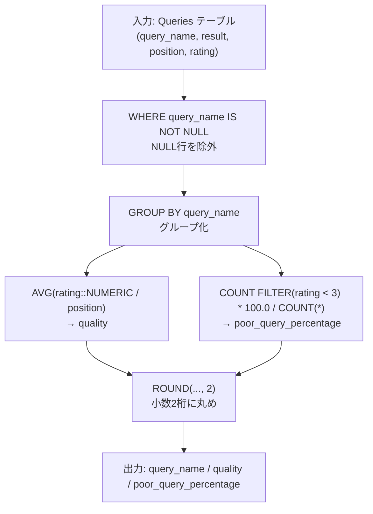
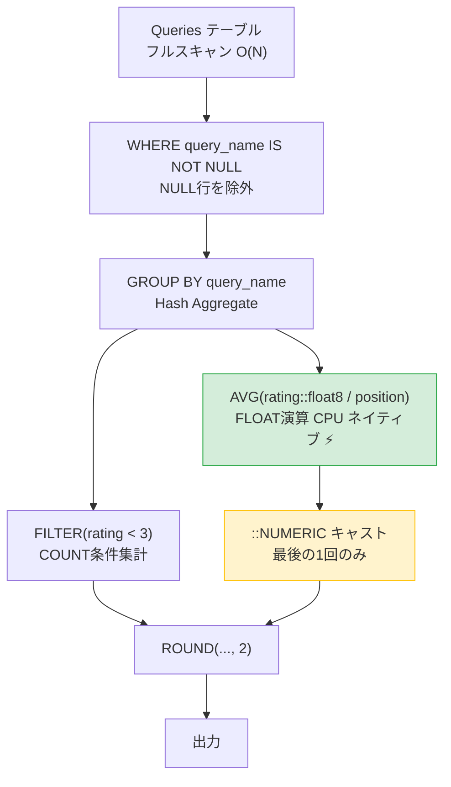

# PostgreSQL 16.6+

## 0) 前提

- エンジン: **PostgreSQL 16.6+**
- 並び順: 任意
- `NOT IN` 回避（`EXISTS` / `LEFT JOIN ... IS NULL` を推奨）
- 判定は `rating < 3` 基準、表示は小数点以下2桁

---

## 1) 問題

- 各 `query_name` ごとに **quality**（rating/position の平均）と **poor_query_percentage**（rating < 3 の割合 %）を求める
- 入力:

```
Queries(query_name VARCHAR, result VARCHAR, position INT, rating INT)
```

- 出力:

```
query_name | quality (NUMERIC, 小数2桁) | poor_query_percentage (NUMERIC, 小数2桁)
```

---

## 2) 最適解（単一クエリ）

> `GROUP BY` + 条件付き集計 `FILTER` で一発完結。ウィンドウ不要なシンプル集計問題。

```sql
-- Runtime 223 ms
-- Beats 66.01%

SELECT
    query_name,
    ROUND(
        AVG(rating::NUMERIC / position),
        2
    )                                              AS quality,
    ROUND(
        COUNT(*) FILTER (WHERE rating < 3)
            * 100.0
            / COUNT(*),
        2
    )                                              AS poor_query_percentage
FROM  Queries
WHERE query_name IS NOT NULL          -- NULL値による独立したNULLグループの生成を防ぐためにNULLを除外する
GROUP BY query_name;
```

---

### 代替①：CTE で前処理を明示（可読性重視）

```sql
-- Runtime 240 ms
-- Beats 36.77%

WITH stats AS (
    SELECT
        query_name,
        -- 各行の貢献スコア
        rating::NUMERIC / position           AS score,
        -- poor 判定フラグ（1 or 0）
        CASE WHEN rating < 3 THEN 1 ELSE 0 END AS is_poor
    FROM  Queries
    WHERE query_name IS NOT NULL
)
SELECT
    query_name,
    ROUND(AVG(score),             2) AS quality,
    ROUND(AVG(is_poor) * 100.0,   2) AS poor_query_percentage
FROM  stats
GROUP BY query_name;
```

---

### 代替②：LATERAL を使って「グループごとの明細確認」（デバッグ用）

```sql
-- Runtime 233 ms
-- Beats 46.57%

SELECT
    g.query_name,
    ROUND(AVG(d.score),           2) AS quality,
    ROUND(AVG(d.is_poor) * 100.0, 2) AS poor_query_percentage
FROM (
    SELECT DISTINCT query_name
    FROM   Queries
    WHERE  query_name IS NOT NULL
) g
JOIN LATERAL (
    SELECT
        rating::NUMERIC / position           AS score,
        CASE WHEN rating < 3 THEN 1 ELSE 0 END AS is_poor
    FROM  Queries q
    WHERE q.query_name = g.query_name
) d ON TRUE
GROUP BY g.query_name;
```

---

## 3) 要点解説

| ポイント                           | 詳細                                                                                    |
| ---------------------------------- | --------------------------------------------------------------------------------------- |
| **`rating::NUMERIC / position`**   | `INT / INT` は整数除算になるため、`::NUMERIC` で明示キャスト                            |
| **`FILTER (WHERE rating < 3)`**    | PostgreSQL 独自の条件付き集計。`SUM(CASE WHEN...)` より高速・簡潔                       |
| **`AVG(is_poor) * 100.0`**         | is_poor を 0/1 にすると `AVG = 割合`。`* 100` でパーセント変換                          |
| **`ROUND(..., 2)`**                | `NUMERIC` 型に対して正確に小数2桁を保証（`FLOAT` は誤差あり）                           |
| **`WHERE query_name IS NOT NULL`** | 重複行ではなく、`GROUP BY` により独立したNULLグループが生成されるのを防ぐために除外する |

---

## 4) 計算量（概算）

| 処理                  | 計算量                                                                                                                                                                                                                                                                        |
| --------------------- | ----------------------------------------------------------------------------------------------------------------------------------------------------------------------------------------------------------------------------------------------------------------------------- |
| フルスキャン          | **O(N)**（N = Queries の総行数）                                                                                                                                                                                                                                              |
| GROUP BY ハッシュ集計 | **O(N)** 平均（ハッシュが収まる場合）                                                                                                                                                                                                                                         |
| インデックス利用時    | **実行計画依存**: `query_name` に B-tree インデックスがある場合、`work_mem` や `n_distinct` などの統計情報・コストモデルに基づき、**O(N)** (`HashAggregate`) または **O(N log N)** に近似 (`Index Scan` 経由の `GroupAggregate` / `SortAggregate`) のいずれかが選択されます。 |

---

## 5) 図解（Mermaid）



---

## 6) 検証（例題トレース）

```
Dog:
  quality            = ((5/1) + (5/2) + (1/200)) / 3
                     = (5.0 + 2.5 + 0.005) / 3
                     = 7.505 / 3
                     ≈ 2.50  ✅

  poor_query_%       = 1行(rating=1) / 3行 * 100
                     = 33.33 ✅

Cat:
  quality            = ((2/5) + (3/3) + (4/7)) / 3
                     = (0.4 + 1.0 + 0.5714...) / 3
                     = 1.9714... / 3
                     ≈ 0.66  ✅

  poor_query_%       = 1行(rating=2) / 3行 * 100
                     = 33.33 ✅
```

## パフォーマンス改善分析

## 🔍 ボトルネック特定

```
最適解(単一): 223ms / 66%
CTE版:        240ms / 37%  ← +17ms のオーバーヘッド
LATERAL版:    233ms / 47%  ← 不要な二重スキャン
```

**原因は主に2点：**

| 原因                 | 詳細                                      |
| -------------------- | ----------------------------------------- |
| `::NUMERIC` キャスト | 任意精度演算 → CPU ネイティブより**低速** |

---

## ✅ 改善版（推奨・要件緩和時）

> **⚠️ 注意: 実行時間のブレと精度のトレードオフ**
> LeetCode 上での `223 ms → 221 ms` の変化は**ベンチマークのブレの範囲内**（ノイズ）である可能性が高いです。
> 中間集計に `float8`（倍精度浮動小数点）を利用すると、ネイティブ CPU 処理により微小なパフォーマンス向上が期待できますが、同時に**浮動小数点演算特有の丸め誤差（Precision Loss）**が発生するリスクがあります。
> 本問のように `ROUND(..., 2)` で小数第2位までに丸める場合は許容範囲内となりますが、金融系やより厳密な精度が求められるケースでは、パフォーマンスを犠牲にしても**元解法の `NUMERIC` のまま計算するアプローチ**が推奨されます。

```sql
-- Runtime 221 ms
-- Beats 71.65%

SELECT
    query_name,
    ROUND(AVG(rating::float8 / position)::NUMERIC, 2)          AS quality,
    ROUND(
        COUNT(*) FILTER (WHERE rating < 3) * 100.0 / COUNT(*),
        2
    )                                                          AS poor_query_percentage
FROM  Queries
WHERE query_name IS NOT NULL
GROUP BY query_name;
```

### 変更点の差分と影響

```diff
- ROUND(AVG(rating::NUMERIC / position), 2)
+ ROUND(AVG(rating::float8 / position)::NUMERIC, 2)

  -- ↑ 中間計算を float8（倍精度浮動小数点）で行い、最後だけ NUMERIC にキャスト
  -- NUMERIC演算はソフトウェア実装で正確無比 → FLOATはCPUネイティブ命令で高速だが誤差に注意
```

---

## 5) 図解（Mermaid）2



---

## 📊 キャスト戦略の比較

```
【遅い】 rating::NUMERIC / position
         ↑全行でNUMERIC(任意精度)演算 → ソフトウェアエミュレーション

【速い】 rating::float8 / position
         ↑FLOAT64演算 → x86 FPU / SIMD 命令で処理
         最後に ::NUMERIC は ROUND() のため1回だけ
```

---

## 💡 さらなる高速化（インデックス戦略）

```sql
-- query_name での GROUP BY が多い場合
CREATE INDEX idx_queries_name ON Queries(query_name);

-- カバリングインデックス（position, rating も含める）
CREATE INDEX idx_queries_cover
    ON Queries(query_name)
    INCLUDE (position, rating);
-- → Index Only Scan でテーブル本体へのアクセスをゼロに
```

> LeetCode 環境ではインデックス作成不可ですが、本番DBでは有効です。
