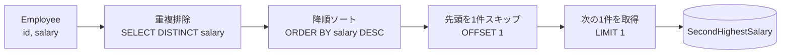
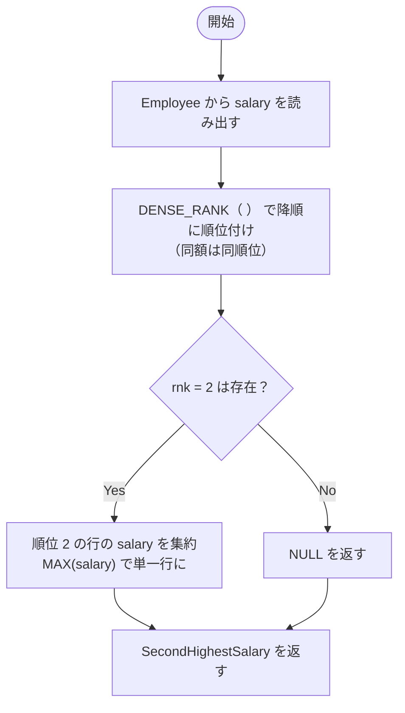

# 解法 1（最短・移植性高い）: `DISTINCT + ORDER BY + LIMIT ... OFFSET`

```sql
-- 2番目に高い（重複を除いた）給与。無ければ NULL
SELECT (
  SELECT DISTINCT salary
  FROM Employee
  ORDER BY salary DESC
  LIMIT 1 OFFSET 1
) AS SecondHighestSalary;
```

## ポイント 1

- `DISTINCT` で給与の重複を除去
- `ORDER BY salary DESC` で高い順に並べる
- `LIMIT 1 OFFSET 1` で「1 件スキップして次の 1 件」＝ 2 番目を取得
- サブクエリが 0 件なら結果は自動的に `NULL`

---

## 図解 1：SQL パイプライン（何をしているかの流れ）



## 手順の解説

1. **重複排除**: 同じ給与が複数あっても 1 つにまとめる
2. **降順ソート**: 高 → 低の順に並べ替え
3. **1 件スキップ**: 一番高い給与を飛ばす
4. **次の 1 件を取得**: これが 2 番目に高い給与
5. **0 件の場合**: 候補が無ければ `NULL` になる

---

## 解法 2（MySQL 8.0+）: ウィンドウ関数 `DENSE_RANK()`

```sql
-- MySQL 8.0 以降
SELECT MAX(salary) AS SecondHighestSalary
FROM (
  SELECT salary,
         DENSE_RANK() OVER (ORDER BY salary DESC) AS rnk
  FROM Employee
) t
WHERE rnk = 2;
```

### ポイント 2

- `DENSE_RANK()` は「重複を 1 つの順位」にまとめる
    - 例）300, 200, 200, 100 → 順位は 1 位=300, 2 位=200, 3 位=100

- `rnk = 2` の行だけを対象にし、その `salary` の最大＝ 2 位の給与
- 2 位が存在しなければ集合が空になり、`MAX(...)` は `NULL` を返す

---

## 図解 2：DENSE_RANK の考え方



---

## 動作確認（問題の例）

### 例 1

```text
id | salary
---+-------
 1 |   100
 2 |   200
 3 |   300
```

- 解法 1/2 ともに結果：`200`

### 例 2

```text
id | salary
---+-------
 1 |   100
```

- 解法 1/2 ともに結果：`NULL`

---

## どちらを使うべき？

- **最短で書きたい／MySQL 5.x 互換も意識**：解法 1（`DISTINCT + ORDER BY + LIMIT ... OFFSET`）
- **MySQL 8.0+ を前提に、順位付けの意図を明確に**：解法 2（`DENSE_RANK()`）

> 実務では **解法 1 が最も簡潔** で、クエリプランもシンプルになりやすいです。ウィンドウ関数の読みやすさ・拡張性が必要な場合は解法 2 を選ぶと良いです。
