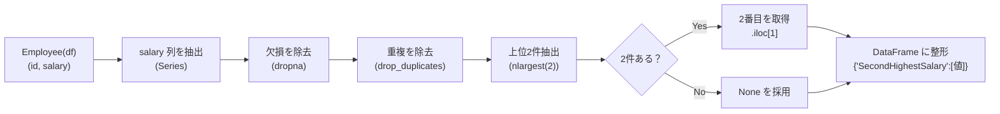
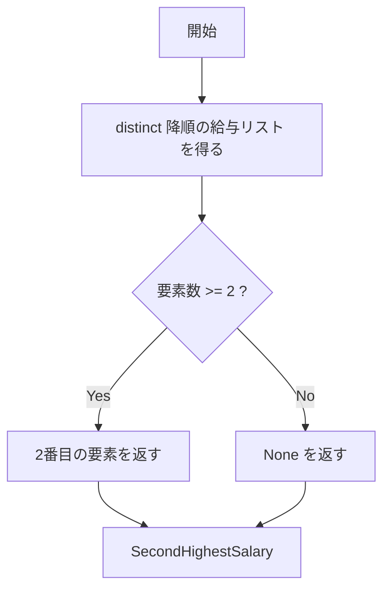

# 解法 A（最短・実務向け）: `drop_duplicates` × `nlargest(2)` から 2 番目を拾う

```python
import pandas as pd

def second_highest_salary(df: pd.DataFrame) -> pd.DataFrame:
    """
    Employee(id:int, salary:int) 相当のDataFrameから
    2番目に高い（重複なし）給与を1行のDataFrameで返す。
    見つからなければ None を返す。
    返り値: DataFrame(列名: 'SecondHighestSalary', 行数: 1)
    """
    # 1) 給与列を取り出し → 2) 欠損除去 → 3) 重複除去 → 4) 上位2件だけ取得
    top2 = (
        df["salary"]
        .dropna()
        .drop_duplicates()
        .nlargest(2)
    )

    # 5) 2件あれば2番目を、なければ None
    val = top2.iloc[1] if len(top2) >= 2 else None

    # 6) 仕様どおりのフォーマットで返す
    return pd.DataFrame({"SecondHighestSalary": [val]})
```

## ここがポイント

- `drop_duplicates()` で**同額の重複を 1 つに**。
- `nlargest(2)` で**上位 2 件だけ**を見る（全ソートより速いことが多い）。
- 2 件なければ `None` を返す（問題仕様どおり）。

---

## 図解 A：処理パイプライン



---

## 解法 B（読みやすさ重視）: 明示ソートで 2 番目を `iloc` 取得

```python
import pandas as pd

def second_highest_salary_v2(df: pd.DataFrame) -> pd.DataFrame:
    s = (
        df["salary"]
        .dropna()
        .drop_duplicates()
        .sort_values(ascending=False)
    )
    val = s.iloc[1] if len(s) >= 2 else None
    return pd.DataFrame({"SecondHighestSalary": [val]})
```

- 考え方は A と同じ。**「明示的に降順ソート」**してから 2 番目を取るだけ。

---

## 図解 B：分岐の考え方（存在チェック）



---

## おまけ：`rank` による「ウィンドウ関数」風アプローチ（Pandas 流）

> SQL の `DENSE_RANK()` に相当する発想で実装します。

```python
import pandas as pd
import numpy as np

def second_highest_salary_rank(df: pd.DataFrame) -> pd.DataFrame:
    if df.empty or "salary" not in df.columns:
        return pd.DataFrame({"SecondHighestSalary": [None]})

    s = df["salary"].dropna()

    if s.empty:
        return pd.DataFrame({"SecondHighestSalary": [None]})

    # 同額は同順位になる「dense」な降順ランクを付与
    r = s.rank(method="dense", ascending=False)

    # ランク2の給与だけを抽出（同額が複数でも同値）
    cand = s[r == 2]

    # 見つからなければ None、あれば その値（同額なので max/min いずれでも同じ）
    val = cand.max() if not cand.empty else None
    return pd.DataFrame({"SecondHighestSalary": [val]})
```

- **利点**：第 k 位などに拡張しやすい（`r == k`に変えるだけ）。

---

## 動作確認（問題の例）

```python
import pandas as pd

# 例1
df1 = pd.DataFrame({"id":[1,2,3], "salary":[100,200,300]})
print(second_highest_salary(df1))
# 期待:
#    SecondHighestSalary
# 0                 200

# 例2
df2 = pd.DataFrame({"id":[1], "salary":[100]})
print(second_highest_salary(df2))
# 期待:
#    SecondHighestSalary
# 0                None
```

---

## 計算量の目安

- 解法 A: `drop_duplicates` が O(n)、`nlargest(2)` は部分選択で概ね **O(n)**（実装依存、全ソートより有利なことが多い）
- 解法 B: `sort_values` が **O(u log u)**（u = 重複を除いた給与の種類数）
- 実務では **解法 A** をまず選び、単純・高速・直感的に扱えます。

---

必要なら、上の関数を**ユニットテスト**用に分割したり、「第 k 位」をパラメータ化した汎用関数（`kth_highest_distinct(df, k)`）にもできます。
