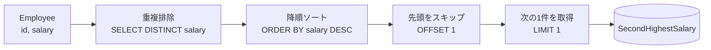
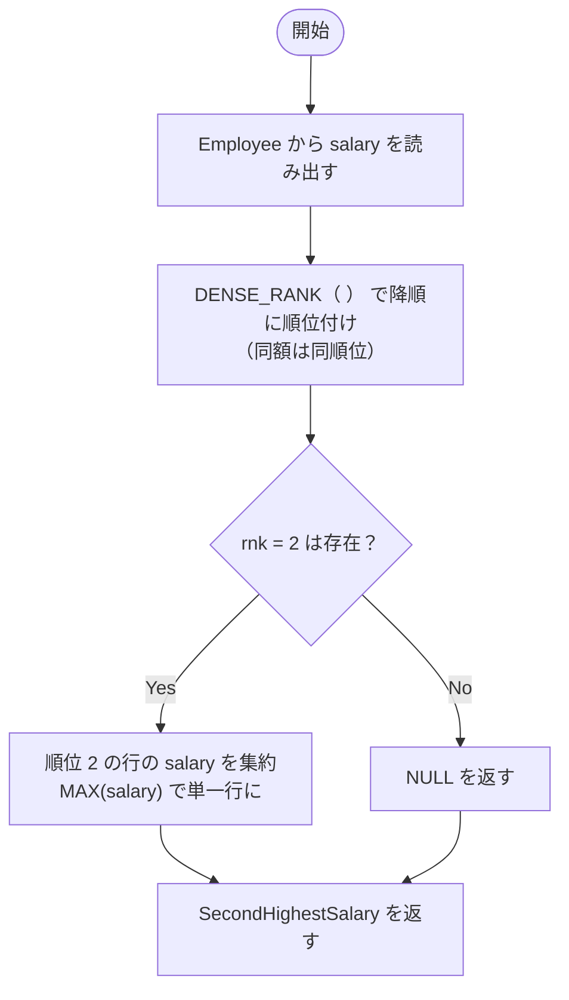

# 解法 1（最短・シンプル）: `DISTINCT + ORDER BY + OFFSET/LIMIT`

```sql
-- PostgreSQL
SELECT (
  SELECT DISTINCT salary
  FROM Employee
  ORDER BY salary DESC
  OFFSET 1   -- 先頭（最高給与）を1件スキップ
  LIMIT 1    -- 次の1件（=第2位）を取得
) AS "SecondHighestSalary";
```

## ここがポイント 1

- `DISTINCT` で給与の重複を除去（例：200 が複数行あっても 1 つに）
- `ORDER BY salary DESC` で高い順に整列
- `OFFSET 1` で第 1 位を飛ばす → `LIMIT 1` で第 2 位を取得
- サブクエリが 0 件（= distinct が 1 件以下）なら **自動的に `NULL`**

### 図解 1：処理パイプライン（何をしているか一目で）



### ステップ別の挙動

1. **重複排除**: 同じ `salary` は 1 つにまとめる
2. **降順並べ替え**: 高い順に並ぶ（例：300, 200, 100 …）
3. **OFFSET**: 先頭（＝最高）を飛ばす
4. **LIMIT**: 次の 1 件のみ取得 → これが第 2 位
5. **候補無し**: 1 件しか無い（または 0 件）ときは `NULL` になる

---

## 解法 2（PostgreSQL 9.4+）: ウィンドウ関数 `DENSE_RANK()`

```sql
SELECT MAX(salary) AS "SecondHighestSalary"
FROM (
  SELECT salary,
         DENSE_RANK() OVER (ORDER BY salary DESC) AS rnk
  FROM Employee
) AS t
WHERE rnk = 2;
```

## ここがポイント 2

- `DENSE_RANK()` は同額を**同じ順位**にする（例：300, 200, 200, 100 → 1 位=300, 2 位=200, 3 位=100）
- `rnk = 2` の行のみ対象。複数行あっても `salary` は同額なので `MAX` でも 1 値にまとまる
- 2 位が存在しなければ集合が空 → `MAX` が `NULL` を返す

### 図解 2：`DENSE_RANK` の考え方



---

## （おまけ）別解：上位 2 件だけ切り出して下側を取る

PostgreSQL 12+ なら `FETCH FIRST` も可です（読みやすさ重視派に）。

```sql
SELECT MIN(salary) AS "SecondHighestSalary"
FROM (
  SELECT DISTINCT salary
  FROM Employee
  ORDER BY salary DESC
  FETCH FIRST 2 ROWS ONLY    -- 上位2件のdistinct給与だけ取る
) AS top2;                    -- その中の小さい方 = 第2位
```

> ※ 上位 2 つを切り出し、**小さい方（=2 位）** を `MIN` で返す発想。
> 2 件未満なら `MIN` は `NULL`。

---

## 動作確認（問題の例）

### 例 1

```text
id | salary
---+-------
 1 |   100
 2 |   200
 3 |   300
```

- 期待結果：`200`
- 解法 1/2/おまけ、いずれも `200` を返します。

### 例 2

```text
id | salary
---+-------
 1 |   100
```

- 期待結果：`NULL`
- 解法 1/2/おまけ、いずれも `NULL` を返します。

---

## どれを選ぶべき？

- **最短・読みやすい・高速に十分** → 解法 1（`DISTINCT + ORDER BY + OFFSET/LIMIT`）
- **順位ロジックを明示し、拡張（第 k 位など）に強い** → 解法 2（`DENSE_RANK()`）
- **「上位 N 件だけ見て決める」表現がしっくり来る** → おまけ解

> 実務ではまず **解法 1** を推します。ウィンドウ関数で第 k 位やタイも扱う要件になったら **解法 2** に切り替える、という使い分けが分かりやすいです。
