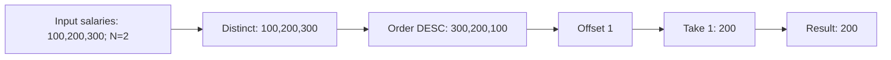

# ✅ 解法（MySQL 8+, LeetCode 互換関数）

最少・最速の王道は「重複を除いた給与を降順にし、`OFFSET N-1` を 1 件だけ取得」。該当が無い場合、**スカラサブクエリは `NULL` を返す**ので、そのまま要件を満たします。

```sql
-- LeetCodeのデータベース上でそのまま通る想定
CREATE FUNCTION getNthHighestSalary(N INT) RETURNS INT
BEGIN
  RETURN (
    SELECT DISTINCT salary
    FROM Employee
    ORDER BY salary DESC
    LIMIT 1 OFFSET N - 1
  );
END;
```

## ローカル(MySQL CLI)で関数を作る場合の書式

```sql
DELIMITER $$

CREATE FUNCTION getNthHighestSalary(N INT) RETURNS INT
DETERMINISTIC
READS SQL DATA
BEGIN
  RETURN (
    SELECT DISTINCT salary
    FROM Employee
    ORDER BY salary DESC
    LIMIT 1 OFFSET N - 1
  );
END$$

DELIMITER ;
```

### 単発クエリ版（関数を作らず結果だけ見たい時）

```sql
-- 例: N=2 のとき
SELECT (
  SELECT DISTINCT salary
  FROM Employee
  ORDER BY salary DESC
  LIMIT 1 OFFSET 2 - 1
) AS `getNthHighestSalary(2)`;
```

---

## 🧠 アルゴリズムの考え方

1. `DISTINCT salary` で**重複を排除**
2. `ORDER BY salary DESC` で**高い順に並べ替え**
3. `OFFSET N-1` までスキップし、`LIMIT 1` を**1 件だけ取り出す**
4. 件数不足なら**空集合**→ スカラサブクエリは **`NULL`** を返す

**計算量**:

- D = distinct な給与の個数
- 並べ替えが支配的 → **O(D log D)**

---

## 🧩 図解 1：全体フロー


---

## 🔎 図解 2：Example 1 の流れ（N=2）

入力:

```text
id | salary
1  | 100
2  | 200
3  | 300
```



---

## 🟦 図解 3：Example 2 の流れ（N=2, データ不足）

入力:

```text
id | salary
1  | 100
```


---

## 🧭 代替解（参考）：ウィンドウ関数 `DENSE_RANK`

MySQL 8+ なら `DENSE_RANK()` でも書けます（**重複を自然にまとめる**）。
ただし関数の `RETURN` に載せるには**スカラ化**が必要なので、`LIMIT 1` などで 1 行に絞ります。

```sql
-- DISTINCT→DENSE_RANK で N 位の給与を抽出
CREATE FUNCTION getNthHighestSalary_v2(N INT) RETURNS INT
BEGIN
  RETURN (
    SELECT salary
    FROM (
      SELECT salary, DENSE_RANK() OVER (ORDER BY salary DESC) AS rk
      FROM (SELECT DISTINCT salary FROM Employee) AS d
    ) AS r
    WHERE rk = N
    ORDER BY salary
    LIMIT 1
  );
END;
```

> どちらも要件を満たしますが、**簡潔で早いのは LIMIT/OFFSET 版**です。

---

## ✅ 動作確認クエリ

```sql
-- サンプルデータ
TRUNCATE TABLE Employee;
INSERT INTO Employee(id, salary) VALUES (1,100),(2,200),(3,300);

-- 期待: 200
SELECT getNthHighestSalary(2) AS `getNthHighestSalary(2)`;

-- データ不足パターン
TRUNCATE TABLE Employee;
INSERT INTO Employee(id, salary) VALUES (1,100);

-- 期待: NULL
SELECT getNthHighestSalary(2) AS `getNthHighestSalary(2)`;
```

---

## 🛠️ Mermaid 図のパースエラー回避のコツ

- ノード内テキストは**1 行・短文**に（`<br/>` は使わない）
- 日本語や絵文字で崩れる場合は**英数字**に
- 記号は最小限（カンマやコロンは OK）

---

エラー原因と対処、それから「LeetCode の SQL 実行環境のバージョン確認」についてまとめます。

---

## 1) そのエラーのよくある原因

**メッセージ**: `... near '- 1 ); END'`
主に次のどちらかが原因です。

1. **`DELIMITER` を変えずに `CREATE FUNCTION ...` を実行**
   ローカルの MySQL では、関数本体内の `;` で文が分割されてしまいます。
   → `DELIMITER $$` を使ってから関数を作成してください（下記コード参照）。

2. **`LIMIT ... OFFSET N - 1` の「式」が許容されないケース**
   環境によっては `OFFSET` に**式**（`N - 1`）を直接書くと構文エラーになることがあります。
   → 先に `SET N = N - 1;` で**変数に代入**してから `OFFSET N` を使うと安定します。
   （LeetCode の解答投稿でもこの書き方がよく使われます。([leetcode.com][1])）

### ✅ ローカル MySQL で確実に通る版

```sql
DELIMITER $$

CREATE FUNCTION getNthHighestSalary(N INT) RETURNS INT
DETERMINISTIC
READS SQL DATA
BEGIN
  SET N = N - 1; -- ここで式を変数に畳み込む
  RETURN (
    SELECT DISTINCT salary
    FROM Employee
    ORDER BY salary DESC
    LIMIT 1 OFFSET N
  );
END$$

DELIMITER ;
```

> 代替：二引数の `LIMIT` でも OK（`LIMIT offset, row_count`）
>
> ```sql
> ...
>   SET N = N - 1;
>   RETURN (
>     SELECT DISTINCT salary
>     FROM Employee
>     ORDER BY salary DESC
>     LIMIT N, 1
>   );
> ...
> ```

---

## 2) LeetCode 側の「SQL バージョン」を確認するには？

結論から言うと、**LeetCode は公式に RDB の「厳密なバージョン番号」を公開していません**。問題ページの「MySQL / MS SQL Server / Oracle」など**方言は選べますが**、細かなバージョンは明示されません。
一方で、LeetCode の Discuss（公式トピック）や問題解説では **MySQL のウィンドウ関数（`DENSE_RANK()` など）を前提にした解法が案内**されており、
**少なくとも MySQL 8+ 相当の機能が使える**ことが読み取れます。([leetcode.com][2])

### 現実的な確認手段

- **機能ベースで推測**する
  例）`DENSE_RANK()` が動く → **MySQL 8+ 機能**は使える、と判断。([leetcode.com][2])
- **Discuss の公式ポストや解説をチェック**
  LeetCode が配信している Database Primer などで使っている機能を確認。([leetcode.com][2])
- **サンドボックスに依存しない書き方に寄せる**
  例えば今回の問題は、**`DISTINCT + ORDER BY DESC + LIMIT`** でウィンドウ関数を使わずに解けるため、**環境差の影響を最小化**できます（本回答の関数）。([leetcode.com][1])

> 備考：LeetCode の採点環境では任意クエリで `SELECT VERSION();` のような“自己診断”を走らせることは基本的にできません（採点は固定スキーマ／固定 IO で比較されるため）。

---

## 3) LeetCode 提出用（簡潔版）

LeetCode のエディタにそのまま貼るなら、次の **「先に `N` を更新 → `OFFSET N`」** 版が堅いです。

```sql
CREATE FUNCTION getNthHighestSalary(N INT) RETURNS INT
BEGIN
  SET N = N - 1;
  RETURN (
    SELECT DISTINCT salary
    FROM Employee
    ORDER BY salary DESC
    LIMIT 1 OFFSET N
  );
END;
```

---

## 4) それでもダメなときのチェックリスト

- ローカル実行なら **`DELIMITER` 切り替え**を入れているか？
- `Employee` テーブル名・列名の **大小文字**やタイプミスがないか？
- 既に同名関数があれば **`DROP FUNCTION getNthHighestSalary;`** 実行後に再作成
- それでも通らなければ、`SET N = N - 1;` を **`DECLARE off INT DEFAULT N-1;`** → `OFFSET off` に変えてみる（同趣旨）

---

[1]: https://leetcode.com/problems/nth-highest-salary/discuss/498281/mysql-offset-by-n-1?utm_source=chatgpt.com 'Nth Highest Salary - LeetCode'
[2]: https://leetcode.com/discuss/post/1600719/database-sql-primer-part-2-window-functi-sm8m/?utm_source=chatgpt.com 'Database SQL Primer (Part 2) [ Window Functions ] - Discuss'

原因はシンプルで、**`DELIMITER` は MySQL サーバーの構文じゃなく “クライアント側専用ディレクティブ”** だからです。
あなたの環境（LeetCode や一部 GUI ツール）は `DELIMITER` を解釈せず、そのままサーバーに送ってしまうため、
サーバーが **`DELIMITER $$` を SQL として解釈 → 構文エラー** になります。

以下から自分の環境に合う対処を選んでください。

---

## 1) LeetCode（最有力）なら：`DELIMITER` 行は**全部削除**

LeetCode では **`DELIMITER` を書かない** で OK です。次をそのまま貼ってください。

```sql
CREATE FUNCTION getNthHighestSalary(N INT) RETURNS INT
BEGIN
  -- OFFSET での式(N-1)が環境により嫌がられる場合があるので、先に畳み込みます
  SET N = N - 1;
  RETURN (
    SELECT DISTINCT salary
    FROM Employee
    ORDER BY salary DESC
    -- どちらでもOK（好きな方で）
    -- LIMIT 1 OFFSET N
    LIMIT N, 1
  );
END;
```

動作確認（LeetCode では提出後に内部で呼ばれますが、ローカルならこう呼べます）:

```sql
SELECT getNthHighestSalary(2);
```

---

## 2) MySQL CLI / MySQL Workbench なら：`DELIMITER` を**別行で**使う

`mysql` CLI や Workbench は `DELIMITER` を理解します。**必ず “別行” で実行**してください（1 行目の頭から `DELIMITER` を置く）。

```sql
DELIMITER $$

CREATE FUNCTION getNthHighestSalary(N INT) RETURNS INT
DETERMINISTIC
READS SQL DATA
BEGIN
  SET N = N - 1;
  RETURN (
    SELECT DISTINCT salary
    FROM Employee
    ORDER BY salary DESC
    LIMIT N, 1
  );
END$$

DELIMITER ;
```

> ポイント
>
> - 「スクリプト全体を一気に実行」すれば OK（Workbench なら稲妻ボタン）。
> - `DELIMITER` と `CREATE FUNCTION ... END$$`、`DELIMITER ;` は**各行独立**で送ること。

---

## 3) DataGrip / DBeaver / phpMyAdmin など GUI で `DELIMITER` を解釈しない場合

- **方法 A（推奨）**: そのツールの「バッチ/スクリプト実行モード」を使う（Workbench と同様に扱えるモードがあることが多い）。
- **方法 B**: エディタ設定で「区切り文字（Delimiter）」を `$$` に変更できる UI があれば、そこで設定してから実行。
- **方法 C**: 面倒なら **LeetCode 方式（`DELIMITER` 無し）**の関数を貼って実行（多くの GUI は 1 クエリとしてまとめて送るため、そのまま通ります）。

---

## まだエラーが出る場合のチェックリスト

- 既に同名関数がある → `DROP FUNCTION getNthHighestSalary;` してから再作成
- テーブル名・列名のタイプミス無し？（`Employee` / `salary`）
- クライアントがステートメントを**1 行ずつ**投げていない？（`CREATE FUNCTION` は**1 リクエストで全文**送る必要があります）
- 以前の環境では `OFFSET N-1` が NG だった → **二引数 `LIMIT N, 1`** を使う（上記スニペットは対応済み）
