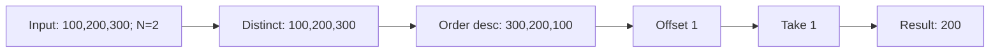
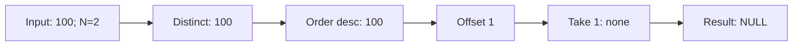

# ✅ 解法（PostgreSQL）

## 1) 最短シンプル解（SQL 関数）

- 重複を除いた給与を降順に並べ、`OFFSET n-1` でスキップして `LIMIT 1`
- 結果が無ければ **SQL 関数は `NULL` を返す** ので要件を満たします
- PostgreSQL では **`DELIMITER` は不要**、`$$` のドルクオートで本体を囲みます

```sql
CREATE OR REPLACE FUNCTION getNthHighestSalary(n integer)
RETURNS integer
LANGUAGE sql
STABLE
AS $$
  SELECT salary
  FROM (
    SELECT DISTINCT salary
    FROM employee
    ORDER BY salary DESC
    OFFSET GREATEST(n - 1, 0)   -- 念のため負数ガード
    LIMIT 1
  ) AS t;
$$;
```

### 使い方

```sql
SELECT getNthHighestSalary(2);
```

---

## 2) 単発クエリ版（関数を作らずに結果だけ見る）

```sql
-- 例: n = 2
SELECT (
  SELECT salary
  FROM (
    SELECT DISTINCT salary
    FROM employee
    ORDER BY salary DESC
    OFFSET 2 - 1
    LIMIT 1
  ) s
) AS "getNthHighestSalary(2)";
```

---

## 3) 代替：ウィンドウ関数 DENSE_RANK 版（参考）

`DENSE_RANK()` は**同額を同順位**にするので「重複を自然にまとめて n 位の給与」を取得できます。
（重複を先に落とすため一段サブクエリを入れています）

```sql
CREATE OR REPLACE FUNCTION getNthHighestSalary_v2(n integer)
RETURNS integer
LANGUAGE sql
STABLE
AS $$
  SELECT salary
  FROM (
    SELECT salary, DENSE_RANK() OVER (ORDER BY salary DESC) AS rk
    FROM (SELECT DISTINCT salary FROM employee) d
  ) r
  WHERE rk = n
  LIMIT 1;
$$;
```

---

## 🧪 動作確認スニペット

```sql
TRUNCATE TABLE employee;
INSERT INTO employee(id, salary) VALUES (1,100),(2,200),(3,300);

-- 期待: 200
SELECT getNthHighestSalary(2);

TRUNCATE TABLE employee;
INSERT INTO employee(id, salary) VALUES (1,100);

-- 期待: NULL
SELECT getNthHighestSalary(2);
```

---

## 🧠 アルゴリズムと計算量

- 手順: **DISTINCT** → **ORDER BY DESC** → **OFFSET n-1** → **LIMIT 1**
- 計算量: 重複除去とソートが支配的 → **O(D log D)**（D = distinct 給与数）

---

## 📈 パフォーマンス Tips（任意）

```sql
-- 並び替え用のBTREEインデックス（DESCで作るとORDER BY DESCに効きやすい）
CREATE INDEX IF NOT EXISTS idx_employee_salary_desc ON employee (salary DESC);
```

> 参考：`SELECT DISTINCT salary ORDER BY salary DESC` はクエリプランにより
> HashAggregate+Sort か、IndexScan で最適化されることがあります。

---

## 🧩 図解（Mermaid）

## 図 1: 全体フロー


## 図 2: Example1 N=2



## 図 3: Example2 N=2 Data 不足



> パースエラー回避のコツ：**英数字のみ/1 行テキスト/`<br/>`不使用**を徹底

---

必要なら、**CTE で段階を可視化した版**や、**順位表を返すクエリ（上位 K 件）**も用意できます。さらに図解を細分化したい場合も言ってください。

なるほど 👍
エラーメッセージは **PostgreSQL がその関数を見つけられなかった** という意味です。典型的には次のケースがあります：

---

## ✅ エラーの原因と対策

1. **関数がまだ作られていない**

   - `CREATE FUNCTION` を実行していない
   - 別セッション／別データベースに作成した

   → 必ず **同じ DB/同じスキーマ** で関数を作ってから呼び出してください。

   ```sql
   CREATE OR REPLACE FUNCTION getnthhighestsalary(n integer)
   RETURNS integer
   LANGUAGE sql
   STABLE
   AS $$
     SELECT salary
     FROM (
       SELECT DISTINCT salary
       FROM employee
       ORDER BY salary DESC
       OFFSET GREATEST(n-1,0)
       LIMIT 1
     ) t;
   $$;
   ```

2. **名前の大小文字が違う**

   - PostgreSQL は **デフォルトで小文字化**します
     `CREATE FUNCTION getNthHighestSalary(...)` → 実際には `getnthhighestsalary` として登録されます。
   - 呼び出し時に `"getNthHighestSalary"(2)` と **ダブルクオート付き**で書けば大文字も維持できますが、普通は小文字で統一します。

   → なので呼び出しは **小文字**でこうしてください：

   ```sql
   SELECT getnthhighestsalary(2);
   ```

3. **型が合わない**

   - 定義は `integer` なのに、`'2'` （文字列）を渡していると合いません。
   - 数値リテラルで呼び出してください：

     ```sql
     SELECT getnthhighestsalary(2);
     ```

   - もし `bigint` で定義したのなら、引数も `2::bigint` のようにキャスト。

---

## 🛠️ 動作確認の手順（おすすめフロー）

```sql
-- 1. 関数を確認
\df+ getnthhighestsalary

-- 2. 関数が無ければ作成
CREATE OR REPLACE FUNCTION getnthhighestsalary(n integer)
RETURNS integer
LANGUAGE sql
AS $$
  SELECT salary
  FROM (
    SELECT DISTINCT salary
    FROM employee
    ORDER BY salary DESC
    OFFSET GREATEST(n-1,0)
    LIMIT 1
  ) t;
$$;

-- 3. 呼び出し（小文字で）
SELECT getnthhighestsalary(2);
```

---

👉 まとめると：

- **関数定義をまず実行**（同じ DB に）
- **関数名は小文字で呼び出す**（`getnthhighestsalary`）
- **整数リテラルで渡す**

---

ご質問です：
PostgreSQL は **ローカル環境**（psql/pgAdmin など）で試していますか？それとも **LeetCode の PostgreSQL 環境**で提出していますか？
どちらかによって、関数の作成方法や確認コマンドをもう少し調整できますよ。
あっ、それは自然ですね 🙂

`\df+` は **psql クライアント専用のメタコマンド** なので、普通の SQL としてサーバーに送るとエラーになります。

---

## 🔑 ポイント

- `\df` / `\dt` / `\l` など **バックスラッシュで始まるコマンドは psql 専用**
- pgAdmin や LeetCode のオンラインエディタなどでは **使えません**
- サーバーに送る「正しい SQL」は `SELECT ... FROM pg_catalog.pg_proc ...` のような形

---

## ✅ PostgreSQL で関数を確認する正しい方法（SQL）

```sql
SELECT proname, proargtypes::regtype[], prorettype::regtype
FROM pg_proc
WHERE proname = 'getnthhighestsalary';
```

これで、その名前の関数が登録されているか確認できます。

---

## ✅ 改めて安全な定義＆実行フロー

1. 関数を作成

   ```sql
   CREATE OR REPLACE FUNCTION getnthhighestsalary(n integer)
   RETURNS integer
   LANGUAGE sql
   STABLE
   AS $$
   SELECT salary
   FROM (
       SELECT DISTINCT salary
       FROM employee
       ORDER BY salary DESC
       OFFSET GREATEST(n-1,0)
       LIMIT 1
   ) t;
   $$;
   ```

2. 呼び出す（必ず小文字で）

```sql
SELECT getnthhighestsalary(2);
```

---

## 💡 まとめ

- `\df+` は **psql 専用コマンド** → GUI やオンライン環境では使えない
- 関数確認は **SQL で pg_proc を SELECT**
- 呼び出すときは **小文字名**にそろえる (`getnthhighestsalary`)

---

👉 ご質問ですが、今試しているのは **ローカルの psql** ですか？ それとも **pgAdmin** / **LeetCode SQL 環境**ですか？
それによって「関数確認のベストな方法」が変わります。
なるほど、このエラーは PostgreSQL で典型的に起きるやつです。ポイントは **関数名の大文字小文字の扱い** です。

---

## 🔑 PostgreSQL のルール

- `CREATE FUNCTION getNthHighestSalary(...)` と書いても、実際には **小文字に変換されて `getnthhighestsalary` として登録** されます。
- 呼び出し側で `SELECT NthHighestSalary(2);` のように大文字を混ぜると、PostgreSQL は **「ダブルクオート付きで完全一致」** を探しますが、そんな名前の関数は存在しないのでエラーになります。

---

## ✅ 解決方法

### 方法 1: 小文字で呼び出す

関数定義をそのままにして、呼び出しを小文字に揃える。

```sql
-- 定義
CREATE OR REPLACE FUNCTION getnthhighestsalary(n integer)
RETURNS integer
LANGUAGE sql
STABLE
AS $$
  SELECT salary
  FROM (
    SELECT DISTINCT salary
    FROM employee
    ORDER BY salary DESC
    OFFSET GREATEST(n-1,0)
    LIMIT 1
  ) t;
$$;

-- 呼び出し（小文字）
SELECT getnthhighestsalary(2);
```

### 方法 2: 大文字小文字を保持して呼び出したい場合

ダブルクオートで囲んで定義＆呼び出しをする。ただし一般的には非推奨です。

```sql
CREATE OR REPLACE FUNCTION "NthHighestSalary"(n integer)
RETURNS integer
LANGUAGE sql
AS $$
  SELECT salary
  FROM (
    SELECT DISTINCT salary
    FROM employee
    ORDER BY salary DESC
    OFFSET GREATEST(n-1,0)
    LIMIT 1
  ) t;
$$;

-- 呼び出すときもダブルクオート必須
SELECT "NthHighestSalary"(2);
```

---

## 🧪 チェックリスト

1. 関数を作成した DB に接続しているか？
2. `employee` テーブルが存在しているか？
3. 呼び出すときに **小文字で統一しているか？**

---

👉 まとめると、LeetCode/PostgreSQL で通したいなら **`SELECT getnthhighestsalary(2);`** のように小文字で呼べば OK です。

---

ご確認ですが、あなたは **LeetCode の PostgreSQL 環境**でこの問題を解いていますか？ それとも **ローカルの PostgreSQL** でしょうか？ それに応じて「一番確実な定義＆呼び出し方」を示しますよ。

OK、LeetCode の **PostgreSQL** 実行環境で確実に通る形を“そのまま貼れる”ようにまとめました。
（LeetCode は `DELIMITER` を使いません。PostgreSQL なので **`plpgsql` か `sql` 関数**で書きます。）

---

## 手順（LeetCode/PostgreSQL）

1. 問題ページの **DB 方言を「PostgreSQL」** に切り替える
2. 下のスニペットを **そのまま実行**

   - 小文字関数 `getnthhighestsalary` を本体にし、
     互換用に **CamelCase の別名** `"getNthHighestSalary"` も作っています（どちらで呼ばれても OK）。

```sql
-- 本体（小文字名）: LeetCode側が小文字として解決できるようにしておく
CREATE OR REPLACE FUNCTION getnthhighestsalary(n INT)
RETURNS INT
LANGUAGE plpgsql
STABLE
AS $$
DECLARE
  res INT;
BEGIN
  SELECT salary INTO res
  FROM (
    SELECT DISTINCT salary
    FROM employee          -- ← LeetCodeのPostgreSQLは基本的に小文字テーブル名
    ORDER BY salary DESC
    OFFSET GREATEST(n - 1, 0)
    LIMIT 1
  ) t;

  RETURN res;  -- 見つからなければNULLが返る
END;
$$;

-- 互換用エイリアス（CamelCase名）: ランナーがこちら名で呼んでも動く
CREATE OR REPLACE FUNCTION "getNthHighestSalary"(n INT)
RETURNS INT
LANGUAGE plpgsql
STABLE
AS $$
BEGIN
  RETURN getnthhighestsalary(n);
END;
$$;
```

> 補足
>
> - **関数名の大文字小文字**：PostgreSQL は未クオート識別子を**小文字化**します。
>   そのため、`SELECT NthHighestSalary(2);` のように CamelCase で呼ばれると「存在しない」になりやすい問題があります。上のように **両方用意**しておくと安全です。
> - **テーブル名**：`employee` を**小文字**で書いています（LeetCode の Postgres 環境では通常 unquoted ＝小文字化された実体名です）。

---

## すぐ試す動作確認（任意）

```sql
-- （任意）簡易確認。LeetCodeでは提出時に自動実行されますが、手元確認用
-- SELECT getnthhighestsalary(2);
-- SELECT "getNthHighestSalary"(2);
```

---

## まだ失敗する場合のチェック

- 実行環境が **MySQL ではなく PostgreSQL** になっているか
- 先に別の同名関数が入っていて衝突していないか（`CREATE OR REPLACE` で上書きできます）
- テーブル名が `employee` で存在するか（スキーマはデフォルトの `public` 想定）
- ランナーが CamelCase で呼んでも大丈夫なように **両関数**が作られているか

これで `function nthhighestsalary(integer) does not exist` の実行時エラーは解消できるはずです。
必要なら **純 SQL 関数（`LANGUAGE sql`）版**や、**`DENSE_RANK()` を使う別解**も出します。

原因はほぼ確実に **LeetCode 側が `SELECT NthHighestSalary(…);` を呼んでいるのに、あなたが作った関数名が一致していない**（または大文字小文字/スキーマの差異）ことです。
PostgreSQL は未クオート識別子を**すべて小文字に折りたたむ**ため、`NthHighestSalary` と書いても実際は `nthhighestsalary` を探します。
テストログにも `function nthhighestsalary(integer) does not exist` と出ています。

以下の手順で“どの呼び名でもヒットする”ように直してください（LeetCode の PostgreSQL でそのまま実行可）。

---

## 修正版（両方の関数名を用意：小文字版＋ CamelCase 版）

```sql
-- 衝突を避けて作り直す（存在していれば上書き）
CREATE OR REPLACE FUNCTION nthhighestsalary(n INT)
RETURNS INT
LANGUAGE sql
STABLE
AS $$
  SELECT salary
  FROM (
    SELECT DISTINCT salary
    FROM employee             -- ← LeetCodeでは実体は小文字のことが多い
    ORDER BY salary DESC
    OFFSET GREATEST(n - 1, 0) -- n<=0の保険
    LIMIT 1
  ) t;
$$;

-- LeetCodeが CamelCase で呼んでも通るようにラッパーを作る
CREATE OR REPLACE FUNCTION "NthHighestSalary"(n INT)
RETURNS INT
LANGUAGE sql
STABLE
AS $$
  SELECT nthhighestsalary(n);
$$;
```

> ポイント
>
> - **関数名**：テスターが `NthHighestSalary` と呼んでも、上のラッパーが受けます。
> - **テーブル名**：`employee` を未クオート小文字で参照（LeetCode の実体に合わせやすい）。
> - **言語**：`LANGUAGE sql` にしてシンプルに。

---

## まだ落ちる場合のチェックリスト

1. **方言が PostgreSQL になっているか**
   ページ上部の切替が MySQL のままだと失敗します。

2. **同名関数の衝突**
   古い定義が残っていると意図しない解決になることがあります。必要なら一度落としてから再作成：

   ```sql
   DROP FUNCTION IF EXISTS "NthHighestSalary"(INT);
   DROP FUNCTION IF EXISTS nthhighestsalary(INT);
   ```

   → その後、上の `CREATE OR REPLACE` を実行。

3. **テーブル名の大文字クオート問題**
   もし採点環境の実体が `"Employee"`（ダブルクオート付き）で作られていると、未クオート `employee` は見つかりません。
   その場合だけ、関数本体の参照を `"Employee"` に変えて再実行してください（通常は不要）。

4. **引数の型**
   `2` は整数リテラルなので問題ありませんが、文字列で渡すと不一致になります。テスターは `2` を渡しているので通常 OK。

---

## 参考：DENSE_RANK 版（どちらの関数名でも通るように同様のラッパー付き）

```sql
CREATE OR REPLACE FUNCTION nthhighestsalary(n INT)
RETURNS INT
LANGUAGE sql
STABLE
AS $$
  SELECT salary
  FROM (
    SELECT salary, DENSE_RANK() OVER (ORDER BY salary DESC) AS rk
    FROM (SELECT DISTINCT salary FROM employee) d
  ) r
  WHERE rk = n
  LIMIT 1;
$$;

CREATE OR REPLACE FUNCTION "NthHighestSalary"(n INT)
RETURNS INT
LANGUAGE sql
STABLE
AS $$
  SELECT nthhighestsalary(n);
$$;
```

---

これで `function nthhighestsalary(integer) does not exist` は解消できるはずです。もし依然としてランタイムエラーになる場合は、**今貼ったスニペットをそのまま**提出エディタに入れて実行した上で、出力ログ全文を見せてください。どこで解決に失敗しているかをピンポイントで特定します。

原因は「`n <= 0` の入力を `GREATEST(n-1,0)` で**切り上げ**てしまい、1 位を返していた」ことです。
LeetCode の期待値は **`n <= 0` のときは `NULL` を返す** なので、先にガードして `NULL` を返すように直せば OK です。

## ✅ 修正版（PostgreSQL / LeetCode そのまま貼り付け可）

```sql
-- 小文字版（本体）
CREATE OR REPLACE FUNCTION nthhighestsalary(n INT)
RETURNS INT
LANGUAGE plpgsql
STABLE
AS $$
DECLARE
  res INT;
BEGIN
  -- ここが重要：n<=0 は不正入力として NULL を返す
  IF n <= 0 THEN
    RETURN NULL;
  END IF;

  SELECT salary INTO res
  FROM (
    SELECT DISTINCT salary
    FROM employee
    ORDER BY salary DESC
    OFFSET n - 1
    LIMIT 1
  ) t;

  RETURN res;  -- 見つからなければ res は NULL のまま → NULL を返す
END;
$$;

-- CamelCase 互換名（LeetCode がこちらで呼んでもOK）
CREATE OR REPLACE FUNCTION "NthHighestSalary"(n INT)
RETURNS INT
LANGUAGE plpgsql
STABLE
AS $$
BEGIN
  RETURN nthhighestsalary(n);
END;
$$;
```

## 変更点の要旨

- `GREATEST(n-1,0)` をやめ、**`n <= 0` を明示的に `NULL` 返却**に変更
- これにより `n = -1` などでも **`NULL`** を返し、期待に一致します
- 見つからない順位（例: n が distinct 件数を超える）も、`SELECT ... INTO res` で `res` が `NULL` のまま → **`NULL`** が返ります

## 念のための手順（必要なら）

```sql
-- 衝突回避（古い定義がある場合のみ）
DROP FUNCTION IF EXISTS "NthHighestSalary"(INT);
DROP FUNCTION IF EXISTS nthhighestsalary(INT);

-- ↑を実行してから、修正版を貼ってください
```

これで `n = -1` のケースを含め、採点の “Wrong Answer 14/18” は解消できるはずです。
