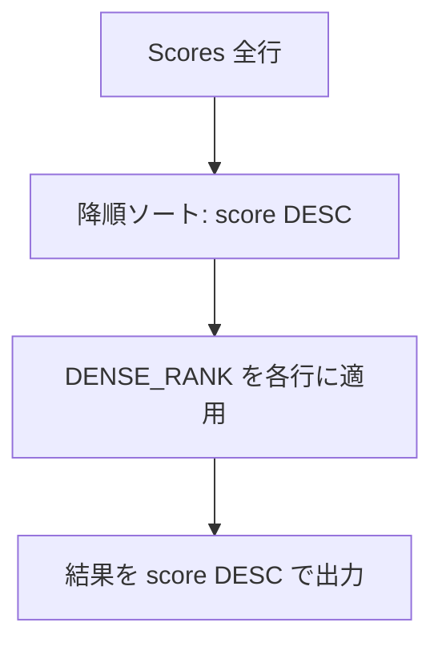
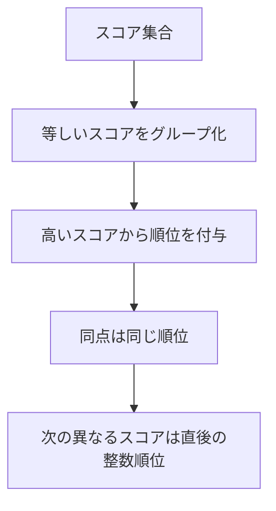

# 解説

## ✅ 解法 1（推奨 / MySQL 8.0+）

```sql
SELECT
  score,
  DENSE_RANK() OVER (ORDER BY score DESC) AS `rank`
FROM Scores
ORDER BY score DESC;
```

### ポイント 1

- `DENSE_RANK()` は「同点は同順位」「次の順位は連番（穴なし）」を自動で満たします。
- 問題要件の並び順は `ORDER BY score DESC` だけで OK（ID 順は不要）。

---

## ✅ 解法 2（互換 / MySQL 5.7 など）

ウィンドウ関数が使えない環境では、**相関サブクエリ**で「自分より高い**異なる**スコアの個数 + 1」を順位にします。

```sql
SELECT
  s1.score,
  1 + (
    SELECT COUNT(DISTINCT s2.score)
    FROM Scores AS s2
    WHERE s2.score > s1.score
  ) AS `rank`
FROM Scores AS s1
ORDER BY s1.score DESC;
```

### ポイント 2

- `COUNT(DISTINCT s2.score)` により**同点は同じ順位**になる（穴なし＝ DENSE の性質）。
- シンプルで確実ですが、データ量が多いと相関サブクエリで重くなることがあります。

---

## （参考）CTE で「重複除去 → 順位 → 突き合わせ」の段階を明示（MySQL 8.0+）

概念的な段階（Distinct → Rank → Join）をクエリ上でも表したい場合：

```sql
WITH ds AS (
  SELECT DISTINCT score FROM Scores
),
rr AS (
  SELECT
    score,
    DENSE_RANK() OVER (ORDER BY score DESC) AS `rank`
  FROM ds
)
SELECT s.score, rr.`rank`
FROM Scores AS s
JOIN rr USING (score)
ORDER BY s.score DESC;
```

---

## 図解：処理の流れ（ウィンドウ関数版）

> 余計な HTML タグや複雑な改行を排し、Mermaid が壊れにくい最小構成にしています。



---

## 図解：DENSE_RANK の考え方（概念）



---

## サンプルに対する出力イメージ

入力:

```text
id | score
---+-------
1  | 3.50
2  | 3.65
3  | 4.00
4  | 3.85
5  | 4.00
6  | 3.65
```

出力（どの解法でも同じ）:

```text
score | rank
------+------
4.00  | 1
4.00  | 1
3.85  | 2
3.65  | 3
3.65  | 3
3.50  | 4
```

---

## つまずきポイントと対策

- **表示の小数桁**：`score` が `DECIMAL(?,2)` であれば「4.00」のように 2 桁が保たれます。
  もし `FLOAT/DOUBLE` なら `ROUND(score, 2)` で揃えると安全です（問題文は DECIMAL 前提）
- **順位の穴**：`RANK()` は「穴あり」になるので、本問題は**必ず `DENSE_RANK()`** を使うか、相関サブクエリで「高い異なるスコア数 + 1」を計算してください。
- **パフォーマンス**：巨大テーブルではウィンドウ関数が高速なことが多いです。5.7 の相関サブクエリ版はインデックス（`score`）である程度は緩和できます。

---
