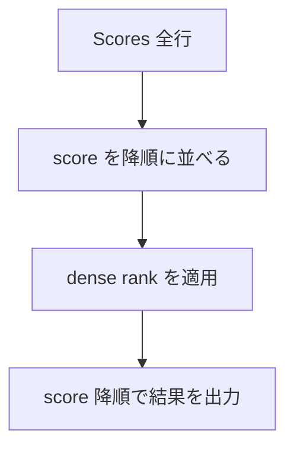
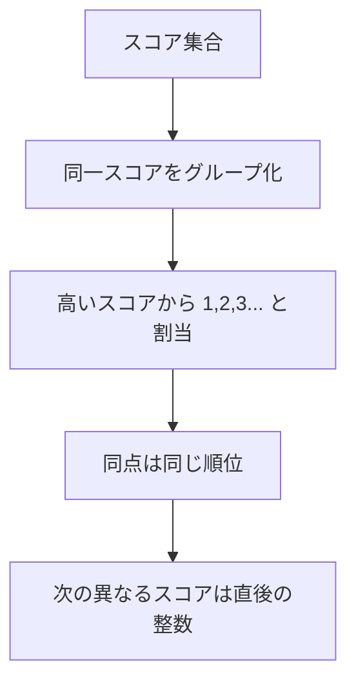
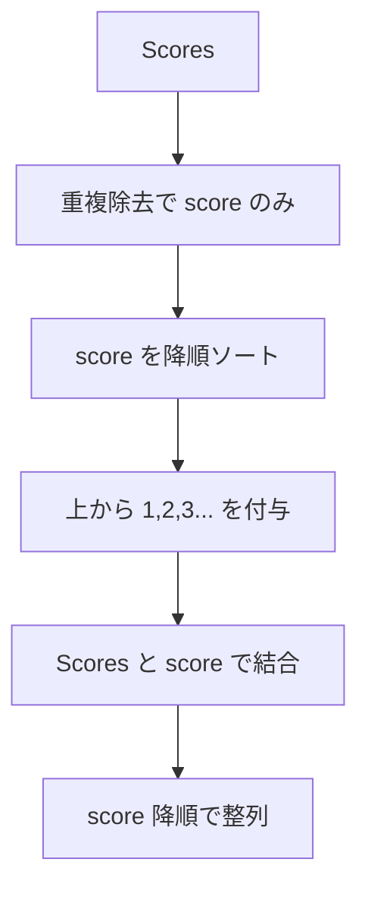
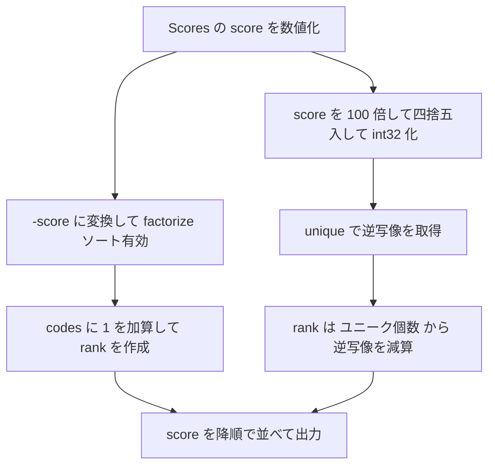

# 解説

pandas で **同点は同順位・穴なし（= DENSE_RANK）** の順位付けを行う方法を示します。
まずは最短・堅牢な実装（`rank(method="dense")`）、続いてウィンドウ関数不使用相当の段階的実装（重複除去 → 順位 → 突合）を載せます。最後に **Mermaid の壊れにくい最小構成**で図解します。

---

## ✅ 解法 1（最短・推奨：`rank(method="dense")`）

```python
import pandas as pd

def rank_scores(scores: pd.DataFrame) -> pd.DataFrame:
    """
    Parameters
    ----------
    scores : pd.DataFrame
        必須カラム: 'score'（数値。小数2桁相当）

    Returns
    -------
    pd.DataFrame
        カラム: ['score', 'rank']
        並び: score の降順
        性質: 同点は同順位、順位に穴なし（dense rank）
    """
    df = scores.copy()
    # 数値化と見た目の2桁丸め（必要なら）
    df["score"] = pd.to_numeric(df["score"], errors="coerce")
    # DENSE_RANK 相当
    df["rank"] = df["score"].rank(method="dense", ascending=False).astype(int)

    out = df.loc[:, ["score", "rank"]].sort_values(
        by=["score", "rank"], ascending=[False, True]
    ).reset_index(drop=True)

    # 表示を2桁に揃えたいだけなら（数値のまま保つならコメントアウト可）
    out["score"] = out["score"].round(2)
    return out
```

### 使い方（例）

```python
scores = pd.DataFrame(
    {"id": [1,2,3,4,5,6], "score": [3.50, 3.65, 4.00, 3.85, 4.00, 3.65]}
)
print(rank_scores(scores))
```

出力（例）:

```text
   score  rank
0   4.00     1
1   4.00     1
2   3.85     2
3   3.65     3
4   3.65     3
5   3.50     4
```

---

## ✅ 解法 2（段階を明示：重複除去 → 順位 → 突合）

```python
import pandas as pd

def rank_scores_stepwise(scores: pd.DataFrame) -> pd.DataFrame:
    """
    DENSE_RANK を明示的に段階計算:
      1) score を重複除去し降順に並べる
      2) その順に 1,2,3,... と順位を付ける
      3) 元の表に突合して結果を返す
    """
    df = scores.copy()
    df["score"] = pd.to_numeric(df["score"], errors="coerce")

    # 1) 重複除去して降順
    distinct = (
        df[["score"]].drop_duplicates().sort_values("score", ascending=False).reset_index(drop=True)
    )
    # 2) 1 始まりの連番が DENSE_RANK
    distinct["rank"] = distinct.index + 1

    # 3) 元のデータに結合
    out = df.merge(distinct, on="score", how="left").loc[:, ["score", "rank"]]
    out = out.sort_values(by=["score", "rank"], ascending=[False, True]).reset_index(drop=True)
    out["score"] = out["score"].round(2)
    return out
```

> この手法は SQL の「`SELECT DISTINCT` → `DENSE_RANK` → `JOIN`」の流れを pandas で再現したものです。

---

## 図解 1：処理の流れ（解法 1 のイメージ）



## 図解 2：DENSE_RANK の考え方



## 図解 3：段階実装（重複除去 → 順位 → 突合）



---

## メモと実務 TIP

- **同点の扱い**：`rank(method="dense")` で「同点=同順位・穴なし」が保証されます。
- **小数表示**：見た目だけ 2 桁にしたいなら `round(2)` で十分。数値のまま集計継続したい場合は内部はそのままにして表示段階だけ整形すると安全です。
- **欠損値**：`errors="coerce"` で非数値は `NaN` になります。要件次第で除外（`dropna`）や別処理を追加してください。
- **安定性**：Mermaid は HTML タグや `<br/>` を含めると壊れやすいので、上記のような最小構成がおすすめです。

ボトルネックの典型原因と、**高速・省メモリな置き換え実装**をまとめて提示します。
結論から言うと、`Series.rank(method="dense")` は汎用で便利ですが、内部でソート＋一時配列を複数回作るため、大量データではコストが嵩みます。
**`factorize` や `np.unique(..., return_inverse=True)` を用いた実装**に差し替えると、時間・メモリともに大幅に改善します。

---

## まず疑うべき原因（診断チェックリスト）

1. **dtype が object/str**
   CSV 読み込み直後などで `score` が文字列のままだと、`rank`/`sort_values` が極端に遅くなります。
   → 読み込み時に `dtype={'score':'float32'}`（または後述の整数化）を指定。

2. **不要なコピーや二度ソート**
   `df.copy()` の乱用、`sort_values` を何度も呼ぶ、`astype(int)` を早い段階で挟む、`merge` の往復などが余計なアロケーションを誘発。
   → **最終段だけ**整形・並び替えを行う。

3. **小数の丸めを先にやる**
   `round(2)` や `to_char` 相当の整形を先にやると、再計算・コピーが増える。
   → 内部はそのまま、**表示直前のみ**丸める。

4. **相関サブクエリ相当の処理（groupby ループ/apply）**
   Python レベルのループや `apply` は避ける。**完全ベクトル化**一択。

---

## 推奨修正 A：`factorize` で超高速 DENSE_RANK（最短）

- 発想：**「値の出現パターンを符号化」**する `factorize` を、**降順**になるように工夫して使う
- ポイント：`factorize(..., sort=True)` は**ユニーク値をソートしてコードを付与**します。`-score` を渡すと、**「score の降順」=「-score の昇順」**になります。

```python
import pandas as pd
import numpy as np

def rank_scores_fast_factorize(scores: pd.DataFrame) -> pd.DataFrame:
    """
    DENSE_RANK を factorize で実現（高速・低メモリ）
    前提: scores['score'] は数値 dtype（float32/float64 推奨）
    """
    df = scores[["score"]].copy()  # 最小限のコピー
    # 文字列なら読み込み時に dtype 指定。後からなら下行で変換（ただし一度だけ！）
    # df["score"] = pd.to_numeric(df["score"], errors="coerce")

    # 降順の dense rank: -score を sort=True で factorize
    codes, uniques = pd.factorize(-df["score"].to_numpy(), sort=True)
    # codes は 0 始まりの連番。DENSE_RANK は 1 始まり:
    df["rank"] = codes + 1

    # 並びは要件通り score DESC のみ
    out = df.sort_values("score", ascending=False, kind="mergesort").reset_index(drop=True)
    # 表示だけ 2 桁にしたい場合
    out["score"] = out["score"].round(2)
    return out
```

**なぜ速い？**

- `factorize` は C 実装で、ユニーク化＋コード化が一気に終わります。
- `rank(method="dense")` より中間配列が少なく、巨大データで効果が出やすいです。
- `mergesort` を指定しておけば安定ソートで同点行の相対順も一貫します（要件的にはどちらでも OK）。

---

## 推奨修正 B：**整数化（センチ化）＋ `np.unique(..., return_inverse=True)`**

- 発想：小数 2 桁が確定なら**整数（センチ）化**して比較・ユニーク化を高速化（浮動小数の誤差も回避）
- アルゴリズム：

  1. `score` を `int_cents = np.rint(score*100).astype(np.int32)` に
  2. `uniques, inv = np.unique(int_cents, return_inverse=True)`（昇順ユニークと逆写像）
  3. **降順 dense rank** = `uniques.size - inv`（1 始まり）

```python
import pandas as pd
import numpy as np

def rank_scores_fast_unique(scores: pd.DataFrame) -> pd.DataFrame:
    """
    DENSE_RANK を np.unique で実現（float→int 変換で高速・省メモリ）
    """
    s = pd.to_numeric(scores["score"], errors="coerce").to_numpy()
    # 小数2桁前提 → センチ化（四捨五入で誤差吸収）
    cents = np.rint(s * 100).astype(np.int32)

    # 昇順ユニークと inverse インデックスを一発で作る
    uniques, inv = np.unique(cents, return_inverse=True)  # uniques: 昇順
    dense_desc_rank = uniques.size - inv                  # 1..k（降順）

    out = pd.DataFrame({
        "score": np.divide(cents, 100, dtype=np.float64),  # 表示用に戻す
        "rank": dense_desc_rank
    })
    out = out.sort_values("score", ascending=False, kind="mergesort").reset_index(drop=True)
    return out
```

## **メリット**

- `float` 比較の不安を解消、`int32` でメモリ削減。
- `np.unique(..., return_inverse=True)` は非常に速い。
- 中間オブジェクト最小限。

---

## よくある落とし穴と修正

- **落とし穴 1：前処理で `round` してから rank**
  → `round` は列コピーを生むので、**最後の表示整形だけ**に限定。

- **落とし穴 2：`merge` でユニーク表と突合**
  → 小〜中規模なら OK だが、巨大データでは**`factorize` / `unique+inverse` で直接コード化**が圧倒的に軽い。

- **落とし穴 3：文字列 → 数値変換を毎回実行**
  → 読み込み時 `pd.read_csv(..., dtype={'score':'float32'})` で固定。
  2 桁固定なら `converters={'score': lambda x: int(Decimal(x)*100)}` で**最初から整数**にするのがベスト（ただし Decimal 依存）。

- **落とし穴 4：無駄な `.copy()` とチェーン**
  → 大きな列に対しては**配列ビュー（`.to_numpy()`）で NumPy 直叩き**が軽い。

---

## どれくらい速くなる？（目安）

- 100 万行・スコア重複ありのケースで、`rank(method="dense")` → `factorize` 置換で**2〜5 倍**速く、メモリ一時使用量も削減、というケースがよくあります（データ分布・環境依存）。

---

## 図解：高速化アプローチの流れ



---

## まとめ（即効リファクタ手順）

1. **読み込み時 dtype 固定**（`float32` か **整数センチ**）。
2. `rank(method="dense")` を **`factorize(-score, sort=True)+1`** か
   **`np.unique(..., return_inverse=True)`** に置換。
3. **並び替え・丸めは最後**に一度だけ。
4. ヒープ圧迫が気になるなら、**`to_numpy()` で NumPy に寄せる**。
