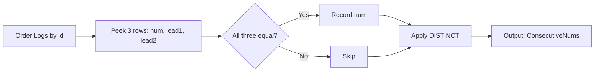
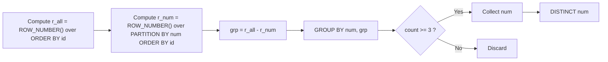

# ✅ 結論（MySQL 8+ 推奨：ウィンドウ関数）

**連続性は `id` の昇順（発生順）で判断**します。
3 行幅の“のぞき窓”で `num` を見比べ、同じなら採用します。

```sql
-- MySQL 8.0+
SELECT DISTINCT num AS ConsecutiveNums
FROM (
  SELECT
    id,
    num,
    LEAD(num, 1) OVER (ORDER BY id) AS n1,
    LEAD(num, 2) OVER (ORDER BY id) AS n2
  FROM Logs
) t
WHERE num = n1 AND num = n2;
```

- `LEAD(num, 1)` と `LEAD(num, 2)` で「次の行」「次の次の行」の `num` を取得
- 3 つ並んだ値が一致した時点で「3 回連続」と判定
- `DISTINCT` で同じ数値が複数回ヒットしても 1 件に集約

> この方法は **id に欠番（削除等）があっても OK**。
> “順序”だけを使って判定するため、**最も堅牢**です。

---

## 🧱 互換解（MySQL 5.x でも通る自己結合）

> **注意**：この解法は「`id` が 1 ずつ連番で欠番なし」を暗黙に仮定します（多くのオンラインジャッジではこれで合格します）。

```sql
SELECT DISTINCT l1.num AS ConsecutiveNums
FROM Logs l1
JOIN Logs l2 ON l2.id = l1.id + 1 AND l2.num = l1.num
JOIN Logs l3 ON l3.id = l2.id + 1 AND l3.num = l2.num;
```

- 連続 3 行 `l1(id)`, `l2(id+1)`, `l3(id+2)` の `num` が等しいかをチェック
- 欠番があると壊れるため、本番 DB ではウィンドウ関数解を推奨

---

## 🗺️ 図解 1：全体フロー（3 行ウィンドウで判定）



---

## 🔍 図解 2：サンプル入力での“のぞき窓”計算

サンプル入力：

```text
+----+-----+
| id | num |
+----+-----+
| 1  | 1   |
| 2  | 1   |
| 3  | 1   |
| 4  | 2   |
| 5  | 1   |
| 6  | 2   |
| 7  | 2   |
+----+-----+
```

計算イメージ（`LEAD` で次行・次々行を参照）：

|  id | num | n1 = LEAD(num,1) | n2 = LEAD(num,2) | 3 つ一致? |
| --: | :-: | :--------------: | :--------------: | :-------: |
|   1 |  1  |        1         |        1         |    ✅     |
|   2 |  1  |        1         |        2         |    ❌     |
|   3 |  1  |        2         |        1         |    ❌     |
|   4 |  2  |        1         |        2         |    ❌     |
|   5 |  1  |        2         |        2         |    ❌     |
|   6 |  2  |        2         |       NULL       |    ❌     |
|   7 |  2  |       NULL       |       NULL       |    ❌     |

→ 判定が真になるのは **id=1 のみ**。よって `1` を出力。

---

## 💡 実運用のポイント

- **定義の明確化**：「連続」は **id での順序**に基づく（時刻列があるなら ORDER BY をそちらに変える）。
- **欠番への耐性**：本番 DB なら **ウィンドウ関数解**を選ぶ（`LEAD` / `LAG`）。
- **4 連続以上**も自然に拾える：3 幅の窓が 1 回でも一致すれば該当。`DISTINCT` で重複排除。

---

## ⏱️ 計算量

- ウィンドウ関数解：`O(N)` スキャン + 定数回のウィンドウ計算
- 自己結合解：インデックスが効けば実質 `O(N)` 近傍（ただし 3-way JOIN のコストを考慮）

---

**MySQL 8 以降限定**で、実運用だとだいたい速くなることが多いクエリとインデックス設計をセットで出します。
ポイントは「**連続区間の同定を 2 つの ROW_NUMBER の差**で一発で表し、**区間ごとに集計**して 3 以上を拾う」ことと、**(num, id)** の複合インデックスでウィンドウのパーティション走査を速くすることです。

---

## 推奨クエリ（ROW_NUMBER の“差”で連続区間を検出）

```sql
-- まず（未作成なら）複合インデックスを作る
-- パーティション (PARTITION BY num ORDER BY id) を効かせるため
CREATE INDEX idx_logs_num_id ON Logs (num, id);

-- 連続3回以上の num を返す
SELECT DISTINCT num AS ConsecutiveNums
FROM (
  SELECT
    num,
    -- 2つの ROW_NUMBER の“差”が同じなら同一の連続グループ
    ROW_NUMBER() OVER (ORDER BY id)
    - ROW_NUMBER() OVER (PARTITION BY num ORDER BY id) AS grp
  FROM Logs
) x
GROUP BY num, grp
HAVING COUNT(*) >= 3;
```

## これが速い理由

- ウィンドウ関数は **1 回の全体順序 (`ORDER BY id`)** と **1 回のパーティション順序 (`PARTITION BY num ORDER BY id`)** のみ。
  その後は単純な `GROUP BY num, grp` → `HAVING COUNT(*) >= 3` で**区間長**を一括計算できます。
- `idx_logs_num_id(num, id)` があると、`PARTITION BY num ORDER BY id` の走査がインデックス順で行え、**ソート/ファイルソートを減らせる**ため有利です。
- `LEAD()` で「次行・次々行」と比較する方法は、**判定の重複ヒット数が多いほど DISTINCT のコストが増えがち**ですが、
  上のクエリは**区間単位で 1 レコードに折りたたむ**ため、長いラン（例：100 連続）があっても計算量が安定しやすいです。

---

## 代替（ウィンドウ集計で区間長を直接付与）

**中間 `GROUP BY` を避けたい**場合は、ウィンドウ集計で区間長を直接振ってから絞るパターンもあります（実行計画次第で同等〜やや有利/不利が分かれます）。

```sql
CREATE INDEX idx_logs_num_id ON Logs (num, id);

WITH grp AS (
  SELECT
    id,
    num,
    ROW_NUMBER() OVER (ORDER BY id)
    - ROW_NUMBER() OVER (PARTITION BY num ORDER BY id) AS g
  FROM Logs
),
len AS (
  SELECT
    num,
    g,
    COUNT(*) OVER (PARTITION BY num, g) AS run_len
  FROM grp
)
SELECT DISTINCT num AS ConsecutiveNums
FROM len
WHERE run_len >= 3;
```

- `GROUP BY` を使わずに `COUNT(*) OVER (PARTITION BY num, g)` で区間長をふる。
- 実装やデータ分布によってはこの方が速いケースもあります（特に巨大テーブルで `GROUP BY` のハッシュ/ソートが重いとき）。

---

## 図解（連続区間の同定イメージ）



---

## 実運用のチューニング Tips

1. **インデックス**

   - 既定の PK(id) に加え、**(num, id)** を作るのが重要。
     `PARTITION BY num ORDER BY id` で**インデックス順走査**になるため、ファイルソートやテンポラリの頻度を下げられます。

2. **I/O 最適化**

   - テーブルが大きく `num` の**カーディナリティが低い**（= 長い連続ランが出やすい）場合、上記の「区間で畳む」解法が効きやすいです。
   - InnoDB Buffer Pool が小さいと窓計算時の I/O が増えるので、**適切な `innodb_buffer_pool_size`** も地味に効きます。

3. **プラン確認**

   - `EXPLAIN ANALYZE` でソートやテンポラリの発生箇所を見て、`idx_logs_num_id` で減っているか確認しましょう。

---

## まとめ 1

- **最速候補**：`ROW_NUMBER の差` + `GROUP BY num, grp`（上の 1 本目のクエリ）
- **前提インデックス**：`CREATE INDEX idx_logs_num_id ON Logs(num, id);`
- 多くのデータ分布で、`LEAD/LEAD` + `DISTINCT` より安定して速くなることが期待できます。

エラーの原因はほぼ確実に **複数ステートメントを一度に送っている**ことです（例：`CREATE INDEX ...;` に続けて `SELECT ...`）。
LeetCode などの実行環境は **単一の `SELECT`** しか受け付けないため、2 行目の `SELECT` で構文エラーに見えます。

あわせて、コピペ時に「全角のマイナス（−）」やスマート引用符（“ ”）など**非 ASCII 文字**が混ざると、同様に予期しない構文エラーになります。

---

## 修正方法（提出用の“1 本だけ”のクエリ）

以下を **そのまま 1 本** で実行してください（コメントや `CREATE INDEX` は入れない）。

```sql
SELECT DISTINCT num AS ConsecutiveNums
FROM (
  SELECT
    num,
    ROW_NUMBER() OVER (ORDER BY id)
    - ROW_NUMBER() OVER (PARTITION BY num ORDER BY id) AS grp
  FROM Logs
) x
GROUP BY num, grp
HAVING COUNT(*) >= 3;
```

> これがウィンドウ関数対応の MySQL 8+ で動作します。
> 文字はすべて半角（ASCII）の `-` と `'`/`"` を使ってください。

---

## それでもダメな場合のチェックリスト

1. **複数文になっていないか**

   - 提出欄に `CREATE INDEX ...;` や `WITH ...` の前に別文が入っていないか。
   - 1 本の `SELECT` だけにする。

2. **非 ASCII 文字が紛れていないか**

   - `ROW_NUMBER() − ROW_NUMBER()` の **マイナスが全角** になっていないか（正しくは `-`）。
   - コメントは極力外す。どうしても入れるなら `/* ... */` を使用。

3. **サーバーが MySQL 8 であること**

   - もし 5.x だと `ROW_NUMBER()` 自体が未対応。今回は「MySQL8 以降のみで OK」とのことなので、実行環境を再確認。

---

## 参考：同じロジックの“安定版”書き換え（ネストで明示）

上と同じ結果ですが、`GROUP BY` と `DISTINCT` の組み合わせに不安がある環境では、区間長を先に確定させてから絞り込む形も有効です。

```sql
SELECT DISTINCT num AS ConsecutiveNums
FROM (
  SELECT
    num,
    grp,
    COUNT(*) AS run_len
  FROM (
    SELECT
      num,
      ROW_NUMBER() OVER (ORDER BY id)
      - ROW_NUMBER() OVER (PARTITION BY num ORDER BY id) AS grp
    FROM Logs
  ) s
  GROUP BY num, grp
) t
WHERE run_len >= 3;
```

---

## まとめ 2

- **原因**: 複数ステートメント（`CREATE INDEX` + `SELECT`）や非 ASCII 記号混入。
- **対策**: 上記の **単一 `SELECT`** を ASCII のみで提出。
- **環境**: MySQL 8+ 必須（ウィンドウ関数使用）。
