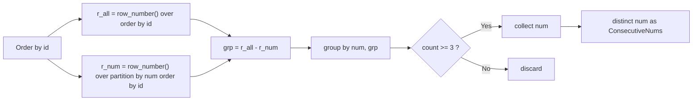
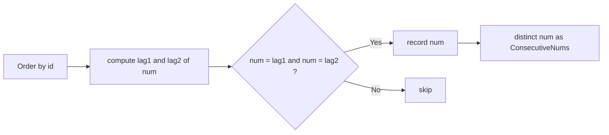
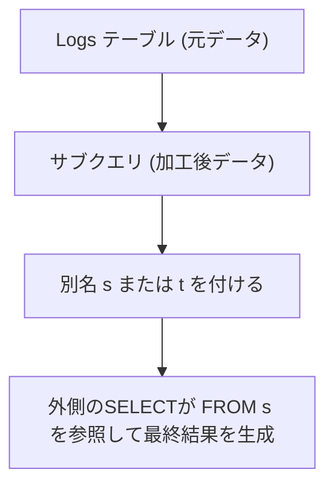
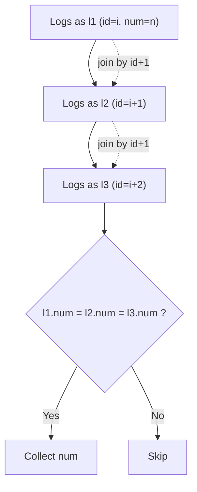
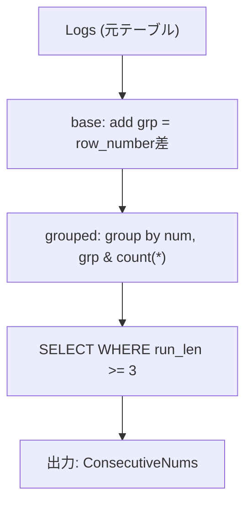
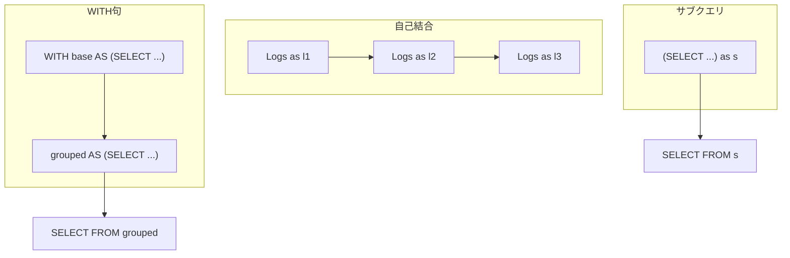

# 解法 A（推奨）：ROW_NUMBER の“差”で連続区間を検出（Gaps & Islands）

```sql
-- 3回以上連続した数値を1回ずつ返す
SELECT DISTINCT num AS "ConsecutiveNums"
FROM (
  SELECT
    num,
    ROW_NUMBER() OVER (ORDER BY id)
      - ROW_NUMBER() OVER (PARTITION BY num ORDER BY id) AS grp
  FROM Logs
) s
GROUP BY num, grp
HAVING COUNT(*) >= 3;
```

## ポイント 1

- `r_all = ROW_NUMBER() OVER (ORDER BY id)` と
  `r_num = ROW_NUMBER() OVER (PARTITION BY num ORDER BY id)` の**差**が同じ行は「同一の連続ラン」になります。
- その `grp` 単位で `COUNT(*)` が **3 以上**のものを採用。
- 長い連続（例: 同じ `num` が 100 連続）でも**1 グループに畳める**ため安定。

---

## 解法 B：LAG で 3 連続を直接判定（実装が直感的）

```sql
SELECT DISTINCT num AS "ConsecutiveNums"
FROM (
  SELECT
    id,
    num,
    LAG(num, 1) OVER (ORDER BY id) AS n1,
    LAG(num, 2) OVER (ORDER BY id) AS n2
  FROM Logs
) t
WHERE num = n1 AND num = n2;
```

## ポイント 2

- 現在行と 1 つ前・2 つ前が同じ `num` なら 3 連続。
- 直感的で短いが、長い連続が多数あるデータではヒット行が増えやすい（`DISTINCT` コストが相対的に増えることがある）。

---

## 図解 1：解法 A の流れ（ROW_NUMBER の差）



## 図解 2：解法 B の流れ（LAG で 3 連続）



---

## パフォーマンスの実務 Tips（PostgreSQL）

- ウィンドウ順序のために **`id` の PK**は必須（既にある想定）。
- データ量が大きく `num` の種類が多い場合、**解法 A**が安定しやすいです（長い連続を 1 グループに畳める）。
- 実環境では `EXPLAIN (ANALYZE, BUFFERS)` で**ソート/バッファ I/O**を確認し、より速い方を採用してください。
- 文字列の不整合が心配なら `num` を `TRIM(num)` に置き換えるのも手です（課題サイトでは不要なことが多い）。

とても良い質問です！
SQL における `FROM Logs s` や `FROM Logs t` のような **「テーブル別名（エイリアス）」** の意味と使い方を、PostgreSQL/MySQL 両方に共通する観点で詳しく説明します。

---

## 🔹1. 基本構文：「エイリアス（alias）」とは

`FROM Logs s` のように書くと、
**テーブル名 `Logs` に短い別名 `s` をつけている**ことになります。

```sql
FROM Logs AS s
```

上のように `AS` を明示しても・省略しても同じ意味です（どちらも OK）。

---

### ✅ 目的

SQL の文中でそのテーブルを短く参照できるようにするためです。

```sql
-- 別名なし（やや冗長）
SELECT Logs.num, Logs.id
FROM Logs
WHERE Logs.id > 10;

-- 別名あり（短くて読みやすい）
SELECT s.num, s.id
FROM Logs AS s
WHERE s.id > 10;
```

別名を使うと、**同じテーブルを何度も参照する場合（自己結合など）**に非常に便利です。

---

## 🔹2. 今回のケースでの `s` や `t` の役割

### 例 A（ROW_NUMBER の差を使う解法）

```sql
SELECT DISTINCT num AS "ConsecutiveNums"
FROM (
  SELECT
    num,
    ROW_NUMBER() OVER (ORDER BY id)
      - ROW_NUMBER() OVER (PARTITION BY num ORDER BY id) AS grp
  FROM Logs
) s
GROUP BY num, grp
HAVING COUNT(*) >= 3;
```

ここでの `s` は――
🔸 **サブクエリ（内側の SELECT ...）全体に付けた別名**です。

### イメージ

```text
┌────────────────────────────┐
│ (subquery result)          │ ← これに名前 s をつけて外側が参照
│ id | num | grp             │
└────────────────────────────┘
```

- `FROM Logs` … 元のテーブル
- `) s` … その結果セットを **仮想テーブル s として扱う**

これにより、外側のクエリで `FROM s` のように扱えます。

---

### 例 B（LAG を使う解法）

```sql
SELECT DISTINCT num AS "ConsecutiveNums"
FROM (
  SELECT
    id,
    num,
    LAG(num, 1) OVER (ORDER BY id) AS n1,
    LAG(num, 2) OVER (ORDER BY id) AS n2
  FROM Logs
) t
WHERE num = n1 AND num = n2;
```

ここでは **別名 `t`** がサブクエリの別名です。
役割は `s` と全く同じで、単に “temporary table name” のようなものです。

---

## 🔹3. 別名を付ける理由まとめ

| 理由               | 内容                                           | 例                     |
| ------------------ | ---------------------------------------------- | ---------------------- |
| ① 可読性向上       | 長いテーブル名を短くできる                     | `Logs` → `l`           |
| ② 自己結合に必須   | 同じテーブルを複数回 JOIN する場合、区別が必要 | `Logs l1 JOIN Logs l2` |
| ③ サブクエリに必須 | サブクエリ（括弧内 SELECT）には必ず別名が必要  | `FROM (SELECT ...) s`  |

> **PostgreSQL・MySQL ともに** > `FROM (SELECT ...) [alias]` の `[alias]` は **必須** です。
> これがないと「syntax error near ')'」のような構文エラーになります。

---

## 🔹4. 実行イメージ図



---

## 🔹5. まとめ

| 要素                | 説明                                                |
| ------------------- | --------------------------------------------------- |
| `Logs`              | 元のテーブル名                                      |
| `s` / `t`           | 一時的に付ける**別名（alias）**                     |
| 役割                | サブクエリや同一テーブル参照を簡潔に扱うため        |
| PostgreSQL のルール | `FROM (SELECT ...) alias` の `alias` は**省略不可** |

---

もし気になる場合、英語的に意味を持たせて書くのもおすすめです 👇

```sql
FROM (SELECT ... ) AS sub
FROM (SELECT ... ) AS temp
FROM (SELECT ... ) AS grouped
```

---

素晴らしいですね 👏
では、今回のテーマ「**SQL におけるエイリアス（別名）**」について、
実践的な 2 つの重要ケースを図解付きで解説します。

---

## 🧩 Part 1. 自己結合（Self Join）におけるエイリアスの使い方

---

## 🎯 背景

同じテーブルを複数回参照する場合、
テーブル名が 1 つだけではどの列を指しているのか分からなくなります。

→ そのため、**同一テーブルに別名（l1, l2, l3 など）を付けて区別**します。

---

## ✅ 例題（Logs テーブルで 3 連続判定）

```sql
SELECT DISTINCT l1.num AS "ConsecutiveNums"
FROM Logs l1
JOIN Logs l2 ON l2.id = l1.id + 1 AND l2.num = l1.num
JOIN Logs l3 ON l3.id = l2.id + 1 AND l3.num = l2.num;
```

---

### 📘 解説

| 別名 | 指しているもの | 意味                             |
| ---- | -------------- | -------------------------------- |
| `l1` | 現在行         | 1 行目など基準となる行           |
| `l2` | 次の行         | `id = l1.id + 1` で 1 行後を表す |
| `l3` | さらに次の行   | `id = l2.id + 1` で 2 行後を表す |

---

## 🧠 実行イメージ



---

### 🧩 結果

3 行連続 (`l1`, `l2`, `l3`) が同じ `num` の場合のみ抽出されます。
ここでのエイリアス (`l1`, `l2`, `l3`) は「同じテーブルの別視点」を表しています。

---

## 🧱 Part 2. WITH 句（CTE）におけるエイリアスの使い方

---

### 🎯 背景 2

複雑なサブクエリを分割して見通しを良くするために
`WITH ... AS (...)` で名前（エイリアス）を付けて定義します。

---

## ✅ 例（PostgreSQL 推奨の CTE 版）

```sql
WITH base AS (
  SELECT
    num,
    ROW_NUMBER() OVER (ORDER BY id)
    - ROW_NUMBER() OVER (PARTITION BY num ORDER BY id) AS grp
  FROM Logs
),
grouped AS (
  SELECT
    num,
    grp,
    COUNT(*) AS run_len
  FROM base
  GROUP BY num, grp
)
SELECT DISTINCT num AS "ConsecutiveNums"
FROM grouped
WHERE run_len >= 3;
```

---

### 📘 解説 2

| エイリアス  | 対象           | 意味                                                |
| ----------- | -------------- | --------------------------------------------------- |
| `base`      | 最初の計算結果 | 連続グループ番号 (`grp`) を付与した中間結果         |
| `grouped`   | 2 段目の CTE   | `num, grp` ごとにまとめて `COUNT(*)` を付与した結果 |
| 最終 SELECT | grouped から   | 長さが 3 以上の連続区間だけを抽出                   |

---

## 🧠 実行イメージ 2



---

## 💡 補足：CTE のメリット

| 利点              | 内容                                                                  |
| ----------------- | --------------------------------------------------------------------- |
| 可読性            | 複数段階の処理を上から順に説明的に書ける                              |
| 再利用性          | 同じ中間結果を複数回参照できる                                        |
| デバッグ性        | 各 CTE を単独で実行して動作確認できる                                 |
| PostgreSQL 最適化 | 一部の CTE は最適化されてインライン化される（`MATERIALIZED`ヒント可） |

---

## 🧭 まとめ

| 使い方         | エイリアス        | 主な用途                           | 注意点                                     |
| -------------- | ----------------- | ---------------------------------- | ------------------------------------------ |
| **自己結合**   | `l1`, `l2`, `l3`  | 同じテーブルを複数回 JOIN して比較 | 各エイリアスを明確に指定しないと構文エラー |
| **サブクエリ** | `s`, `t`          | 内部 SELECT 結果を外部で参照       | サブクエリの末尾の別名は必須               |
| **CTE**        | `base`, `grouped` | 分割定義・再利用                   | 名前のスコープはそのクエリ内のみ           |

---

## ✅ 最終イメージ：3 種類のエイリアス位置まとめ



---
