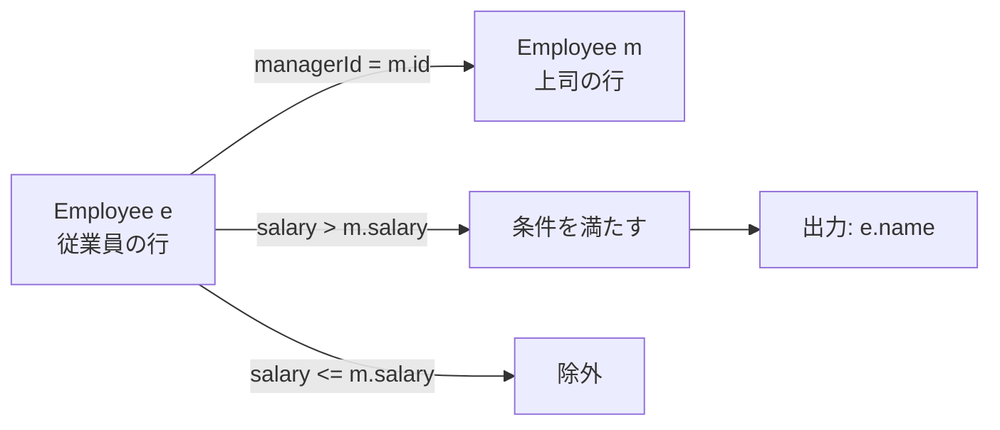
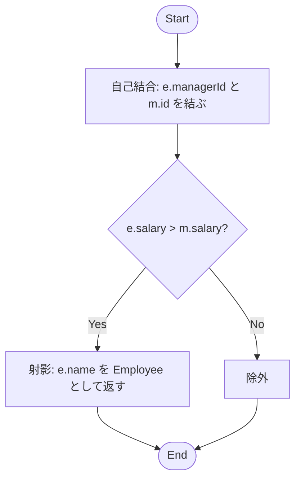

# ✅ MySQL 解答（自己結合）

```sql
-- 従業員テーブルを e、同じテーブルを上司として m に別名を付けて自己結合
SELECT e.name AS Employee
FROM Employee AS e
JOIN Employee AS m
  ON e.managerId = m.id        -- e の上司（managerId）が m の id と一致
WHERE e.salary > m.salary;     -- 上司より高給の行だけ残す
```

- `managerId` が `NULL`（＝上司なし）の行は `JOIN` で自然に除外されます（比較対象がいないため）。

---

## 🧠 手順の考え方（ポイント）

1. **自己結合**：`Employee` を 2 回参照して、`e`（従業員）と `m`（上司）という別名を付けます。
2. **結合条件**：`e.managerId = m.id` で従業員と上司を対応付けます。
3. **フィルタ**：`e.salary > m.salary` で「上司より高給」だけに絞ります。
4. **射影**：要件通り出力は名前のみ（`e.name AS Employee`）。

---

## 🧩 図解 1：自己結合の関係



---

## 🔎 図解 2：クエリ処理フロー



---

## 🧪 サンプル入力に対する動き

- `Joe (70000)` の上司は `id=3 (Sam, 60000)` → **70000 > 60000** なので残す
- `Henry (80000)` の上司は `id=4 (Max, 90000)` → **80000 > 90000** ではないので除外
- `Sam, Max` は上司が `NULL` → 結合対象がいないため除外
  → 結果は `Joe` のみ（問題の出力と一致）

---

## ⚙️ パフォーマンス & 実運用メモ

- 推奨インデックス（存在しない場合）

  ```sql
  CREATE INDEX idx_employee_managerId ON Employee(managerId);
  -- id は主キー前提（PRIMARY KEY）で OK
  ```

  - `e.managerId = m.id` の結合に効きます。

- 計算量の目安：インデックスがあれば `O(n)` 相当（片側ルックアップ）。
- 行数が多い場合は `EXPLAIN` で実行計画を確認しましょう。

---

## ✨ 別解（参考）

### EXISTS を使う書き方（意味は同じ）

```sql
SELECT e.name AS Employee
FROM Employee AS e
WHERE EXISTS (
  SELECT 1
  FROM Employee AS m
  WHERE m.id = e.managerId
    AND e.salary > m.salary
);
```

### LEFT JOIN で NULL を弾く書き方

```sql
SELECT e.name AS Employee
FROM Employee AS e
LEFT JOIN Employee AS m
  ON e.managerId = m.id
WHERE m.id IS NOT NULL
  AND e.salary > m.salary;
```

> いずれも結果は同じですが、最初に示した **INNER JOIN + 比較** が最も素直で読みやすいです。

`Parse error` が出ているのは **Mermaid 記法の文法エラー** です。原因は `--` の矢印表現の使い方と、ノード名に日本語やスペースを直接書いたことです。
Mermaid では **ノード ID は英数字のみ**を推奨し、ラベルを表示する場合は `[ ]` 内に書きます。

修正版を提示します。これなら GitHub や Mermaid Live Editor で正しく描画されます。

---

## ✅ 修正版：図解 1（自己結合の関係）


---

## 📌 ポイント修正

1. **ノード ID は英数字のみ**にしました（`E`, `M`, `K`, `D`, `O`）。
2. **説明文は `<br/>` を使って改行**（Mermaid は HTML タグの一部をサポート）。
3. `-- text -->` ではなく **`--> |text|`** を使用（正しいラベル付き矢印の書き方）。

---

これでエラーは消えるはずです 👍
