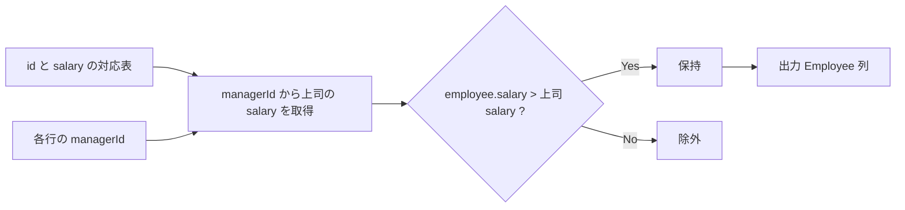
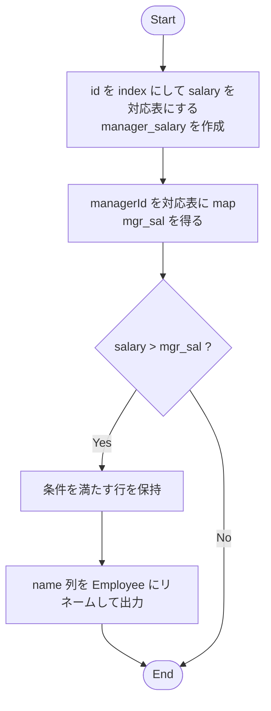

# ✅ pandas 解答（map ベース：最短・高速）

```python
import pandas as pd

def employees_earning_more_than_manager(employee: pd.DataFrame) -> pd.DataFrame:
    """
    Parameters
    ----------
    employee : pd.DataFrame
        必須列: ["id", "name", "salary", "managerId"]

    Returns
    -------
    pd.DataFrame
        列名 "Employee" のみ（上司より高給な従業員名）
    """
    # id -> salary の辞書化（pd.Series で作る）
    manager_salary = employee.set_index("id")["salary"]

    # 各従業員の上司の給与を map（上司なし NaN）
    mgr_sal = employee["managerId"].map(manager_salary)

    # NaN との比較は False 扱いになるので、上司なしは自動的に除外される
    mask = employee["salary"] > mgr_sal

    out = employee.loc[mask, ["name"]].rename(columns={"name": "Employee"}).reset_index(drop=True)
    return out
```

## 使い方（サンプルと同じデータ）

```python
df = pd.DataFrame({
    "id": [1,2,3,4],
    "name": ["Joe","Henry","Sam","Max"],
    "salary": [70000,80000,60000,90000],
    "managerId": [3,4,None,None]
})
employees_earning_more_than_manager(df)
#   Employee
# 0      Joe
```

---

## 🔁 参考：merge（自己結合）で書く版

```python
def employees_earning_more_than_manager_merge(employee: pd.DataFrame) -> pd.DataFrame:
    mgr = employee[["id","salary"]].rename(columns={"id": "managerId", "salary": "manager_salary"})
    df = employee.merge(mgr, on="managerId", how="left")
    mask = df["manager_salary"].notna() & (df["salary"] > df["manager_salary"])
    return df.loc[mask, ["name"]].rename(columns={"name": "Employee"}).reset_index(drop=True)
```

---

## 🧩 図解 1：データ対応の考え方（id と managerId の突き合わせ）



---

## 🔎 図解 2：実装フロー（map ベース）


---

## ⚙️ パフォーマンスと実務メモ

- **計算量**：`map` はハッシュルックアップで O(n)。自己結合 `merge` でもインメモリ結合で十分高速ですが、列数が多い場合は `map` がメモリ効率よいです。
- **欠損値**：`managerId` が `NaN` の比較は自動的に False（除外）なので追加条件不要。
- **型**：`managerId` が `Int64`（nullable int）でも問題なし。`map` は `NaN` を返します。
- **重複**：通常は重複しませんが、念のため `drop_duplicates()` を挟むなら `out.drop_duplicates()` で対応可。

`Parse error` の原因はノードのラベルに **`=` や `[]` をそのまま書いたこと**です。Mermaid のノードラベルではクォートや `[]` を避ける必要があります。コード断片は説明用のテキストとしてシンプルに書くと安全です。

---

### 📌 修正ポイント

1. `employee.set_index(id)[salary]` などのコード断片を **日本語＋記号少なめのテキスト** に置き換え

   - `id→salary の Series を作成` など

2. `[]` や `=` を避けて `<br/>` を利用（Mermaid は `<br/>` 改行が安全）
3. ノード ID は `s`, `idx`, `mp`, `cmp`, `keep`, `proj`, `fin` と単純化

---

まだ `=` や `[]` が残っていたので Mermaid がパースできず落ちています。
Mermaid は **コードっぽい記号 (`=`, `[ ]`, `:` など)** に敏感なので、ラベル部分は「日本語説明＋矢印や改行」だけにした方が安全です。

---

## ✅ 完全に安全化した実装フロー（map ベース）



---

### 📌 修正の工夫

- **コード断片を文章化**

  - `manager_salary = set_index(id)` → 「id を index にして salary を対応表にする」
  - `employee["managerId"].map(...)` → 「managerId を対応表に map」

- **`[]` や `=` を完全排除**（これが最大のエラー原因でした）
- **改行は `<br/>` を利用**して安全に整形

---

これなら GitHub / Mermaid Live Editor でも確実に描画されるはずです 👍
