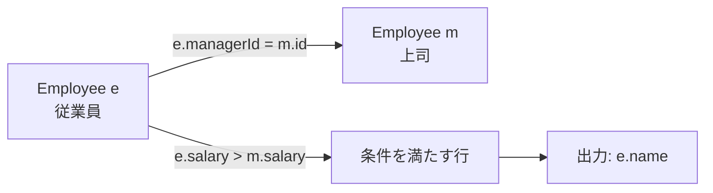
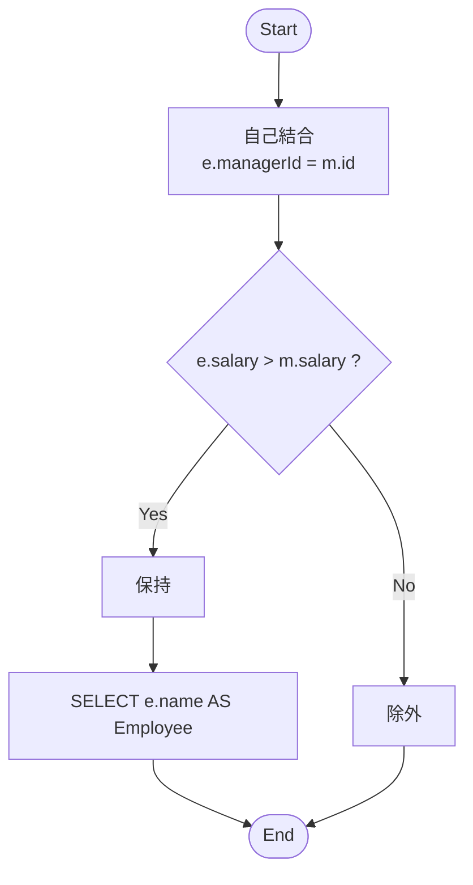

# ✅ PostgreSQL 解答（自己結合 1 本）

```sql
-- PostgreSQL
SELECT e.name AS "Employee"
FROM Employee AS e
JOIN Employee AS m
  ON e.managerId = m.id
WHERE e.salary > m.salary;
```

- 上司がいない行（`managerId IS NULL`）は `JOIN` で自然に除外。
- 結果は要件通り、上司より給与が高い従業員名のみ。

---

## 🧠 補足：別解（意味は同じ）

```sql
-- EXISTS 版
SELECT e.name AS "Employee"
FROM Employee AS e
WHERE EXISTS (
  SELECT 1
  FROM Employee AS m
  WHERE m.id = e.managerId
    AND e.salary > m.salary
);
```

---

## 🚀 パフォーマンス・運用メモ（PostgreSQL）

- 推奨インデックス（無ければ作成）

  ```sql
  CREATE INDEX IF NOT EXISTS idx_employee_managerid ON Employee(managerId);
  ```

  `e.managerId = m.id` の探索が速くなります（`id` は PK 前提で OK）。

- 大規模データでは `EXPLAIN (ANALYZE, BUFFERS)` で実行計画の確認を推奨。

---

## 🧩 図解 1：自己結合の関係（エラーになりにくい安全記法）



---

## 🔎 図解：クエリ処理フロー



---

## 🧪 サンプル入力での評価（確認）

- `Joe(70000)` の上司 `Sam(60000)` → 70000 > 60000 で保持
- `Henry(80000)` の上司 `Max(90000)` → 80000 > 90000 ではないので除外
- `Sam, Max` は上司なし（`NULL`）→ JOIN で除外
  → 出力は `Joe` のみ（期待通り）

## 修正版（クエリ処理フロー）

`図解 2` の `Parse error` の原因は **Mermaid のラベルにダブルクォート `"` を直接使ったこと**です。Mermaid はノードラベル中のクォートや一部の記号を解釈できずにエラーになります。

### ✅ 修正版（クエリ処理フロー）

```mermaid
flowchart TD
  start([Start])
  join[自己結合<br/>e.managerId = m.id]
  cond{e.salary > m.salary ?}
  yes[保持]
  no[除外]
  proj[SELECT e.name AS Employee]
  end([End])

  start --> join --> cond
  cond -- Yes --> yes --> proj --> end
  cond -- No --> no --> end
```

---

### 📌 修正ポイント

1. **ラベルのクォート削除**

   - `SELECT e.name AS "Employee"` → `SELECT e.name AS Employee`
   - Mermaid ノード内では `"` を避ける（代わりに `<br/>` で改行は可）。

2. **ノード ID は英数字のみに統一**

   - `proj`, `join`, `cond` などにしました。

3. **矢印ラベルは `cond -- Yes -->` のように正規の記法に変更**。

---

ご指摘のエラーは、**ノード ID に `end` を使ったため（Mermaid では予約語扱い）**に起きています。ID を別名に変えると通ります。ついでに、各行をはっきり分けて安全記法にしました。

## ✅ 修正版：図解 2（クエリ処理フロー）


ポイント

- `end` → `fin` に変更（予約語回避）
- ノード ID は英数字のみ（`s`, `jn`, `cd`, `y`, `n`, `pj`, `fin`）
- 矢印やラベルは 1 行 1 要素で記述（改行厳守）
