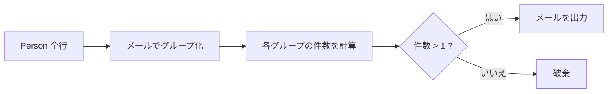
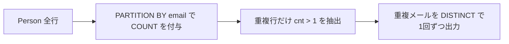

# ✅ 標準解（最短・高速・推奨）

```sql
-- 重複している email を1回ずつ返す
SELECT
  email AS Email
FROM Person
GROUP BY email
HAVING COUNT(*) > 1;
```

Runtime
350
ms
Beats
72.26%

## 何をしているか

- `GROUP BY email` … 同じメールで行をまとめる
- `COUNT(*)` … グループ内の件数を数える
- `HAVING COUNT(*) > 1` … 2 件以上（=重複）だけ通す
- `email AS Email` … 期待される列名に合わせる

---

## 🧠 代替解 1（ウィンドウ関数版／MySQL 8+）

```sql
SELECT DISTINCT
  email AS Email
FROM (
  SELECT
    email,
    COUNT(*) OVER (PARTITION BY email) AS cnt
  FROM Person
) t
WHERE t.cnt > 1;
```

Runtime
357
ms
Beats
64.07%

- 行を削らずに各行へ「そのメールの出現回数」を付与 → `DISTINCT` で 1 行化。

---

## 🧪 代替解 2（自己結合版）

```sql
SELECT DISTINCT
  p1.email AS Email
FROM Person p1
JOIN Person p2
  ON p1.email = p2.email
 AND p1.id <> p2.id;
```

Runtime
342
ms
Beats
80.81%

- 同じ email で別 id が存在する行がある＝重複と判定。

---

## 📈 パフォーマンスのポイント

- 実運用では `email` に索引があると高速化します（集約・結合のキーだから）。

    ```sql
    CREATE INDEX idx_person_email ON Person(email);
    ```

- 小規模な問題環境（オンラインジャッジ）では上の索引作成は不要。提出クエリは **「標準解」1 行だけ** で十分です。

---

## 🗺️ 図解 1：GROUP BY 解の流れ



---

## 🗺️ 図解 2：ウィンドウ関数解の流れ



---

## 🔍 例で確認

入力:

```text
+----+---------+
| id | email   |
+----+---------+
| 1  | a@b.com |
| 2  | c@d.com |
| 3  | a@b.com |
+----+---------+
```

出力（いずれの解でも同じ）:

```text
+---------+
| Email   |
+---------+
| a@b.com |
+---------+
```

> 注: 問題文より「email はすべて小文字」なので大文字小文字の扱いは気にしなくて OK です。
