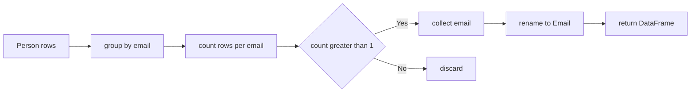

# ✅ 解法 1（推奨）：`groupby` + 集約（SQL の GROUP BY 相当）

```python
import pandas as pd

def duplicate_emails(person: pd.DataFrame) -> pd.DataFrame:
    """
    入力: person = DataFrame(columns=["id", "email"])
    出力: DataFrame(columns=["Email"])  重複メールを1行ずつ
    """
    out = (
        person
        .groupby("email", as_index=False)
        .agg(cnt=("id", "size"))     # 同じ email の件数を数える
        .query("cnt > 1")            # 2件以上のみ
        .loc[:, ["email"]]
        .rename(columns={"email": "Email"})
        .reset_index(drop=True)
    )
    return out
```

Runtime
332
ms
Beats
9.24%
Memory
67.72
MB
Beats
10.79%

## ポイント 1

- `groupby("email")` で同一メールをまとめる
- `agg(cnt=("id","size"))` で件数を列 `cnt` に
- `query("cnt > 1")` で重複のみ抽出
- 列名を仕様どおり `Email` に揃える

---

## 🧠 解法 2：`duplicated(keep=False)` + `drop_duplicates`（行操作ベース）

```python
def duplicate_emails_v2(person: pd.DataFrame) -> pd.DataFrame:
    out = (
        person.loc[person["email"].duplicated(keep=False), ["email"]]  # 重複行だけ残す
              .drop_duplicates()                                       # 1回ずつに圧縮
              .rename(columns={"email": "Email"})
              .reset_index(drop=True)
    )
    return out
```

Runtime
247
ms
Beats
97.22%
Memory
67.12
MB
Beats
60.05%

## ポイント 2

- `duplicated(keep=False)` は重複している **全行** を True にする
- その後 `drop_duplicates()` で 1 行にする

---

## 🪄 解法 3：`value_counts()` のカウントから作る（最短ワンライナー寄り）

```python
def duplicate_emails_vc(person: pd.DataFrame) -> pd.DataFrame:
    vc = person["email"].value_counts()
    return pd.DataFrame({"Email": vc[vc > 1].index}).reset_index(drop=True)
```

Runtime
245
ms
Beats
97.80%
Memory
67.01
MB
Beats
71.67%

---

## ⏱️ 計算量と実務メモ

- いずれも概ね **O(n)**（ハッシュベースのグルーピング）
- 入力が大きい場合は `email` を `string` dtype に統一しておくとメモリ効率が良いことが多いです

    ```python
    person = person.astype({"email": "string"})
    ```

- 問題文より `email` は **小文字のみ・NULL なし** → 前処理は不要

---

## ✅ 動作確認用の最小例

```python
df = pd.DataFrame(
    {"id": [1, 2, 3], "email": ["a@b.com", "c@d.com", "a@b.com"]}
)

print(duplicate_emails(df))
#     Email
# 0  a@b.com
```

---

## 🗺️ 図解 1（解法 1：groupby 集約の流れ）



---

## 🗺️ 図解 2（解法 2：duplicated の流れ）


---

## どれを使う？

- 可読性・汎用性重視なら **解法 1（groupby）**
- 手続き的に行を削る感覚で書きたいなら **解法 2（duplicated）**
- 1 行で済ませたいなら **解法 3（value_counts）** が簡潔です。
