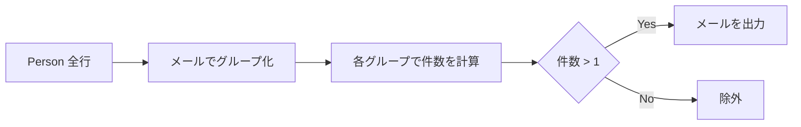
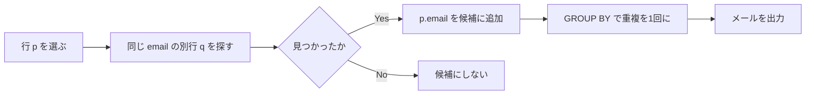

# ✅ 標準解（最短・推奨：GROUP BY + HAVING）

```sql
-- 重複している email を1回ずつ返す
SELECT
  email AS "Email"
FROM Person
GROUP BY email
HAVING COUNT(*) > 1;
```

Runtime
212
ms
Beats
69.75%
Memory
0.00
MB
Beats
100.00%

## **ポイント 1**

- `GROUP BY email` で同一メールを一塊に。
- `COUNT(*) > 1` で重複だけを残す。
- 列名は期待仕様に合わせて `"Email"` と大文字化（PostgreSQL は大文字保持にダブルクォートが必要）。

---

## 🧠 代替解 1（ウィンドウ関数：PostgreSQL 9.6+）

```sql
SELECT DISTINCT
  email AS "Email"
FROM (
  SELECT
    email,
    COUNT(*) OVER (PARTITION BY email) AS cnt
  FROM Person
) t
WHERE t.cnt > 1;
```

Runtime
208
ms
Beats
78.33%
Memory
0.00
MB
Beats
100.00%

## **ポイント 2**

- 各行に「同一 email の出現回数」を付与し、`cnt > 1` のみ抽出。
- `DISTINCT` で 1 行にまとめて出力。

---

## 🧪 代替解 2（自己結合 / EXISTS）

```sql
-- 自己結合版
SELECT DISTINCT
  p1.email AS "Email"
FROM Person p1
JOIN Person p2
  ON p1.email = p2.email
 AND p1.id <> p2.id;

-- EXISTS版（多くのDBで効率良いことが多い）
SELECT
  p.email AS "Email"
FROM Person p
WHERE EXISTS (
  SELECT 1
  FROM Person q
  WHERE q.email = p.email
    AND q.id <> p.id
)
GROUP BY p.email;
```

Runtime
206
ms
Beats
83.10%
Memory
0.00
MB
Beats
100.00%

---

## 📈 パフォーマンス／実務 Tips

- 大量データなら `email` に B-Tree インデックスが有効（集約・結合キーのため）。

  ```sql
  -- オンライン作成（本番系は CONCURRENTLY が安全）
  CREATE INDEX CONCURRENTLY IF NOT EXISTS idx_person_email ON Person(email);
  ```

- 今回のオンライン判定環境では DDL は不要。提出は **標準解のみ** で OK。
- 問題文より「email は小文字・NULL なし」なのでケース変換や `IS NOT NULL` は不要。

---

## 🗺️ 図解 1：GROUP BY 解の流れ



---

## 🗺️ 図解 2：ウィンドウ関数 解の流れ


---

## 🗺️ 図解 3：EXISTS 解の流れ



---

### 例（確認）

入力：

```text
id | email
----+---------
 1  | a@b.com
 2  | c@d.com
 3  | a@b.com
```

出力：

```text
Email
---------
a@b.com
```

> 注：PostgreSQL では文字列比較は既定で大小区別しますが、本問題は「全て小文字」なので追加対応は不要です。
