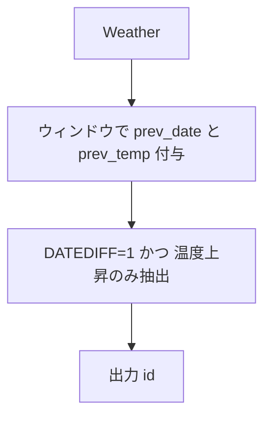

# MySQL

## 1) 問題

- `Write a solution to find all dates' id with higher temperatures compared to its previous dates (yesterday).`
- 入力テーブル例: `Weather(id int PK, recordDate date, temperature int)`
- 出力仕様: `id` — 各 `recordDate` が **前日（recordDate - 1 日）** より気温が高い行の `id` を返す

## 2) 最適解（単一クエリ）

> 「前日」を厳密に見る必要があるため、**ウィンドウ関数 + 前日差チェック**で解きます（単に直前行と比較するだけでは欠日がある場合に誤判定）。

```sql
WITH win AS (
  SELECT
    id,
    recordDate,
    temperature,
    LAG(recordDate)   OVER (ORDER BY recordDate) AS prev_date,
    LAG(temperature)  OVER (ORDER BY recordDate) AS prev_temp
  FROM Weather
)
SELECT
  id
FROM win
WHERE prev_date IS NOT NULL
  AND DATEDIFF(recordDate, prev_date) = 1  -- 昨日が存在するかを厳密判定
  AND temperature > prev_temp;

Runtime
330
ms
Beats
98.99%

```

## 3) 代替解

> 欠日考慮をシンプルに書くなら **自己結合** が最短です。

```sql
SELECT w1.id
FROM Weather AS w1
JOIN Weather AS w0
  ON w0.recordDate = DATE_SUB(w1.recordDate, INTERVAL 1 DAY)
WHERE w1.temperature > w0.temperature;

Runtime
366
ms
Beats
89.98%

```

## 4) 要点解説

- **欠日対策**: 直前行（`LAG`）との比較だけだと、`2015-01-01`、`2015-01-03` のように欠日があるケースで「昨日」ではないのに比較してしまう。
  → `DATEDIFF(recordDate, prev_date) = 1` で厳密に前日を要求。
- **自己結合との差**: 自己結合は読みやすく最短。ウィンドウ版は「前日存在チェック」を同一スキャンで完結できるのが利点。
- **順序**: 結果順は任意のため `ORDER BY` は付けない（高速化）。

## 5) 計算量（概算）

- ウィンドウ: 全件ソート **O(N log N)**、1 パス集計 **O(N)**
- 自己結合: `recordDate` にインデックスがあればルックアップ **O(N)** 近似（なければ **O(N log N)**）

## 6) 図解（Mermaid 超保守版）


