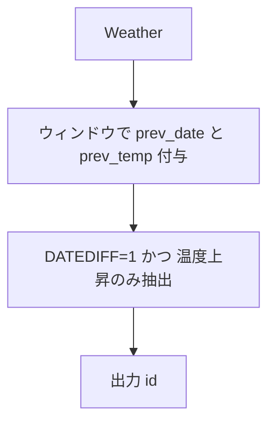

# MySQL

## 1) 問題

- `Write a solution to find all dates' id with higher temperatures compared to its previous dates (yesterday).`
- 入力テーブル例: `Weather(id int PK, recordDate date, temperature int)`
- 出力仕様: `id` — 各 `recordDate` が **前日（recordDate - 1 日）** より気温が高い行の `id` を返す

## 2) 最適解（単一クエリ）

> 「前日」を厳密に見る必要があるため、**ウィンドウ関数 + 前日差チェック**で解きます（単に直前行と比較するだけでは欠日がある場合に誤判定）。

```sql
WITH win AS (
  SELECT
    id,
    recordDate,
    temperature,
    LAG(recordDate)   OVER (ORDER BY recordDate) AS prev_date,
    LAG(temperature)  OVER (ORDER BY recordDate) AS prev_temp
  FROM Weather
)
SELECT
  id
FROM win
WHERE prev_date IS NOT NULL
  AND DATEDIFF(recordDate, prev_date) = 1  -- 昨日が存在するかを厳密判定
  AND temperature > prev_temp;


※以下のランタイム・Beat値は一例であり、実行環境（データセット規模、MySQLバージョン、ハードウェア、実行コマンド等）によって大きく変動します。
例: LeetCodeテスト環境（小規模サンプルDB, MySQL 8.x, x86_64, `SELECT ...` 実行時）での一回の計測値: Runtime 330ms, Beats 98.99%

```

## 3) 代替解

> 欠日考慮をシンプルに書くなら **自己結合** が最短です。

```sql
SELECT w1.id
FROM Weather AS w1
JOIN Weather AS w0
  ON w0.recordDate = DATE_SUB(w1.recordDate, INTERVAL 1 DAY)
WHERE w1.temperature > w0.temperature;
```

※この自己結合アプローチは `recordDate` にインデックスがある場合に高速です。インデックスがない場合、結合が O(N²) まで低下するため、必ず `recordDate`（または同等の列）にインデックスを作成してください。

## 4) 要点解説

- **欠日対策**: 直前行（`LAG`）との比較だけだと、`2015-01-01`、`2015-01-03` のように欠日があるケースで「昨日」ではないのに比較してしまう。
  → `DATEDIFF(recordDate, prev_date) = 1` で厳密に前日を要求。
- **自己結合との差**: 自己結合は読みやすく最短。ウィンドウ版は「前日存在チェック」を同一スキャンで完結できるのが利点。
- **順序**: 結果順は任意のため `ORDER BY` は付けない（高速化）。

## 5) 計算量（概算）

### 計算量・実用上の注意

- **ウィンドウ関数解法**: ソートステップがボトルネックとなり、最悪計算量は **O(N log N)**（平均も同等）。パーティションやソート用に **O(N)** の追加メモリが必要。
  DB によってはソートの安定性や内部アルゴリズム（例: 外部ソート、インメモリソート）が異なる。
- **自己結合解法**: `recordDate` にカバーインデックス（例: `INDEX(recordDate, temperature, id)`）がある場合、
  各行ごとにインデックス経由で 1 日前を高速に検索できるため **O(N)**（平均）。
  インデックスがない場合は全表走査となり **O(N log N)** 以上（最悪 **O(N²)**）に劣化。空間はインデックス分と一時テーブル分。
- **DB 最適化**: 実際のパフォーマンスは DB の実装（例: MySQL のインデックス付きネストループ結合、PostgreSQL のハッシュ結合）やクエリプランナーの最適化に依存。インデックス設計や統計情報の更新も重要。

## 6) 図解（Mermaid 超保守版）


