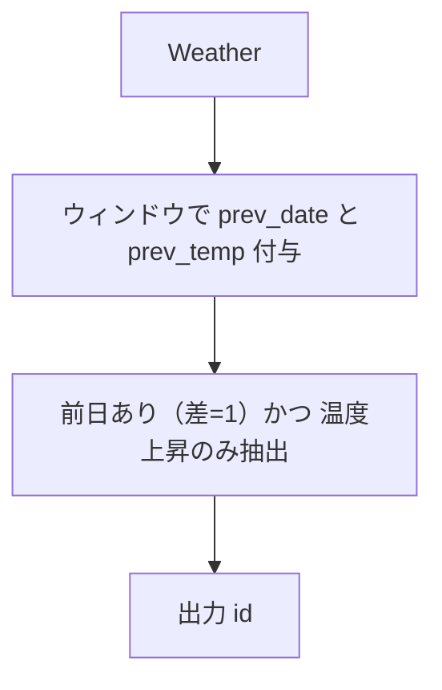

# PostgreSQL 16.6+

## 1) 問題

- `Write a solution to find all dates' id with higher temperatures compared to its previous dates (yesterday).`
- 入力: `Weather(id int PK, recordDate date, temperature int)`
- 出力: `id` — 各 `recordDate` が **前日（recordDate - 1 日）** より気温が高い行の `id` を返す（順不同）

## 2) 最適解（単一クエリ）

> 欠日がある可能性に備え、**前日が存在する日だけ**を比較します。ウィンドウで直前の日付・気温を取り、`recordDate - prev_date = 1` を厳密チェック。

```sql
WITH win AS (
  SELECT
    id,
    recordDate,
    temperature,
    LAG(recordDate)  OVER (ORDER BY recordDate) AS prev_date,
    LAG(temperature) OVER (ORDER BY recordDate) AS prev_temp
  FROM Weather
)
SELECT
  id
FROM win
WHERE prev_date IS NOT NULL
  AND (recordDate - prev_date) = 1    -- ちょうど前日だけを対象（date 差は整数日）
  AND temperature > prev_temp;


**Runtime:** 213ms (Beats 84.57%)

```

### 代替（自己結合でシンプルに）

```sql
SELECT w1.id
FROM Weather AS w1
JOIN Weather AS w0
  ON w0.recordDate = w1.recordDate - 1   -- 前日が存在する行だけ残る
WHERE w1.temperature > w0.temperature;


**Runtime:** 208ms (Beats 93.95%)

```

## 3) 要点解説

- 「昨日と比較」を厳密にするため、**単なる直前行**ではなく **前日存在の検証**（`recordDate - prev_date = 1`
  あるいは `w0.recordDate = w1.recordDate - 1`）を行う。
- ウィンドウ版は単一スキャンで前日情報を付与でき、可読性も高い。自己結合版は最短記述で実行計画も素直。
- 結果順は任意のため `ORDER BY` は不要。

## 4) 計算量（概算）

- ウィンドウ処理: **O(N log N)**（`recordDate` でのソート後に 1 パス）
- 自己結合: `recordDate` にインデックスがあれば各行ごとにインデックス経由で 1 日前を高速検索できるため **O(N)**。
  インデックスがない場合、DB はネストループ結合で **O(N²)** になることが多く、ハッシュ結合やマージ結合が使われれば **O(N log N)** や **O(N)** まで改善する場合もある。
  最適な性能のため、`recordDate` にインデックスを作成することを推奨。

## 5) 図解（Mermaid 超保守版）


