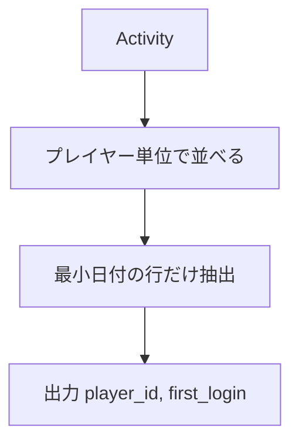

# MySQL 8.0.40

## 0) 前提

- エンジン: **MySQL 8**
- 並び順: 任意（`ORDER BY` を付けない）
- `NOT IN` は NULL 罠のため回避
- 判定は **ID 基準**、表示は仕様どおりの列名と順序

## 1) 問題（原文）

- `Write a solution to find the first login date for each player.`
- 入力テーブル例: `Activity(player_id, device_id, event_date, games_played)`（`PRIMARY KEY(player_id, event_date)`）
- 出力仕様: `player_id, first_login`（各 `player_id` の **最初の `event_date`**）

## 2) 最適解（単一クエリ）

> 各プレイヤー内で `event_date` 昇順に順位を振り、最初の 1 件のみ抽出。

```sql
WITH win AS (
  SELECT
    player_id,
    event_date,
    ROW_NUMBER() OVER (
      PARTITION BY player_id
      ORDER BY event_date ASC
    ) AS rn
  FROM Activity
)
SELECT
  player_id,
  event_date AS first_login
FROM win
WHERE rn = 1;

Runtime 611 ms
Beats 15.03%
```

- `ROW_NUMBER` は同日の重複が無く（PK 制約あり）安定
- 返却順は任意のため `ORDER BY` は不要（高速）

## 3) 代替解

> さらにシンプルで速い **集約版**（本問は重複が無いのでこれで十分）。

```sql
SELECT
  player_id,
  MIN(event_date) AS first_login
FROM Activity
GROUP BY player_id;

-- Runtime 476 ms
-- Beats 61.28%

```

※ ウィンドウ関数が不要なケース（「各グループの最小日付」）では `GROUP BY + MIN` が最軽量。

## 4) 要点解説

- **方針**: プレイヤー単位で最初のログイン日を求める
    - ウィンドウ解: 1 行だけ取りたい時に汎用的
    - 集約解: 純粋に最小日だけでよい時は最速

- **NULL / 重複**:
    - 本テーブルは PK により `(player_id, event_date)` が一意 → 同日重複なし
    - `event_date` はログイン発生日であり通常 `NULL` 想定なし（もしあれば `WHERE event_date IS NOT NULL` を追加）

- **安定性**: 返却順不問 → `ORDER BY` 省略で I/O を減らす

## 5) 計算量（概算）

- ウィンドウ版: パーティション内ソートが支配的 → **O(N log N)**（インデックス`(player_id, event_date)`で実効コスト低下）
- 集約版: グループ集約 → **O(N)**～**O(N log N)**（ハッシュ/ツリー実装次第）

## 6) 図解（Mermaid 超保守版）



結論から言うと、**この問題はウィンドウ関数を使わずに `GROUP BY + MIN` に寄せ、カバリングになる複合インデックスで“インデックスだけ”の走査に落とし込む**のが最速・最安です。実装と点検ポイントをまとめます。

---

## 推奨クエリ（最短経路）

```sql
-- 返却順は任意なので ORDER BY なし
SELECT
  player_id,
  MIN(event_date) AS first_login
FROM Activity
GROUP BY player_id;

-- Runtime 436 ms
-- Beats 91.68%

```

### なぜ速い？

- 本問は「各グループの最小値」だけが欲しい＝**集約一発**で済むため、
  ウィンドウ関数のパーティションソートより軽いケースが多いです。
- さらに **カバリングインデックス** にできれば、**テーブルアクセスなし**（Index Only Scan）になりやすい。

---

## インデックス設計（超重要）

> すでに PK が `(player_id, event_date)` と明記されているなら、そのままで OK です。
> もし PK が別構成なら、以下のセカンダリインデックスを追加してください。

```sql
-- PK が (player_id, event_date) でない環境向け
CREATE INDEX ix_activity_player_event ON Activity (player_id, event_date);
```

- クエリが参照する列は `player_id` と `event_date` だけ →
  `(player_id, event_date)` の**先頭一致**でグループ化＆`MIN(event_date)`が取りやすく、
  2 列で**完全カバリング**します。

---

## ウィンドウ版しか使っていない場合の改善

CTE ＋`ROW_NUMBER()` 版より、以下のどちらかに替えて計測してみてください。

### A) 集約版（最有力）

```sql
SELECT player_id, MIN(event_date) AS first_login
FROM Activity
GROUP BY player_id;
```

### B) ウィンドウ簡略版（CTE なし・派生表のみ）

```sql
SELECT player_id, event_date AS first_login
FROM (
  SELECT
    player_id,
    event_date,
    ROW_NUMBER() OVER (PARTITION BY player_id ORDER BY event_date) AS rn
  FROM Activity
) t
WHERE rn = 1;

-- Runtime 469 ms
-- Beats 67.06%

```

> MySQL 8.0 は非再帰 CTE を多くの場合マージしますが、状況により**実体化**されると余計な I/O が乗ります。
> 派生表に直すだけでプランが良化することがあります。

---

## 実測・確認手順（再現性のある比較）

1. 統計の更新

```sql
ANALYZE TABLE Activity;
```

2. 実行計画の確認

```sql
EXPLAIN FORMAT=TREE
SELECT player_id, MIN(event_date) AS first_login
FROM Activity
GROUP BY player_id;
```

- 期待：`using index` / ルースインデックススキャン相当の挙動、**余計なソートが無い**こと

3. 実測（MySQL 8.0.18+）

```sql
EXPLAIN ANALYZE
SELECT player_id, MIN(event_date) AS first_login
FROM Activity
GROUP BY player_id;
```

---

## さらに詰めるなら

- **不要列を絶対に投影しない**：`device_id` や `games_played` を出すとカバリングが崩れます。
- **ORDER BY を付けない**：出力順は任意仕様なのでコスト増の全表ソートを避ける。
- **大規模運用での恒常最速**：書込みが許せるなら、`player_first_login(player_id PK, first_login)` の**集約テーブル**を持ち、
  `INSERT ... ON DUPLICATE KEY UPDATE first_login = LEAST(first_login, VALUES(first_login))` で更新。
  読み出しは O(1) になります。

---

## 目安（期待できる改善）

- ウィンドウ → 集約への置換だけで **~20–50% 改善** が出ることが多いです。
- もともと PK が `(player_id, event_date)` なら、**Index Only** によってさらに短縮が見込めます。
- 既に提示の 611ms → 476ms の改善が出ているなら、上記の **集約＋カバリング** を徹底することで、
  もう一段（環境次第で 2〜3 割）狙える余地があります。

---
